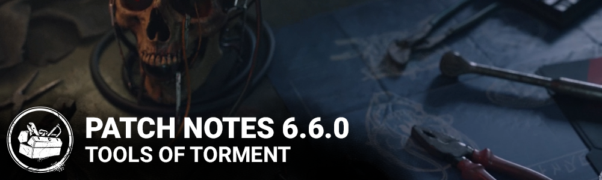

<!-- summary -->
## AI TL;DR

The Skull Merchant joins the Killer roster, while siblings Thalita and Renato Lyra arrive as new Survivors, each bringing three themed perks. Shelter Woods receives a command-center addition, Red Forest gets a visual overhaul, and Haddie Kaur’s cosmetics are refined. Quality-of-life tweaks include near-zero map repeat, removal of Any Means Necessary’s cooldown, revamped Eruption behavior, faster loading timeout handling and lobby player reporting. Bots gain extensive loadout options and smarter AI across many killers and maps. The update also delivers a broad sweep of bug fixes covering characters, environments, audio, UI and server stability.
<!-- /summary -->

<!-- nav -->
&larr; [6.5.2 | Bugfix Patch](374-6-5-2-bugfix-patch.md) · [Live](../../index.md#live) · [6.6.1 | Bugfix Patch](379-6-6-1-bugfix-patch.md) &rarr;
<!-- /nav -->

# 6.6.0 | Tools of Torment

## Content

### New Killer: The Skull Merchant

### Perks:

**Game Afoot:** While you are chasing the Obsession, this perk activates. Damaging Generators and destroying Breakable Walls and Pallets gives you a 5% Haste Status for 8/9/10 seconds. Whenever you hit the Survivor with the total most time in chase with a Basic Attack, they become the Obsession. The Killer can only be Obsessed with one Survivor at a time.

**THWACK!:** After hooking a Survivor, this perk activates. The next Breakable Wall or Pallet you break will make Survivors within 28/30/32 meters scream and reveal their aura for 4 seconds. (Changed from PTB: removed activation timer and distance is now a tiered value)

**Leverage:** Each time you hook a Survivor, gain 1 token, up to 10. When you Hook a Survivor, this perk activates for 30 seconds. For each token, reduces the speed at which Survivors heal by 3/4/5%.

### New Survivor: Thalita Lyra

### Perks:

**Cut Loose:** After performing a rushed vault in a chase, this Perk activates. While active, your rushed vaults are silent for up to 4/5/6 seconds, and successfully performing a rushed vault during that time resets the timer. This perk goes on cool-down for 45 seconds.

**Friendly Competition:**Whenever you finish Repairing a Generator with at least one other Survivor, this Perk activates. You and other Survivors who finished Repairing the Generator with you get 5% increased Repair progress speed for 45/60/75 seconds. Survivors can only have one instance of this Perk's ability active at once.

**Teamwork: Power of Two:** Whenever you finish healing another Survivor, you both move 5% faster as long as you stay within 12 meters of the Survivor you healed or until one of you loses a Health State. **Teamwork: Power of Two** can only trigger once every 180/160/140 seconds. Survivors can only be affected by one Teamwork: Power of Two effect at a time.

### New Survivor: Renato Lyra

### Perks:

**Background Player:** When the Killer picks up another Survivor, Background Player activates for 10 seconds. When you start running, you break into a sprint at 150% of your normal Running Movement speed for 4 seconds and become exhausted. This perk cannot be used while exhausted. This perk causes exhaustion for 60/50/40 seconds. (Changed from PTB; now activates on pickup for 10 seconds, triggers on starting to run, increases move speed for 4 seconds)

**Blood Rush:** This Perk activates once you are one Hook away from instant death. While healthy, running, and suffering from Exhaustion, press the Active Ability Button 1 to lose a Health State and recover from Exhaustion instantly and gain the Broken status effect for 28/24/20 seconds. You are automatically healed from injured to healthy after 28/24/20 seconds. Being put into the Dying State will cancel the healing effect. Activating Blood Rush will disable it for the remainder of the trial. Exhaustion prevents Survivors from activating other Perks that cause Exhaustion. Broken prevents Survivors from being healed.

**Teamwork: Collective Stealth:**Whenever another Survivor finishes healing you, you both leave no scratch marks as long as you stay within 12 meters of the Survivor who healed you or until one of you loses a health state. Teamwork: Collective Stealth can only trigger once every 180/160/140 seconds. Survivors can only be affected by one Teamwork: Collective Stealth effect at a time.

### Map Changes: Shelter Woods

A makeshift command center was erected here, its rigid walls and sharp angles standing in stark contrast to the twisted wood and soil. For those who chance upon this crude structure, the realization that this complex belongs to an apex hunter—a hunter whose prey is human—usually comes too late.

### Visual Update: Red Forest

We’ve taken a lengthy visit to the **Red Forest Realm**, which includes the Maps **Temple of Purgation** and **Mother’s Dwelling**. How about a nice, long walk in the woods?

### Visual Update: Haddie Kaur

- Visual improvement to eyes and hair.
- Hair shape and color adjusted to be more reflective of her lore.
- Added blood to Prestige hair.
- Visual update to her uncommon skin makeup.
- Icons and portrait updated.

## Quality of Life

### Map Repeat Prevention

This update improves the Map selection process. Now, the possibility that players in a Trial will see the same Map as their previous Trial has been reduced to near-zero. It’s also unlikely that they will be sent to a recently visited Map, though the likelihood will be a little higher than near-zero.This will not impact the efficacy of Map Offerings, nor will it affect Custom Games.

### Perk Changes

- Any Means Necessary: Removed cooldown.
- Eruption: After kicking a Generator, its aura is highlighted in yellow. Whenever a Survivor enters the Dying State, every affected Generator explodes, losing 10% worth of progress and starts to regress. Any Survivor repairing a Generator when it explodes will scream and reveal their aura 8/10/12 seconds. Eruption has a cooldown of 30 seconds. (Changed from PTB: now 10% of total progress, not current progress)

### Loading Timeout

After analyzing the data on our side, we have established a set of expected loading times for each of the steps while loading into a Trial. As a result, if any player crashes or hangs while loading, we will now be able to return everyone to the Tally much earlier.

### Reporting Players

We know that sometimes you may face unsportsmanlike behaviour even before a match. We have now added the option to report a player from the online lobby.

## Miscellaneous Updates

### Triggered scream audio

We have done a consistency pass on the following perks and addons which trigger audio feedback when the position of a Survivor is revealed:

Deathbound, Dragon's Grip, Eruption, Hex: Face the Darkness, Infectious Fright, Iron Maiden, Make Your Choice, Iridescent Family Crest, Incensed Ointment, Healing Poultice, Greasy Black Lens.

When a Survivor screams to reveal their location, the scream will be a 3d scream (instead of a 2d/mapwide scream), with a 19m max range, and a loud noise sfx is triggered.

## Bots in Custom Games

### Pre-game Improvements

- Bots are now assigned to specific slots when added in the Custom Match lobby.
- Players can now edit bots to make them use a selection of Perks, Offerings, Items and Add-ons in Custom Games.
- Players can save up to 4 bot loadout presets to re-use them at a later time or to apply them to different bots in order to face bots with unique loadouts.
- Players can now manually select which Survivor should be used as a Bot.
- *Dev Note:* Not all options for loadout are currently supported by Bots. You may notice that some options of Perks, Items, Add-ons or Offerings are missing; these exclusions are intentional.

### In-game Improvements

- Bots respond better while in the Terror Radius on multi-floor Maps.
- Bots are more likely to pick up dropped Items.
- Bots will use the Haste Effect more effectively after being hit by the Killer.
- Bots are no longer overcome with existential dread when Broken and holding a Medkit.
- Bots no longer automatically know where their rekindled Hex: Pentimento Totem is located.
- Bots no longer automatically know the Perk associated with a Hex Totem.
- Bots should now make more strategically sound rescues in the Killer’s presence.
- Improved Bot decision-making while dodging ranged attacks and looping.
- Improved Bot pathing while obstructed by a teammate.
- Bots now prioritize gaining distance from the Killer over seeking a nearby loop.
- Bots react more accurately to sound, especially from Killer Powers.
- Injured Bots are now more effective at healing one another.
- When searching for the closest Locker, Bots are no longer confused by Lockers on a floor below or above.

### Killer-specific Improvements

- Bots are more willing to solve The Lament Configuration when playing against Pinhead.
- Bots no longer automatically know which Generator Freddy Krueger will emerge from while using the Class Photo Add-On.
- Bots no longer automatically know which Portal The Demogorgon will emerge from while using the Red Moss Add-On.
- Bots no longer fear approaching Charlotte while Victor is active.
- Bots now know to crouch to avoid triggering The Hag’s Phantasm Traps.
- Bots no longer attempt to blind The Demogorgon while it is travelling in the Upside Down.
- Bots no longer automatically know which Pallets are fake when playing against Freddy Krueger or The Doctor.
- Bots more accurately react to the Terror Radius when the Obsession is affected by Dark Devotion.
- Bots are far more willing to disarm The Trapper’s Bear Traps when required.

### Bots changes since PTB

- Bots can now use the following Perks:
  - Deception
  - For the People
  - Saboteur
  - Blast Mine
  - Wiretap
  - Tenacity
  - Self-Care
- Bots can now use the following Add-ons:
  - Styptic Agent
  - Anti-hemorrhagic Syringe
  - Brand New Part
  - Glass Bead
- Bots can now sabotage Hooks with a Toolbox.
- Bots can now use Keys and their Add-ons.
- Bots no longer crouch in place while looping a Killer.
- Bots now avoid using particularly small loops.
- When playing against a Trapper with the Tension Spring Add-on, Bots run away from Bear Traps before healing.
- Bots no longer attempt to stand up from the Dying State while lying down on a Trapper's Bear Trap.
- When playing against The Artist, Bots now cancel the Repel Crows action to vault or drop a pallet.
- Bots now correctly vault a specific window in the Dead Dawg Saloon Map.

**Bug Fixes**

## Characters

- Pallets now react as intended when kicked during the Pallet breaking animation.
- The Huntress' legs now move forward while performing basic attacks.
- Female Legion members no longer have the Male Legion walk animation while inside Trials.
- Correct transition now plays after being stunned when The Legion has the Julie's Mix Tape equipped.

## Environment

- A collision in the Mother's Dwelling Map no longer blocks projectiles.
- Addressed level-of-detail issues in the Yamaoka Estate Map,.

## Audio

- Fixed an issue where a Survivor's scream would continue to play after being unhooked rapidly.
- Fixed an issue where Thalita and Renato's screams were muffled when activating the Eruption perk.
- Fixed an issue in the Tome 14 Rift where only The Knight would produce sound when highlighting rewards.
- Fixed an issue where using the Visual Data torso cosmetic for The Legion would use the default sounds instead of Julie's.
- A subtitle from William Birkin's voiceover lines no longer appears when playing as The Blight with a different Cosmetic.

## Misc

- Players affected by a disconnection penalty should now see it correctly when returning to the lobby after a Match.
- Fixed a few cases where subtitles for voiceover lines would linger longer than the audio itself.
- Players are no longer stuck in an infinite loop when matchmaking fails while queueing for a Custom Match.
- Fixed a potential crash when closing the game.
- Fixed a softlock in the Main Menu after selecting a Game Mode and quickly selecting the Store or Archives button at the same time.
- Fixed a positioning issue of the loadout item tooltip in the Tally screen after displaying the Killer Power tooltip.
- Cybil no longer remains idle when interacting with or using Killer objects.
- Fixed some cases where Adept achievements could not be completed.
- Hex: Huntress Lullaby no longer affects Hook struggle Skill Checks
- Whispers now deactivates correctly when a Survivor is killed or disconnects in the Perk's range.
- The Killer's Obsession is now applied to the correct survivor while "Decisive Strike" is equipped.
- Fixed a server crash which happened in some cases after a Survivor is interrupted.
- Bots now cancel a pending Crow removal when waiting to vault or drop pallet.
- Add-Ons from The Knight, The Onryo and The Oni no longer cause Survivors in Lockers to scream.
- Victor's Aura is now correctly displayed after a successful Pounce.
- William Birkin voice line subtitles no longer appear when downing survivors as default Blight.
- Fixed a crash on the server when certain Status Effects are imposed.
- Blood Warden no longer permanently blocks the Exit Gates.
- Wiggle Skill Checks now disappear once becoming Hooked.
- Fixed an issue where Survivors are unable to wiggle off of a Killer's shoulders.

## Bug Fixes since PTB

- Updated The Nurse's Power description to include the fact that she can interrupt and grab Survivors between a Blink and the ensuing fatigue.
  - This change will propagate to other languages in a future update.
- A player disconnecting during the Trial introductory camera rotation now correctly cancels the match.
- Survivors no longer risk receiving a disconnection penalty when the Killer disconnects.
- Fixed an issue where editing a Bot in an invalid state in a Custom Game lobby could crash the game.
- Fixed a crash when selecting the "Edit Bot" option in the Lobby after disabling some items from the Match Management settings.
- Fixed an issue where Bot Loadout items were not affected by the Match Managament settings.
- Fixed an issue with animations in the Bot Edit Loadout popup whe changing pages.
- Fixed a positioning issue of the Perk tooltip in the Bot Edit Loadout popup.
- Fixed some formatting issues in Inventory's tooltip in the Bot Edit Loadout Popup.
- Fixed an issue with the UI Scale setting not being applied to the Bot Edit Loadout popup.
- Fixed an issue that caused different cosmetic issues when a Survivor enters a Drone's active detection zone.
- The Rite of the Skull Merchant Daily Ritual should now progress correctly.
- Survivors with a Claw-Trap no longer see the wrong decal when observing Scouting Drones.
- The Leverage Perk's external icon now correctly displays a timer.
- Rancor's Exposed Status is no longer immediately activated when the Obsession is transferred through the Game Afoot Perk.
- Game Afoot's Obsession transfer is now triggered at the end of a hit, preventing the Remember Me perk from gaining a Token too early.
- Using Blood Rush with the Background Player Perk active now properly removes the Exhaustion Status Effect imposed by another Perk.
- The Cut Loose icon now reflects the proper state and duration.
- Sprint Burst triggers correctly when using Blood Rush.
- Teamwork: Collective Stealth and Teamwork: Power of Two now activate correctly when using a Anti-Haemorrhagic Syringe.
- Teamwork: Collective Stealth is no longer deactivated when one Survivor runs in a different direction from the others.
- Teamwork: Collective Stealth no longer fails to deactivate if the other Survivor disconnects.
- The icons of Teamwork: Power of Two and Teamwork: Collective Stealth now correctly matches the Perk state.

**Known Issues**

**The Archives**

- "Glyph Graduate" Yellow Glyph challenges
  - Skill checks for the Glyph Graduate challenge are not behaving as intended and may not recognize the Player's input in the "good" Skill Check zones.
  - Affects all instances of the Glyph Graduate challenge across all applicable Tomes.

**Misc**

- Renato Lyra's default head is using his uncommon Musician Half-Bun head hair colors.
- Stuttering present for Tools of Torment intro video on XB1.
- The description of achievements do not scroll on the side on the EGS launcher social panel.

**Maps**

- The Boreal Hill on the Red Forest has unclear pathing.

<!-- nav -->
&larr; [6.5.2 | Bugfix Patch](374-6-5-2-bugfix-patch.md) · [Live](../../index.md#live) · [6.6.1 | Bugfix Patch](379-6-6-1-bugfix-patch.md) &rarr;
<!-- /nav -->
