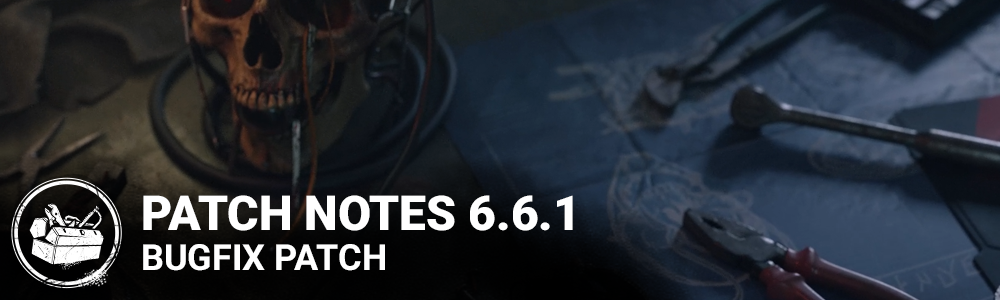

<!-- summary -->
## AI TL;DR

The Skull Merchant’s power UI received a visual overhaul, correcting display anomalies and ensuring active states are shown correctly. The patch also delivers a broad sweep of bug fixes: challenge progress now tracks accurately, audio glitches for Spirit’s phase ability and menu pop-ups are resolved, bots gain smarter behavior against lockers, drones, and specific add-ons, and numerous character animation and clipping issues—including Legion’s door break, Survivor hand distortion, and The Artist’s arm jitter—are fixed. Perk interactions such as Grim Embrace, Teamwork: Power of Two and Friendly Competition now work reliably, platform-specific map listings, store access and Switch launch crashes are addressed, and UI tooltips and load-out pop-ups are corrected.
<!-- /summary -->

<!-- nav -->
&larr; [6.6.0 | Tools of Torment](378-6-6-0-tools-of-torment.md) · [Live](../../index.md#live) · [6.6.2 | Bugfix Patch](381-6-6-2-bugfix-patch.md) &rarr;
<!-- /nav -->

# 6.6.1 | Bugfix Patch

## Release Schedule

Update Releases: 11AM ET

*Note: Times are an estimate and may vary from platform to platform.*

## Features

- Updated UI for The Skull Merchant's Power.

## Bug Fixes

### Archives & Challenges

- Fixed an issue where the "Glyph Graduate" Yellow Glyph challenges were not recognizing the Player's input within a good skill check zone.
- Fixed an issue where the "Near Miss" challenge could gain progress if the Killer's attack missed a Survivor from a distance greater than the intended 5 meters.
- Fixed an issue where the "Gruesome" challenge would gain two (2) points of progress instead of one (1) during the End-Game Collapse.
  - This fix also addresses other Hook action challenges that gained double progress during the End-Game Collapse.

### Audio

- Fixed an issue with The Spirit where the audio for her phase ability would not be played for Survivors while using the Furin add-on.
- Fixed an issue where granted currency and item pop-ups in the Main Menu would play twice.
- Fixed an issue where the SFX for changing pages using a controller would be missing while in a bot lobby.
- Fixed an issue where the game's audio could be heard while in the Loading Screen before entering or leaving a Trial.

### Bots

- After playing a Custom Game with Add-ons disabled, the Tally screen no longer shows incorrect Add-ons.
- An injured Bot will now think twice before attempting to heal a downed Bot within the Terror Radius.
- Bots can now use the Repressed Alliance Perk.
- Bots no longer shuffle at a slow pace while at a pallet if the chasing Killer is slightly far away.
- Bots now respect Killers more by not getting into lockers while in the Killer's line of sight.
- Bots will now avoid backtracking to Pallet to stun the Killer, as it often led to an injury.
- In the Custom Game lobby, Bots now correctly display the Item equipped even after changes in party members.
- When playing against a Killer with the Iron Maiden Perk, Bots are now more careful about getting into Lockers, especially when equipped with Locker-based Perks like Flashbang.
- When playing against Freddy Krueger with Add-ons allowing Dream Pallets, Bots will now remember which Pallets were replaced by fakes.
- When playing against The Skull Merchant, Bots avoid loops covered by a Drone zone.
- When playing against The Skull Merchant, Bots are now capable of vaulting near Drones.
- When playing against The Skull Merchant with the Iridescent Unpublished Manuscript Add-on, Bots now respond to the change in Terror Radius.

### Characters

- Fixed an issue that cause the Door breaking animation to play too fast when playing as The Legion with Brutal Strength and equipped Frank's mix tape.
- Fixed an issue that cause all Survivors' left hands to be distorted when receiving healing.
- Fixed an issue that causes The Artist's arm to jitter backward awkwardly when she walks into and past a tall asset.
- Fixed an issue that cause All Survivors' hands and heads to clip through the locker when fast exiting.
- Injured Survivors have no more crooked wrists when moving and holding a Pocket Mirror.
- Fixed an issue causing killers to sometimes be unable to hit a Survivor healing a downed Survivor.
- Fixed an issue where The Knight's Healing Poultice, The Onryo's Distorted Photo and The Oni's Iridescent Family Crest Add-ons incorrectly revealed auras for the duration of their effect.
- The Dredge no longer incorrectly becomes Invisible when teleporting during Nightfall.
- Survivors who scream during the Cenobite's teleport no longer become stuck.
- The Skull Merchant's Drones no longer appear invisible when in the Active State.

### Environment

- Fixed a lighting issue that caused the Onryo's well to look incorrect in the lobby.
- Fixed an issue with a rock that could be climbed in the Mount Ormond Resort map.

### Perks

- The Survivor's Aura no longer fails to be revealed by Grim Embrace when the obsession is transferred by Game Afoot.
- Teamwork: Power of Two no longer fails to deactivate if the other Survivor disconnects.
- Healing an injured Survivor who has the Perk Adrenaline equipped while all Generator are completed no longer triggers the effect of the Perk Teamwork: Power Of Two
- The Teamwork: Power of Two buff external icon now properly appears on all of the Survivors using the Perk.
- The Teamwork: Collective Stealth's external perk icon now correctly appears on the affected Survivor instead of the perk owner when both Survivors have this Perk equipped.
- The Friendly Competition repair bonus speed buff is now properly maintained if the Perk owner disconnects from the Trial.
- Using the Perk For The People on a dying Survivor now properly gives the Survivors the Teamwork: Power of Two and Teamwork: Collective Stealth buffs.
- The End Game Collapse timer now updates properly when the last remaining survivor gets back up from the Adrenaline perk's effect

### Platforms

- All available Maps now correctly show in the Custom Game settings for players on the Epic Games Store.
- Fixed an account mismatch issue when using the in-game Store on the Windows Store.
- Fixed an intermittent crash when launching the game on Switch.

### UI

- Fixed an animation issue when quickly changing pages in the Edit Bot Loadout popup.
- Fixed a layout issue in the Edit Bot Loadout popup when the UI Scale Setting is not 100%.
- Fixed an incorrect tooltip message for unavailable add-ons in the Edit Bot Loadout popup.

### Misc

- Hooking Survivors during the End Game Collapse no longer counts for 2 Hooks for the Hooks challenges progress
- The Hack the Mainframe Achievement now unlocks correctly upon Killer disconnection.
- Adept Renato and Adept Thalita are unlocked if the Killer Disconnects after the Exit Gate was opened.

<!-- nav -->
&larr; [6.6.0 | Tools of Torment](378-6-6-0-tools-of-torment.md) · [Live](../../index.md#live) · [6.6.2 | Bugfix Patch](381-6-6-2-bugfix-patch.md) &rarr;
<!-- /nav -->
