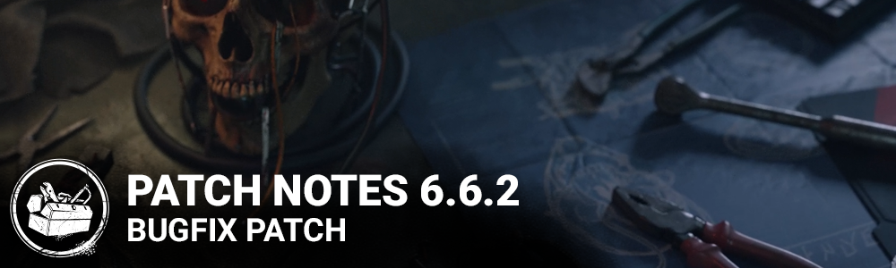

<!-- summary -->
## AI TL;DR

The Skull Merchant is overhauled: Survivors grant up to +7% Haste, Claw Traps no longer recharge from failed hacks or active zones, and drones return only after their battery empties and are unhackable near trapped Survivors. Fast-vaulting Survivors break both pallet and trap, and hacked traps self-destruct. A new Ultrasonic Trap Speaker halves Undetectable start-up, Expired Batteries and Prototype Rotor rarities are adjusted, and Adaptive Lighting rises to 50%.

The patch fixes bugs: progress now counts pallet breaks; audio cues and voice-overs are restored; bots gain pathing; model glitches on hooks and tally screens are resolved; chest in Shattered Square’s basement is removed; perk icons and effects work correctly; Xbox One intro cinematics no longer stutter; UI tooltips are corrected.
<!-- /summary -->

<!-- nav -->
&larr; [6.6.1 | Bugfix Patch](379-6-6-1-bugfix-patch.md) · [Live](../../index.md#live) · [6.7.0 | Mid-Chapter](385-6-7-0-mid-chapter.md) &rarr;
<!-- /nav -->

# 6.6.2 | Bugfix Patch

## Release Schedule

Update releases: 11am ET

## Developer Update

[https://forums.bhvr.com/dead-by-daylight/kb/articles/380](https://forums.bhvr.com/dead-by-daylight/kb/articles/380)

## Features

**Killer: The Skull Merchant**

- Base power changes:
  - The Skull Merchant gains a flat Haste Status Effect for each Survivor detected on the radar. This bonus is lost when no Survivor is detected on the Radar.
    - One Survivor : +3%
    - Two Survivors: +5%
    - Three Survivors: +6%
    - Four Survivors: +7%
    - *Note: You do not need to be Inspecting the Radar in order to get this bonus.*
- Failing the Claw Trap hack no longer recharges its battery
- Entering an Active Zone no longer recharges Claw Trap batteries
- Drones only return to the Killer after their respective Claw Trap battery is empty
- Survivors with a Claw Trap cause Drones to be Unhackable while they are nearby
- Claw Trapped Survivors who fast vault pallets break the pallet and their Claw Trap at the same time
- Claw traps are automatically removed when their battery is empty
- Addon changes :
  - Ultrasonic Trap Speaker (NEW EFFECT): Decrease the time it takes for Undetectable to take effect by 50%
- Increase the “Expired Batteries” addon rarity to Ultra Rare (was Very Rare)
- Decrease the “Prototype Rotor” addon rarity to Very Rare (was Ultra Rare)
- Increase Adaptive Lighting to 50% (was 20%)
- Decrease Expired Batteries to 40% (was 150%)

## Miscellaneous

- A previous patch note stated that the perk Leverage no longer worked on self-healing. This was not the case. Leverage has worked on self-healing and still does.
- Updated screams caused by Perks to be heard map-wide, as they were prior to version 6.6.0.

## Bug Fixes

### Archives & Challenges

- Fixed an issue where pallets broken by The Knight's Guards were not contributing progress towards applicable challenges, such as "Rault's Strength" and "Unleash the Rage".

### Audio

- Fixed an issue in the Archives where the French voice over for Memory 714 of Tome 13 would cut before the end.
- Fixed an issue where The Trapper would fail to trigger a voice over when a Survivor escapes his grab.

### Bots

- Bots can now ask other players to move out of their way.
- Bots no longer give up when Broken and within the area of a Boon: Circle of Healing.
- Tentatively fixed an issue where Bots would shut themselves down when injured by an Artist's Dire Crow.
- When playing against Freddy Krueger with the Dream Pallets Power, Bots no longer stop moving after passing a Dream Pallet.
- When playing against The Skull Merchant, Bots can now disable Drones placed on stairs.

### Characters

- Fixed an issue that cause Yun-Jin and a few other female survivors' face to be different when been on the hook.
- Fixed an issue that cause The Nurse's Grim Veil to stretches unnaturally on the tally screen.
- Fixed an issue that cause Males survivors grabbed from lockers to have stretched eyebrows.
- Fixed an issue where The Knight's Healing Poultice, The Onryo's Distorted Photo and The Oni's Iridescent Family Crest Add-ons incorrectly revealed auras for the duration of their effect.

### Map

- Fixed a bug that made two chests spawn in the Shattered Square basement of the main building.

### Perks

- The Haste status effect icon no longer appears on screen when Teamwork: Collective Stealth is active
- The Friendly Competition repair bonus speed buff is no longer lost if the Perk owner disconnects from the Trial.
- A Survivor fast vaults a Pallet with the Skull Merchant Claw trap no longer triggers the Perk Thwack!
- Failing one skill check caused by the Merciless Storm Perk no longer causes subsequent skill checks to fail

### Platforms

- Intro cinematics should no longer stutter on Xbox One.

### Killer - Skull Merchant

- Drones no longer show the scanning VFX for one frame when starting the scan phase.
- Claw-Traps removed by hacking now correctly self-destruct instead of disappearing

### UI

- Fixed Perk description tooltips being incorrectly positioned in the Edit Bot Loadout menu.
- Corrected 'Shotgun Speakers' add-on icon to avoid trypophobia trigger.

<!-- nav -->
&larr; [6.6.1 | Bugfix Patch](379-6-6-1-bugfix-patch.md) · [Live](../../index.md#live) · [6.7.0 | Mid-Chapter](385-6-7-0-mid-chapter.md) &rarr;
<!-- /nav -->
