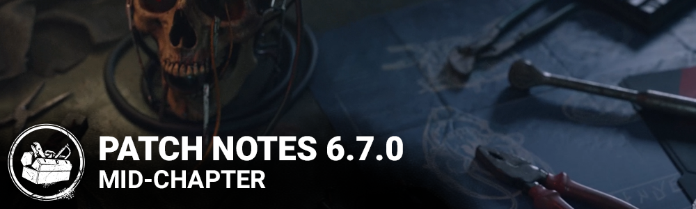

<!-- nav -->
&larr; [6.6.2 | Bugfix Patch](381-6-6-2-bugfix-patch.md) · [Live](../../index.md#live) · [6.7.1 | Bugfix Patch](387-6-7-1-bugfix-patch.md) &rarr;
<!-- /nav -->

# 6.7.0 | Mid-Chapter

## Release Schedule

Update releases: 11am ET

*Note: Update times may vary from platform to platform.*

## Developer Updates

For more information on any of these changes, see our [March](https://forums.bhvr.com/dead-by-daylight/kb/articles/382) and [April](https://forums.bhvr.com/dead-by-daylight/kb/articles/384) Developer Updates.

## Content

## Map Rework: Autohaven Wreckers - Blood Lodge and Gas Heaven

- Maze Tile (MD13) with unsafe Pallets and windows was redesigned to be safe and consistent with other maps.
- Added more Lockers in the realm.
- Raised the minimum amount of Pallets in the Realm to reduce Dead Zones.
- Updated the placement of the Gas Station to be more on the side of the map.
- Updated the setup of the Gas Station to remove the strong window in the back of the building.

## The Archives

- Tome 15: ASCENSION - Level 1 opens on April 19th at 11:00am ET
- "Core Memory" challenges
  - These challenges task Survivors and Killers to restore a lost memory by finding Memory Shards scattered in the trials and restoring them to unlock story fragments in journals.
  - As with the Glyph challenges, upcoming tomes will introduce new variants of the Core Memory challenge, providing a more varied experience in the Archives with each new Tome.
- Lightburn has been removed from all applicable challenge descriptions and challenge requirements.
- Adjusted the challenge requirements for challenges in Tomes 1 to 5 and 12 so they are better aligned with the challenge difficulties of other Tomes and their levels within The Archives.

## Features

**Light-Killer Interactions**

We are removing Killer-specific light interactions.

- The Nurse can no longer be Lightburned out of her Blinks.
- The Hag's Phantasm Traps are no longer removed by lights.
  - Survivors can now remove them by approaching them carefully and wiping them away.
- The Wraith can no longer be Lightburned when cloaked.
- The Artist's Crows are no longer affected by light.
  - Crow swarms cannot be removed by light.
  - Dire Crows cannot be removed by light.
- The Spirit
  - Can no longer burn The Spirit's Husk

## General Healing

- Decrease the bonus on successful Healing Great Skill Checks from **5%**to **3%**.

## Killer Tweaks

- **The Hillbilly**
  - Power
    - Less heat added upon starting to rev the Chainsaw.
    - Less heat added while revving the Chainsaw.
    - More heat added during Chainsaw Sprint.
- **The Pig**
  - John's Medical File Addon
    - Increase crouched move speed by **10%** (was 6%).
- **The Cenobite**
  - The Lament Configuration will now teleport if The Cenobite stands on it for **5 seconds**.
- **The Clown**
  - Redhead's Pinky Finger Addon: Start with **3 fewer bottles**, and maximum bottles is **decreased by 3** (was 2 and 2, respectively).
- **The Nightmare**
  - Add-Ons
    - Sheep Block: Triggering Dream Snares or Dream Pallets inflicts Blindnessfor **60 seconds** (was 30 seconds).
    - Unicorn Block: Triggering Dream Snares or Dream Pallets inflicts Blindnessfor **90 seconds** (was 60 seconds).
- **The Oni**
  - Add-Ons
    - Blackened Toenail: Increases movement speed while absorbing Blood Orbs by **0.4 m/s** (was 0.3 m/s).
    - Bloody Sash: Increases movement speed while absorbing Blood Orbs by **0.7 m/s** (was 0.6 m/s).
- **The Executioner**
  - Scarlet Egg Add-On
    - Increases the duration of Killer Instinct when triggered by Rites of Judgment by **3 seconds**.

## Perk Updates

- **Scourge Hook: Pain Resonance**
  - You start the Trial with **4 tokens**. The first time each Survivor is placed on a Scourge Hook, lose **1 token.**When you lose a token, the Generator with the most progress explodes, instantly losing **15%/20%/25%** progress, and begins to regress. Once you have no tokens, Pain Resonance deactivates for the rest of the Trial.
- **Gearhead**
  - After a survivor loses a health state by any means, Gearhead activates for 30 seconds. While Gearhead is active, the every time a Survivor performs a good Skill Check while repairing, their Aura is revealed to you for **6/7/8 seconds**.
- **Boon: Circle of Healing**
  - Any Survivors within the Boon Totem’s range gain a **50%/75%/100%** healing speed bonus to healing others. Med-Kits do not stack with Boon: CoH. Injured Survivors have their Auras revealed to all other Survivors when inside the Boon Totem’s range.
- **Dead Hard**
  - Dead hard activates after you are unhooked or unhook yourself. Press the Active Ability button 1 while running to gain the Endurance status effect for the next **0.5 seconds**. Causes the Exhausted Status Effect for **60/50/40 seconds**. Dead Hard then deactivates.
- **Overzealous**
  - After cleansing or blessing any totem, this Perk activates. Your Generator repair speed is increased by **8%/9%/10%**. This bonus is doubled if you cleanse/bless a Hex totem. This Perk deactivates when you lose a health state by any means.
- **Call of Brine**
  - After kicking a generator this perk becomes active for **60 seconds**. The Generator regresses at **115%/120%/125%** of the normal regression speed and you can see its aura in yellow. Each time a Survivor completes a good Skill Check on a Generator affected by this Perk, you receive a loud noise notification.
- **Overcharge**
  - Overcharge a generator by performing the Damage Generator action. The next Survivor interacting with that Generator is faced with a difficult Skill Check. Failing the Skill Check results in an additional **2%/3%/4%** loss of progress. Succeeding the Skill Check grants no progress, but prevents the Generator explosion. After Overcharge is applied to a generator, its regression speed increases from **85% of normal to 130% of normal** over the next **30 seconds**.

## Med-kit Update

- **Camping Aid Kit: 24 charges**. (was 16) Increases the speed that you heal others by **35%**. (was 25%) Decreases the speed and efficiency when healing yourself by **33%**. (NEW) Unlocks the self-healing action.
- **First Aid Kit: 24 charges**. (was 24) Increases the speed that you heal others by **40%**. (was 35%) Decreases the speed and efficiency when healing yourself by **33%**. (NEW) Unlocks the self-healing action.
- **Emergency Med-kit: 24 charges**. (was 16) Increases the speed that you heal others by **45%**. (was 50%) Decreases the speed and efficiency when healing yourself by **33%**. (NEW) Unlocks the self-healing action. (Self-healing buff removed)
- **Ranger Med-kit: 24 charges**. (was 32) Increases the speed that you heal others by **50%**. (was 35%) Decreases the speed and efficiency when healing yourself by **33%**. (NEW) Unlocks the self-healing action. (Skill check bonuses removed)
- **All Hallows' Eve Lunchbox: 24 charges**. (was 24) Increases the speed that you heal others by **40%**. (was 35%) Decreases the speed and efficiency when healing yourself by **33%**. (NEW) Unlocks the self-healing action. Makes you considerably more visible.
- **Anniversary Med-kit: 24 charges**. (was 24) Increases the speed that you heal others by **40%**. (was 35%) Decreases the speed and efficiency when healing yourself by **33%**. (NEW) Unlocks the self-healing action.
- **Masquerade Med-kit: 24 charges**. (was 24) Increases the speed that you heal others by **40%**. (was 35%) Decreases the speed and efficiency when healing yourself by **33%**. (NEW) Unlocks the self-healing action.

## Med-kit Addons Update

- **Rubber Gloves: Increases** the Bonus skill check size by **10%**. (NEW) (Removed progress bonus for Great skill checks)
- **Sponge:Increases**the Bonus skill check size by **20%** (NEW) (Removed progress bonus for Great skill checks
- **Needle & Thread: Increases** the chances of triggering a Skill Check by **10%**. **Increases**progression bonus for succeeding Great Skill Checks by **5%**. (NEW) (Removed Bloodpoint bonus)
- **Medical Scissors: Increases** healing speed by **10%**. (was 15%)
- **Gauze Roll: Adds 10 charges** to the Med-Kit. (was 12 charges) Changed to Rare rarity.
- **Surgical Suture:Increases**the chances of triggering a Skill Check by **15%**. Increases progression bonus for succeeding Great Skill Checks by **10%**. (NEW) (Removed Bloodpoint bonus)
- **Gel Dressings:** Changed to Ultra Rare rarity.
- **Abdominal Dressing:Increases** healing speed by **15%**. (was 25%) (Removed charges penalty) Changed to Very Rare rarity.
- **Styptic Agent:** Press the Secondary Action button while healing with the Med-kit to use the Styptic Agent. When the Styptic Agent is used on an injured Survivor, they gain Endurance for **5 seconds**. (was 8 seconds) Consumes the Med-Kit on use.

## Bloodweb Improvements

You asked for it for a long time, and it's finally here: using the Bloodweb has been made much simpler!

- By default, nodes can now be claimed by pressing them rather than holding. If you want to revert to the old method, a setting in the Accessibility tab allows you to toggle between Press and Hold.
- Hovering the cursor over any node in the Bloodweb that is not currently purchasable shows a red outline of a path of nodes leading up to it and displays the total Bloodpoints needed to buy all those nodes.
- Pressing/holding on any such node automatically purchases all the nodes one-by-one on the hovered path. This may not complete if purchasing all nodes becomes limited by your Bloodpoint total or the Entity consuming nodes alon the way.
- After reaching Prestige 1 with a character, the Bloodweb for that character will contain a new center node. Pressing/holding on it will automatically claim as much as possible of the whole Bloodweb level. The automation will prioritize Perks first and attempt to spend the minimum amount of Bloodpoints second. This will stop if you run out of Bloodpoints, but will continue with The Entity consuming nodes.

**We've done the following fixes since PTB:**

- Leaving the Bloodweb menu during Automated Purchasing no longer breaks the Bloodweb.
- Cancelling Automated Purchasing no longer breaks the Bloodweb.
- Switching characters during Automated Purchasing will no longer be possible, as it could have led to a soft-locked state.
- The cost of a Bloodweb node chain ending in a Rare or Very Rare Perk is now displayed correctly.
- The Bloodweb no longer soft locks when pressing the Automated Purchasing button with low Bloodpoints.
- Automated Purchasing no longer stops midway due to Entity shenanigans.
- Audio cues for claiming nodes during Automated Purchasing are removed, instead replaced by a single cue at the completion of a level.
- The speed of automatic purchase has been increased.
- The total chain price format in the Node Tooltip has been modified with a new icon.
- The Center node to automatically purchase nodes is now disabled when there is not enough Bloodpoints to purchase at least one node.
- Fixed some interaction issues related to the new Bloodweb center node to purchase nodes automatically.
- Fixed a softlock when collecting a node in the Bloodweb when starting a Matchmaking at the same time as a Killer.

## Visual Terror Radius

- Added a new Accessibility Options for the Visual Terror Radius.
- When enable, the Terror Radius will be represented by a beating heart within your Survivor's chest. The closer the Killer comes, the faster and more intensely the heart will beat.
- Killer Lullabies will also be represented by a haze effect in your chest.
- This feature can be combined with existing colourblindness settings to improve its visibility as needed.

## Misc

- Anonymous Mode is now available on consoles.
- The "Hide Player Names" setting now also hides the Killer name in Custom Games.
- Cinematic video files are now stored in Bink format.
- The Undetectable effect now mutes the audio progressively in all cases, to mimic the Killer moving away. Previously there were some Add-Ons that were removing the Terror Radius instantly.

## Changes from PTB to Live

## Killer Tweaks

- Reverted the PTB updates to the Hillbilly's Doom Engravings and Death Engravings Add-Ons.

## Perks

- Dead hard now activates when you are unhooked or unhook yourself.
- Scourge Hook: Pain Resonance's effect is now **15%/20%/25%**.
- Boon: Circle of Healing's effect is now **50%/75%/100%**.

## General healing

- Reverted Survivor heal interaction seconds to charge from **24** to **16 seconds**.

## Med-kit Update

- **Camping Aid Kit:** Increases the speed that you heal others by **35%**. (was 25%) Decreases the speed and efficiency when healing yourself by **33%**. (NEW)
- **First Aid Kit:** Increases the speed that you heal others by **40%**. (was 35%) Decreases the speed and efficiency when healing yourself by **33%**. (NEW)
- **Emergency Med-kit:** Increases the speed that you heal others by **45%**. (was 50%) Decreases the speed and efficiency when healing yourself by **33%**. (NEW)
- **Ranger Med-kit:** Increases the speed that you heal others by **50%**. (was 35%) Decreases the speed and efficiency when healing yourself by **33%**. (NEW) (Skill check bonuses removed)
- **All Hallows' Eve Lunchbox:** Increases the speed that you heal others by **40%**. (was 35%) Decreases the speed and efficiency when healing yourself by **33%**. (NEW)
- **Anniversary Med-kit:** Increases the speed that you heal others by **40%**. (was 35%) Decreases the speed and efficiency when healing yourself by **33%**. (NEW)
- **Masquerade Med-kit:** Increases the speed that you heal others by **40%**. (was 35%) Decreases the speed and efficiency when healing yourself by **33%**. (NEW)

## Med-kit Addons Update

- **Rubber Gloves:Increases**the Bonus skill check size by **10%**. (NEW)
- **Butterfly Tape: Increases** healing speed by **5%**. (was 3%)
- **Sponge:Increases**the Bonus skill check size by **20%** (NEW)
- **Needle & Thread: Increases**the chances of triggering a Skill Check by **10%**. **Increases** progression bonus for succeeding Great Skill Checks by **5%**. (NEW) (Removed bloodpoint bonus)
- **Gauze Roll:**Changed to Rare rarity.
- **Surgical Suture:Increases**the chances of triggering a Skill Check by **15%**. Increases progression bonus for succeeding Great Skill Checks by **10%**. (NEW) (Removed bloodpoint bonus)
- **Gel Dressings:Adds 16 charges** to the Med-Kit. (was 14 charges) Changed to Ultra Rare rarity.
- **Abdominal Dressing:Increases** healing speed by **15%**. (was 20%) (Removed charges penalty) Changed to Very Rare rarity.
- **Anti-hemorrhagic Syringe:** Press the Secondary Action button while healing with the Med-Kit to use the Anti-Hemorrhagic Syringe. The affected Survivor will passively gain a health state **16 seconds** after use. (was 24 seconds) The time required is modified by perks, items and add-ons that affect Healing Speeds. This effect is canceled when the affected Survivor changes health state or is picked up. Consumes the Med-Kit on use.
- **Refined Serum: Increases** your Movement speed by **+5% for 20 seconds**. (was 15 seconds) Creates a Blight trail behind the affected Survivor. Can be used on other Survivors or yourself. Consumes the Med-Kit on use.

## Bug Fixes

## The Archives

- The "Near Miss" Survivor challenge now counts when avoiding hits while the Killer is carrying another Survivor.
- The "Near Miss" Survivor challenge now no longer counts attacks while in the dying state or on a hook.
- The "Physical Tantrum" Killer challenge now counts progress from pallets destroyed when vaulted by a Survivor affected by The Skull Merchant's Claw Trap.

## Audio

- Adjusted the speed of audio as the Bloodwell autofills.
- Fixed an issue where the audio of Bloodweb Generation would play twice.
- Survivors are no longer missing voiceovers when a Killer interrupts them while entering and exiting a Locker.
- Fixed a delay in the Terror Radius suppression after de-manifesting and gaining Undetectable with The Onryo.
- Fixed a delay in the Terror Radius suppression when gaining Undetectable with the Cenobite's Add-On "Chatterer's Tooth".
- Fixed a delay in the Terror Radius suppression after crouching and gaining Undetectable with The Pig.
- Fixed a delay in the Terror Radius suppression when gaining Undetectable with the Deathslinger's Add-On "Hellshire Iron".
- Fixed a delay in the Terror Radius suppression when gaining Undetectable with the Hillbilly's Add-On "Iridescent Brick" and "Leafy Mash".
- Fixed an issue where when using The Doctor with any "Discipline" Add-On, the Terror Radius and Red Stain fails to be active after a Chase would end while in Madness Tier 2.

## Bots

- Bots in the Tutorial now have their names correctly localized.
- Bots are less likely to drop a Pallet while standing still on the same side as the Killer.
- Bots no longer slow down while traversing the area of a Skull Merchant's Drone if inside the Terror Radius.
- Bots are less likely to run into a Killer while attempting to evade them.
- Further reduced the odds of Bots failing to loop when a Killer is near.
- Bots no longer try solve the Lament Configuration while being chased.

## Characters

- Fixed an issue that caused The Skull Merchant's Drone deployment animation to be delayed for several seconds after the Drone has been successfully deployed.
- Animations should no longer appear choppy during gameplay.
- The Spirit's arm pieces will no longer clip into each other during several animations.
- Fixed an issue that caused Performing a Lunge Attack with the Female Legion body to cancel the hit animation if the duration of Feral Frenzy ends during the animation.
- The Female Legion cosmetics no longer use male walking animations while in the Trial.
- The Pig should no longer remain standing when Crouching.
- Select Killer Moris will no longer cause the Survivor's camera to fade to gray and flicker before going to the tally screen.
- Survivors may no longer wipe the Hag’s trap away a second time after wiping it.
- The Nurse can properly charge a Blink when being lit by a flashlight.
- The Legion’s Frenzy ends after missing an attack after having hit a Survivor.
- The Legion’s Frenzy completely replenishes when putting a Survivor into Deep Wound when equipped with the Never-Sleep Pills and Mischief List Add-Ons.
- Characters no longer show the missed Skill Check animation the next time they heal someone if they interrupted a healing action just as a Skill Check was appearing.
- The Terror Radius and Red Stain properly activate after ending a chase when equipped with any of the ’Discipline’ Add-Ons as The Doctor.
- The Dredge may no longer become invisible when teleporting during Nightfall.
- The Cannibal, The Hillbilly, The Trapper and The Twins now correctly have their Power visible on the tally screen.
- The Clown may no longer push Survivors while reloading his Tonics.

## Environment

- Fixed an issue where the mist was not visible in the basement of RPD
- Fixed issues where the Skull Merchant can deploy drones in door ways.
- Fixed a bug where the Nightmare could not place his trap in the Asylum building.
- Fixed an issue where Nemesis Tentacles would go through barricaded windows of the Foundry.
- Updated the height of small bushes in Red Forest to improve visibility and navigation.
- Fixed and issue where Killers could not grab a Survivor from a Jigsaw Box in RPD.
- Fixed an issue preventing Victor from jumping on the Pot in the Temple of Purgation dungeon.
- Fixed an issue where a Survivor would clip through the doors of a Locker in Main Building of the Mother's Dwelling Map.
- Fixed an issue where a character could spawn in a car pile.
- Fixed an issue where Zombies get stuck on top of hills.
- Fixed an issue where the exit sign is misplaced in RPD.
- Fixed an issue where items were hidden in the books of Eyrie of Crows building.
- Fixed an issue where a Pallet was clipping with the ground in the Yamaoka Family Residence.
- Fixed an issue in the Garden of Joy where Zombies could not patrol the Greenhouse.
- Fixed an issue where a Generator was not accessible on a tile in Junkyard.
- Fixed an issue where a Hook in The Shattered Square was not accessible to the Killer.
- Fixed an issue where a trap could not be picked near the Yamaoka Family Residence.
- Fixed a Faux Appel near the Temple of Purgation.
- Fixed issue where invisible collisions would block projectiles in the main building of The Shattered Square,
- Fixed an issue where a placeholder tile could spawn on Haddonfield.
- Fixed an issue in Dead Dawg Saloon where waking up against a wall would send the Survivors out of the world.
- Fixed an issue where Legion was not able to vault the Pallet in the shack of the Red Forest.
- Fixed an issue where the Nurse could not blink in the bungalow in Badham Preschool
- Fixed an issue where a trap would spawn inside of a Generator in Treatment Theater.
- Updated the weight of the Generators in Haddonfield to prevent them from being too close.
- Fixed an issue where a Bear Trap would spawn in the Bus tile in Junkyard.

## Perks

- Gearhead no longer activates when a Survivor disconnects.
- Gearhead no longer activates when a Survivor gains a health state.
- Thrill of the Hunt now grants extra Bloodpoints as per perk design
- Merciless Storm no longer causes Generator progress to regress while the Generator is blocked.
- Merciless Storm no longer causes the Generator to lose progress when succeeding the Skill Check.

## UI

- Fixed alignment and overlaps for the input switchers in the Full-screen image viewer of the archives.
- Fixed button overlaps between Main Menu and Options button on multiple languages on the Onboarding Screen.
- The HUD is properly hidden when spectating a Mori.
- The heartbeat icon is no longer visible when using a Flashlight.
- The remaining time text in the Shrine of Secrets is no more cut-off in certain languages.
- Fixed localization issues in some of the system error messages.
- Fixed the tooltip positioning in the Archive Compendium Tab.
- Fixed an unlocalized String in the Match Result screen.
- Added prompt icons support for PS5 controller when playing on PC.

## Misc

- Equipping Cosmetics that have unique voice lines should now have the subtitles always in sync.
- Archive and Event cinematics should now be accessible in lobbies and be interruptable.
- Inviting a player on PS5 to your lobby made on PS4, or vice-versa, should now work correctly, even if the invited player does not have the game running.

## Known Issues

- The Visual Terror Radius is not correctly showing the strength of the Killer's Lullaby

<!-- nav -->
&larr; [6.6.2 | Bugfix Patch](381-6-6-2-bugfix-patch.md) · [Live](../../index.md#live) · [6.7.1 | Bugfix Patch](387-6-7-1-bugfix-patch.md) &rarr;
<!-- /nav -->
