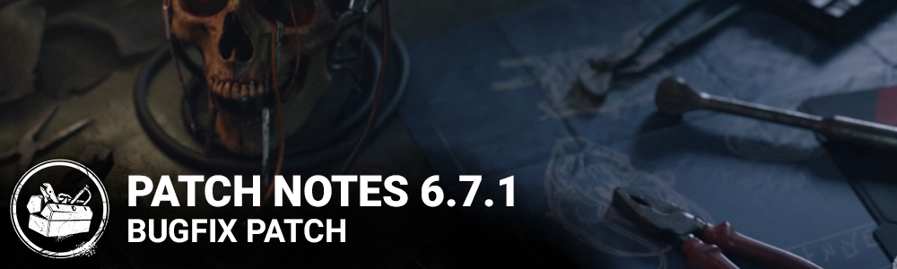

<!-- summary -->
## AI TL;DR

Bot interactions for The Mastermind’s Uroboros Infection and The Dredge locker use were tweaked, and key character visual bugs—including The Oni intro VFX, The Ghost Face cosmetic swaps, The Spirit vault jitter, The Knight token reset, The Wraith flashlight clipping and The Huntress hatchet clipping—were fixed; a choppy-animation optimization was also disabled. Collision and navigation problems on Blackwater Swamp, MacMillan Estate, Raccoon City and several other maps were resolved. Audio glitches for The Shape and The Skull Merchant were corrected, and UI crashes, privacy-policy toggle, Bloodweb tooltip coloring and terror-radius visual cue were addressed, restoring the Bloodweb’s intended purchase priority. Known issues persist for The Dredge’s Masquerade Colours and the Any Means Necessary perk.
<!-- /summary -->

<!-- nav -->
&larr; [6.7.0 | Mid-Chapter](385-6-7-0-mid-chapter.md) · [Live](../../index.md#live) · [6.7.2 | Bugfix Patch](388-6-7-2-bugfix-patch.md) &rarr;
<!-- /nav -->

# 6.7.1 | Bugfix Patch

## Release Schedule

Update releases: May 3 2023, 11AM ET

*Please note that update times may vary slightly per platform.*

## Bug Fixes

**Bots**

- Bots no longer have a tickle fight when they are both infected by The Mastermind's Uroboros Infection and attempting to spray each other with First Aid Sprays.
- When playing against The Dredge, Bots are more likely to lock lockers.
- When playing on the Rancid Abattoir map, Bots no longer infinitely vault a window when going for an Unhook.

**Characters**

- VFX issues no longer occur on The Oni during Intro Camera, Mori and Score Screen.
- VFX issues no longer occur on The Ghost Face when swapping between Cosmetics.
- Smoke VFX no longer appear when switching between certain locked Cosmetics.
- When The Skull Merchant destroys a Pallet, the animation plays out as intended.
- Fixed an issue where, as The Spirit, vaulting from a high location and falling to the ground would cause her to jitter in the air instead of falling continuously.
- Hitting a Survivor with The Knight’s Guardia Compania now correctly resets Play with Your Food tokens.
- The Flashlight beam is no longer obstructed by The Wraith’s body when cloaked.
- The Cenobite may no longer teleport far from the Survivor when the teleport is triggered right after the Survivor starts solving the Lament Configuration.
- Fixed an issue that caused some of the cosmetic VFX to disappear while playing a match.
- Fixed an issue where the kicking animation for breaking pallets and generators was offset while The Huntress was equipped with the 'Night Owl' customization set."
- Fixed an issue that caused The Huntress' arm is to clip in the Killer POV when throwing a hatchet while falling.
- Fixed an issue where when a Survivors starts healing another Survivors immediately after unhooking them, they get positioned in a way that clipping occurs between them.
- Fixed an issue that caused The Spirit's hands to briefly flash blue when releasing the Killer Power at the last second while charging, causing them to duplicate momentarily.
- Fixed an issue that caused The Pig’s crouch and uncrouch animation not to be shorter when equipped with the Combat Straps Add-On.

**Animation**

- Disable an optimization on animation that caused choppy or low-frame rate animations in certain situation.

**Environment**

- Fixed issue in Blackwater Swamp's Pale Rose map where there was a collision issue in the stairs of the Pale Rose's boat.
- Fixed an issue on all maps around the killer shack where a collision would hinder navigation around the exterior of the shack.
- Fixed an issue on The MacMillan Estate Groaning Storehouse map where the killer could body block acces in the stairs to the basement.
- Fixed an issue on The MacMillan Estate Suffocation pit map where the killer could body block acces in the stairs to the basement.

**Archives**

- The "Salvation or Sacrifice" challenge no longer gains an unintended extra point of progress when hooking a Survivor during the End-Game Collapse.
- Issues related to the Core Memory challenges.
  - Memory fragments no longer spawn too close to the Player spawn points and to each other.
  - The memory portal no longer remains displayed after another player interacts with it.
  - The Demogorgon can no longer collect memory fragments while traversing the Upside Down.
  - Survivors can no longer interact with the memory portal while Incapacitated with Victor when playing against The Twins.
  - Fixed multiples issues to the Survivor interactions and visibility with memory fragments and memory portal interaction when Victor was unbound nearby Players when playing against The Twins.
  - The Killer can no longer interact with the memory portal while carrying a Survivor.
  - Fixed an issue where the audio feedback for collecting a memory fragment played only once instead of per fragment.
  - The Knight can no longer collect memory fragments while creating a patrol path for a Guard.
  - Fixed an inconsistent page change audio in the Archive.
  - Fixed an issue where the Killer's camera had unintentional movement when interacting with the memory portal.

**Audio**

- The sounds of Survivors fighting back are no longer missing from The Shape's Mori while having Judith's Tombstone Add-On equipped.
- Survivors grunts no longer persist after being healed while inside The Skull Merchant's Drone detection zone.
- Fixed an issue where, during an active Event, auto-filling the Bloodweb would play the same Item purchase sound multiple times.
- Fixed an issue where the SFXs were missing for the skull merchant's body cleaver weapon.
- **Fixed an issue where the Body Cleaver weapon for The Skull Merchant would not have attack sounds.**
- **Fixed an issue where clicking on the Perk preview UI button would produce no sound.**
- **Fixed an issue where using the Memory Of Maurice outfit for The Dredge would not have the added horse sound effects.**

**Level Design**

- The Nurse can no longer teleport out of bounds in Raccoon City Police Station Map.
- Fixed multiple collision issues in the Red Forest Realm.
- Fixed issues in Ironworks of Misery where some killers could land their powers on places unreachable to survivors
- Zombies no longer get stuck on railings in Father Campbell's Chapel.
- Fixed an issue in Groaning Storehouse where Killers are unable to pick up Survivors.
- Fixed an issue in Shattered Square where the dark mist was not positioned properly in the map
- Zombies should no longer get stuck on Temple of Purgation.
- Zombies should no longer get stuck on Dead Dawg Saloon.
- Fixed global issue where debris from Pallets would clip in the ground.
- Improved situation where lack of Hooks in Badham Preschool negatively impacted Killers.
- Fixed clipping assets in Temple of Purgation.
- Removed an impassable area in Badham Preschool.
- Fixed issue in Gas Heaven that adds mist around the Gas Station.
- Fixed issue in Mount Ormond Resort that prevented The Nightmare from placing Dream Snares around the building
- The Skull Merchant can no longer block doorways with Drones in Father Campbell's Chapel.
- The Demogorgon can no longer jump on top of metal piles in Gas Heaven.
- Zombies can now navigate between cars in Haddonfireld.
- Fixed issue in Midwich Elementary School where Victor could stand unreachable on top of metal shelves.
- Characters no longer get blocked in front of a cart in the Shattered Square.
- Killers can no longer land on top of a Hook in Midwich Elementary School.
- Fixed an issue in Badham Preschool where the Killer could not grab a Survivor working on aGenerator.
- Fixed an issue in Dead Dawg Saloon where a collision prevented Killer navigation near the bar.
- Zombies now navigate better in Temple of Purgation.
- Fixed issue in Treatment Theatre where Killers were body blocked near a hook
- The Nightmare's Dream Snares can no longer be placed on walls of the mine in Suffocation Pit.
- Mist now appears as intended in the Racoon City Police Station Map.
- Fixed an issue that caused the trees to fail to dissolve when the Entity sacrifice a survivor in the different maps.
- Fixed an issue where the dark mist would not appear properly in the Gas Station
- Fixed an issue where killers can stand on the rocks of the hills in Crotus Prenn maps
- Fixed an issue where a Faux-Appels would affect the players near the exit gates in Shattered Square
- Fixed an issue where players could not vault on the side of the Pale Rose Boat
- Fixed an issue that prevented players from navigating properly in the basement stairs, Shattered Square
- Fixed an issue where Trapper's Trap would appear near the fences, Shatered Square
- Fixed an issue where the players were blocked in the basement in the west wing of the Racoon City Police Station map
- Fixed an issue that prevented the nurse from blinking properly in the shrimp boat
- Fixed an issue related to the blocked window in the Myers House and created a dead end
- Fixed an issue where killers could jump on a pile of wood in the Mine map

**UI**

- Players can no longer accept and decline the Privacy Policy at the same time.
- Fixed an issue that caused a crash after passing Level 50 in the bloodweb.
- Fixed an issue where the player is unable to hide other player's name after showing the name when the Hide Other Player Names setting is on.
- Bloodpoint cost on the tooltip is now displayed in red when there is insufficient bloodpoints.
- Fixed an issue where the red outline of center button remains after automatic purchasing of the bloodweb level on Switch.
- Fixed soft lock with bloodweb purchase when switching characters.

**Terror Radius Visual Feedback**

- The Terror Radius Visual Feedback is now displayed when the audio level reaches a certain audible threshold to avoid the indicator being shown when the audio is barely discernible.

**Misc**

- The Insidious Perk icon no longer lights up if you become Undetectable from another source. Now it only lights up to indicate when the Perk itself is active.
- Fixed a crash on PS4 that could occur during initialization.
- Fixed a crash that could occur very rarely when using the Bloodweb.
- Fixed a crash that could occur at the end of a Trial.
- On the Nintendo Switch, the screen no longer flashes white during initialization.
- The Bloodweb is once again buying nodes as per the priority written in its description: nodes closest to the center, of lowest rarity first.
- Fixed the error 8007 for players on the Windows Store.

**Known Issues**

- The Dredge's "Masquerade Colours" cosmetic breaks in the Tally Screen
- The Perk "Any Means Necessary" is currently disabled due to a bug which allows players to reach unintended places.

<!-- nav -->
&larr; [6.7.0 | Mid-Chapter](385-6-7-0-mid-chapter.md) · [Live](../../index.md#live) · [6.7.2 | Bugfix Patch](388-6-7-2-bugfix-patch.md) &rarr;
<!-- /nav -->
