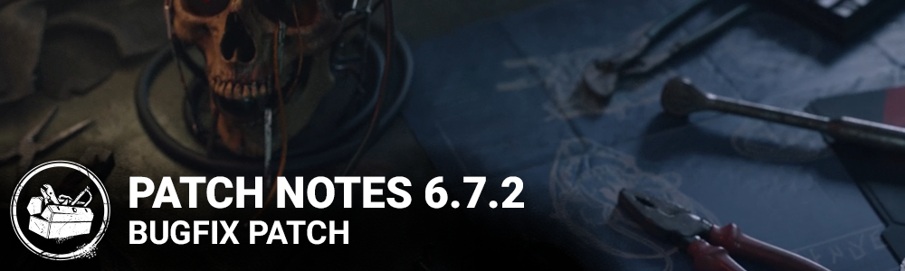

<!-- summary -->
## AI TL;DR

Two new outfits have been added to the in-game store along with a selection of Anniversary and Pride celebration charms. The update also includes a broad set of bug fixes across gameplay, UI and performance, arriving on May 18 2023 for all platforms.
<!-- /summary -->

<!-- nav -->
&larr; [6.7.1 | Bugfix Patch](387-6-7-1-bugfix-patch.md) · [Live](../../index.md#live) · [7.0.0 | End Transmission](392-7-0-0-end-transmission.md) &rarr;
<!-- /nav -->

# 6.7.2 | Bugfix Patch

## Release Schedule

Update releases: May 18 2023, 11AM ET

*Please note that update times may vary slightly per platform.*

## CONTENT

- Added two outfits for in-game store.
- Added some of the charms for Anniversary and Pride celebrations.

<!-- nav -->
&larr; [6.7.1 | Bugfix Patch](387-6-7-1-bugfix-patch.md) · [Live](../../index.md#live) · [7.0.0 | End Transmission](392-7-0-0-end-transmission.md) &rarr;
<!-- /nav -->
