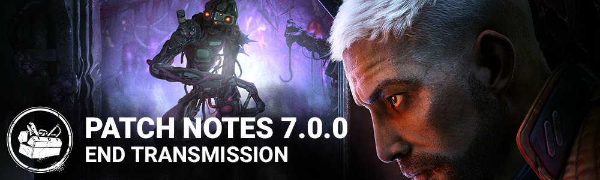

# 7.0.0 | End Transmission

## Release Information

Update release: 11AM ET, June 13

DLC release: 12PM ET, June 13

*Times are estimates and may vary from platform to platform.*

## Content

### New Killer: The Singularity

**Power: Quantum Instantiation**

*A dark crystalline structure in an ancient ruin gifted—or perhaps cursed—Hux with sentience. He built a new body, and with it, a terrifying way to bend the rules of physics to his benefit.*

The Singularity can shoot and spawn Biopods around the map; these Biopods can attach to any vertical surface they land on. The Singularity can control a Biopod remotely and look through it, and tag Survivors, afflicting them with a Temporal Slipstream. When Slipstreamed, The Singularity can teleport next to the Slipstreamed Survivor either by using the Biopods to tag them, or by shooting them. When a Slipstreamed Survivor is in proximity to another Survivor, the Slipstream can spread.

**Special State: Overclock Mode**-After a successful Slipstream teleport, the Singularity enters Overclock Mode. In this state, walls and pallets can be destroyed faster, vaulting speed is faster, and he cannot be stunned by pallets. Attempts to stun by pallet merely remove Overlock Mode and momentarily slow the Singularity.

**Special Interaction: Electromagnetic Pulse** - At the beginning of each Trial, several Supply Cases spawn, each containing an EMP. Survivors can use these EMPs to remove the Slipstream from themselves or others, or to destroy a Biopod. Once used, the EMP is destroyed.

**Perks:**

**Genetic Limits:**When a Survivor finishes the healing action, they suffer the Exhausted status effect for 24/28/32 seconds.

**Forced Hesitation:**When a Survivor is put into the dying state by any means, all other Survivors standing within 16/16/16 meters around them suffer the hindered Status effect for 10/10/10 seconds, reducing their Movement speed by 20%. This perk goes on cooldown for 40/35/30 seconds.

**Machine Learning:**After performing the damage generator action, Machine Learning activates. While this perk is active, the next generator you damage will be compromised until it is completed. The generator is highlighted in Yellow. When the compromised generator is completed, you become undetectable and gain 10% Haste for 20/25/30 seconds. Then, Machine Learning deactivates. If you break a gen while another generator is compromised, the compromised generator moves to the latest one kicked.

### New Survivor: Gabriel Soma

**Perks:**

**Troubleshooter:**When you are chased by the Killer, this perk activates. You see the aura of the Generator with the most progress. You see the aura of the Killer for 4/5/6 seconds after dropping a Pallet. The effect lasts for 6/8/10 seconds after being in chase, then deactivates.

**Made for This:**This perk activates while you are in the injured state. You run 1/2/3% faster. After you finish healing another Survivor, gain the endurance status effect for 6/8/10 seconds. Made for This cannot be used when suffering from Exhaustion but does not cause the Exhausted Status Effect.

**Scavenger:**While you are holding an empty toolbox, this perk activates. Succeeding a great skill check while repairing gives the perk 1 token, up to 5. when you reach maximum tokens, Once you have maximum tokens, lose all tokens and recharge the toolbox to full. Then, your generator repair speed is 50% slower for 40/35/30 seconds. This perk grants the ability to rummage through an opened chest once per Trial and will guarantee a basic Toolbox.

### New Map: Dvarka Deepwood - Toba Landing

**Map**:

**The Landing was a promise for** humanity to rebuild on a new planet. The climate resources were ideal to start anew, until all went wrong, and a new lifeform takes over and it has no connection to humanity. The environment his split in two distinct biomes. A rocky and bare area that will give players a more open space to explore. A destroyed vehicle incased on spiky rocks serves as a testament of a fierce battle and can now serves as a landmark. On the opposite side of the map a lush and busy jungle will give the players a claustrophobic feeling even outside. The vegetation although menacing can be used by the survivors to hide and wait for the real threat to pass by.Between the two biomes the Toba Landing, now a desolate remnant of what was once a second chance of life is now a carcass of advance technology. Players will be able to explore every level from underneath, all the way to the top of the structure.This planet looks wild and untouched, but the more you look around, it is possible to notice a civilization once thrived and left evidence of its presence on some familiar elements, such as the shack and the exit gate.Wild life is present in the environment and a good guide to help players find their way around. Enigmatic blue flowers seem to feed on the energy of the entity and light up when source of energy like generators and exit gates are around.

## Killer Tweaks

- **The Artist**
  - Ink Egg
    - Increase the maximum capacity of Dire Crows by 1. Decreases the time Dire Crows stay idle before disintegrating by 2 seconds (was 4 seconds).
  - Vibrant Obituary
    - Increases the length of time a Dire Crow’s Killer Instinct reveals Survivors by 3 seconds (was 1.5 seconds).
- **The Nemesis**
  - Damaged Syringe
    - Increases time it takes Survivors to use a Vaccine by 3 seconds (was 2 seconds). Increases length of Killer Instinct when Survivors use a Vaccine by 3 seconds (was 2 seconds).
  - Tyrant Gore
    - Increases mutation rate when destroying zombies with Tentacle Strike by 75% (was 50%). Decreases zombie respawn time by 7.5 seconds (was 5 seconds).
  - Zombie Heart
    - Increases mutation rate when destroying zombies with Tentacle Strike by 75% (was 50%).
- **The Trickster**
  - Lucky Blade
    - Increase the duration of Main Event by 0.3 seconds (was 0.2 seconds) for each Blade hit while it is active.
  - Waiting For You Watch
    - Increases the duration of Main Event by 0.4 seconds (was 0.3 seconds) for each Blade hit while it is active.
- **The Ghost Face**
  - Power
    - Movement speed while crouched: 3.8 m/s (was 3.6 m/s).
    - Night Shroud recharge time: 20 seconds (was 24 seconds).
    - Killer Instinct duration after being revealed: 4 seconds (was 2 seconds).
  - Knife Belt Clip
    - Reduces the Terror Radius by 12 meters (was 8 meters) while crouching.
  - Night Vision Monocular
    - A Survivor that reveals The Ghost Face is inflicted with Exhausted for 10 seconds (was 5 seconds).

## Perk Updates

- Pop Goes the Weasel
  - After hooking a Survivor, the next generator you damage instantly loses 30% (was 20%) of its current progress. Normal generator regression applies after the Damage Generator action. Pop Goes the Weasel is active for 35/40/45 seconds after the Survivor is hooked.
- Déjà Vu
  - We have noticed growing concerns surrounding excessively long matches caused by 3-genning (Killer defending a cluster of three generators). We are working on a long term solution for a future update to limit how effective this strategy can be. However, we recognize that Survivors need more options at their disposal right now to combat 3-genning. With this in mind, some adjustments have been made to Déjà Vu: The perk will now reveal the auras of 3 generators which are in close proximity to one another**indefinitely** (previously for 30/45/60 seconds at the start of the trial and everytime a generator was completed) and grant a **4%/5%/6% repair speed bonus** on the revealed generators (previously 3%/4%/5%).
- Flashbang
  - After completing 70%/60%/50% progress on any generator, Flashbang activates. Enter a locker and press the Active Ability Button 1 to craft a flash grenade. (No longer requires being empty-handed)

## Events

- The 7th Anniversary "Twisted Masquerade" event begins June 21, 2023 at 11:00:00 ET
- Level 1 of the "Twisted Masquerade" event tome opens June 21, 2023 at 11:00:00 ET

## Features

### Search Bar

Yes, it's the moment you've been waiting for: the loadout and customization screens finally have a search bar. You can now filter your Items, Add-ons, Offerings, Perks, Cosmetics, Outfits and Charms using this textbox.

The following text parts can be searched for:

- Name
- Description / flavor text
- Rarity
- The Collection name of a Cosmetic
- The Outfit name of a Cosmetic
- The Item that an Add-on attaches to
- For teachable Perks, the name of the character that unlocks it

### Item Rules Rework

- Items are now divided into categories:
  - Survivor Item
    - These can return to a player's inventory at the end of a match
    - e.g. Toolbox, Firecracker, etc
  - Special Item
    - Items related to playing against specific Killers
    - e.g. Lament Configuration, VHS Tape, etc
  - Temporary Item
    - Items that do not return to a player's inventory at the end of a match
    - e.g. the White Glyph's Pocket Mirror, Flashbang

### Misc

- Added an update popup requiring players to back out to the splash screen when a backend update is deployed. This may happen with a Kill Switch change, release of new store items, or other similar changes. This popup will only appear in the Main Menu, in the Store, or before queueing as a Killer.
- Added protection against hackers using characters they do not own.
- Error messages produced by a disconnection, a timeout from the server, or a kick are now distinct and clearer.

## Bug Fixes

### Audio

- Fixed an issue where The Nurse's chase music was louder than the other themes.
- Fixed an issue where the Skull merchant's Body Cleaver customization weapon SFX were missing.

### Killer - The Singularity

- Fixed an issue causing pallets broken by The Singularity to occasionally remain visible
- The Singularity's Hologram Generator Addon no longer shows a Placeholder icon to affected Survivors
- The Singularity can no longer slipstream to the wrong survivor
- The Singularity's Power UI no longer appears enabled during the wake-up sequence
- The Singularity can no longer place Biopods where Survivors stand to interact with generators
- The Singularity's Biopods are no longer missing their Killer Item Aura when spotted by the Map
- Slipstream Pods on Survivors self-destruct before The Singularity's Mori is confirmed and begins
- When The Singularity performs a Slipstream Teleportation, the POV now correctly starts at ground level
- The Singularity no longer gets stuck in the ground or level objects after Teleporting to a survivor
- Slipstream pods on Survivors no longer stretch when the Survivor is placed on a hook
- The Singularity, while in shutdown mode, can no longer interrupt survivors
- The Singularity's add-ons are now correctly affected by the Vigil perk
- The Terror-Radius caused by the Hyperawareness Spray Add-On is now correctly blocked when affected by the Oblivious status effect
- The killer now teleports instead of slides when performing a Slipstream Teleport to an already-assimilated survivor
- When playing as or against The Singularity, EMP Crates are correctly spawned on both floors of Gideon Meat Plant
- The Slipstream Slime Overlay VFX is no longer visible during the Mori, when bleeding out, escaping the exit gates or dying in the end-game scenario
- Slipstream Pods are now removed when Survivors leave the Trial
- There is no more choppiness apparent when the Singularity walks into a still Survivor after teleporting to them
- The description of the Forced Hesitation Perk has been corrected
- The Blood Pact external perk icon is no longer visible to the Survivor with it equipped while affected by the Haste status effect
- The Auras effect of Perks and Add-ons are no longer visible when controlling a Biopod as The Singularity

### Bots

- Bots can now use the following Perks:
  - Background Player
  - Blood Rush
  - Potential Energy
  - Power Struggle
  - Reassurance
  - Urban Evasion
- Bots are more likely to run out of the Basement after wiggling off the Killer while in the Basement or on its stairs.
- Bots no longer attempt to use Dead Hard when the Killer is unable to hit them (for example, when chased by a Demanifested Onryo).
- Bots no longer drop held Items after wiping a Hag's Phantasm Trap.
- Bots no longer have trouble with one window on the Rancid Abattoir Map.
- Bots no longer make the horror trope decision to run away from a chasing Killer into the Basement.
- Bots no longer stubbornly stay in a flee loop when there are important goals available (e.g. escape through opened gates).
- Bots now avoid dropping an unsafe pallet when separated from the Killer by a small wall.
- Bots playing against Freddy Krueger can now use Alarm Clocks.
- Bots playing against Pyramid Head can now attempt to cross a Trail of Torment while crouching.
- Bots playing against The Dredge now lock Lockers near Generators they work on.
- Bots playing against The Knight no longer consider a loop to be safe if a Guard is chasing alongside the Killer.
- Bots playing against The Trapper have learned to avoid Bear Traps set at pallets.
- Bots playing against The Twins are more likely to run up to and kick Victor.
- Bots playing against The Twins can now use the Shove Door or Push interaction to remove Victor from a locker.
- Multiple Bots no longer attempt to sabotage the same hook at the same time.

### Characters

- The Frumious Jabberwock skin for The Artist no longer causes FPS spikes after completing a game.
- Fixed an issue where, when playing as the Executioner, survivors who were rescued from a Cage of Atonement while the Killer was looking away from their location resulted in the rescued Survivor being displayed in their caged animation for the remainder of the Trial, but only for the Killer.
- Fixed an issue where the Pig's hand would move unnaturally when mainly moving sideways to the left.
- Fixed an issue where Cenobite appeared to be sliding around instead of walking.
- Fixed an issue where breakables interactions would appear misaligned when playing as The Huntress in a Trial and having the Torso cosmetics Chain Mail (Blue Rift), or Sand Flower Dress equipped.
- Fixed an issue that caused Victor of the Twin's arms to disappear behind the camera during the running animation.
- Fixed an issue that caused The Skull Merchant's kick animation of breaking pallets to be off-set when wearing the 'Cyber Assassin' customization.
- Fixed an issue that caused The Legion to experience a small animation hitch when strafing to the sides from the Killer's point of view.
- Fixed an issue that cause The Artist to go into A-Pose instead of playing the her wipe animation.
- Fixed an issue that cause Ashley Williams to no longer has an idle animation when Ashy Slashy or Maniac Puppet Hand customizations are equipped.
- Fixed an issue that caused the Mastermind's trench coat to fail to unravel in order to properly cover his legs in the main menu.
- Fixed an issue that cause the Survivors dying during the The Mastermind's Mori to go back to the crawling position and jitter.
- Fixed an issue that caused The Spirit, when carrying a survivor, to have the ability to see through walls and objects.
- The Skull Merchant Add-on Prototype Rotor now properly gives haste
- The same T-Virus vaccine can no longer be picked up at the same time by two survivors
- Chain Hunt is no longer reset when Survivors are interrupted during certain actions
- The Wraith's lunge attack when uncloaking now correctly benefits from the extra distance and speed
- Onryo's Tape Editing Deck add-on now correctly causes Survivors to start with a Tape in hand
- The add-on "The Serpent - Soot" now correctly causes The Wraith to uncloak when performing a break action

### Environment

- Fixed a texture issue on a sign in the exit gate of Silent Hill - Midwich Elementary School
- Fixed an issue with a window on the roof of the Léry's Memorial Institute

### Maps

- Fixed an invisible collision on a staircase in the Eyrie of Crows Map
- Fixed an issue that prevented players from reaching Victor in the Toba Landing Map
- Updated the placement of the generators in the corridors of Midwich Elementary School to avoid 3 gens to spawn in the same corridor
- Fixed an issue that were preventing killers from going down the stairs in Toba Landing basement
- Fixed an issue preventing The Mastermind from pushing Survivors and getting them stuck in collisions on the Gas Haven map
- Fixed issues in maps where the biopods were placed in areas that could not be deactivated
- Fixed an issue in Toba Landing where on side of the generator was not accessible
- Fixed an issue in Haddonfield where killers could land on top of Hedges
- Fixed an issue in Crotus Prenn's shack the placement of locker where survivors were clipping through the doors
- Fixed an issue in Toba Landing where the nurse could blink out of the walls
- Triggering a Hag Phantasm Trap when specific cosmetics are equipped no longer causes a crash

### Events & Archives

- Fixed an issue where Survivors could collect memory fragments while on a hook
- Fixed an issue where memory fragments were still visible after their respective challenge had been completed
- Fixed an issue where the Survivor's held Item would disappear when they collected the fragile mirror from the White Glyph "Glyph Caretaker" challenge

### Perks

- Fixed an issue which could allow Survivors to reach unintended places by using the perk Any Means Necessary.
- Using For the People to heal a survivor to healthy no longer triggers the Endurance effect from Made for This
- The Hex: The Third Seal perk now correctly applies the Blindness status effect to the last Survivors hit rather than the first Survivors hit
- The Perk Quick and Quiet no longer goes into cooldown if the perk is activated during an interaction that already has started and notified the Killer

### UI

- Disconnecting a controller while transitioning to the Tally Screen no longer hardlocks the UI.
- Disconnecting and quickly reconnecting a controller while transition to a lobby no longer softlocks the UI.
- Fixed a soft-lock that could occur when changing role while in the Characters menu.
- Fixed a potential crash when quitting the Game.
- Fixed an issue in the Settings menu where some settings were not reset properly after selecting the "Reset to Default" option.
- Fixed an issue where the character name could sometimes overlap with the preset buttons in the Lobby.
- Fixed an issue in the Bloodweb where players' Bloodpoints show 0 when pressing on the prestige button while having less Bloodpoints than the required amount.
- Trimmed extraneous space entered in the Promo code input text.
- Fixed a navigation issue in the Onboarding Menu when switching Tabs with a Gamepad.
- Fixed an issue in the Promo Code popup where the player could not reselect text field to try entering another code after inputting an invalid code.
- Fixed an issue in the Bot Loadout popup where the pagination can sometimes be unsynced with the actual displayed page.
- Fixed Score Events that do not appear in the HUD when Spectating a Custom Game.

### Misc

- Black bars around the screen no longer appear in the Main Menu when using an unexpected aspect ratio.
- Cosmetics accessories such as hair and cloths should now be correctly in sync.
- Multiple players with the same display name within the same lobby no longer body-swap to each other's characters.
- Outlines now correctly display when playing the Tutorials on a "Core Chunk"/"Ready to Play" partial installation on consoles.
- The loadout is correctly reloaded after re-enabling parts of it in the Custom Game match settings.
- Fixed multiple issues with VFX when changing characters or Cosmetics.
- Fast vaulting no longer causes survivors to briefly snap back to before the vault point
- Dead Survivors no longer stay in the crawling pose after bleeding out
- When escaping, a Survivor will no longer disappear before the end of the fade out
- Players are now able to exit through the Hatch in the Survivor Tutorial
- Regular items are no longer lost when escaping with a special item
- The camera no longer jitters when picking up a survivor from a locker

## Public Test Build (PTB) Adjustments

### The Singularity

- Updated Biopods' disabled state to be more obvious visually
- Made Overclock duration more obvious by adding a meter around the power icon
- Diagnostic Tool (Add on): Updated to work during Overclock mode for clarity and consistency
- Nanomachine Gel (Add on): Updated to work during Overclock mode for clarity and consistency

### EMPs and Supply Crates

- Survivors holding an EMP no longer see Supply Crates
- Number of Supply Crates decreased from 7 to 5
- Increased the time it takes for EMPs to be generated from 80 to 90 seconds

### Toba Landing

- Reduced the amount of vegetation to help players navigate in the map
- Updated the amount of loops considered safe

### Bots

- Bots have realized that a Killer on a different floor directly above or below them is not as dangerous, and are now less likely to drop pallets in that situation.
- Bots playing against The Singularity are now slower at hiding from an active Biopod.
- Bots playing against The Singularity no longer pace back and forth when a Survivor is on a Hook near a Biopod.
- Bots using Flashbang can once again interact with Killer-specific items.

### Platforms

- Fixed a crash occurring when receiving an in-game friend request on the Nintendo Switch.
- PlayStation players that are friends with a party host but not mutual friends can now join that party.
- Inputting an invalid code in the Store twice in a row no longer breaks the text field on some platforms.

### Misc

- Adjustments the the Executioner (Punishment of the Damned) have been reverted
- Fixed multiples issues in the Singularity's mori, where the survivor's face was not dissolving correctly,
- The Perk Preview icons are now disabled in Anonymous Mode.
- Loadout parts are now correctly blocked by Match Management settings in a Custom Game.
