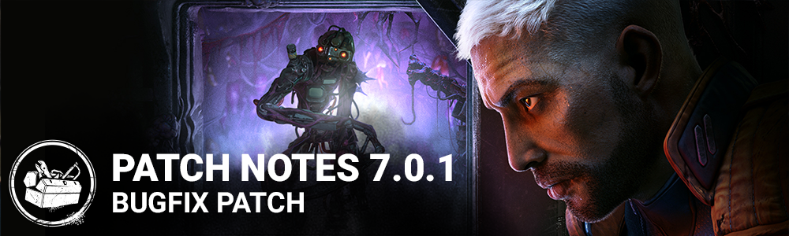

<!-- nav -->
&larr; [7.0.0 | End Transmission](392-7-0-0-end-transmission.md) · [Live](../../index.md#live) · [7.0.2 | Bugfix Patch](396-7-0-2-bugfix-patch.md) &rarr;
<!-- /nav -->

# 7.0.1 | Bugfix Patch

## Release Information

Update release: 11AM ET, June 21

*Note: Update times may vary from platform to platform. A delay is expected for the update on Nintendo Switch, but is expected to release later today.*

## Updates

### The Singularity

- EMP Crates per map were reduced from 5 to 4
- EMP Generation time increased from 90 to 100 seconds
- Survivors are now slowed by 10% while charging the EMP
- Time to charge an EMP increased from 2.0 to 2.5 seconds
- Duration of pod disabling (from an EMP) decreased from 60 to 45 seconds
- Removed score caps on the score events for Assimilation, Teleportation, and Teleportation Strikes
- Increased score points for Assimilation and Teleportation from 200 to 250

### Event

- The 7th Anniversary "Twisted Masquerade" event begins June 22, 2023 at 11:00:00 ET
- Level 1 of the "Twisted Masquerade" event tome opens June 22, 2023 at 11:00:00 ET

## Bug Fixes

**Audio**

- Fixed an issue that caused the Slipstream Teleport sfx to be missing at the beginning of the animation.

**Bots**

- Bots are less likely to follow paths that start by going towards a chasing Killer.
- Bots using the Scavenger perk and affected by the repair speed penalty may now prioritize other goals over working on the generator.
- Bots have read previous Patch Notes and now correctly distinguish Survivor and Special items.

**The Singularity**

- When looking away after performing a Lock On to a Survivor, The Singularity no longer can Slipstream Teleport to a different survivor
- The face melt effect is no longer played a second time when a Survivor is Mori'd by The Singularity
- The Auras of Perks and Add-ons are no longer visible when controlling a Biopod as The Singularity
- The reticle is no longer missing when spectating and switching to The Singularity when already inside a biopod

**Characters**

- Fixed an issue that caused part of the female survivor's face to be distorted when interacting with the Jigsaw box.
- Fixed an issue that caused the Killer's animation to be off-center and misaligned when playing as The Cenobite and performing a Lunge Attack, resulting in the hand completely disappearing during the animation.

**Environment**

**Dvarka Deepwood - Toba Landing**

- Increased the fog on the map, to help with visibility making it feel less cluttered when looking at a distance.
- Desaturated some of the plants for a better readability of the environment.

**Perks**

- Using For the People to heal a survivor to healthy no longer incorrectly applies the Endurance effect from the Made for This perk
- Survivors' camera no longer sometimes stays stuck on the Killer after using the Perk Decisive Strike
- The Troubleshooter perk now correctly applies a yellow Aura to Generators

**Platforms**

- On PlayStation 4, using a keyboard and a controller simultaneously during gameplay no longer leads to a crash.
- On Nintendo Switch, leaving the console running on an error message for a long time no longer crashes the game.

**UI**

- On consoles, the cursor no longer disappears after failing to put a valid code into the Store's Redeem Code popup multiple times.
- The tooltip style for the hidden perk is changed
- Fixed an issue where the observed player's name does not appear when returning to the spectator mode
- Fixed an issue where incorrect values were displayed for the progress of the challenges.
- Fixed an issue where addons text overlaps the search bar in inventory.
- Fixed an issue where the rift fragment rewards were displayed in red color.

**Misc**

- Zombies no longer stop spawning when The Nemesis uses "Tyrant Gore" and "Depleted Ink Ribbon"
- Survivors carrying a Cursed Killer Item are now able to properly complete interacting with Glyphs.
- The Ghost Face is no longer able to lean on all Vaults of the Main Building in Toba Landing

**Level Design**

- Fixed an issue where the character was clipping through the locker in the Garden Of Joy
- Fixed an issue where the character could get stuck near the building of the Gas Heaven
- Fixed issues where the biopods of The Singularity can get placed in areas the survivors can't deactivate them
- Fixed an issue where the survivors are clipping through the lockers of Treatment Theatre
- Fixed an issue where The Nurse could blink under the Temple in Sanctum of Wrath
- Fixed an issue where a pallet clipped through a door frame in the Shattered Square
- Fixed an issue on Dead Dawg Saloon where the killer could place their powers on top of small fences
- Fixed an issue where The Nightmare could not place the Dream Snares on top of the gallows in Dead Dawg Saloon
- Fixed an issue on the Toba Landing where The Demogorgon could land on top of a rock
- Fixed an issue in the Mother's Dwelling where the character could not navigate between two assets
- Fixed an issue where a pallet can clip through assets in Raccoon City Police Station
- Fixed an issue where the Nightmare could not place Dream Snares on a surface of a Landmark in the Temple of Purgation map
- Fixed an issue in the map Garden Of Joy where the players could climb on top of a pallet

**Known Issues**

- We are aware of an issue in which the Attack of Titan DLC's do not provide the related charms - this will be fixed in a future update and the charms applied retroactively.

<!-- nav -->
&larr; [7.0.0 | End Transmission](392-7-0-0-end-transmission.md) · [Live](../../index.md#live) · [7.0.2 | Bugfix Patch](396-7-0-2-bugfix-patch.md) &rarr;
<!-- /nav -->
