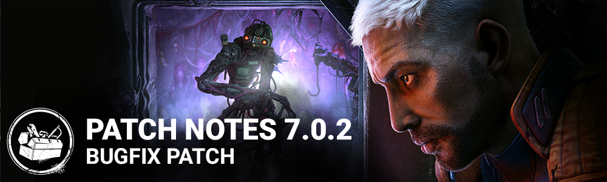

<!-- summary -->
## AI TL;DR

The Singularity’s add-ons receive multiple tweaks—Kid’s Ball Glove overclock time trimmed to 15%, rarity shifts for several items, Cremated Remains now grants blindness, Nanomachine Gel’s broken effect reduced, and other balance changes—while The Nemesis’ Damaged Syringe now adds five seconds to vaccine use. The update also delivers extensive bug fixes: bot item handling, survivor animation on The Executioner’s trail, Nightmare pallet placement, platform crashes on PS5, Steam and Epic, Twisted Masquerade interaction visuals, UI HUD opacity, perk activation quirks, and numerous map navigation and collision issues. Known issues remain with outdated Singularity add-on text and an incorrect Overclock value.
<!-- /summary -->

<!-- nav -->
&larr; [7.0.1 | Bugfix Patch](394-7-0-1-bugfix-patch.md) · [Live](../../index.md#live) · [7.1.0 | Nicolas Cage](400-7-1-0-nicolas-cage.md) &rarr;
<!-- /nav -->

# 7.0.2 | Bugfix Patch

## Release Schedule

Update releases: 11AM ET

*Note: Update times may vary slightly per platform.*

## Content

### Killer Addons

**The Singularity:**

- Kid's Ball Glove - Decreased Overclock duration time to 15% (was 25%)
- Foreign Plant Fibres - changed Rarity rating to Very Rare (was Rare)
- Cremated Remains - changed to "Survivors afflicted with Temporal Slipstream suffer from Blindness." (was Killer Instinct before)
- Nanomachine Gel - changed Rarity rating to Rare (was Very Rare), decreased Broken Status Effect to 30 seconds. (was 40 seconds)
- Denied Requisition Form - changed Rarity rating to Ultra Rare (was Very Rare)
- Soma Family Photo - changed Rarity rating to Very Rare (was Ultra Rare), reduction effect of Overclock Mode is now -20% (was -50%)
- Iridescent Crystal Shard - changed to "When a Biopod is created the auras of all Survivors within 6 meters of that Biopod are revealed to you for 6 seconds." (was applied when within the zone of a Biopod)

**The Nemesis:**

- Damaged Syringe - increases time it takes Survivors to use a Vaccine by 5 seconds (used to be 2 seconds, and increased Killer Instinct by 1.5 seconds)

## Bug Fixes

### Bots

- Fixed additional rare issues with Survivor and Special Items.
- Tentatively fixed an issue that bots are unable to use the Perk Scavenger correctly.

### Characters

- Fixed an issue that caused survivors who walk or crouch while standing in the Torment Trail to remain in the standing position animation during a trial against The Executioner.
- The Nightmare is now able to correctly place Dream Pallets on a location previously holding a Fragile Pallet.

### Platforms

- Fixed a crash on PlayStation 5 when browsing the Store.
- Fixed a crash on Steam when joining a party.
- Fixed an error that would occur when loading into an Autohaven Wreckers map on the Epic Games Store version of the game.

### Twisted Masquerade

- When a Masquerade Pillar disappears after the Exit Gate or the Hatch opens, the proper disappearance VFX are now correctly played
- Masquerade Pillar is now despawned when the hatch or an exit gate is opened
- When the Killer interacts with the Invitation Pillar, the regular interaction icon is now displayed
- As the Twins, the Masquerade Invitation charge UI now updates correctly when switching from Victor to Charlotte.
- Survivors downed while interacting with the Pillar can now correctly be picked up by the Killer

### UI

- Fixed the HUD invitation icon reward state opacity to be independent of the chase state when gaining the reward.
- Fixed and issue that caused a SFX loop when using a controller in the Archive Tier purchase popup.

### Misc

- The Adept Singularity achievement is now correctly unlocked when completing a trial inside a Biopod
- The Game Afoot Perk now correctly activates the Nemesis Perk
- The Survivor perk 'Made For This' endurance effect no longer triggers after using an Anti-Hemorrhagic Syringe on another survivor

### Level Design

- Fixed an issue where the hook can be block by the killer in Toba Landing
- Fixed an issue where Wesker could slide on top of crates in Shelter Woods near the Skull Merchant base
- Fixed an issue where the stairs in the back of the main building in Eyrie of Crows didn't feel smooth
- Fixed an issue where the nurse could get stuck in the west wing basement of the Raccoon City Police Station
- Pass on the Toba Landing to Improve the navigation
- Added Lockers in Toba Landing
- Fixed an issue where killer could get stuck on the Temple of Purgation map

## Known Issues

- The Singularity's add-on "Nanomachine Gel" has still the old text description.
- The Singularity's add-on "Kid's Ball Glove" has still the old text description.
- The Singularity's add-on "Soma Family Photo" has still the old text description.
- The Singularity's add-on "Soma Family Photo" has an incorrect time value for the Overclock Mode. (-80% instead of -20%)

<!-- nav -->
&larr; [7.0.1 | Bugfix Patch](394-7-0-1-bugfix-patch.md) · [Live](../../index.md#live) · [7.1.0 | Nicolas Cage](400-7-1-0-nicolas-cage.md) &rarr;
<!-- /nav -->
