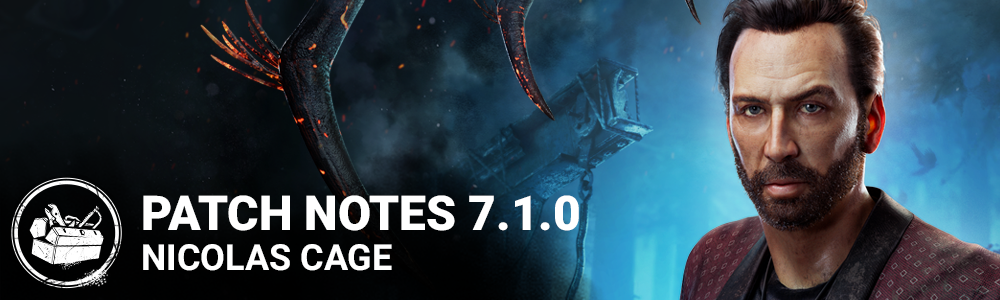

# 7.1.0 | Nicolas Cage

## Release Information

Update releases: 11AM ET

DLC releases: 12PM ET

*Note: Update times may vary slightly from platform to platform.*

## Developer Update

[https://forums.bhvr.com/dead-by-daylight/kb/articles/397-developer-update-july-2023](https://forums.bhvr.com/dead-by-daylight/kb/articles/397-developer-update-july-2023)

## Content

### New Survivor: Nicolas Cage

**Perks:**

**Dramaturgy:**Activates while you are healthy. While running, press the active ability button 2 to run with knees high for 0.5 seconds and then gain 25% Haste for 2 seconds, followed by an unknown effect.

- Exposed for 12 seconds;
- Gain 25% Haste for 2 seconds;
- Scream, but nothing happens;
- Gain a random rare item in hand with random add-ons and drop any held item.

*The same effect cannot happen twice in a row. C*auses exhaustion for 60/50/40 seconds. Can't be used while exhausted.

**Scene Partner:**activates when you are in the Killer's Terror Radius. Whenever you look at the Killer, scream, then see the Killer's aura for 3/4/5 seconds. *There is a chance you will scream again, if you do, you will see the Killer's aura for an additional 2 seconds. Scene Partner* then goes on cool-down for 60 seconds.

**Plot Twist:**activates when you are injured. Press the ability button 2 while crouched and motionless to silently enter the dying state. When using Plot Twist to enter the dying state, you leave no blood pools and you make no noise and you can fully recover from the dying state. When you recover by yourself using Plot Twist, you are fully healed instantly and you gain 50% Haste for 2/3/4 seconds. *This perk deactivates if you recover by yourself by any means. The perk re-activates when the exit gates are powered.*

### Updated Killer: The Onryo

Projection:

- Projecting to a TV now applies ¾ of a stack of Condemned to all Survivors not carrying a Cursed Tape (was 1 stack to nearby Survivors).
- The time a TV is disabled after The Onryo Projects to it has been reduced to 45 seconds (was 100 seconds). This can be further reduced using Add-ons.
- The time a TV is disabled after a Survivor removes the Cursed Tape has been increased to 70 seconds (was 60 seconds).
- Projection now has a 10 second cooldown. Since there is no longer a range limit on the Condemned effect, a limit is required for how frequently this can happen.

Cursed Tapes:

- Getting hit with a Basic Attack while carrying a Cursed Tape applies 2 stacks of Condemned, and the tape is destroyed.
- Being hooked while holding a Cursed Tape destroys the tape.
- Holding a Cursed Tape no longer passively builds Condemned.
- Cursed Tapes can now be placed in any TV other than the one they were retrieved from.

Demanifestation:

- The Onryo can no longer be stunned while Demanifested.
- Chases are prevented when Demanifested, making it more difficult to keep track of The Onryo’s position.
- Demanifesting now removes Bloodlust, similar to other Killer Powers.

Add-ons:

- Videotape Copy:TVs used for Projection turn back on 10 seconds sooner.
- Cabin Sign: TV turn on time after a teleport is reduced by 4.5 seconds.
- Well Stone: TV turn on time after receiving a tape is reduced by 7 seconds.

### Hook Grabs:

Grabs from unhooking Survivors have been removed. This means that the awkward mindgame when unhooking has been eliminated, helping to improve the gameplay flow. You still aren't safe whilst unhooking however, as the Killer will still be able to hit you twice before you can escape.

### Toolbox Add-On Updates:

- Brand New Part - new functionality:
  - Toolbox Repair action is replaced with Install Brand New Part.
  - During the installation, you will be faced with a difficult Skill Check.
  - Upon succeeding the Skill Check, the generator's required charges are reduced by 10.
  - *This add-on is consumed after use*

### Perk Updates

### Killer Perk Updates:

- **Coup de Grace:**
- Each time a generator is completed, Coup de Grâce grows in power. Gain 2 tokens, with a maximum of 5 tokens at one time. Consume one token to increase the distance of your next lunge attack by 70%/75%/80%.
- **Claustrophobia:**
- Every time a generator is completed, all windows and vault locations are blocked for all Survivors for the next 20/25/30 seconds. You see the aura of the vault locations blocked by Claustrophobia for the duration.
- **Hangman's Trick → Scourge Hook: Hangman's Trick:**
- Gain a notification when someone starts sabotaging a hook. While carrying a Survivor, see the aura of any Survivor within 10/11/12 meters of a scourge hook.
- **Territorial Imperative:**
- Unlocks potential in one's aura reading ability. Survivors' auras are revealed to you for 4/5/6 seconds when they enter the basement and you are more than 24 meters away from the basement entrance. *Territorial Imperative* can only be triggered once every 45 seconds.
- **Remember Me:**You becomeobsessedwith one survivor. Each time your Obsession loses a health state, gain 1 token, up to 2/3/4. you increase the opening time of the exit gates by 6 seconds up to a maximum of 12/18/24 additional seconds. The obsession is not affected by *Remember Me*.
- **Hex: Crowd Control:**
- The Entity blocks a window for 40/50/60 seconds after a Survivor performs a rushed vault through it. *The Hex effects persist as long as the related Hex Totem is standing.*
- **Trail of Torment:**
- After kicking a generator, you become Undetectable until the generator stops regressing. During this time, the generator's yellow aura is revealed to survivors. This effect can only trigger once every 80/70/60 seconds.

### Survivor Perk Updates:

- **Prove Thyself:**
- For every other Survivor working on a generator within a 4 meter range, gain 6%/8%/10% repair speed bonus. This same bonus is also applied to all other Survivors within range. Survivors can only be affected by one Prove Thyself effect at a time.
- **We're Gonna Live Forever:**
- Adjusted description to indicate that it works for ALL blinds, not just flashlights.
- **Blast Mine:**
- Blast Mine activates after completing a total of 50% worth of repair progress on generators. After repairing a generator for at least 3 seconds, press the *Active Ability Button 1* to install a trap which stays active for 100/110/120 seconds. Affected generators will be revealed to all Survivors by a yellow aura. Only one trap can be active on a generator. When the Killer kicks a trapped generator, the trap explodes, stunning them and blinding anyone nearby. Blast Mine is then deactivated.
- **Wiretap:**
- *Wiretap* activates after completing a total of 50% worth of repair progress on generators. After repairing a Generator for at least 3 seconds, press the *Active Ability Button 1* to install a spy trap, which stays active for 100/110/120 seconds. Affected generators will be revealed to all Survivors by a yellow aura. Only one trap can be active on a generator. When the Killer enters within 14 meters of the trapped generator, their aura is revealed to all Survivors. Damaging the generator destroys the trap.
- **Saboteur:**
- See hook auras in a 56-meter radius from the pickup spot if a Survivor is being carried. Scourge Hooks are shown in yellow. Unlocks the ability to sabotage hooks without a toolbox. Sabotaging a hook without a Toolbox takes 2.3 seconds. The sabotage action has a 70/65/60-second cooldown.
- **Clairvoyance:**
- Clairvoyance activates whenever you cleanse or bless a Totem. When empty-handed, hold the Ability button to unlock your full aura-reading potential. For up to 8/9/10 seconds, you see the auras of exit gate switches, generators, hooks, chests and the Hatch within a 64-meter range.
- **Breakout:**
- When within 5 meters of a carried Survivor, you gain the Haste status effect, moving at 5%/6%/7% increased speed. The carried Survivor’s wiggle speed is increased by 25%.
- **Buckle Up:**
- While healing a Survivor in the dying state, you both can see the Killer's aura. When completing healing a Survivor from the dying state to injured, both you and the healed Survivor gain Endurance for 6/8/10 seconds.
- **Smash Hit:**
- After stunning the Killer with a pallet, break into a sprint at 150% your normal running speed for 4 seconds. Causes the Exhausted status effect for 30/25/20 seconds. This perk cannot be used while Exhausted.
- **Spine Chill:**
- Get notified when the Killer within a 36-meter range. If the Killer is within range and is looking at you with a clear line of sight, your speed while repairing, sabotaging, healing, unhooking, cleansing, blessing, opening exit gates and unlocking is increased by 2%/4%/6%. The effects of *Spine Chill* linger for 0.5 seconds after the Killer looks away or is out of range.

### Killer Tweaks

**The Executioner:**

- If he comes within 10 meters of a cage, it will disappear and reappear elsewhere on the map (used to be 5).

**The Spirit:**

- Mother-Daughter Ring - the movement speed bonus has been reduced to 25% (was 40%).
- Dried Cherry Blossom - the Killer Instinct range of Dried Cherry Blossom has been reduced to 3 meters (was 4 meters).
- Yakuyoke Amulet, Shiawase Amulet and Kaiun Talisman - these Add-ons will no longer cause Yamaoka’s Haunting to recharge faster.
- Origami Crane - Origami Crane now increases the recovery rate of Yamaoka’s Haunting by 20% (was 10%).
- Rusty Flute - Rusty Flute now increases the recovery rate of Yamaoka’s Haunting by 40% (was 25%).

**The Hag:**

- Waterlogged Shoe - the movement speed boost has been increased to 7.5% (was 4.5%).
- Mint Rag - the teleport cooldown has been reduced to 10 seconds.
- Half Egg Shell and Cracked Turtle Egg - Half Egg Shell now increased Phantasm Trap duration by 45% (was 30%), and Cracked Turtle Egg now increases Phantasm Trap duration by 55% (was 35%).

### Events & Archives

- **NEW TOME:** Tome 16: EXISTENCE - Level 1 opens July 26 at 11:00:00 AM Eastern Time.
- **NEW EVENT:** Scorching BBQ begins August 3 at 11:00:00 AM Eastern Time.
  - Level 1 of the Scorching BBQ event tome opens at the start of the event.

### Maps - Fractured Cowshed and Rancid Abattoir

- During the PTB we have noted that the Abattoir was abusable with a set of vaultable windows close to each other. we have updated the layout.
- The god window next to the basement in the Abattoir got blocked.
- Different modifications were done on all the tiles, to make them consistent for the navigation and gameplay.
- Moved Hooks that would spawn in loops with pallets away from the loops.

## Features

### Disconnected Survivor Bots

- Replaced disconnected survivors with bots.
- Bots can now use Dramaturgy and Plot Twist.

### Improved Player Reporting Feedback

*We hope players are going to feel more confident when learning that their reports were used to take action when necessary*

- Now players are going to receive feedback when their report helps to ban another player.
- The information does not contain players' details, and displays the reason and date of the ban.

### Misc

- You may notice that the Consent menus (such as Privacy Policy and EULAs) now pop up earlier in the initialization.

### UI

- Consent popup now shows earlier.
- Added new Character Portraits for Survivors and Killers.
- New visuals for Store flags (limited time items) and New Items across all menus.

## Bug Fixes

### Audio

- Fixed an issue where the Cenobites 'I came' quote upon completing a teleport is missing.
- Fixed an issue where some survivors' hooked screams last longer than intended.

### Bots

- Fixed an issue where bots keep getting caught in the same trap if a pallet is not broken.
- Fixed an issue that cause survivor bots repeatedly restart the use of their flashlight when attempting to Blind a Killer.

### Characters

- Fixed an issue that caused injured Survivors that getting hit while they are entering in a locker to being seeing in the Dying State for a brief moment before getting out of the locker.
- Fixed an issue that caused some killers to not follow the rule of looking down when damaging a generator.
- Fixed an issue that caused The Trapper, The Wraith, The Hillbilly, The Shape and The Doctor to not follow the rule of looking slightly down when vaulting.
  - We will update the vaulting animation of The Huntress, The Cannibal, The Clown, Ghostface and The Hag in an upcoming release.
- Fixed an issue that caused The Singularity model to slide backward when vaulting over obstacles.
- Survivors no longer exit the Locker in the wrong direction when dying.
- The FOV increase from Blinks can no longer be seen on the Tally screen when leaving a match during a Blink as The Nurse
- The Knight no longer sees both the Special Item and the Regular Item in a Survivor's hand after having used his Power.

### Events & Archives

- Fixed an issue where the localization of the "Adrenaline Overflow" challenge did not correctly display the target number of progress required.
- Fixed an issue where the "Alternative Medicine" challenge requirements were not updated to match the currect version of the Boon: Circle of Healing perk.
- Fixed an issue where the "Mark My Prey" challenge would gain unintended progress when playing as The Huntress and throwing hatchets at a hooked Survivor.
- Fixed an issue where the Pink Glyph of the "Glyph Prowler" and "Glyph Snatcher" challenges did not function properly while Survivors were performing certain interactions.
- The challenge Out Isn't An Option can now be completed when an hatch escape occurs.
- Progress for the Huntress Challenge "Mark my Prey" can no longer be gained by throwing hatchets at hooked Survivors.

### Maps

- Fixed an issue where a collision would block the projectiles in the The Thompson House.
- Fixed an issue where the Trapper could place a trap on a broken bench in RPD.
- Fixed an issue where The Skull Merchant could place a drone in an unreachable spot in the Coal Tower map.
- Fixed an issue where all of The Clown's projectile gas would go through the ceiling of the Fractured Cowshed main building.
- Fixed an issue that caused the Biopods of The Singularity to attach on invisible collisions in the Toba Landing map.
- Fixed an issue where the Nurse could blink out of the world in the Toba Landing map.
- Fixed an issue in the Treatment Theatre map a survivor in a dying state could not be picked up by the killer.
- Fixed an issue where the crows of Dead Dawg Saloon could not be visible for some players.
- Fixed an issue in Midwich Elementary School where the Skull Merchant could place a drone unreachable to the survivors.
- Fixed an issue in Family Residence map where the Zombie or Guards could not navigate.

### Perks

- The Killer perk "Play With Your Food" now correctly displays the cooldown when gaining a token.

### Platforms

- Fixed an issue that caused trophies don't get updated properly when changing device of PS4 or PS5.
- Fixed an issue where cause incorrect cells expiring timer in Japan on Xbox.
- Fixed an issue that cause trial can be seen when entering tally by disconnecting the controller, waiting a short time then reconnecting.
- Fixed an issue that cause AoT charm not being given on Switch.
- Fixed an issue where cause game crash with error code 2622-9511 when region set to Japan on Switch.
- Tentatively fixed an issue that caused error 8,001 happens on Windows Store.

### UI

- Fixed an issue where the loadout page is reset when the host changed the match management setting.
- Fixed an issue that prevents from adding a 4th bot due to overlapping player lists over the button.
- Fixed an issue where icons are visible that should not be visible while observing other players.
- Fixed an issue where the challenge tracker is dismissed too fast.
- Fixed an issue where the wallet tooltip is behind survivor names in the lobby.
- Fixed an issue with back button being disabled when searching for a match while a panel tab is opened.
- Fixed an issue with active challenge not appearing in the archives widget.
- Fixed an issue where the game crashes when you are switching survivors in spectate mode, with some boon effect.
- Fixed an issue where the game sometimes crashes on console when going from store to lobby after purchase.

### Misc

- Fixed an issue where shows wrong error message of "Host unreachable".
- Fixed an issue where shows corrupted data error popup improperly.
- Fixed an issue that caused loadout sometimes are equipped in Trials when all Match Management settings are set to None in custom game.
- Fixed an issue that caused bloodweb automatic purchase get more expensive items before selecting event rarity.
- Tentatively fixed an issue that some players aren't able to unlock Adept achievements when meeting the requirements.
- The Spirit's The Wakizashi Saya Add-on's prompt is now properly translated.
- The Drop Firecracker prompt no longer appears when the Survivor holds a Flash Grenade.
- Pink Glyphs no longer fail to stare at Survivors performing interactions.

## Public Test Build (PTB) Adjustments

### Onryo Update

### Power:

- Survivors no longer gain Condemned when a Survivor with a tape is hooked.
  - Survivors carrying a tape who are hooked still lose the tape.
- Survivors carrying a tape hit with a basic attack gain 2 stacks of Condemned, and lose their tape.
- TVs turn back on in 45 seconds after a teleport.
- TVs turn back on in 70 seconds after receiving a tape.
- Teleporting has a 10 second cooldown.

### Addons:

- Videotape copy:
  - TVs used for Projection turn back on 10 seconds sooner.
- Cabin Sign:
  - TV turn on time after a teleport is reduced by 4.5 seconds.
- Well stone:
  - TV turn on time after receiving a tape is reduced by 7 seconds.

### Perk Updates

- **Scourge Hook: Hangman's Trick:**
  - Increased range by 2m.
- **Remember Me:**
  - Included info about tokens in the description.

### Characters

- The new camera look down after a successful hit animation for some killers has been removed.

### Gameplay

- The Mastermind is again able to turn during Charge Bound dashes.
- Survivors no longer sometimes become unable to move when healed by others.
- Placeholder text is no longer present when using Brand New Part add-on in trials.
- Addons obtained from the "Dramaturgy" Perks are no longer lost when inserting the Onryo's Cursed Tape back to a VHS.
- The "Territorial Imperative" Perk no longer activates for Survivors already in the basement.
- Survivors using the Plot Twist perk no longer scream when in Madness Tier 3.
- Survivors downed by the Killer can no longer fully recovers with the Plot Twist perk.
- The Brand New Part Toolbox Addon can now be used more than once on the same side of a Generator.
- Survivors now correctly see the updated progress bar from Brand New Part while not actively repairing a generator.
- Coup De Grace no longer gains tokens from Generators being worked on when the last Generator is completed.
- Spine Chill no longer flickers when the killer and survivor look at each other in some angles.
