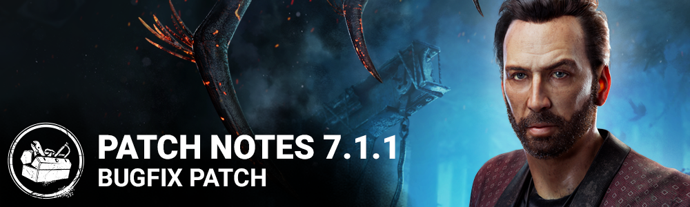

<!-- summary -->
## AI TL;DR

Reactive Healing now rounds up to full 100 % when only a tiny amount is missing, and the Cenobite killer has been re-enabled. The patch then focuses on a broad sweep of bug fixes: perk timing and interactions (Scene Partner, Dramaturgy, Plot Twist), character mechanics (vault heights, Knight pickup, Nurse blink chaining, add-on values), audio glitches, UI crashes, map collision and clipping issues across multiple maps, event challenge calculations, and console-specific problems such as subtitle playback and trophy unlocking.
<!-- /summary -->

<!-- nav -->
&larr; [7.1.0 | Nicolas Cage](400-7-1-0-nicolas-cage.md) · [Live](../../index.md#live) · [7.1.2 | Bugfix Patch](403-7-1-2-bugfix-patch.md) &rarr;
<!-- /nav -->

# 7.1.1 | Bugfix Patch

## Release Schedule

Update Releases: 11AM ET

*NOTE: Update times are an estimate and may vary slightly from platform to platform.*

## Content

- Updated the Reactive Healing Perk to round up to 100% healing when there is only a tiny bit of healing missing (example: instead of healing a Survivor to 96.4%, it would complete the healing at 100%)
- Re-enabled the Cenobite.

## Bug Fixes

### Perks

- The Scene Partner Perk's scream and animation are now played at the same time when curing from The Plague's Vile Purge.
- Survivors in lockers no longer scream because of Dramaturgy's effect.
- The Survivor is no longer slowed down temporarily when activating Dramaturgy.
- The Dramaturgy Perk no longer causes Items to appear during animated interactions.
- The Spirit no longer causes the Survivors with the Scene Partner Perk to scream when passing in front of them when Phase Walking.
- Scene Partner no longer activates when the Killer is Undetectable using Beast of Prey
- The "Dramaturgy" Perk no longer spawns event addons.
- The "Dramaturgy" Perk no longer spawns an Ultra Rare item.
- Survivors with the "Scene Partner" Perk now correctly scream when reviving themselves with the "Plot Twist" perk in front of the Killer
- The Plot Twist Perk is no longer briefly displayed as being usable after recovering from the Dying state

### Characters

- Fixed an issue that caused the fast Vaults to have the same vaulting distance as the Slow and Medium Vaults.
- Fixed an issue that caused the Survivors to be unable to be picked up by the Knight when they are downed while being pulled out from locker by the Guardia Compania
- Fixed an issue that caused cosmetics (Free songbird, Pro-Pain Hammer, Hound Mask and Untamed Donkey Jacket) to be missing from players inventories
- The Trapper's Add-on "Wax Brick" no longer has an incorrect value.
- Survivors are no longer sometimes rendered unable to move when being healed by others
- The Nurse's Matchbox addon no longer affects the Killer's carrying speed
- Hex: Huntress Lullaby activating no longer causes The Doctor and The Pig's skill checks to be silent
- Survivors escaping through an Exit gate no longer have their running animation stop abruptly before the Tally Screen.
- The Knight can now properly pick up downed Survivors hit by the basic attack while grabbed from a locker by the Guardia Compania
- When installing a "Brand New Part" on a Generator with a Toolbox and affected by the "Overcharge" Perk, Missed and Failed Skill Checks now correctly result in the Generator exploding
- For The Nurse, holding the Blink input during a Blink now correctly automatically starts the next Blink in a chain.
- The Onryo Condemned Mori can no longer be executed twice on the same Survivor.

### Audio

- Fixed an issue that caused the Singularity's aiming loop SFX to still be playing if it was stunned while shooting a pod or slipstreaming.
- Fixed an issue that caused Nicolas Cage's voice lines not to be stopped at the start of a Mori.
- Fixed an issue that caused the "Lucky Stroll" and the "Inspiration Seeker" outfits to play a collection music in the menu.

### UI

- Fixed a potential crash in the Hud when hiding the external Perks.
- Fixed an inconsistency between Bloodpoints spent and Bloodpoints displayed upon canceling the Prestige Level Up halfway.

### Maps

- Fixed an issue with an invisible collisions found in the McMillan's Estate
- Fixed an issue in Badham Preschool where the characters would clip out of the lockers
- Fixed an issue where the nurse could get stuck on Toba Landing
- Fixed an issue in Eyrie of Crows map where the projectile detection was not working as intended
- Fixed an issue with the shrimp boat in the Pale Rose map where traps would clip in the ground
- Fixed an issue in Fractured Cowshed where the Demogorgon was able to climb over collisions
- Fixed an issue where Biopods could be placed out reach on Autohaven Wreckers
- Fixed an issue where a collision is mission next to a window in Ormond

### Events & Archives

- Fixed an issue where a Survivor player could gain progress for a Map item related challenges (ie: "Cartophile") without having to equip a Map.
- Fixed an issue where the "Outplayed" challenge was calculating the distance from the pallet to the Killer instead of from the pallet to the downed Survivor.
- Fixed an issue where the "Outplayed" challenge was not gaining progress from Survivors downed near The Nightmare's Dream Pallets.

### Console

- Fixed an issue that caused no subtitles when playing video on XBX and XB1.
- Fixed an issue that caused some players stuck on the starting screen on PS4.
- Fixed an issue that caused trophies to be unlocked without real progression on PS5.

### Misc

- There is no longer an invisible collision in one of the hallways inside the Badham Preschool.

<!-- nav -->
&larr; [7.1.0 | Nicolas Cage](400-7-1-0-nicolas-cage.md) · [Live](../../index.md#live) · [7.1.2 | Bugfix Patch](403-7-1-2-bugfix-patch.md) &rarr;
<!-- /nav -->
