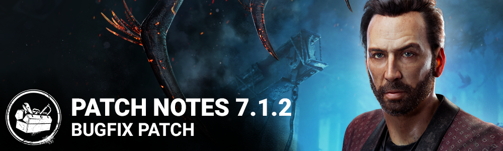

<!-- summary -->
## AI TL;DR

Improved Player Reporting Feedback was activated, and the patch resolves a wide range of bugs across killers, survivors, perks, UI, and maps. Fixes include correct downward vaulting for several killers, Ghostface camera behavior, Deathslinger crouch lock, and multiple perk animation issues such as Dramaturgy and Virtulent Bond. Survivors now hear correctly when hooked, can be healed and picked up with Plot Twist, and female survivors receive hit sounds from The Spirit. UI glitches like tier button lag, overlapping tooltips, and lobby button states were addressed, while level-design problems such as crate climbing, Nurse stalling, trap visibility, map collisions and generator errors were fixed. Minor crashes on all platforms were also patched.
<!-- /summary -->

<!-- nav -->
&larr; [7.1.1 | Bugfix Patch](401-7-1-1-bugfix-patch.md) · [Live](../../index.md#live) · [7.1.2a | Bugfix Patch](404-7-1-2a-bugfix-patch.md) &rarr;
<!-- /nav -->

# 7.1.2 | Bugfix Patch

*This article was created from a* [*community discussion*](https://forums.bhvr.com/dead-by-daylight/discussion/386775/7-1-2-bugfix-patch)*.*

## Release Information

Update Releases: 11 AM ET

## Features

- Activation of the Improved Player Reporting Feedback feature

## Content

### Bug Fixes

- Fixed an issue that caused certain killers to not look downward while vaulting from a ledge or window, which led to a drop
- Fixed an issue that caused the Ghostface camera to move backward when leaning and stalking.
- Fixed an issue that caused Survivors to get stuck crouching after being hit by the Deathslinger.
- Fixed an issue that caused The Knight's camera moves up slightly after a successful basic attack.
- Fixed an issue where shows unknown error message when connection to party is lost via http request errors.
- Fixed an issue where survivors could be heard above ground when hooked in the Killer Basement.
- Fixed an issue where the "Dramaturgy" perk's scream animation is played after stepping on a Bear Trap
- Fixed an issue where the "Dramaturgy" perk's scream animation is played incorrectly as a survivor is downed
- Activating the "Dramaturgy" perk and being hit by Virtulent Bond together no longer plays the wrong screaming animation
- Fixed an issue where the VFX and aura on "Hex Pentimento" are not removed upon being cleansed
- Fixed an issue where "Friendly Competition" sometimes fails to activate
- Fixed an issue where some female Survivors hit by The Spirit will not make injury or grunts sounds on being hit
- Fixed an issue where the Singularity can become stuck when teleporting to a survivor that disconnects
- Fixes for some crashes across several platforms
- Fixed an issue where survivors couldn't be picked up or healed and could block others when holding the key assigned to activate the perk "Plot Twist".

#### UI

- Fixed the input taking too long to register on the add/subtract tier buttons with mouse click.
- Fixed an issue with the perk tooltips being overlapped by survivor info.
- Fixed disable visual state for the "Go to Event Tome" button in the Online Lobby.
- Fixed an issue that prevent player from viewing the profile of someone replaced by a bot.
- Fixed missing Chinese subtitles for archive trailer.

#### Level Design

- Fixed an issue where players could climb on supply crates in the Raccoon City Police Station
- Fixed an issue where the Nurse would get stuck in Toba Landing
- Fixed an issue where crows were overlappng in Dead Dawg Saloon
- Fixed an issue to give more chances for hooks to spawn on the lower floor of the Gideon Meat Plant
- Fixed an issue where the Trapper's trap would hide in a pile of snow in the Ormond
- Fixed an issue where a placeholder tile would spawn in McMillan's Estate Maps
- Fixed an issue where the Hillbilly would not collide with assets in Eyrie of Crows
- Fixed an issue in Ormond where the Legion could not vault over a side of a pallet when in Feral Frenzy
- Fixed an issue where the characters would clip through the doors of the lockers in Eyrie of Crows
- Fixed an issue with the dark mist in Raccoon City Police Station
- Fixed an issue where a generator in Lery's Hospital could not be repaired or damaged
- Fixed an issue where an invisible collision would prevent the navigation of the players

### Known Issues

- Reasons for report feedback are in English across all languages. Full translations to come soon.

<!-- nav -->
&larr; [7.1.1 | Bugfix Patch](401-7-1-1-bugfix-patch.md) · [Live](../../index.md#live) · [7.1.2a | Bugfix Patch](404-7-1-2a-bugfix-patch.md) &rarr;
<!-- /nav -->
