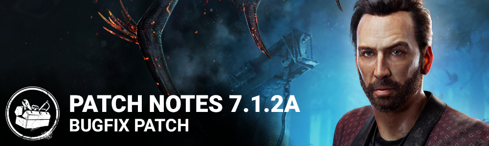

<!-- summary -->
## AI TL;DR

Stadia-owned entitlements were restored on Steam and the Epic Games Store, fixing the disappearance issue introduced with the 7.1.0 update. The 7.1.2a patch is a targeted bug-fix hotfix addressing that entitlement problem.
<!-- /summary -->

<!-- nav -->
&larr; [7.1.2 | Bugfix Patch](403-7-1-2-bugfix-patch.md) · [Live](../../index.md#live) · [7.2.0 | Alien](405-7-2-0-alien.md) &rarr;
<!-- /nav -->

# 7.1.2a | Bugfix Patch

*This article was created from a*[*community discussion*](https://forums.bhvr.com/dead-by-daylight/discussion/388071/7-1-2a-bugfix-patch)*.*

## Release Information

Update Releases: 11AM ET

## Content

### Bug Fixes

- Steam and EGS: Fixed an issue that caused Stadia owned entitlements to be no longer available since the 7.1.0 release

<!-- nav -->
&larr; [7.1.2 | Bugfix Patch](403-7-1-2-bugfix-patch.md) · [Live](../../index.md#live) · [7.2.0 | Alien](405-7-2-0-alien.md) &rarr;
<!-- /nav -->
