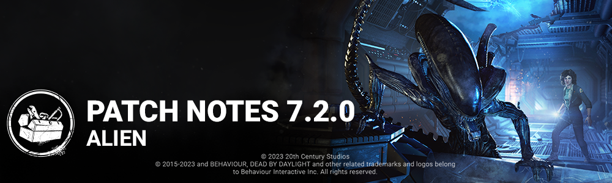

<!-- summary -->
## AI TL;DR

The Xenomorph killer and Ellen Ripley survivor debut, bringing the Nostromo Wreckage map, a Hidden Pursuit tunnel system, Crawler Mode with a Tail Attack, Remote Flame Turrets, and three new perks each. A PC graphics update adds toggles for VSync, FPS limit, anti-aliasing and resolution options. The patch also includes extensive PTB-to-live fixes: Xenomorph movement and turret interactions, numerous character, perk and bot bugs, audio and UI glitches, and platform-specific issues such as Steam lobby stability and Switch time sync. Known issues note a translation error for Crawler Mode and temporary removal of Temple of Purgation.
<!-- /summary -->

<!-- nav -->
&larr; [7.1.2a | Bugfix Patch](404-7-1-2a-bugfix-patch.md) · [Live](../../index.md#live) · [7.2.1 | Bugfix Patch](406-7-2-1-bugfix-patch.md) &rarr;
<!-- /nav -->

# 7.2.0 | Alien

## Release Schedule

**Update releases:** 11AM ET

**DLC releases:** 12PM ET

*Note: Release times are an estimate and may vary from platform to platform.*

## Content

### New Killer - The Xenomorph

*Dev Note: Note that map-specific hooks will be overridden with the Xenomorph's hook when you play as or against The Xenomorph.*

#### Killer Power

**Hidden Pursuit**

A series of tunnels become available on the map when the Xenomorph is in play. By accessing a Control Station, it can enter these tunnels to quickly move around the map, detect the presence of nearby Survivors, and speed up the cooldown time of its Crawler Mode ability. Exiting a Control Station tags nearby Survivors with Killer Instinct.

**Special Ability: Crawler Mode**

The Xenomorph enters Crawler Mode automatically when not on cooldown. In Crawler Mode, the Xenomorph walks on four legs and becomes stealthier, reducing its Terror Radius. While in Crawler Mode the Xenomorph also has access to a brutal Tail Attack.

**Map Feature: Control Stations**

Seven Control Stations are scattered across the map. Survivors can interact with these stations to get a Remote Flame Turret, while the Xenomorph can enter and exit the tunnels underneath the Control Stations.

**Special Item: Remote Flame Turret**

Turrets can be placed in the map to counteract the Xenomorph. When the Xenomorph enters the radius and line of sight of a Turret, the Turret attacks; this attack staggers the Xenomorph and will cause Crawler Mode to end. If a Turret successfully knocks the Xenomorph out of Crawler Mode or fires for too long, it overheats, and must be repaired by a Survivor. The Xenomorph can attack Turrets to destroy them.

#### Perks

- **Ultimate Weapon**
- When you open a locker, this perk activates for 30 seconds. Survivors entering your Terror Radius scream and reveal their position and gain Blindness for 30 seconds. This perk then goes on cooldown for 40/35/30 seconds.
- **Rapid Brutality**
- You can no longer gain Bloodlust. Hitting a Survivor with a basic attack gives you 5% haste for 8/9/10 seconds.
- **Alien Instinct**
- This perk activates when you hook a Survivor. You see the aura of the farthest injured Survivor for 5 seconds and that Survivor is oblivious for 16/18/20 seconds.

### New Survivor - Ellen Ripley

**Perks**

- **Lucky Star**
- When you hide in a locker, this perk activates. You leave no pools of blood and make no grunts of pain for 10 seconds. When you exit the locker, you see other survivors and the closest generator's aura in yellow for 10 seconds. This perk then goes on cooldown for 40/35/30 seconds.
- **Chemical Trap**
- After completing 70%/60%/50% progress on any generator, this perk activates. While standing next to a dropped pallet, press the Active Ability Button 2 to install a Trap, which stays active for 100/110/120 seconds. The aura of trapped pallets are revealed in yellow to all Survivors. When the Killer performs the break action on the trapped pallet, the trap explodes, and they are slowed by 50% for 4 seconds.
- **Light Footed**
- When you are healthy, this perk activates. Your running footsteps are silent. This perk goes on cool-down for 28/24/20 seconds after doing a rushed action.

### New Map - Nostromo Wreckage

Explore the mysterious crash site of the iconic Nostromo. Visit landmarks familiar to the fans of the Alien franchise, in a unique setting where you will find yourself chased in and out of the ship. Run the Killer around the shuttle that brought Ripley to the world of the Entity. Navigate through the alien landscape, and you may yet escape from the remains of the wrecks.

## PTB - Live Changes

- Increased Xenomorph movement speed whilst traversing the map in the tunnel to 18ms was 16ms
- Whilst inside the Tunnel, when in proximity of an exit, the tunnel connection to the Control Station aura is highlighted for the Killer
- Improved visual feedback on the Tail Attack for players
- Fixed the obstruct Tail Attack animation going through objects for Survivors
- Movement speed after missing a Tail Attack has been increased to 2.0ms was 1.2ms whilst in cooldown
- Destroyed Turrets now take 60s to return to a Control Station instead of 45s
- Multiple Turrets firing at a Killer no longer stack, the Xenomorph will not lose it's power faster if it's affected by more than one Turret at a time
- When burned by a Remote Flame Turret without Crawler Mode ending, Power recovery now starts after 1 second (was 2 seconds).
- When burned by a Remote Flame Turret without Crawler Mode ending, Power now recovers at 25% per second (was 20%).
- A Turret being carried by the Survivor, now provides the audio radar feedback to any Survivor in range
- Slightly decreased the Turret placement restriction and Turret collision to allow a bit more flexibility with Turrets in enclosed locations
- Emergency Helmet Addon is now Rare instead of Uncommon rarity
  - now offers 35% increased resistance effect instead of 50%
- Brett's Cap Addon is now an Uncommon rarity instead of Rare rarity
- Adjusted Xenomorph Chase Music

## Killer Tweaks

- **The Knight**
  - Pillaged Mead - Decreases the amount of time it takes for a Guard to complete their Order action by 15% *(was 25%)*.
  - Tattered Tabard - Increases Patrol time for all Guards by 8 seconds *(was 6 seconds)*.
  - Town Watch's Torch - When Survivors escape Guard Hunts without being hit two times *(was 3 times)*, The Knight gains Undetectable Status for 25 seconds.
- **The Demogorgon**
  - Killer Power - Undetectable after teleport lasts 5 seconds *(was 3 seconds)*.
  - Rat Tail - Increases speed of opening a Portal by 50% *(was 35%)*.
  - Unknown Egg - Decreases the cooldown after traversing the Upside Down by 2.5 seconds *(was 1.5 seconds)*.
  - Violet Waxcap - Increases the duration of the Undetectable effect gained when emerging from a Portal by 1 second *(was 0.5 seconds)*.
  - Leprose Lichen - Reveals the auras of all Survivors while traversing the Upside Down. After emerging from a Portal, the auras of all Survivors within 16 meters of an active Portal are revealed for 3 seconds.

## Audio

- Updated the audio for Jonah Vasquez - grunts of pain, scream etc

## Features

### PC Graphics Update

- New setting to toggle VSync on and off.
- New setting to change the FPS limit.
- New setting tog toggle the anti aliasing on and off.
- Setting for resolution option update.

## Bug Fixes

### Archives

- The "It All Leads Here" master challenge description has been fixed to improve objective clarity.
- The "Mastering Deadly Senses" challenge description has been fixed to improve objective clarity.

### Audio

- The survivor's pick up HUD soundcue is no longer heard when killer such as the Trapper, or The Cenobite pick up their respective killer item.
- The Tally screen music is now properly heard if the trial is ending while The Singularity was controlling a Biopod.

### Bots

- Bots are now more likely to be productive within the Terror Radius.
- Bots' behaviour has improved when facing Killer sidekicks, such as The Nemesis' Zombies or The Knight's Guards.
- Bots no longer attempt to confuse the Killer by crouch-walking during a chase.
- Bots now investigate Supply Cases more often.
- Bots now telepathically communicate to avoid multiple Bots running to heal or unhook a Survivor at the same time.
- Reverse Bear Traps no longer cause Bots to freeze when the Exit Gates are opened.

### Characters

- When facing The Onryo, the VHS is now properly aligned in survivors’ hands.
- An extra SFX no longer plays when specific Killers pick up a Killer Item.
- The Hide action is no longer executed upon entering the interaction zone of a Locker while holding the input.
- The Nurse's "Spasmodic Breath" addon no longer increases the carrying speed
- Survivors no longer lose deep wound when grabbed by a killer during a vault
- Survivors hiding in a Locker and hit by The Artist's Dire Crows are now correctly revealed by Killer Instincts
- The Twins no longer enter a broken state when switching control and being stunned simultaneously
- The Knight is now correctly able to summon a second Guard at the same location of the first summon.
- Survivors hit by The Deathslinger's Harpoon projectile will now correctly play pain, injury or grunts on hit
- The Undetectable status no longer triggers Play With Your Food
- When emerging from a Portal, the Demogorgon's Add-on "Leprose Lichen" aura reveal is now correctly distance-limited
- Entering a locker no longer clears the duration of Blindness status effects from Killer Perks and Addons.
- The Cenobite's Mori animation is no longer misaligned with Survivors.
- Killers' camera is now always properly aligned with the Killer's orientation.
- Getting hit by The Onryo no longer causes Survivors to have a VHS tape in hand at the start of retrieving the next VHS
- The Dredge can no longer break locks with a Basic Attack while inside a locker.

### Perks

- A Survivor's Aura is no longer revealed to the Killer when in range of a cleansed Dull Totem when using the Perk Hex: Undying.
- The perk Friendly Competition now correctly activates when a Generator is completed by a Bot.
- Survivors can no longer bypass the Perk "Overcharge" by quickly repairing the generator and leaving it
- Blood Pact no longer fail to activate when using an Anti-Hemorrhagic Syringe add-on.
- The effects of Plot Twist are now correctly disabled after being hooked
- The Scene Partner Perk is now correctly activated by the Terror Radius of The Xenomorph.

### Platforms

- Steam experiencing a network issue will no longer cancel an existing lobby.

### UI

- The "Match Found" message will no longer appear during matchmaking. Instead, the UI will go from "Searching for Match" directly into "Joining Match".
- Display the remaining time when hovering the mouse on the store character item.
- Fixed an issue where Bot Loadout slots greyed out when nothing equipped.
- Fixed an issue where the online subsection within social menu gets reset when choosing to restore defaults in another section of the Options.

### Misc

- Fixed an issue where the wrong killer's power could appear in the Loadout menu, preventing equipping Add-ons.
- Disconnected players can no longer spectate the game they disconnected from.
- Fixed an issue where the game crashes when The Cenobite teleports to the Lament Configuration.

### The Xenomorph (since PTB)

- When The Xenomorph is in a tunnel, the horizontal distance no longer counts towards perks with distance requirements
- Flame Turrets can no longer be placed in such a way as to to block passage for the Killer or partially block access for Survivors
- Fixed an infrequent crash when Starting a custom match as The Xenomorph
- Breaking down a Flame Turret while holding a limited item no longer causes the Survivor to be unable to pick up or place the Turret
- The Xenomorph's tail placement is no longer affected by Survivors
- The Xenomorph no longer alerts crows on the map while in Crawler Mode
- Placeholder white orb is no longer visible in Haddonfield when the killer is The Xenomorph
- The Flame Turret's detection radius VFX no longer remains visible when performing other animations while holding the Flame Turret
- The Flame Turret no longer rotates in Survivors' hands when performing gestures
- Survivors who are grabbed from a Locker no longer keep their Flame Turret.
- When exiting a Control Station as The Xenomorph, it is no longer possible to briefly see out of world
- The Acidic Blood Add-On now displays the correct icon when exiting a Tunnel.
- Survivors can no longer pick up multiple Flame Turrets at once
- Performing a "Break Down Flame Turret" action while screaming no longer causes the Flame Turret's fire VFX to play incorrectly
- The haste effect icon is now shown properly when playing The Xenomorph with Parker's Headband Add-On.
- The Xenomorph no longer pops into view in the Main Menu
- When in a tunnel, The Xenomorph's offscreen indicator tracking moving Survivors no longer jitters

### Perks - The Xenomorph and Ellen Ripley (since PTB)

- The Xenomorph and Ellen Ripley perks are now in the right order in the Character Info section
- The Xenomorph's Tail attacks now correctly consume Play With Your Food Tokens.
- Blast Mine and Wiretap can no longer be placed on generators with zero progress
- The Chemical Trap no longer stays active after being broken by one of The Knight's Guards.
- Chemical Trap's HUD indicator no longer starts with progress or ends early

## Public Test Build (PTB) Adjustments

### Audio

- Killer audio such as footsteps once again correctly plays in the Tally screen.
- Some of the Xenomorph footsteps sound are no longer missing for some quadruped animations.

### Bots

- Bots now avoid running to heal a downed Survivor with a nearby Killer.

### Characters

- Fixed an issue that caused Jonesy to not appear and disappear correctly in the lobby
- Fixed an issue that caused the laser to be too intense when playing against the Xenomorph
- Multiple Jonesy's will no longer spawn as part of menu idle animations.
- Fixed an issue that caused the The Hillbilly, to clip through the camera when using the basic attack or hooking a survivor.
- Fixed an issue that caused The Singularity to drop carried Survivors on the ground between its legs, rather than dropping them on its left side.
- Fixed an issue that caused The Spirit's sword to not fully reset when attacking twice while holding a Survivor.
- Fixed an issue that caused male Survivors to hold the First Aid Spray towards themselves when using it on a teammate in a Trial.
- Fixed an issue that caused the Skull Merchant's elbow to bend and stretch during the idle animation in the lobby when equipped with the "Executive Terror" Torso cosmetic.
- Fixed an issue that caused Survivors to still hold a VHS tape when attempting to retrieve it from a TV set after losing a VHS tape by getting hit from The Onryo.

### Platforms

- Removed incorrectly distributed "Attack on Titan" cosmetics for players on the Windows Store.
- Players on Switch with improperly synchronized time can now correctly start the game.

### UI

- The Report Feedback popup should now be correctly localized.
- The Legion and The Shape now have new portrait renders on the selection screen.

### Misc

- Fixed a crash that could occur when queueing up for a Trial.
- Restored missing Cosmetics that were reported as lost since the 7.1.0 release.

## Known Issues

- **Crawler Mode is incorrectly translated as Runner Mode in-game and will be updated in a future update**
- **Instability may occur when fullscreen mode setting is used when the game is out of focus**
- **Due to an issue with the Temple of Purgation, the map has been temporarily removed from rotation. The offering "The Last Mask" has also been disabled until this issue is addressed.**

<!-- nav -->
&larr; [7.1.2a | Bugfix Patch](404-7-1-2a-bugfix-patch.md) · [Live](../../index.md#live) · [7.2.1 | Bugfix Patch](406-7-2-1-bugfix-patch.md) &rarr;
<!-- /nav -->
