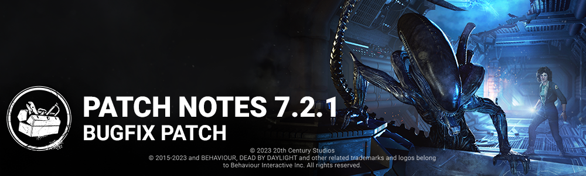

<!-- summary -->
## AI TL;DR

The Xenomorph was patched to end tunnel animation stutter, stop tail attacks on escaped survivors, hide generator, locker and survivor vision during tunnel transitions, and fix missing tail and lighting bugs; the Oni outfit Minotaur, Trickster, Doctor, Ellen Ripley and other characters also received clipping and effect fixes. Map issues were addressed on Haddonfield, Nostromo Wreckage, Eyrie of Crows, Thompson’s House, Badham Preschool and Temple of Purgation, correcting invisible collisions, hidden traps, vaulting misalignments and grab restrictions. Perks Light-Footed, Blood Rush and Blast Mine were tweaked, UI glitches with match results and bot loadout pages were resolved, and several audio, archive and miscellaneous localization and achievement bugs were fixed.
<!-- /summary -->

<!-- nav -->
&larr; [7.2.0 | Alien](405-7-2-0-alien.md) · [Live](../../index.md#live) · [7.2.2 | Bugfix Patch](408-7-2-2-bugfix-patch.md) &rarr;
<!-- /nav -->

# 7.2.1 | Bugfix Patch

## Release Time

Update Releases: 11AM ET

**NOTE**: The update is expected to be delayed on the Nintendo Switch. During this time, crossplay between the Switch and other platforms will not be possible.

## Bug Fixes

### Archives

- Currency previews in The Rift no longer stack, which was decreasing game performance.

### Audio

- The Modern Tales' menu theme is no longer played when Meg is equipped with the Movie Night outfit.

### Characters

- The Xenomorph no longer has an animation stutter upon entering a tunnel.
- The Xenomorph is no longer able to perform a Tail Attack against Survivors who have escaped through the Exit Gate.
- Survivors now correctly play an animation when interrupted from interacting with the Flame Turret.
- The Xenomorph is no longer able to see Generators, Lockers, and Survivors during transitions in and out of tunnels.
- The Oni Outfit "The Minotaur" is no longer missing horns and teeth during a Mori.
- When a Survivor sabotages a Hook, their head no longer clips inside the Hook.
- Fixed an issue that caused Ellen Ripley's Very Rare 'Out Of Uniform' t-shirt to clip through her arm during certain animations.
- Fixed an issue where The Trickster's arm would clip into the camera with certain Cosmetics after a Survivor escapes from his grasp.
- Fixed an issue with The Cenobite Add-On "Greasy Black Lens", which would fail to reveal the Survivor hit by a possessed chain.
- Fixed an issue with The Doctor madness effect where some of the Doctor illusions would sometimes spawn in the floor or outside of the levels.
- Fixed an issue where The Xenomorph was able to see Survivors in Tunnels, located on 2nd floor, if they were standing in the path
- Fixed an issue where The Xenomorph tail was missing while in Crawler Mode

### Environment/Maps

- Fixed an issue in Haddonfield where an invisible collision was blocking the players on the roof of the house
- Fixed an issue in Nostromo Wreckage map where the traps would be hidden under assets
- Fixed an issue where Victor could jump on the table in the Nostromo
- Fixed alignment issues with the survivor animation vault
- Fixed an issue where a placeholder tile would spawn in Eyrie of Crows
- Fixed an issue with the vaulting in Junkyard that affected the animation of the female characters
- Fixed an issue where a branch is floating over the Skull Merchant base
- Fixed an issue where small branches were blocking killers with chainsaws in Eyrie of Crows
- Fixed an issue where the killer could not grab a survivor off a generator in Thompson's House map
- Fixed an issue where Killers could not grab survivor from a generator in Badham Preschool map
- Fixed an issue in Nostromo Wreckage map where an invisible collision would block characters
- Fixed an issue in Dead Dawg Saloon where an entrance was not blocked as intended
- Fixed an issue where the lighting on Haddonfield and in Nostromo Wreckage would change after The Xenomorph exited the Tunnels
- Fixed an issue where the Killer was unable to pick up Survivors in the dying state on the Temple of Purgation and re-enabled the map into rotation

### Perks

- Footsteps are no longer silent when walking while Light-Footed is equipped.
- Blood Rush is no longer active after being downed by the Killer.
- Blast Mine can no longer be placed on a Generator blocked by Repressed Alliance.

### UI

- Fixed an issue where the match result appears when spectating the last survivor during Memento Mori.
- Fixed an issue where the Bot Loadout Menu displays an incorrect page of items when quickly changing pages.
- Fixed transparency texture for locked tooltips.

### Misc

- The Steam Pipes reset progress bar now correctly shows a yellow-colour when used by multiple Survivors.
- Players are now correctly able to advance progress with The Onryo's "Viral Video" achievement.
- Localization issues with certain Cosmetics have been fixed.
- Fixed an issue where The Xenomorph's Tunnels may lose lighting and ambiance when the game is paused or the Graphic Settings are changed

<!-- nav -->
&larr; [7.2.0 | Alien](405-7-2-0-alien.md) · [Live](../../index.md#live) · [7.2.2 | Bugfix Patch](408-7-2-2-bugfix-patch.md) &rarr;
<!-- /nav -->
