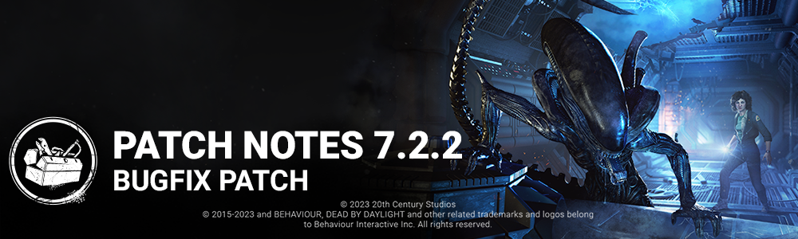

<!-- nav -->
&larr; [7.2.1 | Bugfix Patch](406-7-2-1-bugfix-patch.md) · [Live](../../index.md#live) · [7.2.3 | Bugfix Patch](411-7-2-3-bugfix-patch.md) &rarr;
<!-- /nav -->

# 7.2.2 | Bugfix Patch

## Content

**The Xenomorph:**

- Reviewed the Remote Flame Turret placement logic to allow for more flexibility when deploying them
- Decrease the Tail Attack cooldown movement speed from 2 to 1.2 m/s when missing or when it is obstructed

**Perks:**

- Adjusted the descriptions of Blast Mine, Chemical Trap, and Wiretap for consistency
- Added a VFX for when the Chemical Trap disappears by itself

## Bug Fixes

### The Xenomorph

- The Xenomorph can no longer see Idle Crows when exiting a tunnel
- Players are now correctly able to make progress for The Onryo's "Viral Video" achievement
- The Xenomorph can no longer turn invisible indefinitely in a Trial
- The Xenomorph is now correctly able to destroy turrets in the malfunctioned state
- Fixed an issue where The Xenomorph's regular movement speed could remain after downing a Survivor with the Tail Attack
- Fixed a rare issue where The Xenomorph can become stuck in the tunnels, unable to exit
- Fixed a rare issue where The Xenomorph can fall through the ground

### Perks

- The Adrenaline Perk now correctly gives a bonus health state after self-unhooking

### Audio

- The Skull Merchant's footsteps SFX are no longer missing where she is inspecting the radar.
- Spark bursts in the Nostromo map are no longer silent.

### UI

- Fixed an issue that hides the UI when spamming the ESC key while ending a match.

## Characters

- The Pig's right hand is no longer missing animations when carrying a survivor and moving.
- Fixed an issue that caused the Camera to move backward when leaning and stalking with Ghost Face.
- Fixed an issue that caused Vaulting Survivors to be misaligned during the windows vault animation.
- Fixed an issue that caused The Hag Camera to be obstructed when looking up while wearing any outfit.

## Environment/Maps

- Fixed an issue where the trees of the Garden of Joy map lose texture and have dark silhouettes when survivors are sacrificed on the hook
- Fixed an issue in Ormond where the Bear-Traps would disappear under the snow
- Fixed an issue in RPD where players could climb Wesker's supply crate
- Fixed one sided collisions on the Nostromo Wreckage

## Known Issues

- Survivor fast vaults do not align with the expected animation resulting in different distance achieved between male and female survivors

<!-- nav -->
&larr; [7.2.1 | Bugfix Patch](406-7-2-1-bugfix-patch.md) · [Live](../../index.md#live) · [7.2.3 | Bugfix Patch](411-7-2-3-bugfix-patch.md) &rarr;
<!-- /nav -->
