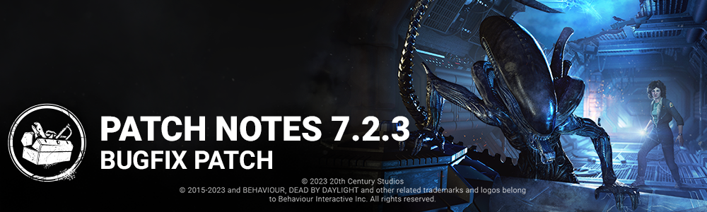

# 7.2.3 | Bugfix Patch

## Release Schedule

Update releases: 11am ET

## Bug Fixes

- Survivors are no longer able to pass through Locker collisions in certain cases
- Add missing animation for Survivor placing "Blast Mine" or "Wiretap" traps on a generator, preventing Survivors from becoming invisible and unhittable in certain cases

**Note:** With this bugfix, we are reenabling Flashlights, along with three Perks: Dramaturgy, Appraisal and Residual Manifest.
