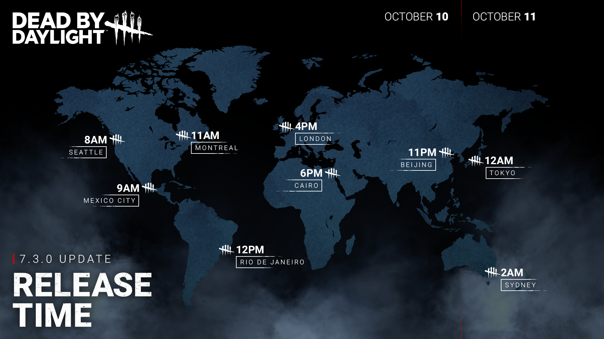

<!-- nav -->
&larr; [7.2.3 | Bugfix Patch](411-7-2-3-bugfix-patch.md) · [Live](../../index.md#live) · [7.3.1 | Bugfix Patch](414-7-3-1-bugfix-patch.md) &rarr;
<!-- /nav -->

# 7.3.0 | Mid-Chapter

## Release Schedule

**Update releases**: October 10, 11a.m. ET

**Tome 17 opens**: October 11, 11a.m. ET

    

## Developer Updates

For more details on what has changed since the Public Test Build, see our October Developer Update:

[https://forums.bhvr.com/dead-by-daylight/kb/articles/412](https://forums.bhvr.com/dead-by-daylight/kb/articles/412)

## Content

### Killer Perk Updates

- **Furtive Chase**
- You become obsessed with one Survivor. You lurk in the shadows, eliminating your victims one by one. When your Obsession is hooked, gain Undetectable and a 5% Haste status effect for 14/16/18 seconds. *(new functionality)*

### Survivor Perk Updates

- **Background Player**
- When the Killer picks-up another Survivor, Background Player activates for 10 seconds. When you start running, break into a sprint at 200% of your normal Running Movement speed for 5 seconds*. (was 150% for 4 seconds)*
- This perk cannot be used while suffering from Exhaustion. This perk causes exhaustion for 60/50/40 seconds.

### Updated Killer: The Skull Merchant

#### Eyes in the Sky

The Skull Merchant begins the match with six Drones. Press the *Power button*to deploy a Drone, which conducts an invisible, continuous sweeping scan. If a Survivor is detected, the Drone becomes active, which makes the Drone’s scan lines visible. Once detected by a scan line, a Survivor gains scan immunity and cannot be detected by other scan lines for 3 seconds. Survivors can attempt to hack Drones. Failure activates the Drone and partially fills their Lock On meter; Success disables the Drone for 45 seconds.

- Removed the Active Zone (cylinder).
- Removed remote Activation of Drones.
- The Killer now starts with 6drones.
- The minimum distance between drones is now 16 meters.
- The Drone radius isnow 10 meters.

#### Radar

Press the *Ability Button* to open a Radar to see the locations of Survivors detected by Drones or those with Claw Traps. Each Survivor detected on the Radar increases The Skull Merchant’s movement speed. The Radar can also recall drones or change the direction of their scan rotation.

#### Lock On

The Lock On meter fills when scanned by a Drone and when failing to disable a Drone. When the meter is full, the Survivor receives a Claw Trap, becomes Injured, and suffers from the Broken status effect. Additional scans briefly apply the Hindered status effect. A Claw Trap broadcasts the Survivor’s location to the Killer and is only removed when its battery dies.

- Removed the Exposed status effect from Lock On

#### Add-Ons

- Adi Valente #1: Effects last until the Claw Trap is removed.
- High-Power Floodlight: Blindness status applied when receiving a Claw Trap. Effects last until the Claw Trap is removed.
- Geographical Readout: Increased action speed bonus while breaking pallets and breakable walls, damaging generators, and vaulting to 20% (up from 15%). The effect is now applied for 8 seconds after deploying a drone.
- High Current Upgrade: Increases the time Survivors appear on the radar when detected.
- Adaptive Lighting: Reduced the bonus granted to Undetectable status to 20% (down from 50%).
- Stereo Remote Mic: Decreases the Disabled State duration of drones.
- Supercharge: Increased battery life of Claw Traps to 15% (up from 12%).
- Shotgun Speakers: Survivors with a Claw Trap have no skill check warning. Effects last until the Claw Trap is removed.
- Low-Power Mode: Decreases Drone Spawn Cooldown.
- Vital Targeting Processor: Increases Hindered status by 3% when a Survivor is detected by a drone.
- Brown Noise Generator: Oblivious status applied when receiving a Claw Trap. Effects last until the Claw Trap is removed.
- Loose Screw: Exhausted status applied when receiving a Claw Trap. Effects last 6 seconds (up from 3 seconds).
- Randomised Strobes: Increases Hindered status by 1 second when a Survivor is detected by a drone.
- Advanced Movement Prediction: Reveals Survivor’s aura when they receive a Claw Trap.
- Ultrasonic Speaker (formerly, “Ultrasonic Trap Speaker”): Decreases scan immunity duration.
- Expired Batteries: Decreases Claw Trap battery life (50%, instead of 60%). Increases Haste status granted when Survivors are detected on the radar.
- Prototype Rotor: Increases drone rotation speed.
- Iridescent Unpublished Manuscript: When a drone is disabled, the drone gains a 32m terror radius for 15 seconds. During this time, The Skull Merchant gains the Undetectable status effect.

#### Other

Daily rituals, Achievements, Loading Tips, and Score Events have been updated accordingly.

### Updated Killer: The Trapper

- When setting a Bear-Trap, The Trapper gets a Haste effect of 7.5% for 5 seconds *(new effect)*.
  - The Coffee Grounds Addon has been updated to indicate it is an additional Haste effect.
- When the Trial begins, 8 Bear-Traps spawn on the map *(was 6)*.

### Other Killer Tweaks

**Huntress**

- Reloading hatchets takes 3 seconds *(was 4 seconds).*

**Deathslinger**

- Reloading takes 2.6 seconds *(was 2.75 seconds)*
- Addon: Warden's Keys - Decreases the Speargun's reload time by 0.35 seconds *(was 0.5 seconds)*
- Addon: Jaw Smasher - Increases movement speed by 1.5% while aiming down the Speargun's sights *(was 1%)*.
- Addon: Wanted Poster - Increases movement speed by 3% while aiming down the Speargun's sights *(was 2.5%)*.

**Legion**

- Addon: BFFs - Earn tokens for hitting Survivors during Feral Frenzy:
  - Second chained hit: 2 tokens.
  - Third chained hit: 3 tokens.
  - Fourth chained hit: 4 tokens.
  - Fifth chained hit: 5 tokens.
  - Once the gates are powered, if more than 15 or more tokens have been collected, gain a 6% movement speed boost when not using Feral Frenzy *(was 4%)*.

**Trickster**

- Reloading knives takes 3 seconds (was 4 seconds).

### Anti Face-Camp Feature

Survivors on the hook have an internal "camp meter" which fills when the Killer is nearby. The meter fills faster the closer the Killer is, but is slower when other Survivors are near (never becomes negative).

Once the meter is full, the Survivor gets a prompt allowing them to escape the hook with 100% probability. Survivors who take this action gain Endurance for 15 seconds.

This feature shuts off entirely once the Exit Gates are powered.

As part of this system, The Cannibal can no longer hit a Survivor who has Endurance twice in the same 0.5 second timespan.

### Events & Archives

- Tome 17 - COMMITMENT: Level 1 of the new tome opens October 11th at 11:00 AM ET
- The "Haunted by Daylight" Halloween event starts October 18th at 2:00 PM ET
  - The "Haunted by Daylight" Halloween event tome opens at the event's start time
- Event Gameplay Details screen
  - The event popup has a new tab where you can view details of the event gameplay.
- Event Currency
  - Haunted by Daylight introduces a new reward, Dark Trinkets, an exclusive currency for Halloween events.
  - Dark Trinkets are earned by completing challenges and levels within the Haunted by Daylight event tome.
  - Spend Dark Trinkets on cosmetics and charms within the event's Collection screen.
- Collection Milestone Rewards
  - Milestone Rewards are a set of rewards that you unlock simply by unlocking event collection rewards. Earn all event cosmetics to unlock them all!

### Map Updates

#### Shattered Square Map Update

The Shattered SquareMap received a lot of comments at release. Some issues were related to the objects being low to the ground and hard to see, especially when it came to Killers that are navigating with a first person camera. We did a clean up and made sure that the loops feel smoother.

There were also inconsistencies with our visual and navigation language. Objects were placed in a way that it felt possible to simply climb, because of similar angles to stairs or slopes found in other maps. This was resolved by taking away some of the objects or placing assets that match the collisions.

The line of sight was very low and gave the ability for players to see across the map. A clear line of sight can be detrimental for both roles depending of the play style. We have changed the positioning of tiles with higher line of sight blockers to be more predominant.

The size of the Map was large and we decided to reduce the size to encourage encounters, make it more dynamic and reduce the time to find interactables (generators, hooks, totems, chest, etc.)

#### MacMillan Estate Realm Update

The Maps of the MacMillan Estate Realm have been in the game for about 7 years. The layouts and other information have been available within the community for a while, but The Entity reminded us to give players a chaotic experience. Therefore, we are adding new variations of the MacMillan Estate Realm maps to the existing pool.

## Features

### Bots Improvements

Reworked the Bots Skill Check system:

- Success rates now correlate with Skill Check size.
- Skill Check debuffs, such as The Doctor's Madness or Hex: Huntress Lullaby, reduce the odds of hitting the Skill Check.

## Bug Fixes

### Archives

- Fixed an issue that prevented several challenges that have to be completed in the Basement from gaining progress.
- Fixed an issue that allowed the Deadly Senses and You Can’t Hide Challenges to gain progress when hitting a survivor with a Killer’s Special Attack.
- Fixed an issue where the "Destructive Investigation" Master Challenge from Tome 16 - EXISTENCE was awarding the incorrect amount of Bloodpoints.
- Updated the description of the "I Want It, I Got It" Master Challenge from Tome 15 - ASCENSION to reflect the update to The Skull Merchant's gameplay changes.
- Updated the "Outplayed" challenge from Tome 16 - EXISTENCE to allow progress from The Dredge to grab a Survivor from a locker they just teleported to.
- Fixed an issue where the "Job Well Done" challenge from Tome 15 - ASCENSION erroneously awarded progress from another Survivor's finished generator repair action.
- Fixed an issue where the "Back Off!" Master Challenge and other similar challenges did not award progress from the stun inflicted after successfully wiggling out of the Killer's grasp.
- Fixed an issue where the "Back Off!" Master Challenge did not correctly display the Player's progress.
- Fixed an issue where the "Swarm of Darkness" Master Challenge did not correctly display the Player's progress.
- Fixed an issue where the "Cellar Search" Master Challenge did not award progress from the chest in the Killer's basement.
- "Remix" challenges no longer prevent the selection of random Perks on consecutive Trials on the same character.

### Audio

- Fixed an issue that caused the Hooked On You music not being played on Trickster's Paradise Beatdown outfit.
- Fixed an issue where the French voice didn't match the text in Tome 15 "The Absolutely Horrifying Maniacal Puppet Show. Guest Starring, Ashy Slashy. 2." Entry.
- Fixed an issue that prevented The Xenomorph to hear Generators while in Tunnels.

### Bots

- Bots can now attempt to self-unhook.
- Bots now break a stare-down with the Killer earlier when standing still on opposite sides of a Remote Flame Turret.
- Bots now try to look for potential Killer approach paths when doing long interactions, taking breaks from turning the camera slowly around.

### Characters

- Fixed an issue that caused any Survivors grabbed by the Trapper while vaulting towards him to be seen clipping into the ground.
- Fixed an issue that caused The Doctor to able to see inside of Lockers by walking into them.
- Fixed an issue that caused survivor Yun-Jin Lee's Tome 17 'Smart Outfit' arm to break when using a flashlight.
- Fixed an issue that caused the Camera to clips through Wraith's 'Saber-Toothed' weapon after hitting a survivor.
- Fixed an issue that cause the camera not to transition properly when using the Cenobite’s Summons of Pain.
- Fixed an issue causing The Xenomorph's tail attack to be able to hit Survivors behind it
- Fixed an issue causing The Xenomorph's tail attack animation not to match the collision

### Environment/Maps

- Fixed an issue in Lery's Hospital where the side of a generator was blocked by assets
- Fixed an issue in Pale Rose where a groups of blockers were too close and prevented possible navigation between them

### Perks

- Fixed an issue that caused the Territorial Imperative perk not to activate when a Survivor enters the basement.
- Fixed an issue that caused the Pain Resonance Perk to be able to explode a Generator blocked by the Deadlock Perk.
- Fixed an issue that caused the Blood Pact Perk’s icon to appear dimmed when the Haste effect is active.

### Platforms

- Fixed a crash on Nintendo Switch that could happen when interacting with the Friends menu.

### UI

- For consoles, the Loadout search bar virtual keyboard now appears in the player's selected language rather than English.
- In the Store UI, exclamation marks for content in a new DLC will now correctly disappear on viewing that content.
- The name of the character properly changes when changing to a preset with a Legendary outfit equipped.
- Wait for mystery box animation to complete before advancing Bloodweb to next level.

### Misc

- Equipped Charms are now always visible on the displayed character in the Store.
- Fixed an issue that caused the Flame Turret’s light to remain visible while vaulting.
- EDITED: Fixed a bug that resulted in a different distance achieved between male and female Survivors during fast vaults.

## Public Test Build (PTB) Adjustments

### Bots

- Bots no longer pick up Items with nearly no charges remaining.
- Fixed a crash that could occur when playing with a Bot having the Reassurance Perk.
- Fixed one vault location on the Nostromo Wreckage that Bots were unable to use.

### Skull Merchant Update

- Increased Drone rotation speed while in Stealth mode from 50 degrees/sec to 60 degrees/sec.
- Increased Drone rotation speed while in Scouting mode from 75 degrees/sec to 85 degrees/sec.
- Increased Drone detection radius from 8 to 10 meters.
- Decreased Drone initialization time from 1.5 to 0.3 seconds.
- Recalling Drones no longer puts the power on cooldown.
- Recalling Drones is available at all times, regardless of the cooldown.
- Added the ability to change a Drone's rotation direction while using the Radar.
- Drones always deploy facing away from you and only rotate after the initialization phase is over.
- The Randomised Strobes Add-On properly increases the duration of the Hindered status by 1 second.
- The Adi Valente #1 Add-On properly reduces skill checks by 20% and not 50%.

### Anti-Camp Feature

- Added 7 second grace period for the Killer to be able to leave the area before the system kicks in.
- Carrying a Survivor in the radius stops the progress bar from building up.
- Dying Survivors in the radius slow down the progress bar.
- Vertical distances are now treated differently to avoid unintentionally triggering the system through floors.

### Perk Updates

- **Furtive Chase**
- Changed functionality: when hooking the Obsession, gain Undetectable and a 5% Haste status effect for 14/16/18 seconds.
- **Background Player**
  - Increased sprint speed to 200%.
  - Sprint Burst no longer triggers at the same time as the Background Player Perk.

### Shattered Square Map Update

- Reviewed loops that were noted as too strong and reduced the number of pallets spawning in the map.

### Misc

- Fixed a crash that could occur in the Splash Screen.
- The Sacrificial Ward Offering no longer disables Map Repeat Prevention.
- The Shape’s arm no longer stretches during the standing Mori from the survivor’s perspective.

<!-- nav -->
&larr; [7.2.3 | Bugfix Patch](411-7-2-3-bugfix-patch.md) · [Live](../../index.md#live) · [7.3.1 | Bugfix Patch](414-7-3-1-bugfix-patch.md) &rarr;
<!-- /nav -->
