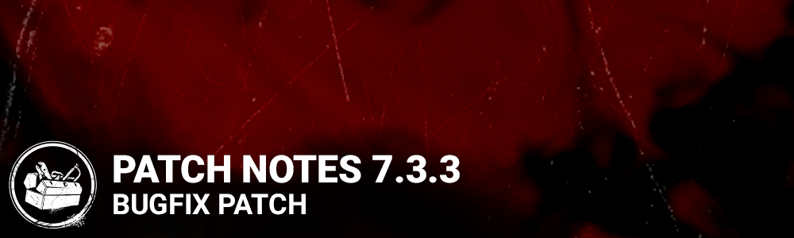

# 7.3.3 | Bugfix Patch

## Release Schedule

**Consoles:**3PM ET

**PC:**3:30PM ET

**Content**

*(Edited)*

## Stranger Things

The Stranger Things DLC is back to Dead By Daylight!

### Perks

The original Stranger Things perks had their names and icons changed after Stranger Things content was no longer available in the game. Now that Stranger Things is back, the original names and icons for the Perks are too (note: the functionality of these perks are NOT changing).

Please note these perks are only translated in English. All other non-English languages will be updated in the next release.

**Currently in Game → New (original) Title**

- Survivor Perks
  - Guardian → Babysitter
  - Kinship → Camaraderie
  - Renewal → Second Wind
  - Situational Awareness → Better Together
  - Self-aware → Fixated
  - Inner Healing → Inner Strength

- Killer Perks
  - Jolt → Surge
  - Claustrophobia → Cruel Limits
  - Fearmonger → Mind Breaker

### The Underground Complex Map

The Underground Complex Map has been reactivated with the same layout and content previously seen. The Hawkins National Laboratory ID Offering is also available once again in the Bloodweb to access the Realm for this Map.

## Bug Fixes

### Archives

- Fixed an issue that made it impossible to gain progress on the "In Extremis" Challenge from Tome 16.

### Bots

- Bots are now better at dodging The Trickster's Blades.

### Characters

- Fixed an issue that caused the Female and Male Survivor fast vaults distance not being the same.
- Fixed an issue that caused The Trapper to play the Naughty Bear animation during several instances (attack miss, vault and stunned).

### Environment/Maps

- Fixed an issue in Pale Rose where a tree root would get the player stuck.
- Fixed an issue where players were pushed into the roof of the Mount Ormond Resort building.
- Fixed an issue that caused the Knights guards order range to be shorter on one side of generators due to Halloween asset collision.

### Platforms

- Fixed an issue on Switch with the Naughty Bear Mori button always visible even when an other outfit was selected.

### UI

- Fixed a potential crash in the Event Entry screen after purchasing an item with event currency.

### Misc

- Fixed a crash that could occur in the Store.
- Fixed a crash/disconnection issue that could occur when playing with Bots.
