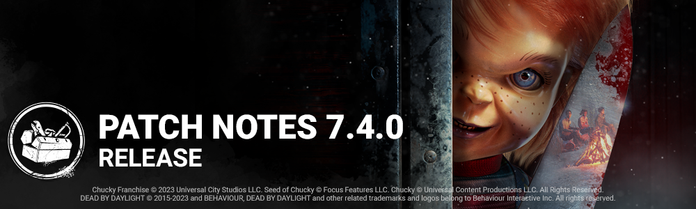

<!-- summary -->
## AI TL;DR

The Good Guy joins the roster as the Chucky Chapter’s new killer, featuring a switchable Hidey-Ho mode, Slice & Dice attack and Scamper vault, plus three exclusive perks (Hex: Two Can Play, Friends ’Til the End, Batteries Included). The Trickster receives speed, recoil and Main Event tweaks plus new add-on effects, while the Nemesis gets a vaccine animation update. Map sizes for Mother’s Dwelling, Temple of Purgation and Garden of Joy were trimmed and navigation improved; FSR 1.0 support lands on all platforms and a Player Profile with customizable cards is added. The update is dominated by broad bug fixes covering archives, audio, bots, character animations, map collisions, UI quirks and platform-specific crashes.
<!-- /summary -->

<!-- nav -->
&larr; [7.3.3 | Bugfix Patch](417-7-3-3-bugfix-patch.md) · [Live](../../index.md#live) · [7.4.1 | Bugfix Patch](422-7-4-1-bugfix-patch.md) &rarr;
<!-- /nav -->

# 7.4.0 | Chucky

## Release Schedule

The 7.4.0 Update and the Dead by Daylight: Chucky Chapter will be available starting at 12PM ET. (This is an estimate and may very from platform to platform.)

## PTB Developer Update

To catch up on everything new since the last PTB, click here:

[https://forums.bhvr.com/dead-by-daylight/kb/articles/420](https://forums.bhvr.com/dead-by-daylight/kb/articles/420)

## Content

### New Killer - The Good Guy

#### Killer Power

The Good Guy has two separate modes he can switch between; Normal Mode and Hidey-Ho Mode. Due to his short height, The Good Guy also has a fixed third-person camera positioned above and behind him, giving the player a better view of his surroundings. He is also much shorter than other Killers making him very stealthy, however he leaves fading Footfalls behind as he walks.

#### Special Ability: Hidey-Ho Mode

**Press the Secondary Power button to enter** Hidey-Ho Mode for 14 seconds. While in this mode the Killer is Undetectable, and "distraction" Illusory Footfalls and audio are spawned all across the map.

#### Special Attack: Slice & Dice

**While in** Hidey-Ho Mode, press and hold the Power button to charge up a Slice & Dice Attack. When fully charged, you automatically dash forward at high speed, triggering an attack at the end. The Power button can be released during the dash to perform the attack early.

#### Special Ability: Scamper

While in Hidey-Ho Mode, when you are near a vault or pallet, press the Interaction button to scamper through it quickly without breaking it.

### Perks

- **Hex: Two Can Play**
- Anytime you are stunned or blinded by a Survivor 4/3/2 times, if there is no Hex Totem associated with this Perk, a Dull Totem becomes a Hex Totem. While the Hex Totem stands, Survivors who stun or blind you get blinded for 1.5 seconds.
- **Friends 'Til the End**
- When you hook a Survivor that is not the Obsession, the Obsession becomes exposed for 20 seconds and reveals their aura for 6/8/10 seconds. When you hook the Obsession, another random Survivor screams and reveals their position and becomes the Obsession.
- **Batteries Included**
- When within 12 meters of a completed generator, you have 5% Haste. The movement speed bonus lingers for 1/3/5 seconds after leaving the generator's range. This perk deactivates when all the generators are powered.

### Killer Updates - The Trickster

- Movement speed increased from 4.4 m/s to 4.6 m/s.
- Removed recoil for throwing knives.
- Blade-ready movement speed: removed per-throw movement speed reduction.
- Increase laceration meter from 6 to 8.
- Main Event Updates:
  - Decrease the number of Blades required to access Main Event from 30 to 8 Blades.
  - Decrease Main Event duration from 10 sec to 5 sec.
  - Pressing the Secondary Power button within 0.3 second of activating Main Event does not cancel it.
  - Add 0.5 second to the next Main Event for each combo score level reached.
  - Combo Score Levels (consecutive hits with thrown Blades increases the combo):
    - E: base time + 0.5 sec
    - D: base time + 1 sec
    - C: base time + 1.5 sec
    - B: base time + 2 sec
    - A: base time + 2.5 sec
    - S: base time + 3 sec

### Trickster Add-on Updates

- **Memento Blades**
- Increases throw speed by 5% *(new functionality)*
- **Inferno Wires**
- Increases duration of *Main Event* by 40% *(was 25%)*
- **Ji-Woon's Autograph**
- **Increase the time before a combo ends by 10%** *(new functionality)*
- **Tequila Moonrock**
- Increases duration of *Main Event* by 60% *(was 50%)*
- **Fiz-Spin Soda**
- **Increase the time before a combo ends by 15%** *(new functionality)*
- **Death Throes Compilation**
- Reveal the aura of Survivors hit during Main Event for 6 seconds *(new functionality)*
- **Iridescent Photo Card**
- For each consecutive Blade hit, gain a stackable 1% Haste status effect, up to a maximum of 7%. (*new functionality)*
- **This bonus is lost when missing a Blade or when injuring a** Survivor by any means. *(new functionality)*

### Killer Update - The Nemesis

- There is a new animation for when Survivors use Vaccines on themselves.

### Perk Updates

- **Made For This**
- This perk activates while you are in the injured state. after you finish healing another Survivor, gain the endurance status effect for 6/8/10 seconds. While affected by Deep Wound, you run 3% faster. *(added deep wound condition for haste effect)*
- **Stranger Things Perks** - now that the Stranger Things DLC is available once more, the following perks will no longer be in the bloodweb unless you own the DLC:
  - Surge - Demogorgon perk (was Jolt)
  - Mindbreaker - Demogorgon perk (was Fearmonger)
  - Cruel Limits - Demogorgon perk (was Claustrophobia)
  - Babysitter - Steve Harrington perk (was Guardian)
  - Camaraderie - Steve Harrington perk (was Kinship)
  - Second Wind - Steve Harrington perk (was Renewal)
  - Better Together - Nancy Wheeler perk (was Situational Awareness)
  - Fixated - Nancy Wheeler perk (was Self Aware)
  - Inner Strength - Nancy Wheeler perk (was Inner Healing)

### Map Updates

The largest Maps in the game, The Mother's Dwelling and The Temple of Purgation of the Red Forest Realm, have been reduced in size. This will help both roles enjoy a play area that is consistent with the other maps. While we were making adjustments to the Red Forest Realm, we also did a pass on the gameplay of the tiles and improve the navigation and the readability of the map.

The Garden of Joy also benefited from a gameplay pass. The house has been revisited to find a better combination of obstacles and reduce the strength of some of the windows. A pass on the tiles has also been done, since the visibility was making it hard for players to enjoy a better navigation in the map and bring the focus on the chase, loops and all interactions. The Killer Shack was also very crowded around the walls and made the collisions known through all realms hard to run consistently, we have cleared the area.

**PTB Feedback for the House** in Garden Of Joy, we noticed that the position changes of the breakable walls, made it more difficult to deal with the Windows. We have removed the breakables, the structure of house is still problematic it is noted and will be part of a future pass on the building.

Autohaven Wreckers will be more festive this year with added holiday decorations in a few places within the maps.

## Features

### Graphics Update

- Added support for FSR 1.0 on all platforms.

### Player Profile and Customizable Player Cards

Players can now expect to find their level and grades on a new screen - their Player Profile! Select the badge in the top right (of most menus) to open it. The Player Profile is where players can customize their Player Card.

Players now have a Player Card and can earn collectable banners and badges to customize it! New banners and badges come in a variety of rarities and appearances and can be earned from Tome and Archive rewards as well as Events. Players will be able to see their new customized player cards in a variety of menus including the end-of-match tally screen where they can show them off to other players.

## Bug Fixes

### Archives

- Fixed an issue where The Wraith could earn progress towards the Tome 6 *Ripple of Violence* challenge when hitting a healthy survivor with the *Blind Warrior - White* add-on. This unintended.
- Fixed an issue where the Green Glyphs were not spawning after the challenge requirement was completed.
- Fixed an issue where the pallet break animation was out of sync while the Killer player was under the effect of the Orange Glyph.
- Fixed an issue where a hooked Survivor player could earn progress on skill check related challenges during the hooked struggle phase. This was unintended.
- Fixed an issue where visual elements of the *Core Memory: Stray Thoughts* challenge were visible after the shard despawned.
- Fixed an issue where the shards of the *Core Memory: Stray Thoughts* challenge could spawn inside environment assets.
- Fixed an issue where the High Skill challenge can gain progress from hook struggle skill checks.

### Audio

- Specific voice lines' subtitles should now match the audio more accurately.
- Fixed various VO issues on The Good Guy.
- Fixed an issue where The Good Guy could hear the illusory footfalls.
- Fixed an issue where some killers were lacking the SFX when snuffing a totem.
- Fixed an issue where the wrong music was playing for Jake Park's Lucky Stroll Outfit.
- Fixed an issue where the Blast Mine explosion was muffling the audio on the Survivor who installed it at any range.
- Fixed an issue where the perk "Spies from the Shadow" caused the loud noises to be too loud.
- Fixed an issue where Memory Shards were lingering after despawning.

### Bots

- Bots are better at handling the Undetectable status of a Killer.
- Bots no longer struggle to repair a Generator on a specific tile on The Game.
- Fixed multiple crashes that could occur when playing with Bots.
- Bots in the Tutorials have been slightly nerfed to improve new player experience.
- Bots have figured out how to access a particular corridor of the Hawking National Laboratory.
- Bots have figured out how to access a particular corridor of the Raccoon City Police Station.
- Bots have figured out how to fall off a specific ledge on Lampkin Lane.
- When a Killer approaches while being healed by another player, Bots are now more willing to run away.

### Characters

- An animation of Mikaela Reid pulling out a book in the menus has been fixed to correctly hide the book at the end.
- Fixed an issue that caused the animation for grabbing a Survivor from a Locker to not play properly when playing as The Nurse in a Trial.
- Fixed an issue that caused the hook animation of the Nurse to not play properly when hooking a survivor.
- Fixed an issue that caused multiple animations to clip during specific interactions as The Hag.
- Fixed an issue that caused the Survivors right arm to appears broken when performing the self-unhook animation
- Fixed an issue that caused the The Hillbilly to be able to see through a Locker when starting the Use Chainsaw.
- Fixed an issue that caused Break pallet animation to be out of sync when breaking a pallet as the Killer while under the Orange Glyph status effect.
- Fixed an issue that caused Nicolas Cage to plays ‘failed skillcheck’ animation when using Styptic Syringe.
- Fixed an issue that caused The Hag camera to moves briefly when returning to idle after an attack.
- Fixed an issue that caused The Trapper and The Pig to be missing their traps in the Lobby
- Fixed an issue that caused Survivor Nicolas Cage's chin to clip through his collar during the pointing animation.
- Fixed an issue that caused Survivor The Nurse's weapon to snaps back into idle position after an attack miss.
- Fixed an issue that caused The Hag's arm to be invisible when having the Sugared Claws equipped during multiple actions.
- Fixed an issue that caused the camera to be misplaced during the Moris as Renato Lyra and equipped with his legendary outfit.
- Fixed an issue that caused The Hag or The Nurse camera to be able to clip inside of the locker until they move, when searching an empty locker.
- Fixed an issue that caused The Blight's camera to be able to clip through locker while using chain dash.
- Fixed an issue that caused The Trickster's camera to drops to low, when landing.
- Fixed an issue that caused Survivors right arm to appear broken when performing the self-unhook animation while holding certain items.
- Fixed an issue that caused the Trapper to be able to farm Bloodpoints and stack Haste bonuses by spamming the Set Trap ability on Maurice's hooves.
- Fixed an issue that caused the Demogorgon's FOV not to increase while using the Shred ability.
- Fixed an issue that caused the Legion's add-on Julie's Mix Tape not to replenish the Feral Frenzy cooldown when pallet stunned.
- Fixed an issue that could cause a crash when the Deathslinger reeled in a speared Survivor.

### Environment/Maps

- Fixed issues related to the navigations of Bots in the The Underground Complex
- Fixed an issue in the realm of Crotus Prenn where the pallet in the shack was clipping in the ground
- Fixed an issue where Victor could not jump through a window of the Grim Pantry building
- Fixed an issue on the Suffocation Pit where the player could land on top pf assets
- Fixed an issue in the Coal Tower maps where player could land on top of pallets
- Fixed an issue with the collision of a car asset in the Badham Preschool.
- Fixed an issue where you could see the edge of the map in the vistas on The decimated Borgo.
- Fixed an issue that caused the Xenomorph's tail attack not to inflict damage on Survivors in the shack in the Red Forest maps.
- Fixed an issue that caused the Xenomorph's tail attack to hit multiple invisible collisions in the Underground Complex map.
- Fixed an issue that caused the Mastermind to not be able to use his power around a sliding door in the Underground Complex map.

### Perks

- Fixed an issue that sometimes caused successful skillchecks from the Merciless Storm perk to count as failed.

### Platforms

- Fixed an issue with purchasing Auric Cells on the Microsoft Store version of the game.
- Fixed a crash that could occur on PS5 while in menus.

### UI

- Buying a node on the Bloodweb for an "item" that is part of the active preset right before the beginning of a match will lead to that "item" to be correctly consumed and shown on the Tally screen.
- Legendary Cosmetics Killers with a unique name (such as The Trapper's Naughty Bear) will now have that name correctly display across all menus.
- Players can switch between Archives visual lore entries while in fullscreen.
- Fixed a missing word in the Player Stats tab
- Fixed an issue where the screen blurs when canceling the Naughty Bear Mori preview while loading.
- Fixed an issue where the spending pop-up above the Bloodpoints wallet doesn't appear when using bonus Bloodpoints.
- Fixed an issue where texts are overlapping in the Loadout menu on the Nintendo Switch.
- Fixed an issue where tooltips do not scale with the UI Scale option

### Misc

- Killswitched Cosmetics can no longer be brought into a Trial.
- Fixed a crash that could occur when starting a match with an empty loadout.
- Fixed an issue that caused Survivors to run in place when the Killer disconnected from the trial.

## Public Test Build (PTB) Adjustments

### New Killer - The Good Guy

#### Killer Power

- Pallet Scamper - 1.4 seconds (Was 1.2 seconds)
- Slice & Dice dash duration - 1.2 seconds (Was 1 second)
- Slice & Dice miss speed adjusted to be more in line with other similar Killers

#### Perks

- Batteries Included - adjusted to deactivate after all generators are completed.

#### Addons

- Good Guy Box - Decrease Slice & Dice hit blade wipe by 7 %. (Was 15%)
- Power Drill - Hidey-Ho Mode cooldown reduced by 15% after hitting a Survivor with Slice & Dice. (Was 20%)
- Electric Carving Knife - Decrease Slice & Dice miss cooldown by 5%. (Was 10%)
- Jump Rope - Increase duration of Slice & Dice by 8%. (Was 30%)
- Flaming Hair Spray - Reduce the amount of time consumed by M1 attacks in Hidey-Ho Mode by 20% (Was 12.5%)
- Automatic Screwdriver - Missing a Slice & Dice attack reduces Hidey-Ho Cooldown by 10%. (Was 15%)
- Portable TV - Slice & Dice duration increased by 70% once the Exit Gates have been powered. (Was 100%)
- Silk Pillow - Terror Radius is reduced by 6m in Normal Mode, but Slice & Dice charge time is increased by 50%. (Was 4m and 75%)
- Iridescent Amulet - Hidey-Ho Mode duration increased by 50%. M1 attacks immediately end Hidey-Ho Mode. (Was 100%)
- Yardstick - Performing a Scamper reveals Survivor auras within 12m distance for 5 seconds. (Was 20m)
- Running Shoes - Gain 2% movement speed after performing a Scamper for 5 seconds. (Was 4% and 3 seconds)
- Rat Poison - While performing a Slice & Dice, the auras of survivors within 12m of you are revealed for 5 seconds (Was 8m)

#### Killer Updates - The Trickster

- Increase Main Event blade requirement to 8 (was 6).
- Revert time between throws to 0.33 sec (was 0.25).
- Addons:
  - Ji-Woon’s Autograph: Increase the time before a combo ends by 10% (NEW EFFECT).
  - Fizz-Spin Soda: Increase the time before a combo ends by 15% (NEW EFFECT).
  - Waiting for You Watch: Increases the duration of *Main Event* by 0.4 seconds for each Blade hit while it is active. (was 0.25)
  - Death Throes Compilation: Reveal the aura of Survivors hit during Main Event for 6 seconds (NEW EFFECT).
  - Iridescent Photocard: Remove the Haste bonus when injuring a Survivor (instead of the dying state).

#### Bots

- Bots will now think twice before doing a fall from a higher floor into the Killer's arms.
- Bots are now more likely to loop clockwise and anti-clockwise around certain loops, rather than fixed to one direction.
- Bots are now more accepting of being healed, particularly while fully downed.
- Bots are more likely to leave an unsafe loop after getting hit.
- Bots can now attempt to dodge dash actions.
- Bots can now vault a specific pallet on the Mother's Dwelling Map.
- Bots can now fall out of a specific window on the Lampkin Lane Map.
- Bots can now vault a specific pallet on the Raccoon City Police Department Maps.
- Bots' looping behaviour has improved, preventing them from turning around mid-loop in certain edge cases.
- Bots are once again self-unhooking, having been disrupted by the anti-camp measures.

### Bug Fixes

#### Gameplay

- Queueing as a certain Killer for a regular game then switching to a custom game no longer locks you to play the Killer you queued as in the regular game.
- Fixed The Demogorgon's Perks being available to Chucky without prestiging the former.

#### The Good Guy

- The Good Guy's voice lines can overlap and cause the Slice and Dice yell to be silent
- When destroying a Pallet as The Good Guy, the animation is now correctly centered in the direction of the Pallet.
- The Good Guy's camera sensitivity is no longer affected when getting stunned during a Slice and Dice dash.
- Activating the Hidey-ho mode no longer results in an increase in server latency and potential rubberbanding
- The Good Guy can no longer hear Illusory Footfalls spawned around survivors
- **After vaulting a Pallet or a Vault, The Good Guy's Slice and Dice vignette no longer remains visible**
- **The Good Guy's Chain** Scampers are now more resilient in high latency network conditions
- Survivors no longer remain on the floor during The Good Guy's pickup animation
- The Good Guy now correctly play voice lines when entering Hidey-Ho Mode
- **The Good Guy can no longer body block hooked** survivors from being unhooked
- The Good Guy's Pallet Scamper and Vault Scamper are now the same duration
- Breaking a pallet with The Good Guy's Hard Hat Addon now correctly triggers Chemical Trap, Thwack!, Game Afoot and Spirit Fury perks
- The Good Guy now correctly plays voice lines when a Survivor escapes a Trial
- The Good Guy's Slice and Dice ability no longer consumes 2 tokens of the Play With Your Food perk

#### The Trickster

- Fixed an issue that caused the Haste bonus from the Iridescent Photocard's add-on to not be lost when hitting a Survivor with Endurance.
- Fixed an issue that caused the Haste bonus from the Iridescent Photocard's add-on to not be lost when grabbing a Survivor.

#### Perks

- Fixed an issue that caused the perk Resurgence not to work after unhooking yourself.
- Fixed an issue that caused the perk Dying Light to gain a stack when hooking the Obsession while having the perk Friends 'Til the End equipped.
- Fixed an issue that caused the Status Effects from the Friends 'Til the End perk not to transfer to the new Obsession when triggered by Obsession transfer perks.
- Fixed an issue that caused the perk Hex: Two Can Play to not be dimmed when all totems were destroyed.
- Fixed an issue that caused the perk Hex: Two Can Play not to gain a charge when a Survivor wiggled out from the Killers grasp.
- Fixed an issue that caused various Haste bonuses not to stack when applied to the lingering bonus Haste of the perk Batteries Included.

#### Platforms

- Fixed a crash that could occur on the Microsoft Store version of the game when moving around menus.
- Fixed a crash that could occur on Nintendo Switch after consecutive matches.

#### Misc

- Fixed a crash that could occur on loading into certain maps.
- Fixed a server crash that could occur when playing with Bots.
- Fixed an issue that caused the Hag's add-ons that reveal Survivor auras when a trap is triggered not to work.

<!-- nav -->
&larr; [7.3.3 | Bugfix Patch](417-7-3-3-bugfix-patch.md) · [Live](../../index.md#live) · [7.4.1 | Bugfix Patch](422-7-4-1-bugfix-patch.md) &rarr;
<!-- /nav -->
