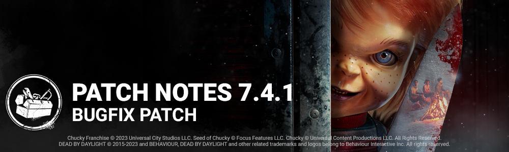

# 7.4.1 | Bugfix Patch

**Features**

## UX

- Input icons on Killer's power stay visible, becoming semi-transparent when that input cannot be used.

**Content**

## Events & Archives

- The "Bone Chill" Winter event returns December 14th at 11:00 AM ET.
- The "Bone Chill" event includes an event tome, with Level 1 opening at the start of the event.

## The Good Guy

- There is now input protection when entering Hidey-Ho Mode *(a small delay before you can exit the mode to prevent double-tapping and accidentally wasting the power by exiting immediately)*.

## The Trickster

- Memento Blades Add-on: Increased the bonus throw speed from Memento Blades to 10% (was 5%).

**Bug Fixes**

## Archives

- Fixed an issue where no audio feedback would play when interacting with a Glyph.

## Audio

- Fixed an issue that caused the Good Guy's VO lines to overlap and cause the Slice & Dice yell to be silent.

## Bots

- Bots no longer run away when a player fails to complete a Heal action on them.
- Bots no longer try to heal players that went into the Downed State by using Plot Twist.
- Bots will now attempt to get the players' attention if they want to be healed.
- Bots can no longer blind The Mastermind while being thrown.

## Characters

- Fixed an issue that caused The Huntress arm to glitch when throwing a hatchet while looking down.
- Fixed an issue that caused the Nurse to gain an additional blink charge after charging a blink and picking up a downed Survivor with the Matchbox add-on.
- Fixed an issue that caused the Demogorgon to traverse with a carried Survivor if it cancelled the traverse interaction at the last second and picked up a downed Survivor.
- Fixed an issue that caused the Demogorgon's portal auras to be white instead of yellow after being activated.
- Fixed an issue that caused from Survivor perspective, to flip repeatedly when The Good Guy interrupted them during a vault.
- Fixed an issue that caused The Killer camera to clip into Charles Lee Ray during the "Wiggle out" animation of the survivor.
- Fixed an issue that caused the Good Guy's basic attack to hit ground collision when looking slightly downward on a missed attack.
- Fixed an issue that caused interaction prompts to remain visible when the Good Guy was performing a Slice & Dice.
- Fixed an issue that caused random the Good Guy VO subtitles to display when loading into or leaving the match.
- Fixed an issue that caused Survivors to be misaligned while being carried by Charles Lee Ray/the Good guy.
- Fixed an issue that caused the Good Guy's camera to be extremely misaligned and clipping after interacting with a glyph.

## Environment/Maps

- Fixed an issue on the Nostromo Wreckage Map where characters can get on top pf some debris.
- Fixed an issue on Gas Heaven Map where The Demogorgon could get on top of a pallet.
- Fixed a global issue where the doors of Lockers would clip in the stairs of the Basement.
- Fixed an issue in The Underground Complex Map where Killers could not grab Survivors working on a side of a Generator.
- Fixed an issue in Coal Tower Map where Killers could land on top of crates.
- Fixed an issue in Badham Preschool Map where the Killer was unable to vault the window of the Killer Shack.
- Fixed an issue in Family Residence Map where The Good Guy was able to land on top of blockers.
- Fixed an issue where traps could be hidden under water in the Yamaoka Estate Maps.
- Fixed an issue where Killers were unable to grab Survivors on some Generators in the Midwich Elementary school map.

## UI

- Fixed an edge case where switching between characters with an identical Perk inventory except for Perk levels would fail to update the inventory.
- Fixed the Store Banner subtitle in the Featured section so that it's not cut before the end in certain languages.
- Fixed an issue in the Archives Rift menu where the Auric Cell Reward preview stayed displayed after selecting a Blood Point Reward.
