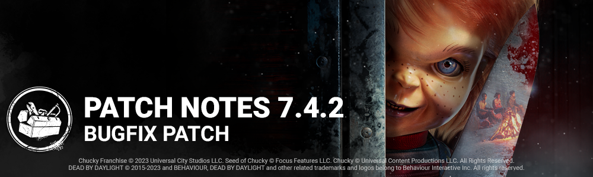

<!-- summary -->
## AI TL;DR

Flashlight items and the perks Residual Manifest, Dramaturgy and Appraisal have been re-enabled, and the Good Guy’s Batteries Included perk now grants 5 % Haste within 12 m of a finished generator with a lingering speed boost, removing its deactivation when all generators are done. The Trickster’s throw cadence was shortened to 0.3 s, his Main Event throw-rate multiplier raised to 66 % and duration to six seconds, and Laceration decay time returned to 15 s. The update also restores bot dodge of special attacks and resolves numerous animation, collision and UI bugs affecting The Good Guy, The Trickster, The Demogorgon, The Huntress and several maps, plus minor crashes and locker-clipping issues.
<!-- /summary -->

<!-- nav -->
&larr; [7.4.1 | Bugfix Patch](422-7-4-1-bugfix-patch.md) · [Live](../../index.md#live) · [7.5.0 | Alan Wake](430-7-5-0-alan-wake.md) &rarr;
<!-- /nav -->

# 7.4.2 | Bugfix Patch

**Content**

- Re-enabled Flashlight items and perks Residual Manifest, Dramaturgy and Appraisal.

## The Good Guy

- **Batteries Included (perk)**
- When within 12 meters of a completed generator, you have 5% Haste. The movement speed bonus lingers for 1/3/5 seconds after leaving the generator's range. *(Removed deactivation when all generators are completed)*

## The Trickster

- Decreased the base time between throws to 0.3 seconds (was 0.33)
- Increased the Main Event throw rate multiplier to 66% (was 33%)
- Increased the Main Event active duration to 6 seconds (was 5 seconds)
- Reverted the time before Laceration starts decaying to 15 seconds (was 10 seconds)

**Bug Fixes**

## Archives

- Fixed an issue that made it impossible to complete the Back-to-Back Tome 17 Challenge if getting a Good skill check or missing a skill check after getting 3 Great skill checks consecutively.

## Bots

- Bots can once again dodge special attacks.

## Characters

- Fixed an issue that caused the Mastermind picking up a Survivor on his shoulders to be misaligned for a few seconds.
- Fixed an issue that caused The Demogorgon's Break Pallet animation to play properly when a Survivor runs into the Pallet from the other side.
- Fixed an issue that caused The Good Guy "Slice and Dice" hit animation to plays twice.
- Fixed an issue that caused survivors to become misaligned during The Good Guy carry animation attacks
- The Good Guy can now scamper under pallets being lifted by Any Means Necessary
- Fixed an issue where players could bypass the 90 degree camera lock with The Good Guy
- The Trickster's Main Event can no longer trigger the Supreme Combo event multiple times per health state
- As seen from the survivor point of view Charles Lee Ray no longer jitters and lags behind while carrying The Good Guy
- Fixed an issue that caused The Huntress' hatchets to become offset at launch

## Environment/Maps

- Fixed an issue in The Nostromo map where characters could land on debris
- Fixed an issue in Midwich Elementary School where characters would clip through a vault
- Fixed an issue in the Swamp Realm where extra collision would let characters stand
- Fixed an issue in The Underground Complex where characters would not be able to rescue a survivor on a hook

## UI

- Fixed occasionally missing UI elements like the Currencies information.
- Fixed a potential crash in the Archives when hovering a Reward node.
- Fixed a potential crash if closing the Player Profile menu too quickly after equipping a Player Card badge or banner.

## Misc

- Fixed an issue that caused Survivors to clip into a locker after being interrupted from entering one by the Killer
- Fixed an issue that caused Survivors to clip into lockers after using a flashlight and entering the locker simultaneously

**Known Issues**

- The Back-to-Back Tome 17 challenge description erroneously says "1 consecutive skill check" instead of 3.

<!-- nav -->
&larr; [7.4.1 | Bugfix Patch](422-7-4-1-bugfix-patch.md) · [Live](../../index.md#live) · [7.5.0 | Alan Wake](430-7-5-0-alan-wake.md) &rarr;
<!-- /nav -->
