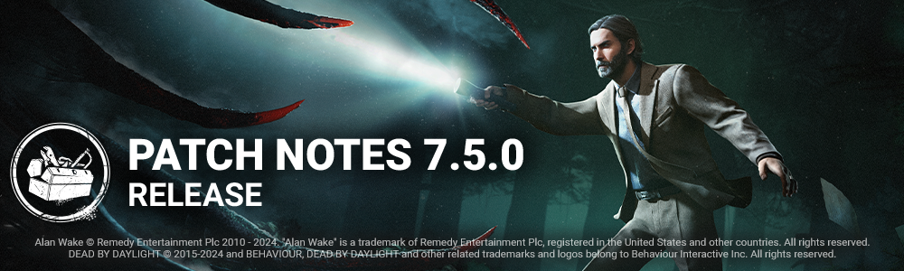

<!-- summary -->
## AI TL;DR

Players now have a beta Field-of-View slider to reduce motion-sickness, and the new survivor Alan Wake joins with Champion of Light, Boon: Illumination and Deadline. The Hillbilly’s Chainsaw Sprint runs faster, cooldowns drop and Overdrive gains extra speed and duration, while the Onryo loses its teleport cooldown and receives a self-charging power meter that applies Condemned at high charge. Generators are limited to eight regression events, preventing endless “3-gen” strategies and updating Hex: Ruin, Monitor and Abuse among others. Mount Ormond’s entrance loop is reworked for smoother play, and the Nowhere to Hide perk and The Knight killer are re-enabled. The patch also bundles bug fixes covering challenges, audio levels, bot logic, character animations, map collisions, UI pop-ups and PTB issues.
<!-- /summary -->

<!-- nav -->
&larr; [7.4.2 | Bugfix Patch](424-7-4-2-bugfix-patch.md) · [Live](../../index.md#live) · [7.5.0 | Hotfix](431-7-5-0-hotfix.md) &rarr;
<!-- /nav -->

# 7.5.0 | Alan Wake

## Features

### Field of View Settings

There is a new settings option in DbD! Players now have the ability to adjust their FOV, or field-of-view, with a slider in the Settings Menu. This allows players with a first-person-camera (Killers, with the exception of The Good Guy) to adjust their field-of-view, reducing motion-sickness and other accessibility issues. This feature is initially in the Beta Tab while we allow for thorough testing.

### FOV Perk Updates

- **Shadowborn**
- When blinded by any means, gain a 6/8/10% Haste Status Effect for 10 seconds *(new functionality)*
- **Monitor and Abuse**
- While in a chase, your Terror Radius is increased by 8 meters. Otherwise, your Terror Radius is decreased by 8 meters *(FoV clause was removed)*

### Generators System Update

The 3-gen strategy (identifying the closest 3 Generators and defending only them) has become very strong, especially on certain Killers. This can lead to very long games and frustration. To help prevent such situations, the following now applies:

- Each Generator can only suffer 8 regression events maximum.
- After the max has been reached on a Generator, that Generator can no longer be regressed by the Killer (including kicks, Add-ons, and Perk-related regressions).
  - Number of regressions per Generator is indicated by increasing VFX after 3 or more regression events.
  - Gens at max regression events cannot regress by the Killer (including kicks, Add-ons, and Perk-related regressions).
- Survivors failing Skill Checks still regress Generators normally and do not count as regression events.
- Killer kick regression is increased from 2.5% to 5%.
- "Gen tapping" is no longer possible. To stop a Generator from regressing, a Survivor must repair 5% of the Generator.
  - Regression does not occur while repairs are in progress.

### Perks Affected

- **Hex: Ruin**
- All Generators are affected by *Hex: Ruin*. While a Generator is not being repaired by a Survivor, it will immediately and automatically regress repair progress at 50%/75%/100% of the normal regression speed. *(no longer deactivates when a Survivor is killed).*
- **Surge** and **Scourge Hook: Pain Resonance**
- *Does not create a loud noise notification if no progress is lost on the Generator.*
- **Oppression**
- *Only causes a regression event on the Generator that was kicked.*
- **Overcharge**
- *Only the initiating kick counts as a regression event.*

## Content

- Re-enabled the Nowhere to Hide Perk.
- Re-enabled The Knight Killer.

### New Survivor - Alan Wake

Dead by Daylight welcomes a new famous Survivor into The Fog - Alan Wake!

### Perks

- **Champion of Light**
- While you are holding a Flashlight, this Perk activates. When you are shining a flashlight, you have 50% Haste. When you successfully blind the Killer, they also gain 20% Hindered for 6 seconds. This effect cannot stack with itself. Then, this Perk goes on cool-down for 80/70/60 seconds.
- **Boon: Illumination**
- Press and hold the *Ability button 1* near a Dull or Hex Totem to bless it and create a Boon Totem. Soft chimes ring out in a 24 meter range. Survivors inside your Boon Totem’s range see the aura of all Chests and all Generators in blue. If you have a lit Boon Totem, you cleanse or bless Totems 6/8/10% faster. You can only bless one Totem at a time. All equipped Boon Perks are active on your Boon Totem.
- **Deadline**
- This Perk activates when you are injured. Skill Checks appear 6/8/10% more frequently when repairing or healing and appear in random places. The penalty for missing Skill Checks is reduced by 50%.

### Killer Update - The Hillbilly

#### Killer Power

Press and hold the Power button to break into a Chainsaw Sprint. Survivors hit during a Chainsaw Sprint are put into the dying state. Revving the Chainsaw, and sprinting with the Chainsaw each cause the Overdrive meter to increase. The meter decreases when the Chainsaw is not in use. When the meter is full, the Chainsaw goes into Overdrive.

#### Base changes

- Increased Chainsaw Sprint movement speed to 10.12 m/s *(was 9.2 m/s).*
- Decreased the Chainsaw hit cooldown to 2.7 seconds *(was 3 seconds).*
- Decreased the Chainsaw miss cooldown to 2.5 seconds *(was 3 seconds).*
- Increased movement speed during the Chainsaw miss cooldown to 2.3 m/s *(was 1.38 m/s).*
- Decreased the size of the Chainsaw's collision to improve navigation during a Chainsaw Sprint.
- Disconnected the Chainsaw's sensitivity from controller sensitivity.
  - Baseline sensitivity was set to 100% of the controller sensitivity.

#### Special State: Overdrive

While in Overdrive, the Chainsaw is enhanced. Chainsaw Charge and Sprint speeds are increased, and Chainsaw Sprint cooldowns are reduced. Overdrive lasts for 20 seconds.

#### Base Overdrive stats

- Chainsaw charge speed increased by 5%.
- Chainsaw Sprint movement speed increased to 13 m/s.
- Chainsaw cooldowns reduced by 10%.

#### Addons

- **Greased Throttle** *(was Junkyard Air Filter)*
- Decrease recovery time after using the Chainsaw by 8% *(new functionality).*
- **Counterweight** *(was Heavy Clutch)*
- Decreases Chainsaw Sprint initial turn rate by 70% *(new functionality).*
- **Cracked Primer Bulb** *(was* Speed Limiter)
- Survivors hit with the Chainsaw are damaged for a single health state.
- Increases Overdrive generation by 15% *(new functionality).*
- **Steel Toe Boots**
- Decreases recovery time after hitting an object with the Chainsaw by 10% *(was 12%).*
- **Begrimed Chains** *(was Big Buckle)*
- Survivors hit with the Chainsaw suffer from the Mangled and Hemorrhage Status Effects until fully healed *(new functionality).*
- **Dad's Boots**
- Increases the Chainsaw Sprint turn rate by 30% *(was 28%).*
- **Clogged Intake** *(was Death Engravings)*
- Increases Overdrive duration by 15% *(new functionality).*
- **Off-Brand Motor Oil**
- Increases Overdrive generation by 15% *(new functionality).*
- **Thermal Casing** *(was Punctured Muffler)*
- Decreases the speed at which heat dissipates when not using the Chainsaw by 20% *(new functionality).*
- **The Thompson's Mix** *(was Black Grease)*
- Decrease recovery time after using the Chainsaw by 12% *(new functionality).*
- **Iridescent Engravings** *(was Doom Engravings)*
- Increases Chainsaw Sprint movement speed by 20%.
- Increases time required to charge the Chainsaw by 12% *(new functionality and rarity).*
- **Ragged Engine** *(was Leafy Mash)*
- Decreases the speed at which Overdrive dissipates when not using the Chainsaw by 30% *(new functionality).*
- **Low Kickback Chains**
- Decreases recovery time after hitting an object with the Chainsaw by 15% *(was 28%).*
- **Discarded Air Filter** *(was Mother's Helpers)*
- Increases the time it takes before Overdrive starts dissipating by 20% *(new functionality).*
- **High Speed Idler Screw** *(was Pighouse Gloves)*
- Increases the time it takes before Overdrive starts dissipating by 30% *(new functionality).*
- **Spiked Boots**
- Increases the Chainsaw Sprint turn rate by 45% *(was 44%, & removed functionality).*
- **Tuned Carburetor**
- *Changed rarity to Ultra Rare.*
- **Apex Muffler**
- *Changed rarity to Very Rare.*
- **Filthy Slippers** *(was Iridescent Brick)*
- After maintaining a Chainsaw Sprint for 2 seconds, grants Undetectable until the Chainsaw Sprint ends *(new functionality and rarity).*

#### Misc.

- Added a new loading tip regarding the Overdrive meter.
- Added new score events when using the Chainsaw:
  - Curve: When turning a minimum of 80 degrees within 1 second of using the Chainsaw.
  - Curve Hit: When hitting a Survivor with the Chainsaw within 2 seconds of getting the Curve score event.
  - Overdrive: When Overdrive triggers.
  - Overdrive Hit: When hitting a Survivor with the Chainsaw when in Overdrive mode.
  - Sprinter: When performing a Chainsaw Sprint that is 4 seconds or longer.
  - Sprint Hit: When hitting a Survivor with the Chainsaw after travelling more than 32 meters.

### Killer Update - The Onryo

#### Demanifested State

- While Demanifested:
  - The Onryo can gain Bloodlust as usual.
  - The Onryo can enter chases as usual.
- When Demanifesting:
  - Bloodlust is no longer lost.
- Increase Demanifested state invisibility duration from 1 to 1.2 seconds.

#### Killer Power

- Teleport cooldown from previous update removed.
- Condemned gained from teleports increased to 1 full stack.
- New Power Meter:
  - Resets on teleport and charges automatically afterwards (10 seconds).
  - If the power meter is at 98% or more when teleporting, the teleport applies Condemned to Survivors within 16 meters of the TV where The Onryo projected or any other powered TV.
  - If the power meter is <98%, no Condemned is applied.
- Powered TVs:
  - Now have VFX showing range at all times (when powered).
  - Are revealed to Survivors within 16 meters.
- Hooking a Survivor locks in up to 2 stacks of Condemned (applies for each hook action). These stacks become impossible to remove.

#### VHS Tapes

- Tapes no longer grant protection from gaining Condemned while holding them.
- Survivors no longer gain Condemned if hit while holding a Tape.
- Survivors no longer lose their Tape when attacked.
- Survivors must bring their Tape to the furthest TV.
  - Highlighted in yellow.
- Retrieving a Tape now takes 1 second *(was 2).*
- Inserting a Tape in a TV now takes 1 second *(was 2).*

#### Addons

- **Videotape Copy**
- Increases the range at which Survivors gain Condemned from Projection by 2 meters *(new functionality).*
- **Reiko's Watch**
- Increases the invisibility duration while Demanifested by 25% *(was 33%).*
- **Ring Drawing**
- When hooking a Survivor carrying a Tape, other Survivors gain 1 Condemned stack *(new functionality).*
- **Tape Editing** **Deck**
- Each Survivor starts the Trial with a Tape in their possession, and their target TV is the furthest from their location *(no change).*
- Survivors that insert their Tape are revealed for 6 seconds *(new functionality).*
- **Iridescent Videotape**
- Projection does not turn off TVs, and does not apply Condemned *(new functionality).*
- TVs turned off by Survivors take 20% longer to turn back on *(new functionality).*

### Killer Addon Updates - The Blight

- **Blighted Rat**
- Increases Rush speed by 2% for each consecutive Rush *(was 4%).*
- **Blighted Crow**
- Increases Rush speed by 3% for each consecutive Rush *(was 6%).*
- **Adrenaline Vial**
- Increases maximum Rush tokens by 2.
- Increases maximum Rush look angle by 20 degrees.
- Increases Rush speed by 5%.
- *(adjusted functionality)*
- **Alchemist's Ring**
- Increases Rush duration by 20% for each consecutive Rush *(new functionality).*
- **Compound Thirty-Three**
- Increases Rush turn rate by 11% for each consecutive Rush that travels at least 3 meters, up to a maximum of 33% *(new functionality).*
- **Iridescent Blight Tag**
- Enables Rush to be performed without spending tokens.
- Rush bonuses are capped after 3 consecutive rushes.
- Blighted Corruption goes on cooldown for 20 seconds after a Lethal Rush attack, missing a Slam, or breaking a Pallet with Blighted Corruption.
- *(new functionality)*

### Perk Updates

- **Quick Gambit**
- When you are chased by the Killer, see the Auras of Gens within 36 meters.
- Survivors working on highlighted Generators receives a 6/7/8% speed boost to the repair action.
- *(new functionality)*
- **Save the Best for Last**
- You become Obsessed with one Survivor.
- Earn a Token for each successful basic attack that is not dealt to the Obsession*.*
- Each Token grants a stackable 4% *(was 5%)* decreased successful basic attack cooldown, you can earn up to 6/7/8 tokens. *(was 8 tokens)*
- When hitting the Obsession with a basic attack or special attack, lose 2 Tokens. You cannot gain Tokens as long as the Obsession is sacrificed or killed. *(adjusted damage source and tokens lost)*
- **Grim Embrace**
- Each time a Survivor is hooked for the first time, gain a Token, then when you leave a 16 meter range of that hook, all Generators are blocked for 8/10/12 seconds. *(new functionality)*
- Upon reaching 4 Tokens, when you leave a 16 meter range of that hook, The Entity instead blocks all Generators for 40 seconds. The Obsession's aura is revealed to you for 6 seconds. *(Increased times, added proximity clause)*
- Then, this Perk deactivates.

### Events

- **Modifier: Lights Out** will be active from February 7, 2024 11:00am ET to February 14, 2024 11:00am ET.
  - A **Modifier: Lights Out** event Tome will also open while the Modifier is active.

### Maps

- **Mount Ormond updates**

We made some changes to Mount Ormond. The layout and main building are staying the same. but we decided to address the fact that the front of the Building, representing an entrance, had no gameplay or interesting loop. It was a big pile of rocks and not much else. So we went updated the gameplay to make it more fluid and fitting with the loops and to actually add gameplay. The Art team went through as well to make things look nice.

In the back of the building we had a couple of tiles that were simple loops, but that didn't have interesting gameplay. We updated this and improved the quality there as well.

## Bug Fixes

### Archives

- Fixed an issue where The Archives Challenges could be completed when playing Tutorial Bot Match.
- Fixed an issue where the Memory Shard visual effects would not stop drawing when in Spectator mode.
- Fixed an issue where the Challenge descriptions of Core Memory: Stray Thoughts were inconsistent with other Core Memory Challenges.
- Fixed an issue where the Tome 17 Back-to-Back Challenge would gain unintended progress from non-consecutive Skill Checks.
- Fixed an issue where the Knockout Challenge would gain progress if a Survivor activated the Plot Twist Perk to put themselves in the dying state.
- Fixed an issue where the A Stunning Display Challenge would not gain progress after wiggling free from the Killer's grasp.
- Fixed an issue where the That's Rude Challenge would not gain progress when pointing at the Killer within five (5) seconds of the Premonition Perk activating.
- The Undying Influence Challenge now properly tracks Totems ignited by the Hex: Plaything Perk.
- The Plot Twist Perk no longer gives progress towards the Killer Challenge Knockout (Remix).
- The That’s Rude Challenge now correctly gains progress when pointing towards the Killer after activating the Premonition Perk.

### Audio

- Fixed issues that caused the Thorn SFX from the 3 Generator System to be too loud.
- Reduced The Hillbilly's Chainsaw volume.

### Bots

- Bots no longer self-heal immediately after being unhooked. They will first try to get healed by the person that got the unhook.
- Bots now have different priorities between different self interactions (self mend being the highest priority, and self care being the lowest priority)
- Bots no longer enter an infinite loop when injured and holding a Medkit and a special item.
- Bots self-healing is now more consistent: they correctly see the interaction as possible while moving.
- Players can now signal a bot for their attention by either using the "come here" emote or by t-bagging. Unless they have something urgent, they'll drop what they're doing and heal the player or let themselves get healed.
- Bots now change the priority of their interactions when they are targeting a specific interactor.
- When bots drop their Flashbang to grab and use a Spray or Serum, they will immediately pick back up their Flashbang once they're done healing themselves.
- Bots no longer stop in front of certain vaults.

### Characters

- The Knight can no longer summon many Guards at the same time when vaulting a window.
- Fixed an issue that caused the Pebble throw animation from male Survivors to be misaligned with the camera's orientation when using the Diversion Perk.
- Fixed an issue that caused Struggling Survivors to clip outside of The Demogorgon's arm.
- Fixed an issue that caused Nancy's red plaid skirt to clips into her leg while running in the tally screen.
- The screen no longer turns black for spectators after The Cenobite teleports to the Lament Configuration.

### Environment/Maps

- Fixed an issue in Nostromo Wreckage where The Nurse would get stuck in the main building.
- Fixed an issue in Mount Ormond where a collision would block the Guards.
- Fixed an issue in the Crotus Prenn Asylum where players could walk on the visually inaccessible ramp.
- Fixed an issue in Mount Ormond where debris would prevent The Mastermind from moving properly.
- Fixed an issue in the Underground Complex where the Killers could not drop down a hole in the Rift room.
- Fixed an issue in the Underground Complex where The Knight's Guards are unable to climb the stairs.

### Perks

- Fixed an issue where players would end up with unleveled perks if they have leveled it in lobby without opening the loadout menu before loading into a Trial.
- Survivors equipped with the Visionary Perk will see the Aura of the claws on a Generator blocked by the Corrupt Intervention Perk.

### UI

- Fixed an issue where the "Controller Disconnected" pop-up does not appear when the controller is disconnected.
- Fixed an issue where a popup message displays an option to buy Auric Cells when the item cannot be purchased with Auric Cells.
- Fixed an issue where the menu buttons when selecting a Survivor appear too small in the custom game lobby.
- Fixed an issue where the reward node status was not updated when collecting it.
- Fixed an issue where FSR SHARPNESS appears 1% lower when reopening the option after increasing it.
- Fixed an issue where Character info can be opened during the offering screen.
- Fixed an issue that caused the hook vignette to remain visible on screen in smaller scale while Survivors were being sacrificed.
- Fixed an issue that caused Survivors to be sacrificed a little before the End Game Collapse’s progression bar became empty.
- Fixed an issue that caused The Blight’s Rush input prompt to flicker when looking up.
- Fixed an issue that caused The Demogorgon’s Open Portal bar to remain white when equipped with the Rat Tail Add-on.
- Fixed an issue that caused the progress bar of nearby Generators, Totems or Chests not to be displayed when equipped with a Key or Map.
- Fixed an issue where some tooltips in bot loadout had their header off screen.

### Misc

- Fixed an issue where players could be stuck in a loop loading when attempting to start a Trial in a Custom Game with 6 players.

## Fixes from PTB

### Characters

- The Cannibal’s Speed Limiter Add-on correctly gives bonus Bloodpoints for the Chainsaw Hit score event.
- The Hillbilly’s movement speed no longer increases when colliding with an asset during a Chainsaw Sprint just as Override activates.
- Fixed an issue that caused some animations to be missing for female Survivors when repairing one side of a Generator.
- The Undetectable Status Effect is properly granted when playing as The Blight with both the Iridescent Blight Tag and Vigo’s Journal Add-ons equipped.
- The Onryo can no longer turn invisible when using the Nowhere to Hide Perk.
- Killer Instinct is now properly shown when The Twins’ Victor is Dormant close to Survivors hidden in Lockers.

### FOV

- Players can no longer bypass the minimum and maximum FOV by editing the ini files.
- The FOV setting is correctly saved between sessions.
- The Restore Defaults button correctly resets the FOV setting.

### Generators

- The minimum repair indicator to stop regression no longer appears on Generators that are not regressing.
- The minimum repair indicator no longer appears if the Generator regression is stopped by something other than repairing the Generator, such as when the Hex: Ruin Totem is Cleansed.
- Eruption no longer applies its effects if the Generator is not damaged because it has already accrued the maximum number of regression events.
- Missing the Overcharge Skill Check no longer causes a Generator with no repair progress to regress.
- Generators that are blocked after having accrued the maximum number of regression events can no longer be regressed by The Legion’s Fuming Mix Tape Add-on.

### Misc.

- Survivors may no longer become invisible when interacting with a Locker at the same time as another Character.
- Characters may no longer get pushed when interacting with a Locker at the same time as another Character.

### Perks

- The Chest Auras reveal by the Boon: Illumination Perk are now hidden when affected by the Blindness Status Effect.
- The Champion of Light Perk no longer applies the Hindered Status Effect to the Killer when blinded by something other than a Flashlight.
- The Shadowborn Perk icon now only lights up when the Perk is active.
- The Save the Best for Last Perk no longer sometimes fails to lose Tokens when hitting the Obsession when other Obsession Perks are equipped.
- Fixed an issue that may cause players to become desynced when the Decisive Strike Perk was triggered at the same time the Killer was Stunned in another way.
- The Plot Twist Perk icon is no longer lit up when the Survivor is healthy.
- Hex: Thrill of the Hunt Perk now has the proper number of Tokens when re-ignited by the Hex: Undying Perk.
- The Endurance Status Effect granted by the We’re Gonna Live Forever Perk now counts towards the Humanitarian achievement.

## Known Issues

- Daily Rituals button is unresponsive when coming to the Main menu from the Archives or a Killer lobby. This can be fixed by visiting any other menus and coming back to the Main menu. The daily rituals button is also accessible in any Lobby or the Tally.

<!-- nav -->
&larr; [7.4.2 | Bugfix Patch](424-7-4-2-bugfix-patch.md) · [Live](../../index.md#live) · [7.5.0 | Hotfix](431-7-5-0-hotfix.md) &rarr;
<!-- /nav -->
