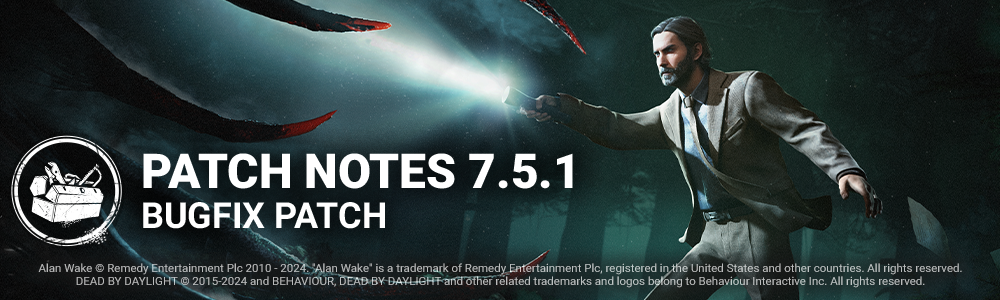

<!-- summary -->
## AI TL;DR

The Blight receives two new addons (Adrenaline Vial and Compound Thirty-Three) adjusting Rush token limits, speed, turn rate and duration, while the Hillbilly gains Greased Throttle and The Thompson’s Mix to shorten Chainsaw recovery outside Overdrive. The Onryo’s power is rebalanced: Condemned cooldown removed, stack cap raised to three, projection boost and manifesting speed increased. A Lights Out modifier runs from Feb 7-14, 2024 with an event tome.

The patch also fixes numerous bugs across archives, achievements, audio, bots, character models, maps, perks and UI, addressing skill-check tracking, sound overlaps, bot navigation, colliders, perk calculations and menu responsiveness.
<!-- /summary -->

<!-- nav -->
&larr; [7.5.0 | Hotfix](431-7-5-0-hotfix.md) · [Live](../../index.md#live) · [7.6.0 | All Things Wicked](437-7-6-0-all-things-wicked.md) &rarr;
<!-- /nav -->

# 7.5.1 | Bugfix Patch

**Update Releases:** 11 AM ET

*Note: Update times may vary from platform to platform. A small delay is expected for the update on the Epic Games Store.*

## Killer Adjustments - The Blight

### Addons

- **Adrenaline Vial**
- Increases maximum Rush tokens by 2.
- Increases maximum Rush look angle by 20 degrees.
- Decreases Rush turn rate by 55%. *(re-added functionality)*
- Increases Rush speed by 5%
- **Compound Thirty Three**
- Rush cannot be performed more than 2 times *(new functionality)*
- Increases Rush turn rate by 33% *(slightly adjusted functionality)*
- Increases Rush duration by 33% *(new functionality)*

## Killer Adjustments - The Hillbilly

### Addons

- **Greased Throttle**
- Decreases recovery time after using the Chainsaw by 8%
- This effect does not apply while in Overdrive *(new functionality)*
- **The Thompson's Mix**
- Decreases recovery time after using the Chainsaw by 12%
- This effect does not apply while in Overdrive *(new functionality)*

## Killer Adjustments - The Onryo

### Killer Power

- Removed the Condemned cooldown
- Increased the number of Condemned stacks that lock in when a Survivor is hooked to 3 *(was 2)*
- Increased the Projection movement speed boost duration to 2 seconds *(was 1.5)*
- Increased movement speed while Manifesting to 4 m/s *(was 3.68)*

## Events

- **Modifier: Lights Out** will be active from February 7, 2024 11:00am ET to February 14, 2024 11:00am ET.
  - A **Modifier: Lights Out** event Tome will also open while the Modifier is active.

## Bug Fixes

### Archives

- The Brand New Part Skill Checks no longer award progress for Archive Quests requiring succeeding Generator Skill Checks.

### Achievements

- The Nerves of Steel achievement now properly tracks Skill Checks.

### Audio

- Fixed an issue where The Good Guys laugh could overlap the Slice & Dice scream
- Fixed an issue that caused no sound to be heard when an invite is accepted.
- Fixed an issue that caused all the Killers sounds to be muted when opening the option menus in-game.
- Fixed an issue where the End Game Collapse bell sound wasn't heard.

### Bots

- Bots no longer run away from a Killer on a different floor.

### Characters

- Fixed an issue where The Good Guy's "Wedding Dress" torso stretches and distorts when selecting the outfit icons.
- Fixed an issue that caused The Hag to be unable to move in any direction when attacking while carrying a Survivor.
- The Plague no longer has a 1 second cooldown before being able to attack after performing Vile Purge.

### Environment/Maps

- Fixed an issue in Shattered Square where blockers prevented the killer from getting to a hook
- Fixed an issue in Midwich Elementary School where items could be hidden under rubbles
- Fixed an issue with the Harvester where bots could get stuck
- Fixed an issue with the crashed Bus where Bots would not leave their position
- Fixed an issue in Underground Complex entity effect were clipped near a hook
- Fixed an issue in Mother's Dwelling where The Nurse could not blink through railings around the house
- Fixed an issue with the collision on a maze tile in Pale Rose
- Fixed an issue in the Underground Complex where the The Singularity's Biopods would not stick to the walls properly
- Fixed an issue in the Dead Dawg Saloon map where a collision would block the players from navigating as intended.
- Fixed an issue in Eyrie of Crows where The Demogorgon could shred through different obstacles from the hill tile
- Fixed an issue in Shattered Square where an invisible collision was blocking the players navigations
- Fixed an issue where an unready Survivor could switch to the Killer role when attempting to start a Trial in custom matches.

### Perks

- Fixed an issue that caused the Healing speed buff for Circle of Healing not to apply when the medkit runs out of charge while healing.
- The Save the Best for Last Perk now correctly grants 4% decreased attack cooldown instead of 5%.
- The Champion of Light perk properly grants the Hindered effect when the Killer is blinded while carrying a Survivor.

### UI

- Fixed missing SFX when a player joins or leaves a party
- Fixed an unresponsive Daily Rituals button in the Main menu when coming back from a Killer Lobby or the Archives
- Fixed an issue where the cursor could be visible/movable during the intro cinematic

<!-- nav -->
&larr; [7.5.0 | Hotfix](431-7-5-0-hotfix.md) · [Live](../../index.md#live) · [7.6.0 | All Things Wicked](437-7-6-0-all-things-wicked.md) &rarr;
<!-- /nav -->
