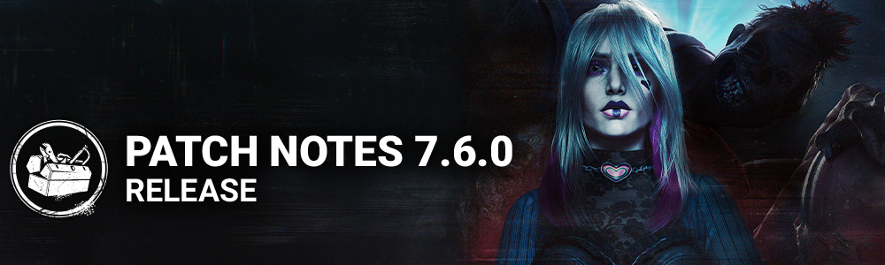

<!-- summary -->
## AI TL;DR

The Unknown arrives as a new Killer with Hallucinations and teleportation, while Sable Ward adds three basement-focused Survivor perks that modify generator progress, allow med-kit-free healing and guarantee. The Greenville Square map opens on the Withered Isle and Mangled now includes timers on each source for choice. Existing killers get balance tweaks - rushes for The Blight, faster Afterpiece Antidote for The Clown, reduced Shred cooldown for The Demogorgon, longer Shock Therapy range for The Doctor, more hatchets for The Huntress and quicker ambush attacks for The Pig. The patch adds Bloodweb UI shortcuts, load-out search, outfit tag fixes and audio, bot, map and perk bug fixes, with issues for The Unknown DLC cosmetic, Twins-Charlotte navigation and Scourge Hook percentages.
<!-- /summary -->

<!-- nav -->
&larr; [7.5.1 | Bugfix Patch](432-7-5-1-bugfix-patch.md) · [Live](../../index.md#live) · [7.6.1 | Bugfix Patch](439-7-6-1-bugfix-patch.md) &rarr;
<!-- /nav -->

# 7.6.0 | All Things Wicked

## Content

### New Killer - The Unknown

#### Killer Power

Press the Power button to charge UVX. Once ready, press the Attack button to launch UVX, a bouncing Projectile which creates a Blast Area upon impact. Survivors become Hindered if touched by UVX while airborne. Survivors touching the Blast Area become Weakened. Weakened Survivors lose health states if touched by Blast Area. Survivors lose Weakened by successfully Staring Down The Unknown.

#### Special Ability: Hallucinations

The Unknown will intermittently creates up to 4 Hallucinations. Hallucinations cannot be created while charging UVX, performing interactions, or in proximity to map objects like Hooks. Whenever Survivors are touched by Blast Area or otherwise become Weakened, the next Hallucination's spawn time decreases by 10 seconds.

#### Special Ability: Teleport

The Unknown can teleport to Hallucinations, leaving behind a temporary Decoy. Survivors can remove Hallucinations from the Trial with the Dispel ability. Weakened Survivors take longer to Dispel. If Dispel is not completed, Survivors become Weakened and trigger Killer Instinct.

#### Perks

- **Unbound**
- This perk activates for 24/27/30 seconds after a Survivor becomes injured by any means.
- After vaulting a window, you gain 5% Haste for 10 seconds. This effect cannot stack with itself.
- **Unforeseen**
- When you perform the Break action on a Generator, your Terror Radius transfers to the Generator for 22/26/30 seconds and its radius is set to 32/32/32 meters.
- You gain Undetectable for that duration.
- Then, this Perk goes on cooldown for 30/30/30 seconds.
- **Undone**
- When a Survivor misses a healing or repair Skill Check, gain 3 Tokens, up to a maximum of 18/24/30 Tokens.
- When you perform the Break action on a Generator, if you have any Tokens, consume all of them. For each Token consumed, the Generator loses 1% total progress and then becomes blocked for 1 second.
- Then, once the Generator is unblocked, it starts regressing.
- This Perk goes on cooldown for 60 seconds.

### New Survivor - Sable Ward

#### Perks

- **Invocation: Weaving Spiders**
- When in the Basement near the circle, press the ability button 1 to begin the Invocation.
- Invocations take 120 seconds. Other Survivors will see your aura during this and can join an ongoing interaction, increasing speed by 50% each. If they have an Invocation Perk equipped, they increase it by 100% instead.
- Once the Invocation is completed:
- You become injured and Broken for the rest of the Trial.
- Reduce the max required Generator progress of all remaining Generators by 8/9/10 charges *(same effect as "Brand New Part").*
- Completing the Invocation disables that Perk for all Survivors.
- **Strength in Shadows**
- When in the basement, this Perk activates.
- Unlocks the *Strength in Shadows* ability, which allows you to heal without a med-kit at 70/70/70% normal healing speed.
- When you finish a heal in the basement, you see the Killer's aura for 6/8/10 seconds.
- **Wicked**
- Your self-unhook attempts in the basement always succeed.
- When you are unhooked or unhook yourself, you see the Killer's aura for 16/18/20 seconds.

### New Map - Greenville Square

A new section of the Withered Isle has opened up to the players. The Greenville Square is a very different environment from what was previously seen from that Realm. It features a brand new set of tiles, including a new main building, The Theater. Make sure to explore all its layers! Look out for the Statue where two familiar friends would meet up and leave their mark. What does it mean and where will it bring us next? *No one ever came back to tell us.*

### Mangled Update

Mangled up until now has required Survivors to heal in order to remove the effect, while also slowing down healing speeds. To create more meaningful player choice, we'll be adding a timer to every source of Mangled in the game, allowing players to choose to heal through it, or wait it out.

**Affected Perks**

- Blood Echo
- Sloppy Butcher
- Scourge Hook: Gift of Pain
- Vigil

**Affected Addons**

- Defaced Smiley Pin (Legion)
- Diagnostic Tool (Singularity)
- Rusted Spike (Deathslinger)
- Begrimed Chains (Hillbilly)
- Blind Warrior - White (Wraith)
- Broken Hilt (Knight)
- Fragile Wheeze (Nurse)
- Grissly Chains (Cannibal)
- Honey Locust Thorn (Deathslinger)
- Cain's Helmet (Xenomorph)
- Powdered Glass (Skull Merchant)
- Rusted Jaws (Trapper)
- Rusty Attachments (Pig)
- Unity Blades (Pig)
- Rusty Head (Huntress)
- Sulphuric Acid Vial (Clown)
- Thorny Nest (Artist)
- Begrimed Head (Huntress)
- Straight Razor (Good Guy)
- Tilling Blade (Dredge)
- Cat Block (Nightmare)
- Z Block (Nightmare)
- Crimson Ceremony Block (Executioner)

### Killer Updates

#### The Blight

**Add-Ons**

- **Compound Thirty-Three:**
- **Rush cannot be performed more than 3 times** *(was 2).*
- Increases Rush turn rate by 33%.
- Increases Rush duration by 33%.

#### The Clown

**Basekit**

- Increased Afterpiece Antidote duration to 6 seconds *(was 5).*
- **Decreased Afterpiece Antidote activation delay to 2 seconds** *(was 2.5).*
- **Increased number of bottle to 6** *(was 4).*
- **Decreased the visual effect intensity when a** Survivor is affected by the Afterpiece Tonic.

**Add-Ons**

- **Redhead's Pinky Finger:**
- Direct hits by a bottle of Afterpiece Tonic inflict Exposed until Intoxication ends.
- Sets maximum number of carried bottles to 1 *(new functionality).*

#### The Demogorgon

**Basekit**

- Decreased Shred successful hit cooldown to 2.7 seconds *(was 3).*
- **Decreased Shred pallet break cooldown to 1.8 seconds** *(was 2).*

**Add-Ons**

- **Black Heart:**
- Decreases Shred hit cooldown by 10% *(was 15%).*
- **Barb's Glasses:**
- Decreases Shred pallet break cooldown by 10% *(was 15%).*

#### The Doctor

**Basekit**

- Increased Shock Therapy range to 12 meters *(was 10.7).*
- **Decrease Shock Therapy detonation delay to 0.8 seconds** *(was 1).*

**Add-Ons**

- **"Discipline" - Class III:**
- **Decreases the detonation delay of Shock Therapy by 15%** *(was 20%).*
- **"Discipline" - Carter's Notes:**
- **Decreases the detonation delay of Shock Therapy by 20%** *(was 30%).*

#### The Hag

**Basekit**

- Increased Phantasm Trap teleport range to 48 meters *(was 40).*
- **Decreased Phantasm Trap setting time to 0.9 seconds** *(was 1).*
- **Increased triggered Phantasm Trap duration to 6 seconds** *(was 5).*
- **Decreased Phantasm Trap trigger range to 2.7 meters** *(was 3).*
- **Increased the time it takes to wipe away traps to 4 seconds** *(was 3.5).*

**Add-Ons**

- **Bloodied Mud:**
- Decreases Phantasm Trap trigger range by 30% *(was "Increases").*
- **Bloodied Water:**
- Decreases Phantasm Trap trigger range by 20% *(was "Increases").*
- **Bog Water:**
- Decreases Phantasm Trap trigger range by 10% *(was "Increases").*
- **Cracked Turtle Egg:**
- Increases triggered Phantasm Trap duration by 20% *(was 55%).*
- **Cypress Necklet:**
- Increases Phantasm Trap setting speed by 15% *(was 20%).*
- **Dead Fly Mud:**
- Increases teleportation range by 10% *(was 20%).*
- **Dragonfly Wings:**
- Increases teleportation range by 12.5% *(was 25%).*
- **Dried Cicada:**
- Increases teleportation range by 15% *(was 30%).*
- **Half Eggshell:**
- Increases triggered Phantasm Trap duration by 15% *(was 45%).*
- **Powdered Eggshell:**
- Increases triggered Phantasm Trap duration by 10% *(was 25%).*
- **Rope Necklet:**
- Increases Phantasm Trap setting speed by 10% *(was 15%).*
- **Swamp Orchid Necklet:**
- Increases Phantasm Trap setting speed by 20% *(was 25%).*

#### The Huntress

**Basekit**

- Increased Hatchet count to 7 *(was 5).*
- **Decreased The Huntress' Hatchet wind up speed to 0.9 seconds** *(was 1).*

#### The Pig

**Basekit**

- Increased Ambush attack duration to 2.3 seconds *(was 2).*
- **Decreased Ambush attack successful hit cooldown to 2.7 seconds** *(was 3).*
- **Decreased Ambush attack miss cooldown to 1.5 seconds** *(was 2).*
- **Increased The Pig's movement speed while crouched to 3.8 m/s** *(was 3.6).*
- **Decreased the time it takes for The Pig to crouch to 1 second** *(was 1.3).*
- **Removed The Pig's ability to see Jigsaw Boxes.**
- **Increased the amount of** Bloodpoints earned for Ambush Dash hits to 850 BP *(was 500).*
- **Increased the amount of** Bloodpoints earned for setting a Reverse Bear Trap to 1000 BP *(was 500).*

**Add-Ons**

- **Combat Straps:**
- Increases crouching and uncrouching speed by 10% *(was 30%).*
- **Shattered Syringe:**
- Decreases Ambush attack miss cooldown by 10% *(was 25%).*
- **Workshop Grease:**
- Increases Ambush attack charge speed by 50%.
- Decreases Ambush attack miss cooldown by 10% *(was 25%).*
- **Amanda's Secret:**
- **Gain a notification when a Survivor removes a Reverse Bear Trap.**
- **Auras of Survivors removing a Reverse Bear Trap are revealed to you for 6 seconds.**
- Disables your ability to see the Auras of Jigsaw Boxes. (*removed functionality as it is now basekit).*

#### Archives & Events

- The **Blood Moon** event begins March 18th at 11:00 am ET.
- The **Blood Moon** event tome also opens March 18th at 11:00 am ET.

## Features

### UX

### Bloodweb Improvements

- The auto-purchase center node gets unlocked for all Characters after at least one of them have been Prestiged.
- Level up pop-ups can be skipped by pressing: Controller's A button, mouse's left button, any keyboard key
- Added loading wheel animation when data is being loaded.

### Loadout and Perks

- Selecting an empty Perk slot will no longer reset to the first page of Perks.
- Perks can now be searched with certain keywords and short-forms.

### Locked Outfit Discount Tag Removal

For outfits that cannot have its pieces purchased individually, a discount tag will no longer be shown for buying the entire set.

## Bug Fixes

### Archives

- Fixed an issue where the Ailing Annihilator Challenge failed to gain progress when playing as The Clown and downing a Survivor affected by the Afterpiece Antidote.
- Fixed an issue where the Ailing Annihilator Challenge would unintentionally gain progress by the Killer's Perk(s) if they applied a Perk effect, but not a Status Effect.
- Fixed an issue where the Ailing Annihilator Challenge failed to gain progress when playing as The Twins and using Victor Pounce ability.
- Fixed an issue where the Ailing Annihilator Challenge failed to gain progress after grabbing a Survivor from inside a locker when playing as The Dredge.
- Fixed an issue where the Ailing Annihilator Challenge failed to gain progress if a Survivor fell into the dying state after failing to mend their Deep Wound Status Effect.
- Fixed an issue where bots could unintentionally provide progression toward the player's active Challenge(s).
- Fixed an issue where the Core Memory fragments could spawn in the ground in the Mount Ormond Realm.

### Audio

- Fixed an issue that caused Kate's Composer Pyjamas Outfit to have the wrong music playing in the lobby.
- Fixed an issue that caused The Blight's Wandering Cat Outfit to have the default SFX.
- Fixed an issue that caused The Blight's Wandering Cat Outfit to have the wrong music playing in the lobby.
- Fixed an issue that caused Yun-Jin's Record-Breaking Sneakers to play the High Heels SFX.
- Fixed an issue that caused a spatialization issue with the Artist's Dire Crow Power.
- Fixed an issue that caused Invocation: Weaving Spiders sound to restart when Survivor interrupt a co-op Invocation action.
- Fixed an issue that caused The Wraith's cloak transition sound effect to be global instead of 40m.
- Fixed an issue that caused the sound to stutter when switching left and right quickly from pod to pod as The Singularity.

### Bots

- Nemesis Zombies now turn around when walking into an obstacle at an indirect angle.
- Nemesis Zombies now correctly walk around a specific Vault Frame in The Underground Complex.
- Bots no longer get stuck near the Exit Gate while trying to escape The Underground Complex.
- Bots now try to run past the Killer when trapped in a dead end.
- Bots now replace Survivors who were kicked for cheating.

### Characters

- Fixed an issue where The Oni's ceremonial blade was facing the wrong direction.
- Fixed an issue where The Huntress's hatchet throw animation no longer misaligns with the thrown hatchet's trajectory.
- Fixed an issue that caused The Oni's Demon Dash and Demon Strike animation to play at a slower rate.
- Fixed an issue that caused The Legion in Feral Frenzy, when Blinded by a Survivor, to not play the cooldown animation.
- Fixed an issue that caused The Knight to teleport by performing interactions from far away using Guardia Compagnia.
- Fixed an issue that caused Survivors to get stuck in the locker when opened at the same time one of The Knight's Guards searched it.
- Fixed an issue that caused The Onryo's Ring Drawing Add-On to give Survivors an extra Condemned stack when they heal something while they are holding a VHS Tape.
- Fixed an issue that caused The Hillbilly's Overdrive cooldown movement speed not to be decreased.

### Environment/Maps

- Fixed an issue in Lery's Hospital where two basements would spawn.
- Fixed an issue in Dead Dawg Saloon where Victor can reach an area unreachable to Survivors.
- Fixed an issue in the Temple Of Purgation where an asset would block the navigation of players.
- Fixed multiple issues related to the placement of the salt circle that appears with the Perk Invocation: Weaving Spiders.
- Fixed multiple issues where the traps of The Trappers can be hidden under ground assets.
- Fixed an issue in Lery's Hospital where The Nurse could blink through the ceiling.
- Fixed an issue in Mount Ormond Resort where a Hook would not appear properly in the main building.

### Perks

- Fixed an issue that caused the aura of Entity blocked Generators not to fade when in close proximity to the Generator with the Visionary Perk equipped.
- Fixed an issue that caused the Deja Vu Perk not to reveal Generator auras affected by the Trail of Torment Perk.
- Fixed an issue that caused the Reactive Healing Perk to fully heal the player when a locker interrupt occurs.

### UI

- Fixed an issue where the active state of the tab in the player profile is not resetting properly.
- Fixed an issue where the player profile is displayed on the offering screen.
- Fixed not being able to open Options and Daily Rituals during the last 5 seconds before the Trial starts.
- Fixed an issue where some player cards do not appear in the search results.
- Fixed a potential crash in the main menu when entering Killer lobby on PS4/PS5.
- Chapter packs are now shown with their official names.
- Discount tags are no longer showed on Outfits that can not be purchased.
- Black bars no longer appear on the sides of the screen when transitioning out of multiple menus.
- Survivor status icon now displays the correct status on the tally screen if a Survivor is sacrificed and the Killer disconnects.
- Fixed an issue which would cause a freeze in the event menu store, when trying to buy an owned cosmetic.
- Fixed the visual state of the disabled Killer selection button in the online Killer lobby.

### Misc.

- Survivor loadouts now save correctly if the game is closed after completing a Challenge.
- Fixed an issue that caused Survivors to be able to continue repairing a Generator if that Generator exploded while the last Generator required to escape the match was repaired.

## Known Issues

- The Unknown's DLC exclusive cosmetic is currently not granted when purchasing the All Things Wicked Chapter (fixed in 7.6.1 Hotfix).
- Due to an issue causing Charlotte to be hindered in her navigation, The Twins will be kill switched until a future update.
- The percentages for Scourge Hook: Gift of Pain are incorrect.

## Public Test Build (PTB) Adjustments

### Killer Updates - The Unknown

**Basekit**

- Increased Hindered status effect on UVX airborne hits from 3% to 6%.
- Weakness’ duration now increases by 6 seconds when a Survivor is injured by UVX.

**Add-Ons**

- Notebook of Theories

Updated the Add-On's description to better clarify the increased time duration to Hindered status effect triggered upon UVX airborne hits.

- Homemade Mask

Increased Blindness duration for the Add-On to 60 seconds *(was 45 seconds)*.

### Survivor Updates - Sable Ward

- **Invocation: Weaving Spiders**
- Changed benefit to reduce total Generator charges.
- Added a score event when completing the Invocation.
- **Strength in Shadows**
- Increased healing speed benefit for being in the basement to 70%.
- **Wicked**
- Complete rework - see description above.

### Killer Updates - The Huntress

- Reverted The Huntress' movement speed while holding a Hatchet to 3.08 m/s *(was 3.54 m/s)*.

### Killer Updates - The Pig

- Reverted the Reverse Bear Trap timer to 150 seconds *(was 180 seconds)*.

### Killer Updates - The Clown

- The Redhead's Pinkie Finger Add-On now reduces the maximum carried bottles to 1 (previous reduced capacity by 3).

## PTB Bug Fixes

- Fixed an issue that caused the completed Generator notification bubble to fail to be displayed when a Generator is completed from the Perk Invocation: Weaving Spiders.
- Fixed an issue that prevented Killers from interrupting Survivors performing an Invocation.
- Fixed an issue that caused performing an Invocation with multiple Survivors to not count towards co-op Daily Rituals.
- Fixed an issue that caused the radial timer for the Killers aura reveal to be missing when finishing the self-healing action with the Strength in Shadows Perk.
- Fixed an issue that caused the Unforeseen Perk to activate while it was already active under certain circumstances.
- Fixed an issue that caused the Unforeseen and Dark Devotion Perk timers to fail to pause when the other Perk gets activated.
- Fixed an issue that caused the Undetectable Status Effect from the Perk Machine Learning to be lost at the end of the Unforeseen Perk's duration.
- Fixed an issue that caused damaging a Generator with the Unforeseen Perk to cause 2 Terror Radius' from the Survivor's perspective while simultaneously using the Perk Dark Devotion.
- Fixed an issue that caused The Unknown's Husks not to turn towards Survivors from a Spectator perspective.
- Fixed an issue that caused The Unknown's Husks in cooldown to be very difficult to destroy with the UVX projectile when equipping the Slashed Backpack Add-On.
- Fixed an issue that caused The Unknown's Husks to appear transparent after they spawn and have been teleported to more than once.
- Fixed an issue that caused The Unknown's UVX VFX to remain in the Trial indefinitely after a Survivor disconnects while Weakened.
- Fixed an issue that caused The Unknown's Add-Ons Notebook of Theories and Rabbit's Foot to be missing the Status Effect notification.
- Fixed an issue that caused the Healing action not to automatically continue when all med-kit charges are used during a heal.
- Fixed an issue that caused Survivors to run/crawl in place when exiting the trial through the exit gates.
- Fixed an issue that caused the Undetectable Status Effect from the Insidious Perk to be applied before the Perk charge duration finished.
- Fixed an issue that caused the Potential Energy Perk not to gain Tokens when repairing a Generator with a Toolbox until it was depleted.
- Fixed an issue that caused the progress bar to appear full if repairing a Xenomorph Flame Turret more than once.

<!-- nav -->
&larr; [7.5.1 | Bugfix Patch](432-7-5-1-bugfix-patch.md) · [Live](../../index.md#live) · [7.6.1 | Bugfix Patch](439-7-6-1-bugfix-patch.md) &rarr;
<!-- /nav -->
