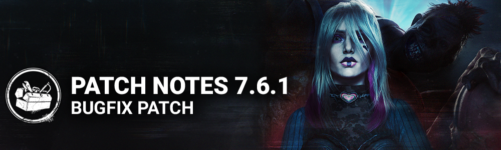

<!-- summary -->
## AI TL;DR

Twins killer returns to live play, the Hag’s egg add-ons receive increased Phantasm Trap durations (Cracked Turtle Egg +30%, Half Eggshell +25%, Powdered Eggshell +20%) and survivor bots now have slower, distance-scaled reaction times and limited vision penalties to aid new killers in custom matches. The patch also resolves numerous bugs: DLC cosmetics for the Unknown now apply retroactively, tutorial loadouts display correctly, lobby crashes, map geometry glitches on multiple locations, character movement issues for Charlotte and Oni, perk glitches for Endurance and Scourge Hook, UI button overlap, and a Switch outfit rendering bug. Known issue: Doctor’s Blood Shock outfit head texture distortion.
<!-- /summary -->

<!-- nav -->
&larr; [7.6.0 | All Things Wicked](437-7-6-0-all-things-wicked.md) · [Live](../../index.md#live) · [7.6.2 | Bugfix Patch](441-7-6-2-bugfix-patch.md) &rarr;
<!-- /nav -->

# 7.6.1 | Bugfix Patch

## Content

- Re-enabled the Twins Killer.

### Killer Updates

#### The Hag

**Add-ons:**

- **Cracked Turtle Egg:**
- Increases triggered Phantasm Trap duration by 30% *(was 20%).*
- **Half Eggshell:**
- Increases triggered Phantasm Trap duration by 25% *(was 15%).*
- **Powdered Eggshell:**
- Increases triggered Phantasm Trap duration by 20% *(was 10%).*

### Survivor Bots

#### Reaction Time

- In order to ease the learning of how to play Killers in Custom Matches, we have updated our Survivor Bots:
- Base reaction times are now randomized and slower on average
- Reaction time versus Powers now increases according to distance between Survivor Bot and Killer
- Reaction time versus Powers now increases when Survivor Bot does not see the Killer

## Bug Fixes

- The Unknown's DLC exclusive cosmetic is now correctly granted when purchasing the All Things Wicked Chapter (works retroactively).
- The correct loadout is now displayed in the tutorials tally screens.
- Fixed a rare issue where returning players might get stuck on game boot.
- Fixed an issue that could cause a crash in the lobby when having any Remix archive challenge selected.

### Audio

- Fixed an issue that caused some wheat plants to not trigger any SFX on Coldwind Farm's Fractured Cowshed map

### Environment/Maps

- Fixed an issue in Crotus Prenn Asylum where the The Trapper's Bear Traps would float above the ground in the shack.
- The Demogorgon is now correctly able to traverse the Upside Down when a Portal is placed in various parts of the theater in Greenville Square map.
- Fixed an issue in Mother's Dwelling where collision would prevent a proper navigation for both roles.
- Fixed an issue that caused a placeholder tile to spawn in Mother's Dwelling.
- Fixed an issue in Treatment Theatre where The Singularity's Biopods would not correctly attach to the walls.
- Fixed an issue where Victor could walk along stairs on Badham Preschool.
- Fixed an issue in Eyrie of Crows where a The Trapper could set his Trap under an object.
- Fixed an issue in Toba Landing where killers could land on top of objects.
- Fixed an issue that caused the Fragile Blood Basins to sometimes float in the air in multiple maps.

### Characters

- Fixed an issue that caused Charlotte's movement to rubberband after unbinding and recalling Victor.
- Fixed an issue that caused Charlotte's movement to be hindered for the rest of the trial after unbinding Victor two or more times.
- Fixed an issue that allowed the Oni to lunge attack while carrying a Survivor.
- Fixed an issue that caused the Unknown's hair to clip into the camera when hitting an object with the Rare and Very Rate heads equipped.

### Perks

- Endurance status effect no longer remains active when performing the Invocation: Weaving Spiders interaction.
- A Score Event is no longer missing upon completion of the Invocation: Weaving Spiders interaction.
- The Perk ''Scourge Hook: Floods of rage'' no longer fails to reveal the other Survivors auras when a Survivor self-unhooks on the Scourge Hook.

### UI

- Fixed an issue where the player could select another button behind the invitation widget while accepting or declining an invitation.
- Fixed the Archive Rift Pass Details text formatting.

### Platforms

- Fixed an issue that caused the Skull Merchant's Scarlet Vengeance outfit to be missing arms on Nintendo Switch.

## Known Issues

- The Doctor's Blood Shock outfit head has stretched textures during his lobby menu animation.

<!-- nav -->
&larr; [7.6.0 | All Things Wicked](437-7-6-0-all-things-wicked.md) · [Live](../../index.md#live) · [7.6.2 | Bugfix Patch](441-7-6-2-bugfix-patch.md) &rarr;
<!-- /nav -->
