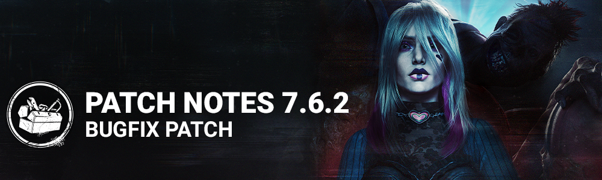

<!-- summary -->
## AI TL;DR

The Clown received reworked add-ons - Sticky Soda Bottle and Cheap Gin Bottle now increase Invigoration by 2% and 3% - and The Huntress saw her Leather Loop and Infantry Belt add-ons changed to grant 2% and 3% Haste for 5 seconds. The patch also addressed a wide range of bugs: killer animation and interaction quirks (The Unknown’s lunge, teleport vision, Spirit locker visibility, Cenobite healing, Good Guy hooking, Cannibal camera clipping, Doctor outfit texture), map placement and clipping issues in Underground Complex, Dead Dawg Saloon and Garden of Joy, a lingering audio jingle for Dwight’s pants, and an Epic-platform scoreboard grade visibility glitch.
<!-- /summary -->

<!-- nav -->
&larr; [7.6.1 | Bugfix Patch](439-7-6-1-bugfix-patch.md) · [Live](../../index.md#live) · [7.7.0 | Mid-Chapter](445-7-7-0-mid-chapter.md) &rarr;
<!-- /nav -->

# 7.6.2 | Bugfix Patch

## Content

### Killer Updates

#### The Clown

**Add-Ons:**

- **Sticky Soda Bottle:** Increases Invigoration's effect by 2% *(rework).*
- **Cheap Gin Bottle:** Increases Invigoration's effect by 3% *(rework).*

#### The Huntress

**Add-Ons:**

- **Leather Loop:** Hatchet hits grant 2% Haste for 5 seconds *(rework).*
- **Infantry Belt:** Hatchet hits grant 3% Haste for 5 seconds *(rework).*

## Bug Fixes

### Characters

- Fixed an issue that caused The Unknown's lunge to be shorter than other Killers.
- Fixed an issue that caused The Unknown to not see a black screen when teleporting to a Hallucination currently being interacted with by a Survivor.
- Fixed an issue that caused the Survivors to clip into the ground when locker interrupted by The Unknown.
- Fixed an issue that caused The Spirit to see hidden items on Survivors in lockers after phasing.
- Fixed an issue that caused The Cenobite's Power not to interrupt healing actions.
- Fixed an issue where the Survivor appeared to float and disappear when being hooked by The Good Guy.
- Fixed an issue that caused The Cannibal camera to clip and see through lockers or walls at the end of is chainsaw animation.
- Fixed an issue that caused a stretched texture on The Doctor's Blood Shock Outfit head during his lobby menu animation.

### Environment/Maps

- Fixed an issue in the Underground Complex where the placement of the hook in the portal room would not be accessible to the survivors.
- Fixed an issue in the Underground Complex where The Trapper could hide Bear Traps in rubble.
- Fixed issues where the salt circle would not appear properly in the basement.
- Fixed an issue where a chest or Killer items would clip in lockers or blockers in the Underground Complex.
- Fixed an issue in Dead Dawg Saloon where a Generator could not be repaired on one side.
- Fixed an issue in Garden of Joy where where the Dream Snare would be placed under the floor.

### Audio

- Fixed an issue that caused Dwight's 'Tight Tights' pants jingle sound to be heard by all players when rotating in the menus.

### Platforms

- Fixed an issue on Epic where some player's Grade could be visible in the Tally scoreboard under certain circumstances.

<!-- nav -->
&larr; [7.6.1 | Bugfix Patch](439-7-6-1-bugfix-patch.md) · [Live](../../index.md#live) · [7.7.0 | Mid-Chapter](445-7-7-0-mid-chapter.md) &rarr;
<!-- /nav -->
