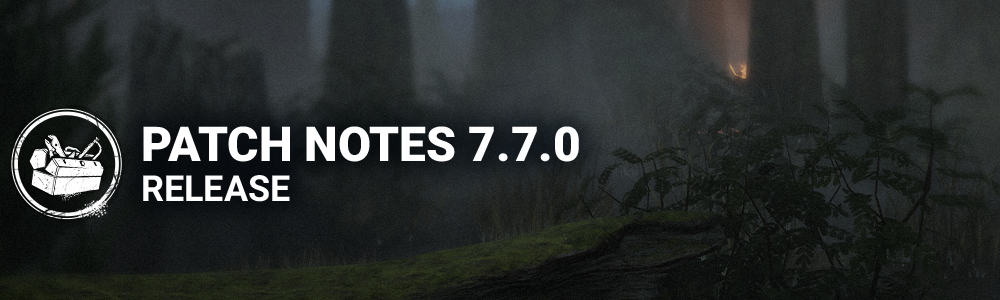

<!-- summary -->
## AI TL;DR

The update moves Dead by Daylight to Unreal Engine 5, trims about 18 GB from console installs and replaces the old store with a new layout featuring separate wardrobes for killers and survivors, weekly gifts, collections, bundles and preview tools for cosmetics, powers, perks and mori. Killer revisions include The Twins’ faster switch and recall times, new visual terror-radius cues, and a cooldown display, while The Blight receives improved collision detection. The Haddonfield - Lampkin Lane map is shortened and given new line-of-sight blockers, and perks Ultimate Weapon, Decisive Strike and Adrenaline are rebalanced. The remainder of the patch focuses on broad bug fixes—audio cues, character animations, map interactions, bot behavior, UI glitches and miscellaneous stability issues.
<!-- /summary -->

<!-- nav -->
&larr; [7.6.2 | Bugfix Patch](441-7-6-2-bugfix-patch.md) · [Live](../../index.md#live) · [7.7.0A | Bugfix Patch (Tentative Strobing Fix)](446-7-7-0a-bugfix-patch-tentative-strobing-fix.md) &rarr;
<!-- /nav -->

# 7.7.0 | Mid-Chapter

## Features

### Game Engine Update

- Game engine was updated to Unreal Engine 5. This update will have no effect on gameplay or in-game graphics and serves as a foundation for possible future improvements.
- Due to the engine update, overall game file size has been reduced by ~18Gb on Xbox Series S|X and PlayStation 5.

### New Store

- New Store available, replacing the previous one:
- Featured Page: Latest releases and Chapters, and the addition of the Weekly Gift feature.
- Weekly Gift: Allows players to claim free rewards during multiple weeks, if activated. Rewards are renewed per week, meaning that unclaimed ones are discarded when the week is reset.
- Specials Page: A dedicated page to show all special offers currently available in the game.
- Collections Page: Houses all Collections that exist in the game, and shows their content. Players can also unlock Cosmetics directly from there!
- Bundles Page: Showcases special bundles available for unlocking, Chapter bundles (previously known as DLC Chapters), and the new DLC Packs. Bundles can be opened to review their content before unlocking them, although not yet in the case of DLC Packs.
- Killer and Survivor dedicated Wardrobes: New separated independent pages for Killers and Survivors that allow for quick Mix and Matching of Characters and their Cosmetics.
- Mix and Matching specifics:
- Players can now select Characters and Cosmetics without having to equip them immediately.
- Clicking on an option allows players to preview the Character or Cosmetic.
- Selecting the Character or equipping the Cosmetic confirms their choice.
- Being able to preview allows players to preview pieces from different locked and unlocked Cosmetics, mix and matching options to be able to "try them out" before unlocking them.
- Players can now filter their Cosmetics with different options, and are able to show all options that are currently unavailable!
- Previewing Perks, Powers and Moris:
- Players now can open a little section that displays the Power and Perks of any Character that is currently selected, allowing for a smoother way to review and compare their Characters' gameplay.
- Players can now preview every Killer's Mori, including with the Mix and Match Outfits! This way players can check out how their Cosmetic choices are going to look during the Mori!
- Visceral Outfits are going to show their own version of their Character's Mori.
- Bio pages for Characters:
- These were made a part of the Characters' Wardrobes.
- They showcase the Characters' lore, height, speed and Terror Radius size. Power and Perks were moved to the Power and Perks window.
- Common:
- Unlocking is now done with a press and hold mechanic to allow for a confirmation process free of pop ups.
- The section for getting more Auric Cells can now be accessed through the Store, and it can also be accessed by clicking the Auric Cells counter on the top right corner of the screen.
- Kill switched options are going to be available for unlocking, yet we are making sure to communicate it with a pop up for players to confirm they still want to proceed.
- Search bars have been included in most sections to allow finding Characters, Collections, and Cosmetics easier.
- Added a celebration pop up to better communicate that players have unlocked content or earned a reward at the Store.
- Shrine of Secrets:
- The Shrine was taken out of the Store and placed in the Characters' lobbies, to be closer to the loadout and Bloodweb.
- The layout was updated to be easier to read and use, providing key information without the need to hover on any Perk option.

### Match's Details** **Menu

- The Match Details Menu now allow players to review Perks.
- During a match, when opening the Match Details window (Escape on computers), players can see their equipped Perks.
- Hovering on Perks and Offerings allow players to see the tooltips and read their description.

## Content

### The Archives

- Tome 19 "SPLENDOR" - Level 1 opens April 23rd at 11:00:00 AM Eastern Time.

### Killer Update - The Twins

- The Visual Terror Radius accessibility setting will now include Victor’s grunts. *(NEW)*
- Victor will now glow red whenever he is vulnerable to being crushed and white when he is not. *(NEW)*
- Charlotte can now recall Victor at any point while he is unbound. *(NEW)*
- A new icon has been added to indicate the moment when Victor can be recalled. *(NEW)*
- Decreased the time it takes to switch back to Charlotte to 1.5 seconds. *(was 3 seconds)*
- Decreased the time it takes to unbind Victor to 0.75 seconds. *(was 1 second)*
- Decreased the time it takes to charge Victor’s Pounce to 0.85 seconds. *(was 1 second)*
- Increased the cooldown for Victor to come back after being crushed to 10 seconds. *(was 6 seconds)*

**Add-Ons:**

- **Tiny Fingernail:**  
   Decreases Victor’s Unbind time by 33%. *(was 50%)*
- **Toy Sword:**  
   Decreases Pounce charge time by 10%. *(was 20%)*

**UX improvements**

- **Power Widget:**
- Victor's cooldown is now displayed.
- Cooldown is now displayed at a decreased opacity.
- Charlotte's Power icon updates to surface when recalling Victor is available.
- Charlottes Power icon updates to surface the correct input when recalling Victor is available.

### Killer Update - The Blight

- Improved collision detection to reduce cases where The Blight slides off objects.

**Add-Ons:**

- **Shredded Notes:** Decreases time to recharge a Rush token by 0.33 seconds. *(Removed downside)*
- **Summoning Stone:** Increases the initial Rush duration by 0.5 second. *(Rework)*
- **Soul Chemical:** Increases the initial Rush speed by 5%. *(Rework)*

**UX improvements**

- **Power Widget:**
- Cooldown is now displayed at a decreased opacity
- Cooldown now uses the consistent white colour
- Cooldown is now displayed per charge
- Rush duration is now surfaced
- Time to perform a new Rush is now surfaced

### Perk Updates

**Ultimate Weapon**

- Now activates for 15 seconds *(was 30 seconds).*
- Now reveals Survivor auras for 3 seconds instead of causing them to scream and show their position.
- Increased cooldown to 80/70/60 seconds *(was 40/35/30 seconds).*

**Decisive Strike**

- Increased the Stun duration to 5 seconds *(was 3 seconds).*

**Adrenaline**

- Burst of speed now lasts 3 seconds *(was 5 seconds).*
- Adrenaline no longer activates if you are hooked or carried when the Gates are powered.
- Adrenaline no longer causes you to wake up when facing The Nightmare.

### Environment/Maps

**Haddonfield - Lampkin Lane**

The map has been difficult for the players to enjoy. We made the decision to update it, prioritizing gameplay quality. The length of the street was reduced, line of sight blockers have been added in the street, removed any closed houses, reduced the amount of tiles in the map, added gameplay and blockers on the border tiles. added openings in the main house to improve the navigation and the gameplay. and the park tiles have also been revisited.

### Gameplay Mechanics

- The Generator Damage interaction has been reviewed so that the Generator is actually damaged closer to the point where the hit lands to prevent letting go of the input early.

### Emblems

- It is no longer possible to lose a pip after a match.

## Bug Fixes

### Audio

- Fixed an issue that caused the Survivors to hear the Territorial Imperative Perk audio cue.
- Fixed an issue that caused dead Survivors to be moaning after a Mori.
- Fixed an issue that caused Pod breaking SFX being heard by the Killer at any distance.

### Archives

- Fixed an issue that prevented aura-reading related Challenges to not track progress properly, for example Caleb's Watchful Eye Master Challenge.
- Fixed an issue that prevented The Dredge gaining progress on Challenges that required downing Survivors if the Survivor was grabbed during a locker teleportation interaction.
- Fixed an issue that prevented The Hillbilly from gaining progress for the Blood Runner Master Challenge.
- Fixed an issue where the Amateur Ornithologist Challenge would not award the correct amount of progress when startling a murder of crows in affected Realms.
- Fixed an issue that caused the Botanist Extraordinaire and Here For You Challenges not to gain progress when healing from the Dying State.

### Characters

- Fixed an issue that caused The Trickster's vault animation through a window to jitter.
- Fixed an issue that caused the male Survivor's flashlight aim to be lower than before.
- Fixed an issue that caused Survivors to have to aim higher than Victor’s head to blind it.
- Fixed an issue that caused the Exit Gate Entity spikes to disappear if Victor leaps on a Survivor near the Exit Gate while Charlotte is also near.
- Fixed an issue that caused the Killer Instinct aura to show during The Twins Mori if Victor is nearby.
- Fixed an issue that caused Victor and The Nemesis' Zombies to not be destroyed by the Head On Perk.
- Fixed an issue that caused the Punishment score event to be granted when hitting a hooked Survivor with the Punishment of the Damned attack.
- Fixed an issue that caused Bear Traps to float when placed under Survivors.
- Fixed an issue that caused Killers to play the normal vault animation and start falling too early when vaulting into a drop.
- Fixed an issue that caused Killers to fail to be Blinded by Firecrackers and Flashbangs when a downed Survivor is in front of the Killer.

### Environment/Maps

- Fixed an issue with the Crashed Bus where the Characters could not vault.
- Fixed an issue with the Shack on Greenville Square where the Killer could hit through a visual blocker.
- Fixed an issue in Lampkin Lane where the Zombies of The Nemesis could not navigate part of the map.
- Fixed an issue that caused Bear Traps to clip inside a rock on the hill in Coldwind Farm maps.

### Bots

- The Knight's Guards will no longer get stuck on stairs.
- Bots can now activate the Plot Twist Perk
- Fixed an issue where bots were unable to interact with some Hex Totems in Léry's Memorial Institute and Midwich Elementary School

### Perks

- Fixed an issue that caused the Scourge Hook: Gift of Pain Perk to fail to apply more than once.

### UI

- Fixed an issue where Killers could see a random Grade displayed in their scoreboard in the tally screen.
- Fixed an issue where the scale of the reward tooltip was not applied properly according to the option.
- Fixed an issue where the search result of friends cannot be scrolled with a Controller.

### Misc

- Fixed an issue where players would not disconnect from their party when closing the game.
- Fixed an issue where players could not block other players.
- Fixed an issue that could cause Survivors to be unable to unhook after cancelling an unhook interaction.
- Fixed an issue that could cause Survivors to become unhookable if they had previously unhooked themselves just before reaching the struggle stage.

## Known Issues

- The "i" button that opens up the selected Character's lore is removed. This information will be again available in a future update:
- Lore is still accessible through the Store, using the "Bio" subtab on Characters' wardrobes
- Charles Lee Ray is sometimes invisible to some players POV.
- Victor can sometimes not be crushed by pallets.
- Due to the internal engine changes, update download size is bigger than usual, since the game needs to be re-downloaded.

## Public Test Build (PTB) Adjustments

### General Updates

- Reverted the unhook interaction to being cancellable.

### Killer Updates - The Twins

- Reverted most of the changes that were on the PTB, except the quality of life changes listed above.

**Add-Ons:**

- **Rusted Needle:**  
   Crushing Victor when attached inflicts Hemorrhage until healed. *(Reverted)*
- **Sewer Sludge:**  
   Increases time to crush Victor when attached by 2 seconds. *(Reverted)*
- **Silencing Cloth:** Charlotte gains Undetectable for 20 seconds after waking from her dormant state. *(Reverted)*
- **Weighty Rattle:**  
   Crushing Victor when attached inflicts Broken for 20 seconds. *(Reverted)*
- **Iridescent Pendant:**  
   Crushing Victor while he is dormant inflicts Exposed for 45 seconds. *(Reverted)*

### Killer Updates - The Blight

**Add-Ons:**

- **Summoning Stone:** Increases the initial Rush duration by 0.5 second. *(was 1 second)*
- **Soul Chemical:** Increases the initial Rush speed by 5%. *(was 10%)*

### Perk Updates

**Decisive Strike**

- Removed the new stabbing animation.

### Bug Fixes

- Fixed an issue that caused Killers to bypass the Decisive Strike stun by immediately dropping Survivors.
- Fixed an issue that caused the pallet break effects to play several times when pulling down a Dream Pallet.
- Fixed an issue that caused Charles Lee Ray to be invisible during multiple interactions.
- Fixed an issue that caused The Twin's Silencing Cloth Add-On not to grant undetectable when Victor is crushed stunned by any means.
- Fixed an issue that caused a discrepancy between male and female Survivor running vault distances.
- Fixed an issue that caused Survivors animation to stop playing during the Naughty Bear's Mori.
- Fixed an issue that caused The Blight's legs to face the wrong direction when moving during the inject animation.
- Fixed an issue that could cause a crash when quitting the game.
- ⁠Missing a healing skill check then cancelling the heal no longer causes the healing animation to loop indefinitely.
- The Dead Hard perk no longer causes Survivors to A-Pose during the special animation run when activated.
- The Dramaturgy Perk no longer causes Survivors to A-Pose during the high-knee run when activated.

<!-- nav -->
&larr; [7.6.2 | Bugfix Patch](441-7-6-2-bugfix-patch.md) · [Live](../../index.md#live) · [7.7.0A | Bugfix Patch (Tentative Strobing Fix)](446-7-7-0a-bugfix-patch-tentative-strobing-fix.md) &rarr;
<!-- /nav -->
