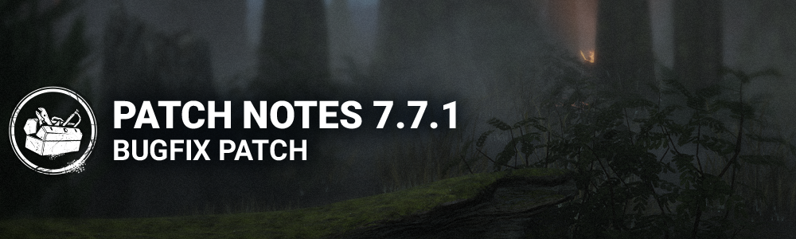

<!-- summary -->
## AI TL;DR

The Chaos Shuffle modifier launches on May 16 at 11:00 AM ET, accompanied by an event tome, and the Ultimate Weapon perk is reworked to make survivors within 32 m of a locker scream, expose their position and suffer 30 seconds of blindness. The update is otherwise a comprehensive bug-fix pass, addressing audio glitches in Mori previews, numerous character issues (Victor’s recall timer, latch restrictions and glow indicator, Xenomorph tail attacks, Nurse pallet-stun immunity, Legion hand animation), UI prompt overlaps, map collision and object-placement problems on most locations, stray visual flashes, and minor perk, store and equipment auto-equip bugs.
<!-- /summary -->

<!-- nav -->
&larr; [7.7.0A | Bugfix Patch (Tentative Strobing Fix)](446-7-7-0a-bugfix-patch-tentative-strobing-fix.md) · [Live](../../index.md#live) · [8.0.0 | Dungeons & Dragons](452-8-0-0-dungeons-dragons.md) &rarr;
<!-- /nav -->

# 7.7.1 | Bugfix Patch

## Content

### Modifiers

- Modifier: Chaos Shuffle opens at May 16th at 11:00:00 AM Eastern Time.
  - This Modifier also features an event tome, opening at the same time.

### Perk Updates

**Ultimate Weapon**

- Now causes Survivors within 32 meters of the locker to scream and show their position *(was based on the Killer's position)* then gain Blindness for 30 seconds (as before).

## Bug Fixes

### Audio

- Fixed an issue that caused sound issues in the Mori Preview after previewing The Nightmare or the Wraith.
- Fixed an issue that caused Naughty Bear to have overlapping voice lines in the Mori Preview.
- Fixed an issue that caused the Huntress Inhuman Brute cosmetic sounds to be too low.

### Characters

- **Potential fix for an issue that caused rubber-banding when moving.**
- **Fixed an issue that caused a stutter at the end of several interactions.**
- Fixed an issue which allowed Victor to be recalled sooner than 30 seconds after latching onto a Survivor.
- Victor now glows red after downing an injured Survivor with a Pounce attack, properly indicating he can be Crushed.
- Victor can no longer latch on to survivors with the Endurance status effect.
- Fixed an issue that caused Victor to be unable to move after switching to Victor while a Bot is crushing him.
- Fixed an issue that may cause Survivors to be unable to wiggle out when a Hook interaction is denied by the server.
- Fixed an issue that caused The Xenomorph to be unable to hit a Survivor placing a turret with their tail attack.
- Fixed an issue that caused The Nurse to not be affected by pallet stuns.
- Fixed an issue that caused the Survivors' left arm to jitters when in downed state
- Fixed an issue that caused The Legion's post-Frenzy hand to snaps upwards before entering the self-stun animation.
- Fixed an issue which caused some DLC characters to be unavailable for Nintendo Switch players.

### Perks

- **Toolboxes now properly lose charge when used to charge the Potential Energy perk.**

### UI

- Fixed an issue when going back to the Main Menu from a "Play as Killer" offline Lobby causing the bottom button prompts to overlap.
- Fixed an issue in the Killer tutorial where two prompts could sometimes overlap.
- Fixed an issue in the Archives where the menu became invisible after watching a Journal's Entry cinematic.
- Fixed an issue where the Killer name would be missing from the daily ritual "The Hunt Ritual"

### Environment/Maps

- Fixed an issue in the Nostromo map where the Nurse could blink and get stuck in the hull of the Spaceship
- Fixed an issue where The Blight didn't bounce of wall properly in the Raccoon PD map
- Fixed an issue in Greenville Square where the traps could be placed under the ground next to the shack window
- Fixed an issue in Shattered Square where both pallets of the main building would spawn at the same time
- Fixed an issue in the RPD where the survivors could land on top of a door frame
- Fixed an issue in Lery's Hospital where the killer could not interrupt a survivor from one side of a generator
- Fixed an issue in Autohaven Wreckers where Victor could jump though a sheet of metal in the shack
- **Fixed an issue in Greenville Square where the double pallet tile didn't spawn**
- Fixed an issue that may cause Meg to be unable to unhook Dwight during the Survivor Tutorial.
- Fixed an issue in Dead Dawg Saloon where the player camera could clip into a rock
- Fixed an issue in Coldwind Farms where the Cow Tree's vault tarp was missing
- Fixed an issue in Crotus Prenn Asylum where Trapper could hide beartraps inside the rocky edge of the hill
- Fixed an issue in Eyrie of Crows where Trapper could hide beartraps inside some roots at the stone gazebo
- **Fixed an issue in Hawkins Laboratory where superfluous collisions were affecting player navigation near some closed doors and causing rubber-banding**
- Fixed an issue in Hawkins Laboratory where players could hide items in the floor near the storage room doors
- Fixed an issue in Haddonfield where players would collide with the car mirrors and experience frustrating navigation issues
- Fixed an issue in Haddonfield where the End-Game Collapse Cracks would appear on the ceiling of the balcony from one of the large houses
- Fixed an issue in Midwich Elementary School where Killers' vision could clip into a destroyed wall and see outside of the map
- Fixed an issue in Raccoon City Police Department West Wing where Trapper could hide beartraps inside a pile of debris in the library
- Fixed an issue in Raccoon City Police Department where players could climb on top of a duffle bag
- Fixed an issue in Raccoon City Police Department East Wing where players could climb onto the toilets
- Fixed an issue in Toba's Landing where the central computer console from the main base was popping with distance

### Graphics

- **Fixed an issue that caused bright flashes in the basement and in the end game screen.**

### Store

- Fix: Auric Cell Offers cards now can be clicked entirely without players needing to click on the button.

### Misc

- Fixed an issue where items and add-ons would not get equipped automatically after previously running out of them

<!-- nav -->
&larr; [7.7.0A | Bugfix Patch (Tentative Strobing Fix)](446-7-7-0a-bugfix-patch-tentative-strobing-fix.md) · [Live](../../index.md#live) · [8.0.0 | Dungeons & Dragons](452-8-0-0-dungeons-dragons.md) &rarr;
<!-- /nav -->
