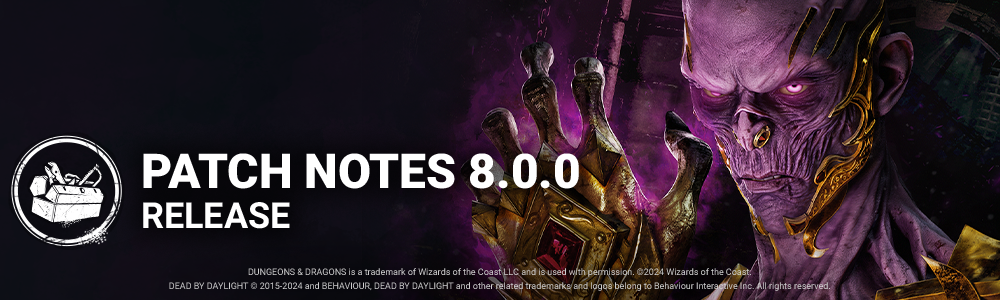

<!-- nav -->
&larr; [7.7.1 | Bugfix Patch](447-7-7-1-bugfix-patch.md) · [Live](../../index.md#live) · [8.0.1 | Bugfix Patch](453-8-0-1-bugfix-patch.md) &rarr;
<!-- /nav -->

# 8.0.0 | Dungeons & Dragons

**Content**

**New Survivor - Aestri Yazar**

**New Survivor Perks**

- **Mirrored Illusion**This perk activates after completing a total of **50%** worth of repair progress on generators.  
   Press the ability button 2 when next to a totem, chest, generator or exit gate to spawn a static illusion that lasts for **100/110/120 seconds.**Then, the perk deactivates.
- **Bardic Inspiration**Press the ability button 1 while standing and motionless to enter the "performance" interaction that lasts up to **15 seconds**and empowers Survivors within **16 meters.** Roll a d20. This effect lasts for **90 seconds** if the performance is completed.  
   When the ability is cancelled or the performance completes, it goes on cooldown for **110/100/90 seconds.  
   1**| You scream, but nothing happens  
  **2-10**| skill checks give +1% progress  
  **11-19**| skill checks give +2% progress  
  **20** | skill checks give +3% progress
- **Still Sight**After standing still for **6/5/4 seconds,** this perk activates.  
   Until you start moving, you see the aura of the Killer as well as all generators and chests within **24 meters**.

## New Killer - The Lich

### Killer Power

Bound with the skin and flesh of men, the Book is packed with spells both forbidden and wicked.  
 To select a Spell, hold the Ability Button to open the Spell selection. The Lich has access to 4 different Spells:

- Mage Hand: Creates a magical hand that lifts a downed pallet or blocks an upright pallet for 4 seconds.
- Flight of the Damned: Conjures 5 flying spectral entities that can pass through obstacles and injure Survivors.
- Dispelling Sphere: Casts a moving invisible sphere that reveals Survivors and temporarily disables their Magic Items.
- Fly: Gain a flying speed for a short period of time, allowing you to travel a long distance quickly and move over vaults and pallets.

**SPECIAL ITEM: MAGIC ITEMS**

Treasure Chests found around the map can contain Magic Items. Each Survivor can equip up to two Magic Items at once: one pair of Boots and one pair of Gauntlets. These Magic Items are each connected to a specific Spell, and activate when The Lich casts that spell.

- Boots/Gauntlets of the Interloper: The Survivor sees the aura of pallets affected by Mage Hand and gains Haste for 3 seconds.
- Boots/Gauntlets of the Nightwatch: The Survivor can see the auras of the spectral entities conjured by Flight of the Damned.
- Boots/Gauntlets of the Archivist: The Survivor can see the Dispelling Sphere.
- Boots/Gauntlets of the Skyguard: The Survivor can see The Lich's aura during Fly and for a few seconds after.

**SPECIAL ITEMS: HAND & EYE OF VECNA**

Rarely, Survivors can instead find the Hand or Eye of Vecna in a Treasure Chest. When picked up and used, Survivors gain a special ability while at full health. Using one of these special abilities costs the Survivor a health state and reveals their location with Killer Instinct for 3 seconds.

- Hand of Vecna: When doing a Fast Locker Entry, the Survivor is teleported to a further locker.
- Eye of Vecna: When doing a Fast Locker Exit, the Survivor cannot be seen by The Lich and gains Haste for 15 seconds.

### New Killer Perks

- **Weave Attunement**When any item becomes depleted for the first time each match, it is dropped. You see the auras of dropped items.  
   Survivors within **12 meters** of dropped items have their auras revealed to you.  
   When a Survivor picks up a Survivor item, they suffer the Oblivious status effect for **20/25/30 seconds.*Oblivious prevents Survivors from hearing or being affected by the Killer's Terror Radius.*
- **Languid Touch**When a Survivor within **36 meters** of you scares a crow, they gain the Exhausted status effect for **6/8/10 seconds.**This perk has a **20-second** cooldown.  
  *Exhausted prevents Survivors from activating exhausting perks.*
- **Dark Arrogance**Increases the duration you are blinded and the duration of pallet stuns by **25%.**Increases regular vault speed by **15/20/25%.**

## New Map - Forgotten Ruins

Pulled from the memories of alchemists, warriors, storytellers, and criminals, the Forgotten Ruins is an amalgamation of hidden knowledge and dark secrets. How many have wandered this dead terrain, unaware of what lurked beneath their feet? And how many more ventured down to the bottom of that decaying staircase, only to succumb to what awaited them?

## Killer Perk Updates

- **Deadlock**Decreased the block duration to 15/20/25 seconds. *(was 20/25/30 seconds)*
- **Grim Embrace**  
   Decreased the block duration before reaching 4 tokens to 6/8/10 seconds. *(was 8/10/12 seconds)*
- **Pop Goes the Weasel**  
   Decreased the amount of progress lost to 20%. *(was 30%)*
- **Scourge Hook: Pain Resonance**  
   Decreased the amount of progress lost to 10/15/20%. *(was 15/20/25%)*

## Survivor Perk Updates

- **Background Player**Decreased the movement speed bonus to 150%. *(was 200%)*Decreased the Exhaustion duration to 30/25/20 seconds. *(was 60/50/40 seconds)*
- **Buckle Up**Both you and the healed Survivor gain Endurance for 6/8/10 seconds. (*Removed)*The healed Survivor breaks  
   into a sprint at 150% of their normal Running Movement speed for 3/4/5   
   seconds and leaves no scratch marks during this time. *(New functionality)*
- **Invocation: Weaving Spiders**  
   Decreased the time it takes to complete the Invocation to 60 seconds. *(was 120 seconds)*Increased the time it takes for an Invocation to completely regress to 90 seconds. *(was 6 seconds)*
- **Decisive Strike**Decreased the stun duration to 4 seconds. *(was 5 seconds)*

## Killer Updates

### The Blight - Addons

- **Compound Thirty-Three**Rush tokens are capped at 5. *(was 3)*Increases Rush turn rate by 11%. *(was 33%)*Increases Rush duration by 11%. *(was 33%)*
- **Iridescent Blight Tag**  
   Increases Rush speed by 10%. *(was 20%)*

### The Cannibal - Basekit

- Decreased the obstruction collision size while using the Chainsaw to 10 cm.*(was 17.5 cm)*
- Decreased the base Tantrum duration to 3 seconds. *(was 5 seconds)*
- Increased the base Chainsaw Sweep duration to 2.5 seconds. *(was 2 seconds)*
- Increased the base Chainsaw Sweep movement speed to 5.35 m/s. *(was 5.29 m/s)*

### The Cannibal - Addons

- **Award-Winning Chili**Increases maximum Chainsaw Sweep duration by 0.2 seconds per charge spent. *(was 0.5 seconds)*
- **Chainsaw File**Decreases tantrum duration by 0.25 seconds. *(was 0.5 seconds)*
- **Chili**Increases maximum Chainsaw Sweep duration by 0.15 seconds per charge spent.*(was 0.25 seconds)*
- **Homemade Muffler**Decreases tantrum duration by 0.5 seconds. *(was 1 second)*
- **Knife Scratches**Increases Chainsaw Sweep movement speed by 1.5%. *(was 2%)*Increases time required to charge the Chainsaw by 10%. *(was 12%)*
- **The Beast's Marks**Increases Chainsaw Sweep movement speed by 2%.*(was 3%)*Increases time required to charge the Chainsaw by 12%. *(was 14%)*

### The Deathslinger - Basekit

- Decreased the stun duration when a Survivor breaks free to 2.7 seconds. *(was 3 seconds)*
- Increased the reel speed to 2.76 m/s. *(was 2.6 m/s)*
- Increased movement speed while reloading to 3.08 m/s. *(was 2.64 m/s)*

### The Deathslinger - Addons

- **Bayshore's Cigar**Decreases the stun duration when Survivors break free by 0.75 seconds. *(was 1 second)*
- **Bayshore's Gold Tooth**Increases the Speargun's reeling speed by 5%. *(was 9%)*
- **Chewing Tobacco**Decreases the stun duration when Survivors break free by 0.25 seconds. *(was 0.5 seconds)*
- **Snake Oil**Increases the Speargun's reeling speed by 2.5%. *(was 5%)*

### The Mastermind - Basekit

- Decreased the Hindered penalty when reaching maximum infection to 4%. *(was 8%)*
- The Uroboros infection now resets to 1% upon being hooked. *(was 50%)*

### The Good Guy - Basekit

- Scamper is now only available while performing a Slice & Dice.
- Hidey-Ho Mode cooldown reduced to 12 seconds. *(was 18 seconds)*
- Scamper time reduced to 1.3 seconds.*(was 1.4 seconds)*
- Added a 1 second cooldown after cancelling a Slice & Dice charge up.

### The Good Guy - Addons

- **Strobing Light**  
   Decreases Terror Radius by 8m when Hidey-Ho Mode is in cooldown. *(was 4m)*
- **Pile of Nails**  
   Upon manually exiting Hidey-Ho Mode, Chucky remain Undetectable for 3 seconds. *(was 5 seconds)*
- **Yardstick**  
   Performing a Scamper reveals Survivor auras within 16 m distance for 3seconds. *(was 12m / 5 seconds)*
- **Hard Hat**  
   Removed "and exits Hidey-Ho Mode." from description.

## Toolbox Updates

- **Toolbox**Increases sabotage speed by 15%. *(was 10%)*
- **Mechanic's Toolbox**Increases sabotage speed by 25%. *(was 10%)*
- **Commodious Toolbox**Increases sabotage speed by 50%.*(New functionality)*
- **Engineer's Toolbox**Increases sabotage speed by 10%. *(was Decreases by 25%)*
- **Alex's Toolbox**18 charges. *(was 24 charges)*Increases sabotage speed by 100%. *(was 50%)*
- **Festive Toolbox**Increases sabotage speed by 50%. *(New functionality)*
- **Anniversary Toolbox**Increases sabotage speed by 50%.*(New functionality)*
- **Masquerade Toolbox**Increases sabotage speed by 50%.*(New functionality)*

**Toolbox Addons**

- **Cutting Wire**Increases the Toolbox's sabotage speed by 20%. *(was 15%)*
- **Grip Wrench**Hooks sabotaged using the Toolbox take an extra 20 seconds to respawn.*(was 15 seconds)*
- **Hacksaw**  
   Increases the Toolbox's sabotage speed by 30%. *(was 20%)*

## Events & Archives

- The Twisted Masquerade event begins June 13th at 11:00 am ET.
- The Twisted Masquerade event tome also opens June 13th at 11:00 am ET.

## Map Updates

### Decimated Borgo Realm Update

The red lighting was a big issue in the realm of The Decimated Borgo. The art and lighting team took care to make the realm more accessible to all players and bring a different ambiance to the maps.

**Features**

## UX

- **Started adding search tags for Charms**Only "Perks" and "Birds" for the moment.
- **New Item Preview Window**Regular and Special Items will now display a short description of their effect inside a Trial by using a new item previewer window.

**Bug Fixes**

## Archives

- Fixed an issue that affected Archives challenges which required the Killer to complete a Trial with no more than X Survivors living to update their progress incorrectly during a match. It now correctly updates throughout the match as each Survivor dies.
- Fixed an issue that prevented the Archives challenge progress notification to display in the Match Results screen if the challenge was already   
   completed before entering another trial.

## Bots

- The names of the Bots that appear following a player disconnection have been corrected.

## Characters

- Fixed an issue that caused some survivors to stop playing their idle animation when equipped with an item in the lobby.
- Fixed an issue that caused Survivor to be misaligned with The Ghost Face during a vault interruption.
- Fixed an issue that caused the Male Survivors to be misaligned when Naughty Bear picks them up.
- Fixed an issue that caused the chains from the Cenobites portals not to be dismissed when the Cenobite teleports to a Survivor solving the box.
- Fixed an issue that caused a crosshair to be briefly visible in the middle of the screen when unbinding Victor as the Twins.
- Fixed an issue that caused Victor to briefly appear on Charlottes head in the tally screen when playing as the Twins.
- Fixed an issue that caused the Plague's Vile and Corrupt Purge animation to continue playing after the interaction has ended.
- Fixed an issue that caused the Cannibal to be missing the Tantrum animation from the Killer POV when not extending the Chainsaw Sweep.
- Fixed an issue that caused the Cannibal to be missing the Tantrum animation after bumping into an asset.
- Fixed a crash that could sometimes happen when playing against killers with a lullaby

## Environment/Maps

- Fixed an issue that caused items to slightly float on the Ferry Boat in the Pale Rose map.
- Fixed an issue that prevented the Killer from interrupting Survivors performing the Invocation interaction from specific spots.
- Fixed an issue in Raccoon City Police Station where the Nurse can blink out bound

## Platforms

- Fixed an issue with input bindings for players on the Windows Store.
- Haptic Feedback has been fixed on PlayStation.

## UI

- Changing presets in the Loadout Menu will no longer rotate the character due to different charm layouts.
- Fixed an issue where the survivor offerings' order is inconsistent in the match details
- Fixed a crash issue that could occur in the search bar
- Fixed a crash issue that could occur while reporting another player
- Fixed an issue where the perk's description is not displayed properly in the Tally Scoreboard on the Switch
- Fixed an issue where the owned tag is shown on customization items in the Rift
- Fixed an issue where a tooltip was not displayed on the disabled button in the lobby

## Misc

- Bloodwebs with kill-switched items should no longer be possible.
- Fixed a crash that could occur while in a Trial when gaining Bloodpoints.
- Fixed a crash that could occur while loading between the Play as Survivor lobby and the pre-Trial lobby.
- Fixed an issue that VFX to misalign with the Spirit's body during the Mori preview with the Blazing Lineage outfit.

**Public Test Build (PTB) Adjustments**

## New Killer - The Lich

- Survivor activating the effect of a Vecna Item suffers from Broken Status effect for 30 seconds.
- Decreasing the Spell charge time of all Spells from 0.33 seconds to 0.2 seconds.
- Increased all Spell charges movement speed from 3.68 m/s to 4.0 m/s.
- Increased duration of the Fly spell from 3.5 seconds to 4.0 seconds.
- Killer gains back collision with Survivors at the start of the end of Fly sequence.
- Slightly Increased ground friction and controls at the end of Fly to diminish the sliding effect.
- Reduced the FOTD Projectiles spawns from 1.0 seconds to 0.5 seconds.
- Increased the FOTD Projectiles movement speed from 8.0 m/s to 9.0 m/s.
- Increased FOTD Activation cooldown movement Speed from 2.3 m/s to 3.68 m/s.
- Increased Dispelling Sphere active time from 20 seconds. to 25 seconds.
- Increased Dispelling Sphere movement speed from 4.2 m/s to 5.5m/s.
- Increased Dispelling Sphere Activation cooldown movement Speed from 2.3m/s to 3.68m/s.
- Increased Mage Hand Activation cooldown movement Speed from 2.3m/s to 3.68m/s.
- Decreased Mage Hand time to lift a pallet from 0.5 seconds to 0.35 seconds.
- Decreased all Spell Cooldown from 50 seconds to 38 seconds.
- Decreased all Magic Items default Reveal Killer aura from 3.0 to 1.5 seconds.

**Addons**

- Addon Raven's Feather Decreased duration of the Fly spell from 1 second. to 0.5 seconds.
- Addon Trickster's Glove: Decreased Mage Hand holds pallet time from 1 seconds to 0.5 seconds.
- Addon Crystal Ball: Increased the duration of Killer instinct from 1.5 seconds to 3.0 seconds.
- Addon Potion of Speed: Decreases the period where you cannot attack after casting Fly from 0.5 seconds to 0.35 seconds.
- Addon Ring of Telekinesis Decreased the lift speed from 50% to 35%
- Addon Ring of Spell Storing Decreased the cooldown reduction of all spells from 5 seconds to 4 seconds.
- Addon Robe of Eyes Decreased distance detection from 8M to 6M.
- Addon Dragontooth Dagger Increased Haemorrhage and Mangled Status Effects from 30 seconds to 45 seconds.
- Addon Cloak of Invisibility Decreased the Undetectable time from 12 seconds to 10 seconds.
- Addon Vorpal Sword: Decreased the Broken status effect from 60 seconds to 30 seconds.

**Score Events**

- Violent Caster Increased from 100 to 300 Bloodpoints
- Spectral Smash Increased from 500 to 600 Bloodpoints

## New Killer Perks

**Weave Attunement**

- Aura reveal distance increased from 8 meters to 12 meters of dropped items.

**Dark Arrogance**

- Vault speed increase updated from 16/18/20% to 15/20/25%.

## New Survivor Perks

**Bardic Inspiration**

- Buff now lasts 90 seconds instead of 60 and goes on cooldown for 110/100/90 seconds instead of 80/70/60.
- Duration of buff is now shown on the external perk icon.

**Still Sight**

- Aura reveal distance increased from 18 meters to 24 meters.

## Killer Updates

### The Blight - Addons

- **Compound Thirty-Three**Rush tokens are capped at 5. *(was 3)*

## Archives

- The current challenge progression will now pop on the side of the Tally   
   screen at the end of every game, even if there was no progress on the   
   selected challenge.

## Bots

- Bots can now use the Mirrored Illusion Perk correctly.
- Bots no longer magically see The Lich's Dispelling Sphere without an appropriate Magic Item.
- Bots should be less likely to stop mid-chase while thinking of options.
- Fixed multiple crashes that could occur due to playing with Bots.
- Duplicates of characters replaced by Bots should no longer appear in the Tally screen.

## Bug Fixes

**The Lich**

- Fixed an issue that caused The Lich to lose collision with Survivors while selecting or charging spells.
- Fixed an issue that caused The Lich to lose collision with Survivors during the Fly spell.
- Fixed an issue that caused The Lich to lose collision with crouching Survivors after using the Fly spell.
- Fixed an issue that caused The Lich to potentially get stuck if the Fly spell ends on top of a vault.
- Fixed an issue that caused The Lich to be unable to avoid being flashlight   
   blinded after having used Fly or the Flight of the Damned spells.
- Fixed an issue that caused The Lich's spells to display in active cooldown on  
   the spell selection screen when quickly cancelling any spell cast.
- Fixed an issue that caused Survivors to remain stuck in the grab animation for a few seconds after being interrupted during the Mimic chest escape interaction.
- Fixed an issue that caused the dispelling sphere loop SFX to be too loud on the survivor and killer perspective.
- Fixed an issue that caused blood burst VFX to appear at the feet of male survivors when attuning to the Eye of Vecna.
- Fixed an issue that caused the Magic Items to lack a dissolve VFX.
- Fixed an issue that caused the Vecna Items to lack a dissolve VFX.
- Fixed an issue that caused the Spell Indicator VFX invisibility or to remain dimly lit during and after the first Cooldowns.
- Fixed an issue that caused the Lich's motion trail VFX offset during multiple actions.
- Fixed an issue that caused the Eye of Vecna Invisibility Locker Smoke VFX to be only visible for the Survivor fast-exiting the Locker.
- Fixed an issue that caused the blood drip VFX for The Lich's wipe animation to offset.
- The Lich no longer speeds up briefly when casting Flight of the Damned or Dispelling Orb
- The Lich's Flight of the Damned collision hitbox is now correctly lowered while using the Iridescent Book of Vile Darkness addon

**Perks**

- Fixed an issue that caused the Bardic Inspiration music to play indefinitely when falling the dice roll.
- Fixed an issue that caused the Bardic Inspiration perk animation to continue when a Survivor is downed during the interaction.
- Fixed an issue that caused Mirrored Illusion husk dissolution smoke VFX to remain longer than intended.
- Fixed an issue that caused Survivors' auras to be revealed when swapping a handheld item with an item inside a chest when the Killer had the Weaved Attunement perk.
- Fixed an issue that caused the Weave Attunement external perk icon not to be displayed.
- Fixed an issue that caused the Languid Touch external perk icon not to be displayed.

**Misc**

- Buying multiple characters too fast should no longer crash the game.
- Fixed an issue that caused smoke flickering on pallets in the Forgotten Ruins map.
- Fixed an issue that caused trap Killers to be unable to use their powers at the entrance of the main building in the Forgotten Ruins map.
- Fixed an issue that caused Victor's SFX to keep looping after a Survivor shoves open a locker blocked by Victor when playing against the Twins.
- Fixed an issue that caused the Dredge and a Survivor to get stuck in a locker if another Survivor tried to hide in the same locker before the Dredge teleported.
- Fixed an issue that caused The Good Guy to be able to Scamper window vaults while in Hidey-Ho Mode.
- Fixed a crash that could occur when using Decisive Strike.
- Fixed a crash that could occur when playing the Tutorial matches.
- Survivors are now able to correctly blind the Unknown with a Flashlight.

<!-- nav -->
&larr; [7.7.1 | Bugfix Patch](447-7-7-1-bugfix-patch.md) · [Live](../../index.md#live) · [8.0.1 | Bugfix Patch](453-8-0-1-bugfix-patch.md) &rarr;
<!-- /nav -->
