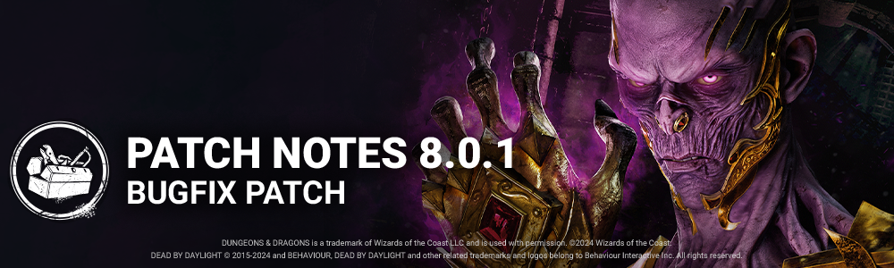

<!-- summary -->
## AI TL;DR

Good Guy’s Power Drill and Automatic Screwdriver add-ons now reduce Hidey-Ho cooldown by 10% and 8% respectively after a Slice & Dice hit, instead of the previous higher values, while a temporary power-recharge bug is noted. A new graphics setting lets players choose full-size or reduced item previews during matches.

The patch also fixes audio (The Legion’s outfit voice), bot interactions, numerous character animation and clipping problems (including The Pig, The Onryo, The Twins, Blight and Lich VFX), map loading and collision issues on several maps, perk icon and illusion bugs, a PS4 startup black-screen, subtitle playback in cinematics, and UI quirks like the Flame Turret info display. Known issue: Archives progress widget remains hidden for certain challenges.
<!-- /summary -->

<!-- nav -->
&larr; [8.0.0 | Dungeons & Dragons](452-8-0-0-dungeons-dragons.md) · [Live](../../index.md#live) · [8.0.2 | Bugfix Patch](454-8-0-2-bugfix-patch.md) &rarr;
<!-- /nav -->

# 8.0.1 | Bugfix Patch

## Content

### The Good Guy - Addons

- **Power Drill**Hidey-Ho Mode **cooldown reduced by 10% after hitting a Survivor with Slice & Dice.*(was 15%)***
- **Automatic Screwdriver**Missing a Slice & Dice **reduces Hidey-Ho Cooldown by 8%.*(was 10%)***

*Dev note: Currently, The Good Guy's Power incorrectly starts to recharge as soon as the Slice & Dice attack is started rather than after it finishes, making his Power recharge much faster than intended. This will be corrected in the near future. In the meantime, we have toned down these Add-Ons to make sure they don't get out of hand. They will return to their normal strength once this is resolved.*

## Features

### UX Improvement

- Added an option on the Graphic settings menu for players to choose between the use of the full sized item preview or reduced item preview during matches.

## Bug Fixes

### Archives

- Fixed an issue with the "Bloody Rewards" challenge where progress could not be made when the player was earning Bloodpoints in a trial.

### Audio

- Fixed an issue that caused The Legion's Backstabber outfit to have Frank's voice instead of Susie's.

### Bots

- Bots no longer break from interacting with pallets reset by Any Means Necessary.
- The Trapper Bot in Survive with Bots Tutorial remembered how to use Bear Traps again

### Characters

- Fixed an issue that caused some Survivors to lack facial animations while idle in the lobby.
- Fixed an issue that caused multiple clipping issues when performing various actions on the Survivor as The Pig.
- Fixed an issue that caused the hands to appear without the arms when teleporting to a TV while playing as The Onryo.
- Fixed an issue that caused the legs of male Survivors to clip through The Twins' POV when the Survivor performs Decisive Strike.
- Blight no longer slows down to 4.6m/s before the end of a Rush when using the Alchemist's Ring add-on.

### Characters - The Lich

- When using the Fly spell, The Lich is now correctly able to move over crouched Survivors.
- The Treasures Chest lid no longer closes slightly for a moment after having been opened by a Survivor
- A network desync no longer occurs when The Lich interrupts a Survivor rushing into a locker with the Hand of Vecna equipped
- The Attuned Hand and Eye of Vecna no longer remain visible when Survivors are sacrificed on a hook
- The Hand of Vecna mesh no longer lacks a dissolve VFX when Survivors bleed out holding the hand
- The Locker Smoke VFX when The Lich or a Survivor opens an Entry-Locker is no longer hidden for Survivors
- The Lich's Dispelling Sphere starting point is no longer offset when cast while strafing
- The Lich's Mage Hand Decal VFX no longer remains visible on multiple Pallets when they are close together
- The Lich's mini-mori is no longer bound to the same input as the regular mori
- The Lich's mori and mini mori prompts no longer behave erratically when both are available at the same time
- The Lich's Spell Indicator VFX no longer can become distorted when users change the First Person FOV while Full Screen/Windowed Full Screen on an Ultra Wide Monitor
- While spectating the Lich, the Spell Indicator VFX is no longer offset until a Survivor is killed by a mori.

### Environment/Maps

- Fixed an issue in Toba Landing where there was a delay when entering the map
- Fixed an issue with the hatch where there was a delay when getting close to it
- Fixed an issue in Midwich Elementary school where players could experience a delay when navigating the corridor between the bathrooms
- Fixed an issue in the Yamaoka's Estate Residence where a collision would create an issue for the Blight
- Fixed an issue in Badham Preschool where the killer would be blocked in the navigation
- Fixed an issue In MacMillan Estate Realm where projectiles would not go between the boards of boarded up windows
- Fixed an issue in Raccoon City Police Station where the Mastermind would not vault with his power activated
- The Camera no longer becomes misaligned if the Survivor is grabbed while traversing a Passage.
- The Knight's guards pathing no longer breaks when Survivors take the Tower Passage during a Hunt
- The Passage glow VFX no longer remains visible from afar after traveling through it
- The camera no longer becomes first person when traveling through Passages on the Spectator's POV
- The Passage aura and glow VFX are no longer missing on the Spectator's POV

### Events

- Fixed an issue where the Tryks Stand-In charm, a Twitch Drop reward, was erroneously listed within the Collection screen of the Twisted Anniversary event.

### Perks

- The Mirrored Illusion can no longer be distinguished from The Killer POV from afar.
- Survivors using Mirrored Illusion can no longer stack Static illusions at the same location.
- The Mirrored Illusion VFX is no longer missing when a Survivor uses the Perk a second time.
- Survivors using Mirrored Illusion can no longer spawn Static Illusions on Boon Totems.
- Survivors with Mirrored Illusion can no longer become stuck and jitter when placing an Illusion on certain Generators.
- The Generator progress to activate the "Mirrored Illusion" Perk no longer fails to be displayed on the Perk icon
- The Still Sight perk icon now correctly remains dimmed when the survivor is hidden inside a locker
- The Pallet stun duration increase by Dark Arrogance is now correctly 25% instead of 20%
- The Perks Languid Touch and Weave Attunement no longer display a green 'buff' external Perk icon for Survivors.
- The Survivor can no longer be seen floating after succeeding in a Decisive Strike on the Killer.

### Platforms

- Fixed an issue on PS4 where rarely, the game could get into an infinite black screen during startup.

### UI

- Subtitles now correctly play in Cinematics.

### Misc

- The Flame Turret no longer fails to display the Information UI on initial pickup from the Control Station.
- Basic attacks with 'Undetectable' status gained from perks and add-ons now correctly count towards 'Outta Nowhere' achievement
- Killers with the Ivory Memento Mori Offering can Mori Survivors on the 1st Hook stage when they self-unhook at the very last second.

## Known Issues

- The Archives progress widget does not appear in-game when gaining progress on the "Show 'Em What You Got", "Encore! Encore!", "It Takes Two", and "Dancing with Myself" challenges. Progress is still retained after the match.

<!-- nav -->
&larr; [8.0.0 | Dungeons & Dragons](452-8-0-0-dungeons-dragons.md) · [Live](../../index.md#live) · [8.0.2 | Bugfix Patch](454-8-0-2-bugfix-patch.md) &rarr;
<!-- /nav -->
