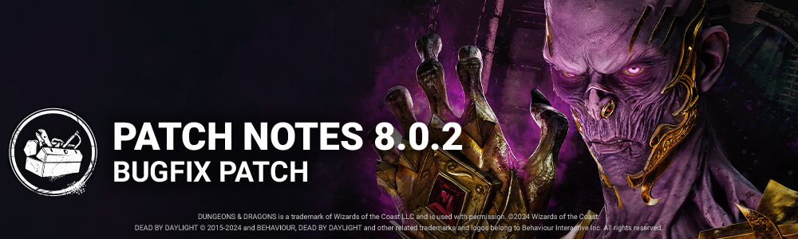

<!-- summary -->
## AI TL;DR

The Lich got several tweaks: Mage Hand now lifts pallets slower (0.35→0.5 s), its Vorpal Sword addon makes pallets take longer to break (2.2→3.2 s), and a new Ring of Telekinesis addon grants a temporary 10% vault speed boost. Forgotten Ruins also received map fixes, ensuring at least four hooks in the dungeon, moving passages away from vaults and pallets, and adjusting interaction times for survivors and killers. The update rounds out with a broad sweep of bug fixes covering anniversary visual glitches, map collisions, passage-stuck cases, perk syncing, and general VFX and interaction issues.
<!-- /summary -->

<!-- nav -->
&larr; [8.0.1 | Bugfix Patch](453-8-0-1-bugfix-patch.md) · [Live](../../index.md#live) · [8.1.0 | Tomb Raider](459-8-1-0-tomb-raider.md) &rarr;
<!-- /nav -->

# 8.0.2 | Bugfix Patch

## Content

### Environment/Maps

- In the Forgotten Ruins Map, at least 4 hooks will now always be available in the dungeon section of the map.
- In the Forgotten Ruins Map, Passage locations have been adjusted to avoid being directly beside vaults and pallets.
- Passage interaction time has been extended by 0.15 seconds for Survivors and shortened by 0.25 seconds for Killers.

### Characters

**The Lich**

- Increased Mage Hand pallet lifting time from 0.35 seconds to 0.5 seconds.
- Increased the volume on Flight of the Damned skeleton spawn to give better awareness to Survivors.
- Addon Ring of Telekinesis: Activating Mage Hand on an Upward pallet increases your general vault Speed by 10% for the next 8 seconds.
- Addon Vorpal Sword: Increasing time to break pallet from 2.2 seconds to 3.2 seconds.

## Bug Fixes

### Anniversary

- Fixed an issue that caused some VFXs to appear late when a Player that was far away approaches the location where they appeared
- Cancelling an Invitation Pillar interaction no longer causes the gold glitter VFX to linger and fail to respawn the scroll atop the Pillar.
- The Dancing Marionettes no longer clip with the ceilings of the Underground Complex.
- Survivor's pools of blood no longer disappear very rapidly after the effect of the "Quiet Mode" ability is over

### Archives

- Fixed an issue where progress could not be made with some iterations of the Bronze Age challenge.
- Fixed an issue where multiple recent Tomes were using the same cover color in the Compendium screen of The Archives.

### Characters

- Fixed an issue where the Lich's hand teleports away from the survivor for a frame at the end of the assimilate animation.
- Fixed an issue where the The Lich can be seen entering the Passage during the selection animation.
- Fixed an issue that caused a few Killers' motion trail VFX to not play correctly.
- The Lich's Spell Indicator VFX no longer becomes distorted when players change the First Person FOV while Full Screen/Windowed Full Screen on an Ultra Wide Monitor
- The Hand of Vecna's Locker Smoke VFX no longer appears before the locker doors open when Survivors fast-exit a destination locker after teleporting
- Survivors no longer obtain items from The Lich's chest in the dying state
- It is no longer possible for a Survivor to teleport into the locked room on Temple of Purgation with the Hand of Vecna
- The assimilated Hand of Vecna no longer jitters and becomes desynced with the Survivors arm when moving
- The animation of The Lich's chest can no longer be skipped if the Survivor presses the interaction button while the animation is playing.
- Fixed an issue where the Blight might not enter the fatigue state after destroying a wall or pallet with a rushed attack.

### Environment/Maps

- Fixed an issue in Garden of Joy where a Survivor could climb on the rock on the edge of the map
- Fixed an issue in the Temple of Purgation where content of the map could block the collision of the Killers only
- Fixed an issue in Lery's Hospital where the Killer could not pick up a Survivor that was crawling against a blocker
- Fixed an issue in the Forgotten Ruins where a placeholder tile would appear in the environment
- Fixed an issue in Decimated Borgo where a blocker would prevent the Killer from passing
- Fixed an issue in Lery's Hospital where a Survivor on hook would prevent the Killer from navigating
- Fixed an issue in Toba Landing where the Survivors could run on the railing of the stairs
- Survivors entering a Passage at the same time no longer get stuck
- Entry into a Passage is no longer cancelled when Victor Pounces on a Survivor entering a Passage
- Survivors no longer get stuck in the Killer's collision when a Killer waits for Survivors at a Passage's exit.
- The camera no longer gets stuck on the Spectator's POV when the in-match Survivor uses the Passage while the Spectator was being mori'd

### Perks

- Illusions spawned by the Mirrored Illusion perk now correctly despawn when the Killer walks through it
- The Mirrored Illusion perk no longer charges when an Illusion is already active.
- The Dark Arrogance perk's bonus vault effect no longer incorrectly applies to other Killer abilities.

### Misc

- Medkits now fully deplete when self-healing to 100% with no add-ons
- Fixed an issue that caused the Entity window blocking effects not to block a window that was just unblocked after 3 consecutive rushed vaults
- Survivors no longer get stuck in the hooked state when the killer is interrupted

<!-- nav -->
&larr; [8.0.1 | Bugfix Patch](453-8-0-1-bugfix-patch.md) · [Live](../../index.md#live) · [8.1.0 | Tomb Raider](459-8-1-0-tomb-raider.md) &rarr;
<!-- /nav -->
