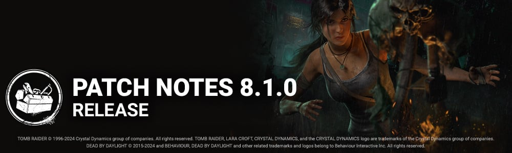

<!-- summary -->
## AI TL;DR

Introduce new survivor Lara Croft with three perks (Finesse, Hardened, Specialist) and several perk buffs for killers and survivors, plus extensive rework of The Knight (new guard cycling, path length modifiers, hunt timers, detection tweaks and addon changes) and The Singularity adjustments (tagging timing, aim-assist, pod controls, EMP tweaks). Also note hook respawn after sacrifice, new map variations for Mount Ormond Resort, Family Residence, Sanctum of Wrath, and UI lobby overhaul adding perk widget and merged character panels.

The rest of the patch is mainly audio, bot, environment and UI bug fixes, plus PTB clarifications for the new perks and several stability fixes; a few known issues remain with floating models and a disabled map variation.
<!-- /summary -->

<!-- nav -->
&larr; [8.0.2 | Bugfix Patch](454-8-0-2-bugfix-patch.md) · [Live](../../index.md#live) · [8.1.1 | Bugfix Patch](462-8-1-1-bugfix-patch.md) &rarr;
<!-- /nav -->

# 8.1.0 | Tomb Raider

## Content

### New Survivor: Lara Croft

#### New perk: Finesse

- This perk activates while you are healthy. Your fast vaults are 20% faster.  
   This perk goes on cool-down for 40/35/30 seconds after performing a fast vault.

#### New Perk: Hardened

- This perk activates after you complete all of the following: unlock a chest;  
   cleanse or bless a totem.  
   For the rest of the trial, anytime you would scream, reveal the Killer's aura for 3/4/5 seconds instead.

#### New Perk: Specialist

- Each time you open or rummage through a chest, gain 1 token, up to 6/6/6. When you hit a great skill check on a generator, consume all tokens. Then for each token consumed, reduce the maximum required generator progress by 2/3/4.

### Killer Perk Updates

**Darkness Revealed:**

- Increased the duration of the aura reveal to 6/7/8 seconds. (was 3/4/5 seconds)

**I'm All Ears:**

- Decreased the cooldown to 60/45/30 seconds. (was 60/50/40 seconds)

**Trail of Torment:**

- Decreased the cooldown to 60/45/30 seconds. (was 80/70/60 seconds)

**Oppression:**

- Decreased the cooldown to 60/50/40 seconds. (was 120/100/80 seconds)

**Dragon's Grip:**

- Decreased the cooldown to 60/50/40 seconds. (was 120/100/80 seconds)

**Machine Learning:**

- Increased the Undetectable and Haste duration to 40/50/60 seconds. (was 20/25/30 seconds)

### Survivor Perk Updates

**Autodidact:**

- Decreased the initial progress penalty to 15%. (was 25%)

**Empathic Connection:**

- Increased the speed at which you heal others to 30% faster. (was 10%)

**Iron Will:**

- Increased the grunts of pain reduction to 80/90/100%. (was 25/50/75%)

**Resurgence:**

- Increased the healing progress gained to 50/60/70%. (was 40/45/50%)

**Solidarity:**

- Increased the heal conversion rate to 50/60/70%. (was 40/45/50%)

**Babysitter:**

- Increased the Haste bonus to 10%. (was 7%)
- Increased the duration to 20/25/30 seconds. (was 4/6/8 seconds)

### Killer Updates

#### The Knight - Basekit

- Added the ability to cycle between guards using the Secondary Ability button.
- Decrease the camera push distance when entering path creation mode to 80 cm. (was 160 cm)
- The Knight must create a patrol path of at least 10 meters before being able to spawn a Guard. It's possible to cancel early by using the Secondary Ability button.
- Adjusted the Guards' detection to reduce the likelihood of being detected through walls.
- While The Knight is within 8 meters of a Guard that is actively hunting, the hunt timer will deplete at 3x the normal speed.
- While drawing a patrol path, its length applies a modifier on the base total hunt time:  
   1-15 meters: 1x  
   16-25 meters: 1.25x  
   26+ meters: 1.5x
- While drawing a patrol path, its length applies a modifier on the base banner spawn time:  
   1-15 meters: 1x  
   16-25 meters: 1.5x  
   26+ meters: 2x
- Decreased The Carnifex's hunt duration to 12 seconds. (was 24 seconds)
- Increased The Jailer's hunt duration to 24 seconds. (was 12 seconds)
- Decreased the time it takes for each Guard to perform the Order action:  
   Carnifex: 1.8 seconds (was 2 seconds)  
   Assassin: 5 seconds (was 6 seconds)  
   Jailer: 5 seconds (was 6 seconds)
- Increased each Guard's detection range:  
   Carnifex: 10 meters (was 8 meters)  
   Assassin: 10 meters (was 8 meters)  
   Jailer: 16 meters (was 14 meters)

#### The Knight - Addons

**Map of the Realm:**

- Increases the Guard's detection range by 2 meters. (was 4 meters)

**Pillaged Mead:**

- Decreases the Break or Damage action of Guards by 10%. (was 15%)

**Battleaxe Head:**

- Decreases the cooldown after calling upon The Carnifex by 20%. (Rework)

**Treated Blade:**

- Decreases the cooldown after calling upon The Assassin by 20%. (Rework)

**Cold Steel Manacles:**

- Decreases the cooldown after calling upon The Jailer by 20%. (Rework)

**Sharpened Mount (was Chain Mail Fragment):**

- Increases the time it takes for the Standard to spawn by 15%. (Rework)

**Grim Iron Mask:**

- When a Guard detects a Survivor during a Patrol, the Survivor suffers from the Blindness Status Effect for the next 75 seconds. (was 60 seconds)

**Broken Hilt:**

- Guards inflict the Haemorrhage and Mangled Status Effects when damaging a Survivor. (was only Mangled)

**Ironworker's Tongs:**

- If a Guard fails to damage a Survivor during a Hunt, the Survivor suffers from the Oblivious Status Effect for 60 seconds. (was 20 seconds)

**Town Watch's Torch:**

- While a Guard is actively Hunting a Survivor, gain the Undetectable Status Effect. (Rework)

**Blacksmith's Hammer:**

- Guards inflict the Broken Status Effect for 60 seconds when damaging a Survivor. (Rework)

**Flint and Steel:**

- After summoning The Carnifex, the auras of all Survivors within 24 meters of any unbroken dropped Pallets are revealed for 8 seconds. (was 5 seconds)

**Healing Poultice:**

- After summoning The Assassin, all Survivors within 8 meters of The Assassin's spawn location have their auras revealed for 8 seconds. (Rework)

**Jailer's Chimes (was Lightweight Greaves):**

- After summoning The Jailer, Survivors that cross The Jailer's Patrol Path have their auras revealed for 8 seconds. (Rework)

**Knight's Contract:**

- After giving an Order, the Guard will remain for an extra 8 seconds, triggering a Hunt should they detect a Survivor. (Rework)

**Iridescent Company Banner:**

- Drawing a Patrol Path through Windows blocks them for all Survivors for 25 seconds after summoning a Guard. (was 15 seconds)
- The Exit Gates are blocked by the Entity Spikes for the Hunted Survivor.
- All Windows vaulted by the Hunted Survivor are blocked for all Survivors for the remained of the Hunt.

### The Singularity

- When tagging a Survivor from a Pod (and Slipstream is not completed), the Tagging progress goes down gradually over 0.5 sec (was instant)
- Tag depletion starts after 0.25 seconds after Slipstream has been accumulated (but not completed) (was 0.3 seconds)
- When destroying a pod while controlling it, hold down M1-Attack Button for 1.25 sec to destroy it (new)
- New Killer Instinct Effect for 3.0 sec. on Survivors receiving Slipstream from another Slipstreamed Survivor or from a Bio-Pod
- Added Aim Assist effect when aiming at a Slipstreamed Survivor
- Decreased Tagging cooldown for Pods after Slipstreaming a Survivor to 3.0 sec (was 3.5 - allows less downtime after shooting a Survivor)
- Decreased distance that Survivor can see Supply Crate aura when not Slipstreamed to 28M (was 32)
- Added Hindered Icon to show the slow down when Survivors charge the EMP tool
- Killer Wake Up time after controlling a Pod decreased to 0.5 seconds (was 1.0).
- Killer Wake Up time near a Hooked survivor decreased to 1.5 seconds (was 5) to account for the anti-camp feature.
- Decreased World Detection of the aiming radius to reduce collisions and interference for shots.
- Overclock Duration no longer scales based on the number of Slipstreamed Survivors. Base value has been increased to 5.7 seconds (was 4.7)
- Increased readability of the Survivor-in-range indicator - Highlight is On = can be tagged / Highlight is Off = cannot be tagged
- After exiting a Pod, the aura of the last used Pod is displayed in yellow for 10.0 seconds (was 5)
- Soma Family Photo Addon +3% Haste effect for the duration of the Overclock is now base kit.
- UltraSonic Sensor Addon sound effect is now base kit. Killer can hear sounds through a controlled Biopod after 0.20 seconds by default.
- Made valid location target placement easier (increased placement timing from 0.1 seconds to 0.2 seconds)
- After using an EMP, Survivors are invincible to Slipstream for 1.0 second (was 2.0)
- EMP Range effect has been increased from 8M to 10M.
- EMPs stop printing when reaching 97%. Survivors now need to complete the last 3% manually. Supply Crate auras are shown in yellow when maximum progress has been reached.
- No longer forced to pick up EMPs after opening Supply Cases
- Perks: Blast Mine and Head-on now both apply the Overheat effect when affected by a stun during Overclock.

### The Good Guy

- Hidey-Ho Mode cooldown now starts at the end of a Slice & Dice.
- Hidey-Ho Mode cooldown reduced to 10 seconds (was 12 seconds)

### Map Updates

- Added 2 new Map variations to the Mount Ormond Resort
- Added 1 new Map variation to the Family Residence from the Yamaoka's Estate Realm
- Added 1 new Map variation to the Sanctum of Wrath from the Yamaoka's Estate Realm
- Gameplay pass on the Forgotten Ruins map to add pallets on at the ground level
- Added variations to the maze tiles in the pool of tiles for the Coldwind Farm Realm
- Added lockers in the existing maze tiles in the Coldwind Farm Realm
- Updated the placement of the Exit Gates
- Updated new maze tile safety from the feedback collected during the PTB

### Events & Archives

- Tome 20 - Mystic level 1 opens July 16 at 11:00:00 Eastern

## Features

### Hook Respawn

- Hooks broken by a Sacrifice will now respawn after 60 seconds.

### UX - Knight Guard's Chase

- Added a visual feedback when you have successfully distracted a guard by passing near a Window or downed Pallet.

### UX - Lobby Update

- Cosmetics and Character selection are merged into a single section. As in the store, players can use subtabs to navigate between options, including Characters' bio pages.
- Perks widget is added to the Lobby, available when looking at the Characters Menu, allowing players to view Perks and Powers while selecting Characters.
- Filter option allows for players to show locked cosmetics if they want to do so.
- As long as players are not waiting for a match to start, they can unlock Characters and Cosmetics directly on the Lobby.
- Now Moris can be previewed in the Lobby.
- Merged certain functionalities of the Killer and Survivor lobbies to make it easier to maintain in the future.
- Following PTB feedback, we've adjusted the Cosmetics and Character selection back to 4 columns for a smoother browsing & selection  
   (note that these changes will not be present on Switch but will be coming in a Hotfix).

### UX - Singularity's Podding and Controlling

- Biopod & Killer reticule was updated to better communicate states:  
   Green state: Idle, Firing Biopod, Slipstreaming Survivor  
   Purple state: Teleport to Survivor  
   Grey state: On cooldown  
   Red state: Destroying Biopod, Disabled Biopod
- Biopods will now indicate to Survivors when they are about to be reactivated

## Bug Fixes

### Audio

- The Voice-Over of the Lich is now correctly playing in the Mori Preview.
- Fixed an issue that caused The Knight's guards audio to remain audible after being despawned during a Hunt.
- The Knight's Hunt audio cue is now triggered correctly when using the addon "Knight's Contract"
- The Legion's (Susie) "Backstabber" outfit now match the correct voice.

### Bots

- The Trapper Bot in the Survive with Friends Tutorial now correctly looks at the target it is chasing.
- The Trapper Bot in the Survive with Friends Tutorial should be better at not stepping into his own traps.
- Prevented multiple Bots in the same Trial to accidentally spawn with the same digits at the end of the name.

### Characters

#### The Knight

- Fixed an issue that allowed The Knight to spawn a Guard while another was already spawned.
- Fixed an issue that caused survivors to not play their downed animation while using Bardic Inspiration.
- Fixed an issue that causes the camera to see into The Knight's leg when vaulting with the 'Menacing Knight' outfit."
- Fixed an issue that causes The Huntress's 'Were-Elk' outfit arms to bend weirdly when throwing an axe while looking down."

### Environment/Maps

- Fixed an issue Mother's Dwelling where players would get stuck in the ground
- Fixed an issue in Greenville Square where the singularity could place pogs on part of the stairs of the Theater
- Fixed an issue where a survivor spawner was misplaced
- Fixed an issue with Projectiles going through metal sheets of the Shack in Autohaven Wreckers
- Fixed an issue in the map Torment Creek where the killer could not navigate and be blocked in a chase
- Fixed an issue in Midwich Elementary School where the traps would get hidden under rubbles
- Fixed an issue in stairs of Midwich Elementary School where players would get stuck
- Fixed an issue of floating pallets in the corn fields
- Fixed an issue with stair in Midwich Elementary School where the players could not navigate smoothly near the Exit Door
- Fixed an issue in Rotten Fields causing unnecessary network corrections

### Perks

- The Illusion created using the Mirrored Illusion perk now despawns when the killer walks through it.
- The Decisive Strike stun now always has the correct duration.

### UI

- Fixed an issue where some perks' descriptions have an improper number format
- Fixed an issue where the account name is displayed in the main menu when turning on or off the "Hide your name" setting
- Fixed an issue where the Auric cell packs purchase screen can be accessible when starting the final countdown.

### Misc

- Fixed an issue that could soft-lock loading into a Trial due to a player's loadout bringing an invalid Item.

## Public Test Build (PTB) Adjustments

### New Perk: Hardened

- Clarified the description of the perk with bullet points to help avoid confusion.

### New Perk: Specialist

- Increased maximum tokens from 3/3/3 to 6/6/6.

### New Perk: Finesse

- Added a custom animation when vaulting pallets.

**Bug Fixes - Lara Croft**

- Lara Croft correctly receives Bloodied outfit when going through Prestige 4-5-6.
- The Hardened now correctly triggers from several abilities and perks such as The Doctor’s power, the Nurse’s Anxious Grasp Add-On, and the Make Your Choice and Hex: Face the Darkness Perks.
- Generators now complete if the progress granted by the Specialist Perk brings them to full charge.

### Disconnect Bots Changes

- In PTB, we have enabled Disconnect Bots during loading. This is now once again disabled. Disconnect Bots continue to work as always in Live, only appearing when a Survivor disconnects after the game has started.

### Killer Updates

**The Knight - Basekit**

- While drawing a patrol path, its length applies a modifier on the base banner spawn time:  
   1-15 meters: 1x  
   16-25 meters: 1.5x  
   26+ meters: 2x
- Different Guards now share the same cooldown.

**Bug Fixes - The Knight**

- The Guard distraction effect on vault points now plays correctly when used several times on the same vault point.
- Survivors standing on the Banner when it spawns now correctly ends the Hunt.

**The Singularity - Basekit**

- Removed autoaim while taking control of a Biopod
- Reverted the time to Slipstream a Survivor from a Biopod back to 0.6 seconds (was 0.8 seconds on the PTB)
- Tagging from a pod or from the weapon now play different sound effects.

**Bug Fixes - The Singularity**

- Placing Biopods on surfaces like trees is now easier.
- The body and the collision of the Singularity now correctly appear at the same place for survivors after teleporting.
- Teleporting to a survivor no longer takes longer to complete than previously.

### Bug Fixes

**Bots**

- Disconnect Bots correctly interact with the Anonymous Mode setting.

**Misc**

- Fixed issues arising from leaving another player's Custom Game lobby.
- Fixed several server-side crashes.
- Survivor animations are now correctly playing when performing various interactions.
- The anti-camp system now correctly fills up when the Killer is standing on top of the Basement.

## Known Issues

- The Hag and The Unknown's model appears floating after previewing the Mori a second time.
- One of the new Ormond Map variations will be disabled until the next Hotfix.

<!-- nav -->
&larr; [8.0.2 | Bugfix Patch](454-8-0-2-bugfix-patch.md) · [Live](../../index.md#live) · [8.1.1 | Bugfix Patch](462-8-1-1-bugfix-patch.md) &rarr;
<!-- /nav -->
