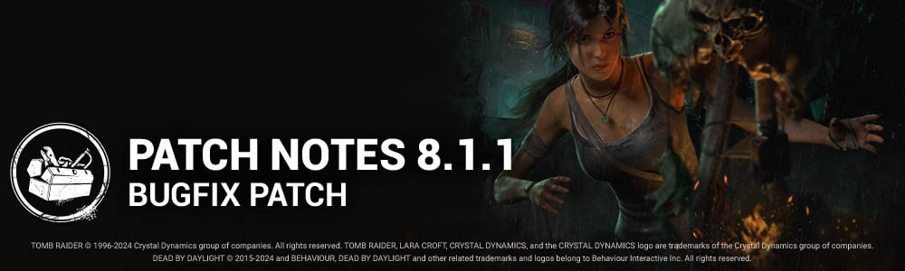

<!-- summary -->
## AI TL;DR

Mount Ormond Resort receives its third map variation and Backwater Swamp maps return, while the Stridor perk’s pain grunts and breathing bonuses are increased and made additive. The Singularity’s biopod control now auto-targets survivors and destroys twice as fast. A brand-new 2V8 mode launches on July 25, featuring dual-killer duos, larger map variants such as Suffocation Pit and Azarov’s Resting Place, and an event tome. Switch lobby UI shifts to four-column navigation and removes owned tags. The patch also bundles extensive bug fixes across archives, bots, character animations, map collisions, perks, UI and gameplay consistency.
<!-- /summary -->

<!-- nav -->
&larr; [8.1.0 | Tomb Raider](459-8-1-0-tomb-raider.md) · [Live](../../index.md#live) · [8.1.1a | Hotfix](463-8-1-1a-hotfix.md) &rarr;
<!-- /nav -->

# 8.1.1 | Bugfix Patch

## Content

- The third Mount Ormond Resort Map variation has been enabled.
- The Backwater Swamp maps have been re-enabled.

### Killer Perk Updates

- **Stridor**  
   Increased the grunts of pain to 30/40/50%. *(was 25/50/50%)*  
   Increased regular breathing to 15/20/25%. *(was 0/0/25%)*  
   The bonuses granted by the perk are additive. *(was multiplicative)*

### Killer Updates

#### The Singularity

- Holding the Ability button when taking control of a Biopod will cause it to automatically aim at the nearest Survivor. Tapping the button will take control normally.
- Reduced the time it takes to destroy a Biopod to 0.75 seconds (was 1.5 seconds).

#### Events & Archives

- Game Mode: 2V8 begins July 25 at 11:00:00 Eastern  
   Team together as survivors, or, for the first time, as a killer duo.  
   Use the new Skill and Class systems to define your loadout.  
   A single disconnected killer can be replaced by a Killer Bot.
- The mode features unique, larger-than-ever Map variations  
   Suffocation Pit  
   Azarov's Resting Place  
   The Thompson House  
   Disturbed Ward  
   Mother's Dwelling
- Game Mode: 2V8 also features an event Tome, opening at the same time.

## Features

### UX - Switch

#### Lobby UI:

- 3 columns wide navigation changed to 4 columns wide
- "Owned" tags disabled.
- Removed notifications on characters & customizations

## Bug Fixes

### Archives

- Fix an issue where the Killer Archive challenge "Knockout (Remix) was not randomizing perk after a disconnect.
- Fix an issue where "Core Memory" and "Glyph" Archive challenges were not appearing in the Trial after a disconnect.

### Bots

- Leaving a Custom Game with 4 Survivor Bots correctly ends the match, no longer allowing spectating.

### Characters

- Fixed an issue that caused some survivors to not play certain idle animations in the lobby.
- Fixed an issue that caused The Lich's grab locker animation to stutter when grabbing a survivor out of a locker.
- Fixed an issue that caused survivors to briefly play the downed animation when getting injured the first time.
- Fixed an issue that caused survivors to become stuck in a floating animation after being released by The Mastermind.
- Fixed an issue that caused The Executioner to have his head missing when performing a Mori.
- Fixed an issue that caused The Executioner's Cage of Atonement ability repeated usages to slow or stop the bleed-out of a Survivor.
- Fixed an Issue that prevented the Survivors Gate opening animations to be played when a flashlight was equipped
- Fixed an issue that caused flashlights to be unusable after previously using a Flash Grenade or Firecracker item.

### Environment/Maps

- Fixed multiple issues where placeholder tiles would appear on different realms
- Fixed an issue in Underground Complex where the Nurse could blink through walls to reach unobtainable areas
- Fixed an issue in Nostromos where the Nurse could blink on top of debris
- Fixed an issue in Crotus Prenn Asylum where the Trapper could hide traps under debris
- Global task cleanup a variety of collisions in different maps
- Fixed an issue in Midwich School where an object would block players from moving
- Fix an issue on Backwater Swamp maps where survivors were immune to killer's basic attack while standing next to a boat.

### Perks

- Survivors with Dead Hard or Borrowed Time now correctly get endurance off the hook
- Resourceful no longer gains progress when picking up an item previously swapped into a Chest by another Survivor
- Sparks from Hex: Ruin no longer remain on the generator after failing a skill check,

### UI

- Fixed a formatting issue in the Tally Scoreboard to remove the comma displayed in the score.
- Fixed a softlock in the Tutorial that happened when opening the Settings menu when a popup is displayed.

### Misc

- Improved data consistency after finishing a Trial.
- Survivor no longer T-poses and bounces down from a the hook briefly when the unhook animation is interrupted
- Fixed an Issue where the Generator count would decrease when a Survivor left the Tally screen of an ongoing Trial
- Fixed Gamepad input conflict between the Lobby MatchMaking button (Play or Cancel) and the Lobby Customizations menu when trying to buy an item with Auric Cells.

 **Known Issues**

- Performance issues with FPS drops in 2v8 mode on Switch. *Dev Note: We would like our Switch players to have the opportunity to play 2v8, but we are aware that the performance is not where we would like it to be unfortunately, due to the technical limitations of running a 10 player game.*
- Holding an item while crafting a Flash grenade from the Flashbang perk will result in the equipped item being lost.
- Some assets in the Azarov's Resting Place map are missing collision.
- Placeholder tiles may spawn in the Shelter Woods map.
- Dead Hard perk does not give Endurance if the perk Off The Record is triggered.

<!-- nav -->
&larr; [8.1.0 | Tomb Raider](459-8-1-0-tomb-raider.md) · [Live](../../index.md#live) · [8.1.1a | Hotfix](463-8-1-1a-hotfix.md) &rarr;
<!-- /nav -->
