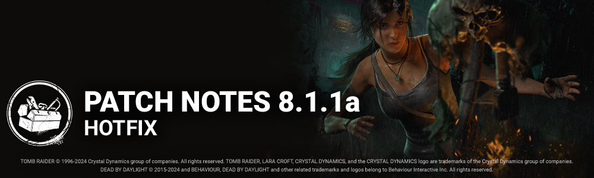

<!-- summary -->
## AI TL;DR

Version 8.1.1a introduces a hotfix that resolves a map-tile desynchronization issue, ensuring server-generated tiles match what players see. The update also enforces a version lock, preventing players on 8.1.1a from matchmaking or partying with those on 8.1.1.
<!-- /summary -->

<!-- nav -->
&larr; [8.1.1 | Bugfix Patch](462-8-1-1-bugfix-patch.md) · [Live](../../index.md#live) · [8.1.2 | Bugfix Patch](466-8-1-2-bugfix-patch.md) &rarr;
<!-- /nav -->

# 8.1.1a | Hotfix

*This update will release as soon as it becomes available on each platform. Players on version 8.1.1a will be unable to matchmake or join parties with players on version 8.1.1.*

## Bug Fixes

- Fixed an issue which caused a desync between the map tiles generated on the server and what players see.

<!-- nav -->
&larr; [8.1.1 | Bugfix Patch](462-8-1-1-bugfix-patch.md) · [Live](../../index.md#live) · [8.1.2 | Bugfix Patch](466-8-1-2-bugfix-patch.md) &rarr;
<!-- /nav -->
