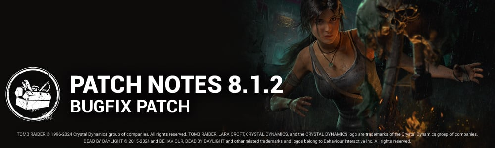

<!-- summary -->
## AI TL;DR

Stridor and Iron Will perks were rebalanced so their audio effects are no longer multiplicative, with Stridor increasing survivor grunts and Iron Will reducing them instead of silencing completely. The update also delivers a broad sweep of fixes: corrected 2v8 cage music, self-care icon lighting, and aura chase SFX; resolved audio cue for killers replaced by bots; improved bot pathing and Huntress hatchet charge; addressed character visual glitches for Singularity, Knight, Trapper, and Mastermind; repaired numerous perk bugs including Invocation: Weaving Spiders, Specialist, Flash Grenade crafting, and Dead Hard; fixed Wraith cloaking on Switch, escape cake bloodpoint awards, and rare game-freeze scenarios.
<!-- /summary -->

<!-- nav -->
&larr; [8.1.1a | Hotfix](463-8-1-1a-hotfix.md) · [Live](../../index.md#live) · [8.2.0 | Castlevania](468-8-2-0-castlevania.md) &rarr;
<!-- /nav -->

# 8.1.2 | Bugfix Patch

## Content

### Perks

**Killer**

- **Stridor**  
   The effect of the perk is no longer multiplicative, meaning that it will increase Survivor grunts of pain volume (even if they have Iron Will)

**Survivor**

- **Iron Will**  
   The effect of the perk is no longer multiplicative, meaning it will lower Survivor grunts of pain volume rather than set it to zero

## Bug Fixes

### 2v8

- Hooked music should now be playing correctly when the player is in a 2v8 Cage.
- The Survivor's Innate Skill "Self-Care" ability icon should now be correctly lit while in the dying state.
- Aura reveal SFX now correctly plays when being chased by a Killer.

### Archives

- Fixed an issue where deselecting an image reward within Tome 20 Mythic's journal collection would cause the game to freeze momentarily.

### Audio

- A Killer disconnecting and being replaced by a Bot will now correctly trigger the "replaced by Bot" sound cue.

### Bots

- Improved Bots pathing to avoid them trying to climb insurmountably steep hills.
- The Huntress Bot is now better at charging up her hatchet the correct amount.

### Characters

- Fixed an issue that caused the white aura to be shown when the Singularity looks at a pod directly.
- Fixed an issue that caused the Knight's Guard preview icon on the Knight's arm to be inconsistent with the selected Guard.
- Fixed an issue that caused the Trapper's Bear Oil add-on to only silence one bear trap in the trial.
- Fixed an issue that caused Survivors to be floating when hit by the Mastermind's Virulent Bound at the end of the self unhook animation.

### Perks

- Fixed an issue that caused Invocation: Weaving Spiders not to complete generators when above 90% repair progress.
- Fixed an issue that caused Specialist to make generators impossible to complete if every Survivor in the trial had and consumed max tokens on the same generator. This should also fix other cases of incompletable generators when combing other perks with Specialist.
- Fixed an issue that caused Survivor to lose their equipped items when crafting a Flash Grenade item from Flashbang.
- Fixed an issue that caused Dead Hard not to give the Endurance effect if Off The Record is triggered.

### Platforms

- Fixed an issue that caused the Wraith's shadow to be visible while cloaked from Survivor POV on Switch.

### Misc

- Fixed an issue that could cause the game to freeze when the Lich leaves the tally screen before all other users after a match.
- Fixed an issue that caused the Escape Cake Offering not to consistently award bonus Bloodpoints.

<!-- nav -->
&larr; [8.1.1a | Hotfix](463-8-1-1a-hotfix.md) · [Live](../../index.md#live) · [8.2.0 | Castlevania](468-8-2-0-castlevania.md) &rarr;
<!-- /nav -->
