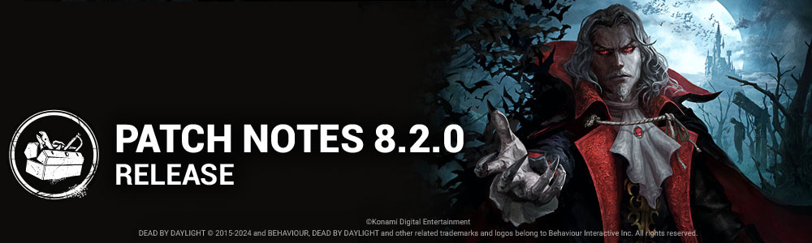

# 8.2.0 | Castlevania

## Content

### New Survivor - Trevor Belmont

#### New Perk: Eyes of Belmont

- When a generator is completed, the aura of the Killer is revealed to you for **1/2/3 seconds**. Any time the Killer's aura is shown for a period of time, its duration is increased by **2 seconds.**

#### New Perk: Exultation

- Stunning the Killer with a pallet upgrades your held item rarity to the next tier, then recharges **25%** of the item's maximum charges. This perk has a **40/35/30-second** cooldown.Rarity is not kept at the end of the trial.

#### New Perk: Moment of Glory

- This Perk activates after you open or rummage through **2 chests**. When you become injured, you become broken. Automatically heal 1 health state after **80/70/60 seconds.**Then, this perk deactivates.  
  *This effect is cancelled if you enter the dying state.This perk will not activate if you are already suffering from the Broken status effect*.

### New Killer - The Dark Lord

#### Killer Power

His dark power allows him to exact revenge on humans, taking many forms to terrorize and slaughter them.

The Dark Lord has access to three Forms and can freely change between them. Each Form has unique abilities and strengths.

- **Vampire Form** - In his default state, The Dark Lord can use the powerful Hellfire spell, which creates pillars of flame that erupt from the ground in front of him and can be cast across low obstacles.
- **Wolf Form** - In Wolf Form, The Dark Lord has access to several abilities that allow for more effective tracking. Blood pools and scratch marks are more apparent, and running Survivors leave a trail of Scent Orbs behind them. The Dark Lord can collect these Scent Orbs to charge a powerful Pounce attack and gain a short non-stacking haste buff.
- **Bat Form** - While in Bat Form, The Dark Lord gains the Undetectable status effect. Additionally, he moves faster, ignores vault points, and can Teleport to any vault points within 32 meters. Survivors become invisible, but scratch marks can be seen.

### Perks

#### New Perk: Hex: Wretched Fate

- After one generator has been repaired, a random dull totem becomes a hex totem and curses the Obsession. The Obsession has a **27/30/33%** repair speed penalty. They also see this Hex totem's aura when within **12 meters.*This effect persists until the Hex totem is cleansed.*

#### New Perk: Human Greed

- You see Unopened Chests auras and Survivors auras are revealed for 3 seconds when they enter a **8 meter** range. You also gain the ability to kick chests to close them. This ability has a **60/45/30-second**cooldown. Survivors unlock these closed chests **50% faster.**

#### New Perk: Dominance

- The first time each totem and each chest is interacted with by a Survivor, that totem or chest is blocked by the Entity for **4/6/8 seconds**. The auras of blocked totems and chests are revealed to you in white.

### Killer Updates

#### The Doctor - Basekit

- Static Blast's cooldown is now dynamic:  
   If no Survivor was caught in the Static Blast, the cooldown will be 30 seconds. *(NEW)*  
   If at least 1 Survivor was caught in the Static Blast, the cooldown will be 45 seconds. *(was 60 seconds)*
- Increased movement speed while charging Static Blast to 2.99 m/s. *(was 1.16 m/s)*

#### The Doctor - Addons

- **"Order" - Class II:**Decreases Static Blast cooldown by 2.5 seconds. *(was 4 seconds)*
- **"Order" - Carter's Notes:**Decreases Static Blast cooldown by 3 seconds.*(was 6 seconds)*

#### The Dredge - Basekit

- Decreased the volume of The Dredge's audio
- Increased movement speed while charging Reign of Darkness to 3.8 m/s. *(was 3.68 m/s)*
- Decreased Daytime cooldown to 10 seconds. *(was 12 seconds)*
- Increased Daytime teleport speed to 19 m/s. *(was 12 m/s)*
- Decreased time to exit locked Lockers to 2.25 seconds.*(was 3 seconds)*
- Increased night charges per injured Survivor to 1 charge per second. *(was 0.75 charges per second)*

#### The Dredge - Addons

- **Boat Key**Increases teleport speed during *Daytime*by 3 m/s. *(was 5 m/s)*
- **Haddie's Calendar**Decreases the time to exit a locked Locker by 0.4 seconds*. (was 1 second)*
- **Malthinker's Skull**Increases the charges gained per injured Survivor by 25%. *(was 66%)*
- **Ottomarian Writing**Decreases the cool-down time of *The Gloaming* by -2 seconds during *Daytime.(was -4 seconds)*

#### The Nemesis - Basekit

- Decrease the Mutation Rate 2 requirement to 5 Contamination Points. *(was 6)*
- Increase Hindered penalty duration from tentacle hits to 2 seconds. *(was 0.25 seconds)*
- Increase the Tentacle Strike length in Mutation Rate 3 to 6.5m *(was 6)*
- Decrease the Tentacle Strike successful cooldown to 2.25 seconds *(was 2.5 seconds)*

#### The Nemesis - Addons

- **Licker Tongue**Survivors are Hindered for an extra 3 seconds after being Contaminated. *(was 0.2 seconds)*
- **Marvin's Blood**Gain an extra 0.5 mutation for infecting a Survivor. *(was 0.75)*

#### The Knight - Basekit

- The Knight can summon a Guard at anytime despawning any Guard that was deployed *(NEW)*
- Each Guard has a unique cooldown that starts after they have despawned *(NEW)*:  
   Assassin: 30 seconds  
   Carnifex: 20 seconds  
   Jailer: 25 seconds
- Despawning a **patrolling**Guard by hitting them with a basic attack decreases the cooldown to 10 seconds *(NEW)*

### Survivor Perk Updates

- **Blast Mine**Activates after completing a total of 40% worth of repair progress on generators. *(was 50%)*
- **Chemical Trap**  
   Activates after completing a total of 20% worth of repair progress on generators. *(was 50%)*Stays active for 40/50/60 seconds. *(was 100/110/120 seconds)*
- **Dance With Me**Decreased cooldown to 30/25/20 seconds. *(was 60/50/40 seconds)*
- **Deception**Decreased cooldown to 30/25/20 seconds. *(was 60/50/40 seconds)*
- **Diversion**Activates after being in the Killer's Terror Radius while not in a Chase for 30/25/20 seconds. *(was 40/35/30 seconds)*
- **Flashbang**Activates after completing a total of 50/45/40% worth of repair progress on generators. *(was 70/60/50%)*
- **Mirrored Illusion**Activates after completing a total of 20% worth of repair progress on generators. *(was 50%)*
- **Wiretap**Activates after completing a total of 40% worth of repair progress on generators. *(was 50%)*

### General Gameplay Updates

- Increase hook stage drain timer to 70 seconds. *(was 60 seconds)*

### Map Updates

#### Castle Vista

Dracula's castle will spawn in the sky of Dead by Daylight original Maps when playing against Dracula.

#### Midwich Gameplay Pass

Midwich Elementary School also benefited from a gameplay pass.  
 The school has been revisited to find a better combination of obstacles and reduce the long line of sight of the school corridors.  
 A pass on both the interior (classrooms) and exterior tiles has also been done, updating the current gameplay and adding new exterior tiles for variation.

## Events & Archives

- **Modifier: Lights Out - Castlevania** begins September 12th at 11:00am Eastern.  
   This Modifier also features an event tome.

## Features

### Graphics Option

- Added the support for Intel XeSS for PC

### Live Data Reboot

As part of our Live operations, we occasionally deploy updates to the game without needing an update of the game application itself. These updates includes kill switches and new cosmetics, amongst other data. Starting from this release, when a critical data update is required to be downloaded by the game, you may see a popup asking you to return to the splash screen.

### UX

#### Gameplay

- Addons are now shown to the left side of Items and Killer Powers.
- The Dark Lord's Killer Power on the UI displays main power and new smaller icons to surface mechanics and cooldowns.

#### Lobby controller compatible navigation

- Players can now toggle Rotation mode to use the R-stick to rotate the character preview, as in the Store, so they don't need to press A on top and use the joystick.

#### Lobby

- Characters default ordering changed to show owned characters sorted by release date, then unowned sorted to show latest characters first.
- Entering the Cosmetics section shows the Outfits category by default instead of Head.

#### Settings Menu

- Disabled options are shown are greyed out, instead of having a black/transparent background.

### Misc

- The Prestige levels of other players is no longer visible within an Online Lobby (post-matchmaking).
- Upgraded EasyAntiCheat to new version. **(PC only)**

## Bug Fixes

### Archives

- Fixed an issue where select Core Memory challenge could display negative progress was made when reaching the tally screen, resulting in no progress gained.

### Audio

- Fixed an issue that caused the Long Grass to make no sound on collision.
- Fixed an issue where Season Grade Reset Rewards sounds triggered multiple times with no visual.
- Fixed Dredge's locker warning SFX being too faint from Killer POV.
- Fixed an issue where the Arcade Machine Pallet SFX from Greenville Square was not played.
- Re-Balanced Were-Elk VOs compared to regular Huntress VOs.

### Bots

- Bots using the Moment of Glory Perk can now set aside an Item, rather than be stuck in an infinite loop trading items with the Chest.

### Characters

- Fixed an issue that caused the Trapper to sometimes not pickup bear traps despite the animation playing while wearing the Naughty Bear outfit.
- Fixed an issue that caused placing a trap as multiple characters (Trapper, Hag, Nightmare) close to walls or other objects to sometimes be cancelled even though the placement indicator shows a valid location.
- The Survivor grab animation is now correctly aligned when the Dredge teleports to a locker at the same time as the Survivor enters it.
- The Demogorgon can no longer perform actions while traveling through a Tunnel and opening and closing the Match Details screen.
- Jittering should be reduced when spectating Killers. Some issues still remain on the Killer’s weapons and are being looked at.
- Fixed an issue that caused The Nurse's left hand to stop animating when holding her power for longer than anticipated.
- Fixed an issue that caused the Were-elk's axe to shake when selected in the Killer's lobby.
- Fixed an issue that caused The Good Guy's camera to move at an unnatural angle when picking up a Survivor.
- Fixed an issue that caused a vertex to poke out of Elodie Rakoto's shoulder in her Old Cami Torso customization.
- Fixed an issue that caused the players model not to follow the camera when sprinting away immediately after opening a chest or Killer crate.
- Fixed an issue that could rarely cause the Hand of Vecna not to teleport the player.

### Environment/Maps

- Collision update pass on the Garden Of Joy Map.
- Collision update pass on the maps of the MacMillan Estate Realm.
- Fixed an issue in Greenville Park where the Parking tile doesn't spawn
- Fixed an issue in Toba Landing where invisible collisions hindered the navigation of the players
- Fixed an issue in Greenville Park where Victor would dissolve when jumping in the stairs
- Fixed a soft-lock that could occur when loading into a map.

### Perks

- Bardic Inspiration no longer requires the activation button to be held down to activate correctly.

### Platforms

- On PS5, fixed a crash that could occur when buying Bundles in the Store.

## UI

- If a player disconnects from a Trial due to network issues, they will no longer see the Killers' Loadouts or name.
- Fixed Player HUD text, font readability and health bar elements to their previous size.
- Fixed Tally buttons navigation misalignment.
- Fixed missing hair on The Good Guy default and prestige head cosmetics.
- Fixed an issue with the reward size on the Tutorials screen.
- The game once again correctly closes when trying to Alt-F4 during the splash screen.
- Experiencing an error when going through the lobbies once again correctly kicks out the player to the Main Menu.
- Fixed an issue where Bloodweb item names are no longer in uppercase.
- Fixed an issue where the cursor is disabled during the offering screen in the custom game.

## Public Test Build (PTB) Adjustments

### New Killer - The Dark Lord

#### POWER

- Hellfire Cancel curve smoothed out so it doesn't feel so abrupt.
- Hellfire Cast curve movement speed increased to 2.0 m/s (was 1.48 m/s).
- Hellfire charge duration decreased to 0.9 seconds (was 1.0 second).
- Wolf's base movement speed increased to 4.6 m/s (was 4.4 m/s).
- Scent Orbs still bring you up to 4.8 m/s.
- Wolf Pounce cooldown reduced to 20 seconds (was 25 seconds).
- Wolf Pounce break actions on walls and pallets reduced to 2.25 seconds (was 2.7 seconds).
- Collision with a wall or obstacle on the 1st pounce no longer ends the power, allowing the 2nd pounce to activate.

#### ADD-ONS

- Sylph Feather: Breaking a pallet grants The Dark Lord a token. For each token held, Hellfire's cooldown is decreased by 5%, to a maximum of 25%. (was ""Breaking a pallet resets Flame Pillar cooldown.")
- Ruby Circlet: Decreases the cooldown of Hellfire by 10%. (was 7%)
- Moonstone Necklace: Reduces the size of the Terror Radius in Vampire and Wolf Forms by 4 meters. (was "Terror Radius in Vampire Form reduced by 4 m.")
- White Wolf Medallion: Increases Killer Instinct duration by 40% while in Wolf Form after Survivors complete rushed actions. (was "Killer instinct from loud noises lasts 40% longer")
- Force of Echo: Scent Orbs spawn rate increased by 17% (was "Scent Orb tracking precision increased by 30%")
- Pocket Watch: Breaking a pallet or wall resets the Teleport cooldown. (was "Breaking a pallet resets Teleport cooldown.")
- Medusa's Hair: All Survivors within 12 meters of your teleport destination suffer from the Hindered status effect for 5 seconds. (was "Passing within 1 m of a Survivor while teleporting causes them to suffer from Blindness for 10 seconds.")
- Lapis lazuli: After Teleporting to a window vault, the Entity blocks that window for Survivors for 15 seconds (was "After teleporting to a window vault, the Entity blocks that window for Survivors for 4 seconds.")

#### SCORING EVENTS

- Hellfire's Bite: Changed blood point value to 800 (was 500)
- Lupine Ferocity: Changed blood point value to 800 (was 500)
- Lupine Ferocity: Event changed to be on a hit with a pounce attack (was on a down with a pounce attack)
- Quick as the Night: Changed blood point value to 600 (was 800)
- Quick as the Night: Changed to 6.0 seconds (was 3.0 seconds)

### Killer Perks

**Human Greed**

- Reduced cooldown from 80/70/60 to 60/45/30 seconds

### Misc

- There is now a limit of 4 million of any Item, Add-on or Offering, raised from the limit in PTB.

### Bug Fixes

- Fixed an issue that caused Trevor Belmont's perks not to appear in the correct order in the Loadout menus.
- Fixed an issue that erroneously caused Survivors to have 4 attempts to self unhook.
- Fixed an issue that caused the Decisive Strike perk icon to remain visibly active after succeeding the skill check.
- Fixed an issue that caused the Moment of Glory perks to stay active after the Survivor is put into the dying state.
- Fixed an issue that could sometimes caused the Hex: Wretched Fate to reveal the auras of all Hex totems in the trial to the Obsession when activated.
- Fixed an issue that caused the Hex: Wretched Fate perk icon to remain visually active when the associated Hex totem was cleansed.
- Fixed an issue that caused the Dark Lord to pass through Survivors while charging his abilities.
- Fixed an issue that caused the Good Guy's camera to move unnaturally when picking up a Survivor.
- Fixed an issue that caused the Good Guy to be unable to vault from an elevated vault.
- Fixed an issue that caused multiple Killers to be missing the hold arrow icon for their power.
- Fixed an issue that caused the Survivor locker sequence to break when the Dredge teleports to a locker at the same time a Survivor enters the same locker.
- Fixed an issue that caused the Pig's Videotape add-on to activate all RBTs at the start of the trial.

#### Maps

- Fixed collision issues on the map of Dvarka Deepwood - Nostromo Wreckage.
