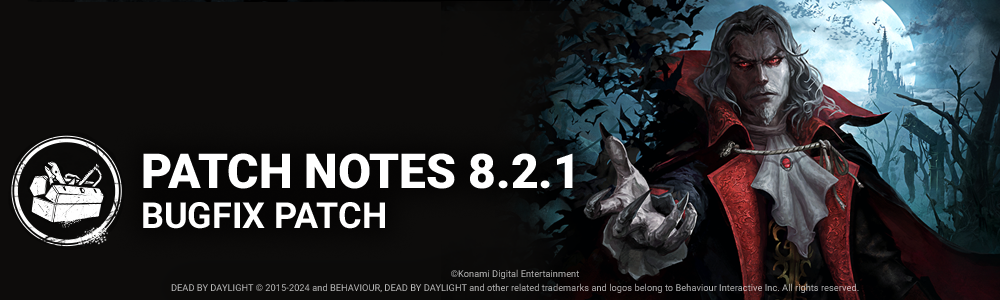

<!-- summary -->
## AI TL;DR

Exultation now retains upgraded-item rarity at trial end, and the Lights Out - Castlevania modifier launches with a new Candelabra item and an event tome, while Chaos Shuffle returns later in September.

The rest of the update is a broad bug-fix sweep covering audio glitches, character visual and animation errors, map collisions and start-of-match lag on several locations, survivor perk token and activation bugs—including Human Greed, Plunderer’s Instinct, Weave Attunement, White Ward, Moment of Glory and Hex : Wretched Fate—UI and platform install screen issues, and miscellaneous problems with Broken-status healing scores and skill-check spamming.
<!-- /summary -->

<!-- nav -->
&larr; [8.2.0 | Castlevania](468-8-2-0-castlevania.md) · [Live](../../index.md#live) · [8.2.2 | Bugfix Patch](471-8-2-2-bugfix-patch.md) &rarr;
<!-- /nav -->

# 8.2.1 | Bugfix Patch

## Content

### Survivor Perks

**Exultation**

- Rarity of upgraded items is now kept at the end of a Trial.

**Events & The Archives**

- Modifier: Lights Out - Castlevania begins September 12th at 11:00am Eastern.  
   Features a new limited item, the Candelabra, used to guide Survivors in the darkness.  
   This Modifier also features an event tome with exclusive rewards.
- Chaos Shuffle returns September 24th at 11:00am Eastern.

## Bug Fixes

### Audio

- Fixed an issue that caused Iron Will to not suppress the final grunt when self-healing
- Audio that starts at the same time as a character spawns, such as theme music, works correctly once again.

### Characters

- Fixed an issue that caused the Lich's pelvic rotation not to match the red stain from the survivor's point of view
- Fixed an issue that caused the Hand of Vecna to not align properly when the Survivor performs certain actions
- Fixed an issue that caused the camera not to be at the correct distance when the Dark Lord switched forms by performing the Destroy action
- Fixed an issue that caused the Dark Lord's Wolf Pounce power not to display the red cooldown drain around the icon after the first pounce attack
- Fixed an issue that caused the Dark Lord's material swap to be desynched with some of the interactions as the wolf and bat
- Fixed an issue that caused the Survivors interrupt animation to be misaligned when the Dark Lord interrupted a window vault or locker
- Fixed an issue that caused the Lich's portal VFX to be corrupted when viewed for the first time

### Environment/Maps

- Fixed an issue in Raccoon City Police Station where a character could vault and land on a lamp over a door frame
- Fixed an issue in Greenville Square where there was a lag at the start of the game
- Fixed an issue in Disturbed Ward where there was a lag at the start of the game
- Fixed an issue in Raccoon City Police Station where a collision on the side of the stairs leading to the Basement would get the characters to bump
- Fixed an issue in Nostromo map where the Nurse could blink on top of a rock
- Fixed an issue in Azarov's Resting Place where the killer could not grab a survivor off a generator side on tile LD13
- Fixed an issue in Raccoon City Police Station in the west wing where the Trapper could hide traps under debris
- Fixed an issue in Mount Ormond Resort where the killer could not pick up a survivor on tile Fr\_MD75
- Fixed an issue in Badham Preschool where the killer could not navigate between assets of Garbage and Foliage
- Fixed an issue in Nostromo Map where the Nurse could blink under the Spaceship
- Fixed an issue in Toba Landing where the Nurse could blink on top of a rock pillar near the main building

### Perks

- Fixed an issue that caused various Survivor chest perks to gain tokens when a Survivor briefly interacted with a chest previously closed by the Human Greed perk
- Fixed an issue that caused the aura of items in a chest to continue to appear after it was closed by the Human Greed perk when the Survivor had Plunderer's Instinct equipped
- Fixed an issue that caused the Weave Attunement perk to trigger by the Exultation perk when stunning the Killer
- Fixed an issue that caused the Survivors White Ward offering to protect the add-ons when a Survivor is sacrificed with an upgraded item from the Exultation perk
- Fixed an issue that caused the Moment of Glory perk not to activate after the Broken status effect ended from the Deliverance & For The People perks
- Fixed an issue that caused the Hex: Wretched Fate not to transfer to the Hex: Undying when destroyed
- Fixed an issue that caused the Hex: Wretched Fate perk to be active despite no dull totems remaining

### Platforms

- Archive and Event Screens are once again correctly blocked during a partial install on platforms that support it.

### UI

- Fixed an issue where only the first modification is applied to cross-play/auto decline friend request setting.
- Fixed an issue where closing the text input popup required an additional selection to interact with store elements.
- Fixed the text field in the lobby archive widget to show all three digits of the rift tier when the tier is a hundred or higher.
- Fixed an issue where the user names of players are not displayed in the penalized user list.
- Fixed an issue where bloodweb perks do not include names of their respective character.

### Misc

- Fixed an issue that caused Survivors affected by the Broken status effect to receive the Heal score events when using the Medkit's Anti-Hemorrhagic add-on
- Fixed an issue that caused the inability to heal others and random skill checks appear when multiple injured Survivors repeatedly spam healed each other

## Known Issues

- Addon Traveler's Hat does not have the in-game effect as implied in its description.

<!-- nav -->
&larr; [8.2.0 | Castlevania](468-8-2-0-castlevania.md) · [Live](../../index.md#live) · [8.2.2 | Bugfix Patch](471-8-2-2-bugfix-patch.md) &rarr;
<!-- /nav -->
