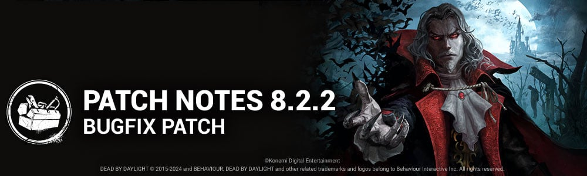

<!-- summary -->
## AI TL;DR

Eight original characters—including Ace Visconti, Feng Min, Kate Denson, Adam Francis, The Hag, The Doctor, The Clown and The Spirit—saw their shop price cut to 125 AC/$1.25, and the Maddening Darkness DLC was lowered to $9.99. The Nemesis’ Licker Tongue now hinders survivors for 1 second, and the Dark Lord received faster bat movement (6.5 m/s), increased teleport speed (12 m/s), a halved shapeshift cooldown (2.5 s) and a reduced Magical Ticket proc chance (10%). The patch also addressed a range of bugs, fixing missing idle and theme sounds, several character animation and addon glitches, collision and interaction issues on multiple maps, and a Fire Up perk token-gain bug.
<!-- /summary -->

<!-- nav -->
&larr; [8.2.1 | Bugfix Patch](469-8-2-1-bugfix-patch.md) · [Live](../../index.md#live) · [8.3.0 | Mid-Chapter](475-8-3-0-mid-chapter.md) &rarr;
<!-- /nav -->

# 8.2.2 | Bugfix Patch

## Important

- From September 12th the pricing of eight of our Original Characters will be reduced, Ace Visconti, Feng Min, Kate Denson, Adam Francis, The Hag, The Doctor, The Clown and The Spirit. These characters will now cost 125 AC/$1.25 USD.
- As a result we will also reduce the price of our Maddening Darkness DLC Pack to $9.99 USD.

## Content

### Killer Updates

#### The Nemesis - Addons

- Licker Tongue Survivors are Hindered for an extra 1 second after being Contaminated. *(was 3 seconds)*

*Note: The Nemesis' Hindered effect was much lower than intended. This is fixed as of this update, prompting the Licker Tongue add-on to be balanced accordingly.*

#### The Dark Lord

- Bat Form movement speed changed to 6.5 m/s (was 6.0 m/s)
- Teleport Speed changed to 12.0 m/s (was 10.0 m/s)
- Shapeshift cooldown changed to 2.5 seconds (was 5.0 seconds)
- Addon Magical Ticket: Reduced to 10% to compensate for increased teleport speed (was 25%)

## Bug Fixes

### Audio

- Fixed missing idle sounds on The Dredge.
- Fixed missing Halloween theme on Michael Myers.
- Fixed an issue that caused The Dark Lord's flame pillar charging sound not being heard from Survivor perspective.

### Characters

- Fixed an issue that caused the Trickster to lack some facial animations when in the lobby.
- Fixed an issue that caused The Dark Lord's Traveler's Hat add-on not to function.
- Fixed an issue where The Dark Lord could attack while transforming.
- Fixed a collision issue with The Dark Lord's Pounce attack.
- Fixed an issue that caused the Nemesis' tentacle strike to apply the incorrect Hindered value to Survivors

### Environment/Maps

- Fixed an issue in the Family Residence where the Dredge would get stuck in a locker
- Fixed an issue in Eyrie of Crows where the killer can't grab from a side of a generator
- Fixed an issue in Toba Landing where the Nurse could blink on top of a stone pillar
- Fixed an issue in Raccoon City Police Station where a character could land on top of a light fixture when vaulting
- Fixed an issue in Nostromo Wreckage that allowed The Nurse to blink underneath the Main Building through the floor of 2 ledges
- Fixed an issue in Toba Landing where fog covered the ceiling and stairs in the basement, obstructing visibility
- Continuing the global clean up of collisions for all maps
- Fixed a window on the Decimated Borgo that could not properly be interacted with.

### Perks

- Fixed an issue that caused the Fire Up perk not to gain tokens when a bot completed a generator

<!-- nav -->
&larr; [8.2.1 | Bugfix Patch](469-8-2-1-bugfix-patch.md) · [Live](../../index.md#live) · [8.3.0 | Mid-Chapter](475-8-3-0-mid-chapter.md) &rarr;
<!-- /nav -->
