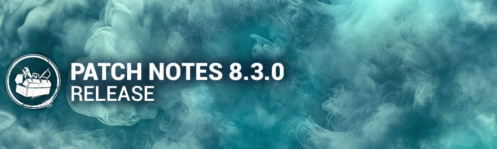

<!-- summary -->
## AI TL;DR

8.3.0 Mid-Chapter rebalances many perks: Blood Echo, Dead Man’s Switch, Deathbound, Predator, THWACK! and Zanshin Tactics get shorter timers or new token rules; survivors gain updates to Bloodrush, Corrective Action, Distortion, Teamwork and other perks with altered cooldowns and aura reveals. Killer adjustments include reduced Hillbilly Overdrive values, constant Skull Merchant drones with faster rotation and a brief haste buff, Twins and Unknown cooldown tweaks, a new window in Springwood, and Cypress Mori added to the basekit.

The update also bundles a bug-fix sweep covering archive challenges, audio cues, bot AI, character animations, map tile generation, void-zone assets, perk icons, platform crashes and UI glitches. PTB changes tweak Deathbound, Zanshin Tactics, Corrective Action and Distortion, while offering reverts are applied.
<!-- /summary -->

<!-- nav -->
&larr; [8.2.2 | Bugfix Patch](471-8-2-2-bugfix-patch.md) · [Live](../../index.md#live) · [8.3.1 | Bugfix Patch](476-8-3-1-bugfix-patch.md) &rarr;
<!-- /nav -->

# 8.3.0 | Mid-Chapter

## Content

### Killer Perk Updates

- **Blood Echo:**  
   When hooking a Survivor, all injured Survivors suffer from Hemorrhage and Exhaustion for **20/25/30 seconds.*(was 45 seconds)  
   Blood Echo* has a cooldown of 80/70/60 seconds. *(REMOVED)*
- **Dead Man'sSwitch:**  
   When hooking a Survivor, *Dead Man's Switch*activates. The first Survivor that stops repairing a generator calls upon the Entity to block it for **40/45/50 seconds**. *(was 35/40/45 seconds)*Dead Man's Switch cannot activate while it is actively blocking a generator. *(NEW)*
- **Deathbound:**  
   When a Survivor heals another Survivor, they scream and activate *Deathbound*. *(Removed the distance requirement)*  
   When the healer is further than **16/12/8 meters** from the Survivor they healed, they are **Oblivious**.  
   This lasts until the healer loses a health state. *(was 60 seconds)*
- **Genetic Limits:**  
   Anytime a Survivor loses a health state, they suffer from the **Exhausted Status Effect**for **6/7/8 seconds**. *(was upon finishing the healing action, and 24/28/32 seconds)*
- **Hex: Crowd Control:**The last **3/4/5**vaults that Survivors rush vault are blocked by the Entity. *(was 14/17/20 seconds)*  
   This lasts until the hex totem is cleansed.
- **Leverage:**When a Survivor performs the unhook action, their healing speed is reduced by **30/40/50%**for **30 seconds.*(was token based, and 3/4/5%)*
- **Machine Learning:**When damaging a generator, it becomes **Compromised.** Only one generator can be **Compromised**at a time. *(Removed the requirement to activate the perk)*  
   When a **Compromised** generator is completed, you become **Undetectable** and gain **10% Haste**for **40/50/60 seconds.**  
   This effect cannot stack.
- **Predator:**  
   When a Survivor escapes a chase, reveal their aura for **6 seconds**. *(NEW)  
   Predator*has a **60/50/40-second**cooldown *(NEW)*
- **THWACK!:**  
  *THWACK*starts with **3 tokens*(NEW)*When breaking a pallet or breakable wall, consume a token. *(NEW)*  
   Survivors within **24 meters**scream, revealing their location for **3/4/5 seconds*(was 28/30/32 meters, and 4 seconds)*When hooking a Survivor, regain **1**token*(NEW)*
- **Zanshin Tactics:**Reveal the aura of pallets and windows within **32 meters.*(removed breakable walls)*Survivors who drop pallets are revealed to you for **6/7/8 seconds**. *(NEW)*

### Survivor Perk Updates

- **Bloodrush:**After being unhooked, *Blood Rush* activates for the next **40/50/60 seconds.**  
   While suffering from **Exhausted**, press the Active Ability Button 1 to recover from **Exhausted** instantly.  
  *Blood Rush*deactivates when used or when performing a conspicuous action.  
  *Blood Rush*is disabled once the exit gates are powered.
- **Corrective Action:**You start the trial with **1/2/3**token(s) and gain a token, up to a maximum of **5**, for every Great Skill Check.  
   When a Survivor fails a Normal Skill Check, 1 token is consumed and their failed Skill Check becomes a Good Skill Check. *(was for coop repairs only)*Additionally, reveal their aura for **6/6/6 seconds**.*(NEW)*
- **Distortion:**Start with 1 token. *(was 3)*  
   When your aura would be read, consume a token and hide your scratch marks and aura for the next **8/10/12 seconds.*(was 6/8/10)*For each 30 seconds spent in chase, gain 1 token, up to 2. *(was while hiding in the Terror Radius)*
- **Inner Focus:**You can see other Survivors' Scratch Marks.  
   Whenever another Survivor loses a health state, the Killer's aura is revealed to you for **6/8/10 seconds**. *(Removed the range condition)*
- **Lucky Star:**When you hide a locker, make no grunts of pain.  
   After exiting the locker, you see the aura of the closest generator, all Survivors, and make no grunts of pain, nor leave blood pools for **30 seconds.*(was 10 seconds)**Lucky Star*goes on cooldown for **40/35/30 seconds*.*
- **Poised:**When first starting repairs on a generator, reveal the Killer's aura for **6 seconds**. *(NEW)*After a generator is completed, leave no scratch marks for **10/12/14 seconds**. *(was 6/8/10 seconds)*
- **Quick Gambit:**When you are being chased, see the aura of other Survivors. *(Removed the range condition)*  
   Survivors working on any generator gain **3/4/5%**repair speed boost. *(was 6/7/8%)*  
  *Quick Gambit*goes on cooldown for **60/60/60 seconds** when you lose a health state. *(NEW)*
- **Teamwork: Collective Stealth:**After being healed by another Survivor, you both leave no scratch marks as long as you stay within **8/12/16 meters**. *(Removed cooldown, was 12 meters)*  
   This effect lingers for **4 seconds** when leaving the range. *(NEW)*  
   This effect does not stack.
- **Teamwork: Power of Two:**When you finish healing another Survivor, you both gain **5% Haste** as long as you stay within **8/12/16 meters**. *(Removed cooldown, was 12 meters)*This effect lingers for **4 seconds**when leaving the range. *(NEW)*  
   This effect does not stack.
- **We're Gonna Live Forever:**When healing another Survivor in the dying state, your healing speed is increased by **150%.*(was 100%)*When completing the heal action, grant them the **Endurance Status Effect**for **6/8/10 seconds**. This effect has a **30-second** cooldown. *(Removed the list of conditions required to trigger this effect)*

### Killer Updates

#### The Hillbilly - Basekit

- Decrease Overdrive dissipation buffer to **8 seconds*(was 15 seconds)*
- Decrease Overdrive chainsaw sprint speed to **12 m/s*(was 13 m/s)*
- Decrease Overdrive charges gained when revving to **1.5/second*(was 2/second)*
- Decrease Overdrive charges gained when sprinting to **1.5/second*(was 2/second)*
- Increase the Chainsaw miss cooldown to **2.7 seconds*(was 2.5 seconds)*

#### The Hillbilly - Addons

- **Discarded Air Filter:**  
   Decrease rarity to Common *(was Rare)*
- **High-Speed IdlerScrew:**  
   Decrease rarity to Uncommon *(was Very Rare)*
- **Dad's Boots:**  
   Increase rarity to Rare *(was Common)*Increases the Chainsaw Sprint turn rate by **20%*(was 30%)*
- **Spiked Boots:**  
   Increase rarity to Very Rare *(was Uncommon)*  
   Increases the Chainsaw Sprint turn rate by **30%*(was 45%)*
- **Lo ProChains:**  
   Chainsaw hits within 5 seconds of breaking a pallet inflict Deep Wound on Injured Survivors *(instead of the Dying State)*

#### The Skull Merchant - Basekit

- The Skull Merchant no longer gains Haste from Survivors having a Claw Trap.
- Survivors who are fast vaulting can no longer be detected by Drones.
- Drones are always in the active state. *(NEW)*
- Decrease the number of scan lines to **1.*(was 2)*
- Drone scan lines are only visible within **16 meters.*(NEW)*
- The Skull Merchant gains **5% Haste** for **8 seconds** when scanning a Survivor within **5 seconds**of deploying a drone or changing a Drone's rotation. *(NEW)*
- Increase the Drones' rotation speed to **95 degrees**per second. *(was 85)*
- Decrease the Hindered penalty when scanned while having a Claw Trap to **8%.*(was 10%)*
- Decrease the Survivor immunity period after being scanned to **2.5 seconds.*(was 3)*
- Decrease The Skull Merchant's movement speed when deploying a Drone or inspecting her Radar to **4.4 m/s.*(NEW)*

#### The Skull Merchant - Addons

- **Ultrasonic Speaker**Decreases immunity period by**10%*(was 25%)***
- **Vital Targeting Processor:**Increases **Hindered from scans by 2%*(was 3%)***
- **Expired Batteries:**All Survivors start the trial with a Claw Trap, which has **50%**normal battery life.  
   Claw Trap battery life increases by **10%** for each Claw Trap received, up to **150%**. *(Note: After the initial Claw Trap of 50%, the next Claw Trap starts at 100% battery life)*

#### The Twins - Basekit

- Increase the cooldown when Victor is crushed to **20 seconds*(was 15 seconds)*
- Increase the cooldown when Victor downs a Survivor to **3.2 seconds*(was 2.7 seconds)*

#### The Unknown - Basekit

- Decrease to Teleport movement speed Recovery to **1.4 seconds*(was 1.7 seconds)*
- Moved Survivor body texture effect from UVX Airborne Hits to successful UVX Weakened Hits *(Weakened Survivors should now have more visual information to track if they have become or are still afflicted by Weakened)*
- Updated sound effect for UVX Airborne Hit to sound more neutral overall
- Updated The Unknown's Killer Power Icon with new smaller icons to better show mechanics and cooldowns

#### The Unknown - Addons

- **Blurry Photo:**  
   After Teleporting, regain full Movement Speed 15% faster *(was 50% faster)*
- **Vanishing Box**  
   Survivors who complete generators become Weakened against UVX  
   Increase Hallucination spawn time by 80%*(NEW)*

### Events & Archives

- Level 1 of Tome 21 - DOMINUS opens October 8, 11:00am Eastern.

### Map Updates

- **Springwood**Added a window in the dead end generator room as a new escape option for Survivors.

## Features

- Cypress Mori is now included as part of the killers basekit abilities, giving the killer the ability to mori the last survivor alive in a trial.
- Cypress Mori offerings will be retired, 1 million bloodpoints will be offered to players, which must be claimed prior to 11am ET on November 7th
- Match Details screen now shows the connection status of the Killer player as well as the normal Survivor players.
- Players can Preview Moris at the Rift Pass

## Bug Fixes

### Archives

- Fixed an issue that caused the "With Your Own hands" challenge not to gain progress when killing a Survivor with the Lich's Recover Artifact.
- Fixed an issue where there was extra text in Memory 3778 that is not reflected in the audio recording from Tome 19 - Splendor.
- Fixed an issue with the "Enlighted" challenge in Tome 1 Level 2 that prevented consistent progress completion among Survivor players.

### Audio

- In 2v8, added a sound cue at the start of a Trial to indicate that the trial started with disconnected players turned into Bots.
- Fixed an issue where The Legion's "Last Sleepover" Outfit used the wrong audio.
- Fixed an issue that caused some Killers outfits to not produce SFX in the menus.
- Fixed an issue that caused the Spirit phasing sound to be too loud from her POV.
- Fixed an issue that caused The Shape to play the Stalking SFX when reaching the Tally Screen.
- Fixed an issue that caused Rain to have the default lobby music instead of the Alien theme.
- Fixed an issue that caused Lara Croft's VO to play during a Mori.
- Fixed an issue that caused Slipknot's Theme to not play when swapping cosmetics.
- Dwight's Mr. Elf outfit is now producing short range SFX when crouching/uncrouching.

### Bots

- Survivor Bots went through a grueling training on how to use Flashlights and are now much better at aiming them and using them mid-chase.
- During the running of 2v8, we found that Huntress Bot was struggling to count. In any future uses of Killer Bots, she'll be able to reload her hatchets even when she has more than 0 hatchets on her.
- Bot brains should correctly initialize if players leave while loading into a Trial.

### Characters

- Fixed an issue that caused the Nemesis' unique roar animation to be missing on the 4th hit
- Fixed an issue that caused survivors to become stuck in the fear animation while in Madness.
- Fixed an issue that made it possible to see inside Victor's head when reappearing.
- Fixed an issue that caused the grace period to be too short with slipstream when being unhooked against The Singularity
- Fixed an issue that caused Survivors to be able to use the Candelabra (Limited item from the Castlevania Lights Out event) or Flashbang items while affected by The Twin's Victor or The Cenobites Chains
- Fixed an issue that caused the Nemesis' add-on Adrenaline Injector not to increase Killer Instinct duration.
- Fixed an issue that caused the Dark Lord's model to become distorted when spectating while the Killer shapeshifted forms.
- Fixed an issue that caused the Dark Lord's bat form camera to sometimes clip through assets at certain angles
- Updated the Description to The Dark Lord's Magical Ticket add-on to reflect the correct value.
- Fixed an issue that caused the Xenomorph's Acidic Blood add-on to only trigger once per trial
- More Legendary Outfits for Killers now come with a custom name.

### Environment/Maps

- Updated the map tile generation to reduce chances of bugs in the future. You may see certain tiles appear more or less commonly than before.
- Fixed multiple issues related to the fading of assets during the Mori Finisher feature
- Fixed multiple issues related to the content released in new 2v8 maps
- Fixed an issue in Dead Dawg Saloon where assets were clipping
- Fixed texture issue on the entity for the void event
- Fixed issues related to the LOD in the void
- Fixed an issue in the void zone where collider volumes were visible
- Optimization of assets in the void zone
- Fixed issue in multiple areas where the Nurse could blink
- Fixed issue allowing Trapper to hide Bear Traps near the ski chalet main entrance on Mount Ormond Resort
- Fixed issue where players would get stuck on debris between the ramp and a locker on Nostromo Wreckage
- Fixed issue where the Nurse could blink behind a wall on the East Wing of Racoon City Police Station
- Fixed issue where the Legion could get stuck on the pipe near the vault of the vat room on Gideon's Meat Plant
- Fixed issue on Lampkin Lane where the moon is missing from the sky
- Fixed issue on Dead Dawg Saloon where players could get stuck going up the stairs of the main building

### Perks

- Fixed an issue that caused the Bardic Inspiration perk buff to only be applied for 30 seconds
- Fixed an issue that caused the incorrect external perk icon to be shown when a Survivor is unhooked with Babysitter.
- Fixed an issue that caused Decisive Strike not to free the Survivor after being caught by the Lich mimic chest.
- Fixed an issue that caused the Eye of Belmont perk to behave inconsistently when paired with Object of Obsession perk.
- Fixed an issue that caused the Weave Attunement debuff icon to remain on a Survivor whilst no longer affected.
- Fixed an issue that caused the Weave Attunement perk icon not to disappear after a Survivor had picked up an item
- Fixed an issue that caused the Moment of Glory perk to lose its charges when entering the dying state
- Fixed an issue that caused the Dark Lord's Sylph Feather add-on to gain tokens when breaking pallets with the Dissolution perk
- Fixed an issue that caused the Invocation: Weaving Spiders perk not deactivate the Wiretap perk when completing a generator

### Platforms

- Improved loading time during splash screen for Xbox Series X.
- Fixed a crash that could occur when Suspending the game on PlayStation consoles.

### UI

- Fixed an issue where too many characters can be entered in the redeem code
- Fixed an issue where the warning icon on the play prompt overlaps with letters
- Fixed an issue where blue lines appear on the screen during loading
- Fixed an issue where finisher mori icon is missing when starting the custom game with only one survivor
- Fixed an issue with inconsistent transparency in the logo image on the loading screen
- Fixed an issue where spectators were able to see input binding buttons
- Fixed an issue that caused the Unknown's Dispel Hallucination progress bar to appear full when approached for the first time

### Misc

- Fixed a crash that could occur when force-exiting the application with Alt-F4 during a Trial.
- Fixed a crash that could occur on servers while loading into a Trial.
- Fixed a crash that could occur while inside a Trial.
- Fixed a crash that could occur when the Killer disconnected from a Trial.
- Fixed an issue that caused the White Ward Survivor Offering not to protect add-on when the Survivor dies with an upgraded item.

## Public Test Build (PTB) Adjustments

### Killer Perk Updates

- **Deathbound:**Deactivates when the affected Survivor loses a health state. *(was upon being hooked)*
- **Zanshin Tactics:**Re-added the old effect of revealing pallets and vaults.Removed Breakable walls from the list of things that it reveals.Reveals Survivors who drop pallets for**6/7/8 seconds.*(NEW)*

### Survivor Perk Updates

- **Corrective Action:**No longer has a maximum range. *(was within 8 meters of your position)*Turns failed skill checks into Good skill checks. *(was turning them into Great skill checks)*  
   Reveals the Survivor who failed the skill check for **6/6/6**seconds. *(NEW)*
- **Distortion:**Re-added the token system. *(was single use)*  
   Regain a maximum of**2 tokens** for each **30 seconds** spent in chase. *(was reactivating on entering a chase)*

### Killer Updates

#### The Hillbilly - Basekit

- Increase Overdrive chainsaw sprint speed to **12 m/s*(was 11.5 m/s)*

#### The Skull Merchant - Basekit

- Survivors who are fast vaulting can no longer be detected by Drones. *(NEW)*
- The Skull Merchant gains **5% Haste** for **8 seconds** when scanning a Survivor within **5 seconds**of deploying a drone or changing a Drone's rotation. *(NEW)*
- Increase the Drones' rotation speed to **95 degrees**per second. *(NEW - was 85)*
- Decrease the Hindered penalty when scanned while having a Claw Trap to **8%.*(was 5%)*
- Decrease the Survivor immunity period after being scanned to **2.5 seconds.*(NEW - was 3)*
- Decrease The Skull Merchant's movement speed when deploying a Drone or inspecting her Radar to **4.4 m/s.*(NEW - was 4.6 m/s)*

#### The Skull Merchant - Addons

- **Ultrasonic Speaker**Decreases immunity period by**10%.***(NEW - was 25%)*
- **Vital Targeting Processor:**Increases Hindered penalty from scans**by 2%.*(NEW - was 3%)*

#### The Unknown - Basekit

- Increase the delay between charging UVX and movement speed penalty to **0.2 seconds*(was 0.07)*

### Misc

Ivory and Ebony Memento Mori Offerings have been reverted back to their former glory, they will continue to allow The Killer to mori Survivors during the match.

### Bug Fixes

- Fixed an issue that caused the Lucky Star perks cooldown to reset when re-entering a locker
- Fixed an issue that caused the No Mither perk to trigger Quick Gambit at the beginning of the trial
- Fixed an issue that caused the Dark Lords secondary chargeable powers to use the main power icon
- Fixed an issue that caused the Machine Learning perk icon to always stay lit up
- Fixed an issue that caused the Predator perk icon not to dim during the cooldown
- Fixed an issue that caused the Predator perk to still generate scratch marker close together
- Fixed an issue that caused the Predator perk to go on cooldown after putting a Survivor in the dying state
- Fixed an issue that caused the Blood Echo perk to be missing an external perk icon in the Survivor perk HUD
- Fixed an issue that caused the Onryo's close to appear in t-pose when Demanifested
- Fixed an issue that caused the perk Teamwork: Power of Two speed buff to stack when two Survivors heal each other
- Fixed an issue that caused the perk Deathbound not to be disabled when being interrupted/grabbed by the Killer
- Fixed an issue that caused the external perk icon for the Hex: Face the Darkness perk to appear when failing a skill check while affected by the Corrective Action perk
- Fixed an issue that caused the Skull Merchant's Drone scan lines to remain visible after the drones despawn when hooking a Survivor nearby

## Known Issues

- Several Killers mori animations have been erroneously changed to FPV. We are working on a fix to rectify this in a future patch.

<!-- nav -->
&larr; [8.2.2 | Bugfix Patch](471-8-2-2-bugfix-patch.md) · [Live](../../index.md#live) · [8.3.1 | Bugfix Patch](476-8-3-1-bugfix-patch.md) &rarr;
<!-- /nav -->
