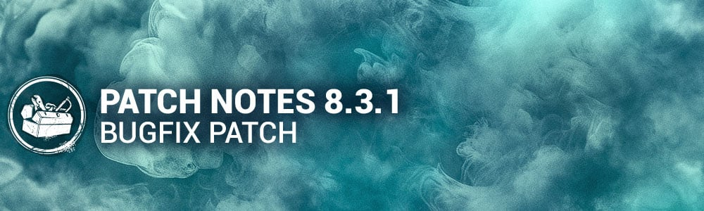

<!-- summary -->
## AI TL;DR

Haunted By Daylight launches on October 17 at 11 am ET, opening its event Tome the same time. The patch also resolves a wide range of bugs: audio glitches for female survivors and Legion’s outfit, bot blind-spot prediction and slower Deathslinger reaction, character visual issues for Renato, Good Guy, Cenobite, Deathslinger’s outfit and Trevor Belmont, several map faults on Badham, Raccoon City Police Station, Suffocation Pit, Wreckers’ Yard, The Game and Mori Finisher assets, and numerous perk malfunctions (Deathbound, Distortion, Hex: Huntress Lullaby, THWACK!, Blood Rush). UI anomalies, matchmaking anti-cheat timeouts, flashlight-while-screaming misuse, and various crashes are also fixed, with Mori animation FPV errors noted for future work.
<!-- /summary -->

<!-- nav -->
&larr; [8.3.0 | Mid-Chapter](475-8-3-0-mid-chapter.md) · [Live](../../index.md#live) · [8.3.2 | Bugfix Patch](477-8-3-2-bugfix-patch.md) &rarr;
<!-- /nav -->

# 8.3.1 | Bugfix Patch

## Content

### Events & Archives

- The Haunted By Daylight event begins October 17th at 11:00 am ET.
- The Haunted By Daylight event Tome also opens October 17th at 11:00 am ET.

## Bug Fixes

### Archives

- Fixed an issue that caused a Tome 21 Killer challenge to be blocked off by two paid content challenges
- Fixed an issue that prevented players from completing the Core Memory: Terrifying Anamnesis challenge from Tome 20.

### Audio

- Fixed an issue causing the Female survivors to not scream when getting hooked by The Dark Lord.
- Fixed an issue causing The Legion's "Last Sleepover" outfit to use the wrong audio.

### Bots

- Survivor bots passed Flashlight training, unfortunately we found blinding killer bots was ineffective. They will now lose location prediction when blinded.
- Survivor bots now have slightly slower reaction time against Deathslinger

### Characters

- Fixed an issue that caused Renato's wrist to appear distorted when he places his hand behind his head while idling in the lobby.
- Fixed an issue that allowed the Good Guy to stack Slice & Dice and use it at any time when cancelling scamper near a window.
- Fixed an issue that caused the Cenobite to be summoned out of bounds when a Survivor used the Lament Configuration in the exit gate area while facing out.
- Fixed an issue with the Deathslinger's Blighted Bounty Hunter outfit weapon that blocked a large portion of the players screen.
- Fixed an issue that caused Trevor Belmont's Soma outfit to have broken facial animations.

### Environment/Maps

- Reverted a change to the Badham map that added a window to a dead end generator room.
- Fixed an issue in Raccoon City Police Station where the Nurse could blink behind walls
- Fixed an issue in the 2v8 version of the map Suffocation Pit where the Hillbilly AI get stuck on the hill
- Fixed an issue in the 2v8 version of the map Wreckers' Yard where a placeholder tile would appear in the map
- Fixed an issue in The Game the map The Game, Gideon Meat Plant where breakable doors would appear over blocker doors
- Fixed a batch of issues related to the fading of assets in the Mori Finisher mode

### Perks

- Fixed an issue that caused the Deathbound perk not to activate when a Survivor was healed by the Anti-Hemorrhagic Syringe medkit add-on.
- Fixed an issue that caused the Deathbound perk to display two debuff perk icons in the external perk widget when two Survivors healed each other.
- Fixed an issue that caused the radial timer on the Distortion perk icon not to appear when activated by an aura reveal.
- Fixed an issue that caused the Cursed status effect to appear before any token is earned on the perk Hex: Huntress Lullaby.
- Fixed an issue that caused the THWACK! perk not to activate when using any Killer's special attack on a dropped pallet.
- Fixed an issue that caused self-unhooking not to activate the Blood Rush perk.

### UI

- Fixed an issue that caused the Good Guy's Slice & Dice charge bar to be visible when activating Hidey-Ho mode.
- Fixed an issue that caused the Mori Finisher icon to not replace the Hook Count icon in the Killer HUD when only one Survivor remained.
- Fixed an issue in the Loading screen to prevent displaying a "facing specific killer" tip after 3 times faced.
- Fixed a softlock in an online lobby when one user leaves the lobby 5 seconds before the countdown ends.

### Misc

- Fixed an issue that caused matchmaking anti-cheat timeout errors after long sessions.
- Fixed an issue that caused Survivors to receive the Killer Stun score event when dropping a pallet and failing to rescue a carried Survivor.
- Flashlights can no longer be used while screaming.
- Fixed an issue that caused Survivors to erroneously see the Killers bubble notifications.
- Fixed an issue that caused the game to crash when the Killer bot Mori'd the player in the Tutorial.
- Fixed an issue that caused the game to crash when the Lich cast any spell when the game ends and left the tally screen before all other users after a match.
- Fixed an issue that prevented players from bringing Event Items into Custom Games.

## Known Issues

- Several Killers' Mori animations have been erroneously changed to FPV. We are working on a fix to rectify this in a future patch.

<!-- nav -->
&larr; [8.3.0 | Mid-Chapter](475-8-3-0-mid-chapter.md) · [Live](../../index.md#live) · [8.3.2 | Bugfix Patch](477-8-3-2-bugfix-patch.md) &rarr;
<!-- /nav -->
