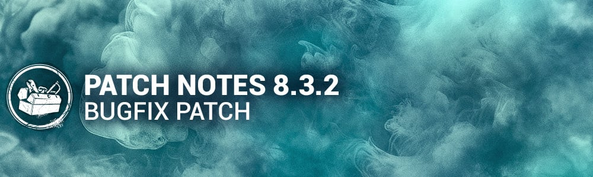

<!-- summary -->
## AI TL;DR

The Skull Merchant basekit receives a speed revert to 4.6 m/s while inspecting her Radar, gains constant drone scan-line visibility and aura reveal within 32 m. Killer perks Machine Learning, Predator and Zanshin Tactics have their aura durations shortened, and survivor perks Distortion, Inner Focus and We’re Gonna Live Forever see timing and trigger adjustments. The Flashbang perk and Firecracker items are re-enabled, the Haunted by Daylight event tome advances to Levels 2 and 3, and bloodpoint rewards for several scoring events are increased.

The patch also fixes Halloween event glitches, missing audio SFX, numerous character animation and ability bugs, map breakable-wall spawns and navigation issues, a platform crash on EAC shutdown, and cross-progression DLC sharing. A PS5-only update addresses potential graphical glitches on the Pro model.
<!-- /summary -->

<!-- nav -->
&larr; [8.3.1 | Bugfix Patch](476-8-3-1-bugfix-patch.md) · [Live](../../index.md#live) · [8.4.0 | Doomed Course](482-8-4-0-doomed-course.md) &rarr;
<!-- /nav -->

# 8.3.2 | Bugfix Patch

## Content

- The Flashbang perk and Firecracker items have been re-enabled.
- The Level 2 of the Haunted By Daylight event tome opened October 24th at 11:00 am ET.
- The Level 3 of the Haunted By Daylight event tome opens October 31st at 11:00 am ET.
- Bloodpoint values for several Haunted by Daylight scoring events have been increased.

### Killer Updates

#### The Skull Merchant - Basekit

- Reverted The Skull Merchant's movement speed when Inspecting her Radar to **4.6 m/s.**
- The Skull Merchant sees scan lines from her Drones at all times. *(NEW)*
- The Skull Merchant sees the aura of scan lines when Inspecting her Radar within **32 meters** of the Drone(s). *(NEW)*

### Killer Perk Updates

- **Machine Learning:** Decreased the duration of the effect once activated to **35/40/45 seconds**. *(was 40/50/60 seconds)*
- **Predator:**  
   Decreased the duration of the aura reveal to **4 seconds**. *(was 6 seconds)*
- **Zanshin Tactics:** Decreased the duration of the aura reveal to **3/4/5 seconds**. *(was 6/7/8 seconds)*

### Survivor Perk Updates

- **Distortion:** Decreased the requirement to regain a token to **15 seconds** in chase*. (was 30 seconds)*
- **Inner Focus:** Now only triggers from health state loss caused by the Killer.
- **We're Gonna Live Forever:** Revert the heal speed increase to **100%**. *(was 150%)*

## Bug Fixes

### Halloween Event

- Fixed an issue that caused Killers to be able to unleash a Captured Haunt and perform a basic attack in quick succession.
- Fixed an issue that caused the Killer's Void Empowered tracker not to properly update when using a Haunt immediately after picking it up.
- Fixed an issue that caused the Blighted Serum add-on to make the Blight's power unusable.
- Fixed an issue that caused Zarina's Spirited Hair head customization to have a lighter skin tone.
- Fixed an issue that caused several Haunted by Daylight outfit icons to be missing glowing VFX.
- Fixed an issue that caused the Captured Haunt projectile to be blocked by the Knight's Guards.
- Fixed an issue that caused the Cenobite to play the wrong animations when interacting with any Void Rift, Portal or Station.
- Fixed an issue that caused the unopened portals in the Void Zone to play the open portal SFX.

### Archives

- Fixed an issue that caused the Nostalgic Axe Charm to be unlocked for all players without unlocking Tier 50 in the Tome 21 Rift.

### Audio

- Fixed an issue that caused the Generator to have missing SFX in the Tutorial.
- Fixed an issue that caused the Entity "Attack" SFX to be missing on hook phase transitions.
- Fixed an issue that caused the Dark Lord's Hellfire charge SFX to be too low.
- General optimization pass to fix issues that caused multiple SFX to be missing.

### Characters

- Fixed an issue that caused several Killers' Mori animations to be entirely in FPV.
- Fixed an issue that caused the Dark Lord's Sylph Feature and Ruby Circlet add-on combo to increase the Hellfire cooldown.
- Fixed an issue that caused the Dark Lord to be able to use Hellfire through some walls when changing directions before using the power.
- Fixed an issue that caused Survivors to be inflicted by Deep Wound when hit with a basic attack after the Hillbilly used his chainsaw with the Lo Pro Chains add-on.
- Fixed an issue that caused the Doctor's Illusionary pallets aura to be shown as both standing and dropped.
- Fixed an issue that caused the Spirit's Husk to have the Killers red stain when Undetectable.
- Fixed an issue that caused the Good Guy's Scamper ability to bypass the 90 degree camera lock.
- Fixed an issue that caused the Good Guy's Hidey-Ho Mode to go on cooldown even if Slice & Dice was still being charged or used.
- Fixed an issue that caused the Knight to be able to kick generators (among other interactions) while setting a path for a Guard.
- Fixed an issue that caused the Skull Merchant's drones scan lines to sometimes spawn inconsistently when deployed.
- Fixed an issue that caused the Darkness effect to disappear on the Dredge after teleporting to a second locker.
- Fixed an issue that caused the Blight to sometimes play the fatigue animation after using Lethal Rush.
- Fixed an issue that caused the Wraith to be unable to move or attack after doing certain interactions when using the Serpent - Soot add-on.
- Fixed an issue that caused Survivors to have no facial expressions when caught by the Cenobites chains.

### Environment/Maps

- Fixed an issue that caused multiple breakable walls to spawn inside the Asylum building in the Disturbed Ward map.
- Fixed an issue that caused 5 breakable walls to spawn inside the main building in the Coal Tower map.
- Fixed an issue that caused breakable walls to spawn close together or on top of each other in multiple maps.
- Fixed multiple issues related to the camera fading since the release of the Mori Finisher Feature
- Fixed multiple issues related to the adaptation of maps for the 2v8 mode
- Fixed an issue in the Nostromo's map where the Nurse can blink on top of rocks
- Fixed an issue in Dead Dawg Saloon where the AI can't navigate properly when the target is standing on the table of the saloon
- Updated a loop around the Groaning Storehouse where the players could abuse the branching of the vaults
- Added Hooks spawners on the second floor of the Father Campbell's Chapel
- Fixed an issue in the Nostromo's map where the Nurse could blink and get stuck in the main structure

### Platforms

- Fixed an issue that caused a crash when EAC Shutdown

### Cross-progression

- Fixed an issue that enabled family shared DLC on Steam to be used on other platforms with cross progressed accounts

### Misc

- Fixed an issue that caused the Killer client to crash when being blinded by a Flashbang or Firecracker at a specific moment at the end of their mori.
- Fixed an issue that caused Survivors spam healing another Survivor in a corner of a map to potentially snap out of bounds.
- Tentatively fixed the issue where players would face desync if they played the game on Low settings.

## Known Issues

- The post-uncloak movement speed is missing when destroying a Breakable Wall or Pallet, or damaging a Generator, with The Wraith's "The Serpent" - Soot add-on.

ADDENDUM

November 4th 11am ET: Update to Playstation 5 only, to prevent potential graphical issues on PS5 Pro. This does not affect crossplay.

<!-- nav -->
&larr; [8.3.1 | Bugfix Patch](476-8-3-1-bugfix-patch.md) · [Live](../../index.md#live) · [8.4.0 | Doomed Course](482-8-4-0-doomed-course.md) &rarr;
<!-- /nav -->
