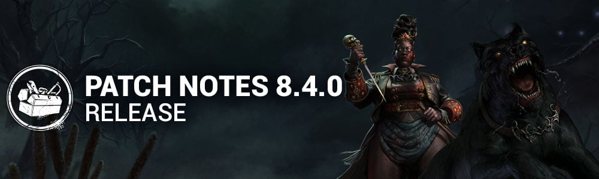

<!-- summary -->
## AI TL;DR

The Houndmaster arrives as a new Killer with the Scent of Blood power, adding Chase and Search commands, and three exclusive perks (All-Shaking Thunder, Scourge Hook: Jagged Compass, No Quarter). New Survivor Taurie Cain joins with three unique perks (Invocation: Treacherous Crows, Clean Break, Shoulder the Burden). The update also reduces Sacrificial Ward Offering rarity, tweaks dozens of existing Killer and Survivor abilities, rebalances several perks, and overhauls UI elements such as the activity and perk HUDs, inbox, and store carousel. It ships with a large batch of bug fixes covering map geometry, character interactions, UI crashes, and PTB-only issues for the Houndmaster and her dog, plus performance and collision tweaks.
<!-- /summary -->

<!-- nav -->
&larr; [8.3.2 | Bugfix Patch](477-8-3-2-bugfix-patch.md) · [Live](../../index.md#live) · [8.4.1 | Bugfix Patch](483-8-4-1-bugfix-patch.md) &rarr;
<!-- /nav -->

# 8.4.0 | Doomed Course

## Content

### New Killer - The Houndmaster

#### Killer Power - Scent of Blood

The Houndmaster and her dog operate as one. Her commands are followed without question or delay.

**Special Ability: Chase**

The Chase Command sends the dog out at high speed. Pressing the Power button again redirects the Chase, pivoting the dog's path. When the dog catches a Survivor, the dog starts a Grab. The Survivor becomes Hindered and is pulled toward The Houndmaster. The Survivor can get free by stunning the dog or can be rescued by another Survivor. Grabs that end without Injury leave the Survivor Hindered. Grab duration is shorter for Survivors with the Endurance status effect.

**Special Ability: Search**

The Search Command sends the dog to a target location, creating a Search Path. It has its own lullaby and, as it moves, its Houndsense radius rises over distance traveled. Survivors who enter the radius are affected by Houndsense and revealed by Killer Instinct. If The Houndmaster follows the dog’s Search Path, she gains increased movement speed over time. Leaving the Search Path ends the bonus movement speed.

**Special Effect: Houndsense**

Healthy Survivors affected by Houndsense receive Deep Wounds when Injured. Injured Survivors affected by Houndsense suffer from louder Grunts of Pain and longer Pools of Blood when put into the Dying state.

#### New Killer Perks:

- **All-Shaking Thunder**
  - After you fall from a height, your lunge attack distance is increased by **75/75/75%** for **8/12/16 seconds**.
  - This perk has a **5/5/5-second** cooldown.
- **Scourge Hook: Jagged Compass**
  - At the start of the trial, up to 4 random hooks are changed into scourge hooks. You see their auras in white.
  - When a Survivor is unhooked from a non-scourge hook, it becomes a scourge hook.
  - When you hook a Survivor on a Scourge Hook, the aura of the generator with the most progress is revealed in yellow for **6/8/10 seconds**.
- **No Quarter**
  - When a Survivor reaches **75/75/75%** of a self-heal, they are faced with continuous skill checks.
  - If one of these skill checks is missed or the heal is interrupted, the Survivor becomes broken for **20/25/30 seconds**.

### New Survivor - Taurie Cain

#### New Survivor Perks:

- **Invocation: Treacherous Crows**
  - When in the Basement near the circle, press the ability button 2 to begin the Invocation.
  - Invocations take **60/60/60 seconds**. Other Survivors will see your aura during this and can join an ongoing interaction.
  - Once the Invocation is completed:
    - You become injured and broken for the rest of the trial.
    - When a Survivor is in the Terror Radius and the Killer scares a crow, their aura is revealed to all Survivors for **1/1.5/2 seconds**.
  - Completing the Invocation disables that perk for all Survivors.
- **Clean Break**
  - After you finish healing another Survivor, while being healed by another Survivor, press the ability button 1 to gain broken.
  - After **80/70/60 seconds**, you become healthy.
  - *This perk does not activate if you are already broken. The effect is cancelled if you go in the dying state.*
- **Shoulder the Burden**
  - Once per trial, as long as you are not on death hook, press the ability button 2 in front of a hooked Survivor to unhook them.
  - When they are unhooked, they lose 1 hook state and you gain 1 hook state. You also scream and become Exposed for **60/50/40 seconds**.

### General Updates

- Decreased the Sacrificial Ward Offering rarity to Common. *(was Rare)*

### Killer Updates

#### The Dark Lord - Basekit

- Increase shapeshift cooldown to 3.5 seconds *(was 2.5)*
- Vampire Form: Increase Hellfire cooldown to 10 seconds *(was 7)*
- Wolf Form: Increase the spawn rate of Scent Orbs to 1 every 5 seconds *(was 1 every 6 seconds)*
- Wolf Form: Decrease Wolf's pounce charge time to 0.85 seconds *(was 1)*

#### The Demogorgon - Basekit

- Decrease Portal setting time to 0.85 seconds *(was 1)*
- Decrease Portal entry time to 1.35 seconds *(was 1.5)*
- Increase Upside Down travel speed to 28 m/s *(was 20)*

#### The Demogorgon - Addons

- **Viscous Webbing:**
  - Increases the Sealing time of Portals by 10% *(was 16%)*
- **Thorny Vines:**
  - Increases the Area of Effect of Active Portals by 1 meter
  - Increases the Sealing time of Portals by 8% *(was 11%)*
- **Upside Down Resin:**
  - Increases the Sealing time or Portals by 20% *(was 28%)*
- **Lifeguard Whistle:**
  - Reveal Survivors near active portals without charging Of The Abyss *(REMOVED)*
  - Increases the number of Portals by 2 *(NEW)*

#### The Ghost Face - Basekit

- Decrease Night Shroud's cooldown to 17 seconds *(was 20)*
- Decrease the time to Mark Survivors to 4.5 seconds *(was 5)*

#### The Ghost Face - Addons

- **"Philly":**
  - Decreases the time to mark Survivors by 10% *(was 20%)*
- **Walleye's Matchbook:**
  - Decrease Night Shroud's recovery time by 3 seconds *(was 6)*

#### The Good Guy - Basekit

- Decrease the Scamper time to 1 second (was 1.3)
- Increase Hidey-Ho Mode's cooldown to 12 seconds *(was 10)*

#### The Good Guy - Addons

- **Rat Poison:**
  - Decreased range to 6 meters *(was 12)*
  - Decreased duration to 2.5 seconds *(was 5)*

#### The Lich - Basekit

- Decreased Dispelling Sphere's cooldown to 35 seconds *(was 38)*
- Decreased Flight of the Damned's cooldown to 35 seconds *(was 38)*
- Decreased Fly's cooldown to 25 seconds *(was 38)*
- Increased Mage Hand's cooldown to 40 seconds *(was 38)*
- Increased the cooldown after cancelling a spell to 1.25 seconds *(was 1)*
- Decreased the time Dispelling Sphere disables magic items to 45 seconds *(was 60)*

#### The Lich - Addons

- **Pearl of Power:**
  - Decreases the cooldown of all Spells by 3 seconds after a successful Basic Attack *(was 5)*
- **Ring of Spell Storing:**
  - Decreases the cooldown of all Spells by 2 seconds *(was 4)*

#### The Mastermind - Basekit

- Decreased Virulent Bound's cooldown to 5.5 seconds *(was 6 seconds)*

#### The Mastermind - Addons

- **Leather Gloves:**
  - Decreases Virulent Bound's cooldown by 8% *(was 10%)*

#### The Shape - Basekit

- Increased Evil Within I movement speed to 4.4 m/s *(was 4.2 m/s)*
- Increased maximum stalk per Survivor to 20 points *(was 10)*
- Decreased the amount of Evil Within required to reach Evil Within II to 3 *(was 5)*
- Increased the Evil Within gain multiplier when stalking from afar to 1 *(was 0.1)*
- Decreased the Evil Within gain multiplier when stalking from up close to 0.4 *(was 1)*

#### The Shape - Addons

- **Fragrant Tuft of Hair:**
  - Increased the Evil Within III requirement to 20 *(was 10)*
- **Lock of Hair:**
  - Decreased the Evil Within III requirement to 50% *(was 100%)*
- **Judith's Tombstone:**
  - Increased the Evil Within III requirement to 20 *(was 10)*
- **Tombstone Piece:**
  - Increased the Evil Within III requirement to 15 *(was 7.5)*
- **Scratched Mirror:**
  - Decreases Evil Within I movement speed to 4.2 m/s *(NEW)*

### Killer Perk Updates

- **Distressing:**
  - Your Terror Radius is increased by 20/25/30%. *(was 22/24/26%)*
  - Gain 100% more Bloodpoints for actions in the Deviousness category. *(REMOVED)*
- **Dominance:**
  - The first time each totem and each chest is interacted with by a Survivor, that totem or chest is blocked by the Entity for 8/12/16 seconds. *(was 4/6/8)*
- **Hex: Thrill of the Hunt:**
  - For each Dull and Hex Totem remaining on the map, gain a Token.
  - Gain 10% more Bloodpoints for actions in the Hunter category for each Token. *(REMOVED)*
  - Survivors' Cleansing and Blessing speed is reduced by 10/12/14% for each Token. *(was 8/9/10%)*
- **Human Greed:**
  - You see Unopened Chests auras and Survivor auras are revealed for 3/3/3 seconds when they enter a 8/8/8-meter range.
  - You also gain the ability to kick chests to close them. This ability has a 30/25/20-second cooldown. *(was 60/45/30 seconds)*
- **Languid Touch:**
  - When a Survivor within 36 meters of you scares a crow, they gain the Exhausted status effect for 6/8/10 seconds.
  - This perk has a 5-second cooldown. *(was 20 seconds)*
- **Weave Attunement:**
  - When any item becomes depleted for the first time each match, it is dropped. You see the auras of dropped items.
  - Survivors within 8 meters of dropped items have their auras revealed to you. *(was 12 meters)*
  - Affected Survivors see the item's aura. *(NEW)*
  - When a Survivor picks up a Survivor item, they suffer the Oblivious status effect for 20/25/30 seconds.

### Survivor Updates

#### General

- Decreased the time it takes to unlock chests to 8 seconds *(10 seconds)*

### Survivor Perk Updates

- **Ace in the Hole:**
  - When retrieving an item from a chest, there is a 100% chance that a Ultra Rare (or lower) add-on will be attached to it. *(was Very Rare or lower)*
  - 50/75/100% chance to finding an add-on of Uncommon rarity or lower. *(was 10/25/50%)*
  - When escaping, keep any add-ons your item has.
- **Buckle Up:**
  - Updated the perk's description for clarity.
- **Invocation: Weaving Spiders:**
  - Description was updated to match the new invocation (Treacherous Crows), but no gameplay change otherwise.
- **No One Left Behind:**
  - Once the Exit Gates are powered, gain the following effects:
  - 50/75/100% additional Bloodpoints for healing and unhooking other Survivors. *(REMOVED)*
  - 50/75/100% bonus actions speed when healing and unhooking other Survivors. *(was 30/40/50%)*
  - When unhooking a Survivor, they gain a 10% movement speed bonus for 15 seconds. *(was 7% for 10 seconds)*
  - The aura of all other Survivors are revealed to you.
- **Pharmacy:**
  - When injured, Pharmacy activates *(REMOVED)*
  - Unlocking chests is 70/85/100% faster. *(was 40/60/80% faster)*
  - The hearing distance for noises from unlocking chests are reduced by 20 meters. *(was 8 meters)*
  - Pharmacy guarantees an Emergency Med-Kit upon completing the interaction.
- **Plunderer's Instinct:**
  - The auras of unopened chests and items in the environment are revealed to you when standing within a 32/48/64 meters range. *(was 16/24/32 meters)*  
     Increases the odds of finding higher rarity items from chests by 50%. *(was 14/24/46%)*
- **Scene Partner:**
  - Scene Partner activates when you are in the Killer's Terror Radius.
  - Whenever you look at the Killer, scream, then see the Killer's aura for 4/5/6 seconds. *(was 3/4/5 seconds)*
  - There is a chance you will scream again, if you do, you will see the Killer's aura for an additional 2 seconds.
  - Scene Partner then goes on cool-down for 40 seconds. *(was 60 seconds)*

### Events & Archives

- "Bone Chill" seasonal event begins December 12 at 11:00am Eastern.
  - This seasonal event also features an event tome opening at the same time.

## Features

### Survivor Activity HUD Improvements

- All activities will now surface their progress on the activity HUD *(previously was just Generators and Recovery)*
- A new activity was created to differentiate when a Survivor is Mending or Healing themselves
- A new activity was created to differentiate when a Survivor is Blessing a totem
- Some Killer power interactions which were previously missing are now included on the activity HUD

### Perk HUD improvement

- Visual differentiation between a Perk being temporally unavailable from being disabled completely. First time implementation for new Invocation Perk.

### Characters' Bio Pages

- Re-added Power and Perks previews on Bio page

### Store

- Featured Page main carousel can also display Bundles.
- Featured Page bundle widget is now a carousel that shows Bundles and Collections.

### Inbox

- A new Inbox, accessible from the main menu, replaces the old News section. The Inbox contains two tabs:
  - News: key announcements, events info, game modes info, etc.
  - Messages: contains messages with rewards to claim and other miscellaneous messages.
- Notifications:
  - The notification on the Inbox icon indicates unread messages or unclaimed rewards.
- “Read/Claim All” Button:
  - Quickly mark all messages as read and claim all associated rewards with a single action.
- Sticky News:
  - Important global announcements now pinned at the top of the News tab.
- Auto-Deletion:
  - News and messages are automatically removed after expiration.

## Bug Fixes

### Archives

- Fixed the titles or descriptions of some challenges across various tomes to improve consistency and clarity.

### Bots

- Improved Survivor bot locomotion.

### Characters

- Fixed an issue that caused the Executioner's Cage to sometimes spawn in occupied locations.
- Fixed an issue that caused the Onryo's Demanifest invisibility duration to be shorter than intended.

### Environment/Maps

- Fixed missing cracks during the End Game Collapse
- Fixing floating assets on multiple maps.
- Fixed brief bright light when returning to the Main Menu from the Store.
- Fixed sudden brief burst of bright light when viewing a Mori.
- Fixed occurrences of exit tiles not matching themed maps.
- Fixed a visible seam at the Exit Gates on Ormond Lake Mine.
- Fixed pools of blood that failed to appear in multiple places on the Ormond Lake Mine
- Fixed missing textures on multiple tiles of the Ormond Lake Mine
- Fixed a clipping issue the bridge in Ormond Lake Mine
- Fixed collision issues on tunnel stairs, tower scaffold ground, and tower tile collisions, on Ormond Lake Mine
- Reworked complex collisions preventing Killer projectile to pass through on the top floor of the Ormond Lake Mine Building
- Fixed issues of Camera Fade exclusion for the Mori Update feature
- Fixed an issue in Lery's Hospital where the Killer could not grab a survivor from one side of a generator
- Fixed an issue with collision on Ironworks of Misery
- Fixed an issue with collision on The Underground Complex
- Fixed an issue with collision on The Nostromo Wreckage

### Perks

- Fixed an issue that caused Hex: Thrill of the Hunt interaction speed values to be incorrect if cleansed before Hex: Undying.
- Fixed an issue that caused Deathbound not to be disabled when grabbed by the Killer.
- Fixed an issue that caused Hex: Devour Hope to gain a token when a Survivor self unhooks with the Deliverance perk.
- Fixed an issue that could cause Survivors to get stuck inside lockers after triggering Dominance.

### UI

- Fixed an issue where cinematics can be skipped by L-stick or R-stick on the controller.
- Fixed a crash that could occur when using the virtual keyboard.
- Fixed an issue where the Beginner Tooltip text can be seen overflowing in certain languages.
- Fixed an issue where the Prestige button's progress bar isn't reacting accordingly to the Bloodpoints balance.
- Fixed a crash that could occur when equipping and unequipping the banner and badge.
- Fixed an issue where the Survivor action icon on the player status is missing after spectating the killer in a custom game.
- Fixed an issue where the blood splatter effect on the player status is missing in various states.
- Fixed an issue where unnecessary lines appear when opening the event popup.
- Fixed an issue where playing Mori animation and leaving the store at the same time would make the lobby have a black screen.
- Fixed an issue that caused the Event Tome to display the incorrect time remaining.

### Misc

- Fixed an issue where platform exclusive outfits cannot be seen by other platform players
- Fixed an issue that caused Aestri Yazar, Lara Croft, Trevor Belmont, The Lich and The Dark Lord Prestige outfits unlock in wrong order.
- The Wraith is now correctly able to move and attack after doing certain interactions when using the "The Serpent - Soot" Add-on
- Fixed an issue that caused Killers to be able to spam the Mori interaction.
- Fixed an issue that could sometimes cause the screen to flash bright when getting unhooked after being hooked in the Void during the Halloween Event.

## Public Test Build (PTB) Adjustments

### New Killer - The Houndmaster

#### POWER

- Completed Generators now appear light orange to The Houndmaster (enabling Search Command targeting at any point during the Trial)
- Increased Chase Command acceleration on dog to 32 m/s *(was 29 m/s)*
- Increased Chase Command Redirect linger time once dog completes distance to 1 second *(was 0.7 seconds)*
- Reduced Chase Command camera transition time from The Houndmaster to dog when activating Redirect to 0.25 seconds *(was 0.5 seconds)*
- Reduced Chase Command camera transition time from dog to The Houndmaster after ending Redirect to 0.25 seconds *(was 0.5 seconds)*
- Search Command detection zone to target objectives has been increased and should now be easier to aim
- Search Command cooldown reduced to 0.5 seconds *(was 5 seconds)*
- Increased Search Command's starting Houdsense radius size to 2.5 meters *(was 1.5 meters and not working as intended on PTB)*
- Increased Killer movement speed bonus while running on Search Path to 6.0 m/s *(was 5.2 m/s)*
- Survivors afflicted with Houndsense now appear bright red to The Houndmaster

#### ADD-ONS

- Knotted Rope: Basic attack cooldown against grabbed Survivors reduced to 10% *(was 40%)*

### Survivor Perks

- **Shoulder the Burden:**
  - Increased Exposed duration from 30/25/20 to 60/50/40 seconds,

### Bug Fixes

#### The Houndmaster / Taurie Cain

- Fixed an issue that caused the Patrol Ground Target & Preview Radius to remain visible when the Dog arrives at the Patrol destination.
- Fixed an issue that caused the Patrol Ground Target VFX not to fade out when the Dog is pallet stunned while on a Patrol command.
- Fixed an issue that caused the Survivor's HUD to show the Broken status effect while in a Dog struggle.
- Fixed an issue that caused the Houndmaster not to be able to be blinded by flashlights when the Dog was in front of her.
- Fixed an issue that caused the Houndmaster to be blinded while in Redirect mode.
- Fixed an issue that caused the dash to sometimes not occur when using Redirect before the camera gets to the Dog.
- Fixed an issue that caused the Cancel prompt to appear for the pet Dog interaction if the user's had the Interaction Behavior setting on toggle.
- Fixed an issue that caused the Dog's Patrol path not to disappear when the Dog was stunned.
- Fixed an issue that caused the Dog's teleportation VFX to be missing when performing a mori while the Dog was away.
- Fixed an issue that caused the healing interaction not to be cancelled when starting a Dog struggle.
- Fixed an issue that caused the Redirect command to be activated while the Killer is mid air.
- Fixed an issue that caused the Head On perk not to stun the Dog.
- Fixed an issue that caused Killer Instinct not to linger on Survivors for 2 seconds when detected by the Dog returning from its Patrol path.
- Fixed an issue that caused the Dog's Patrol detection radius to be smaller than intended.
- Fixed an issue that caused the rescue Survivor from Dog struggle animation to play only at the end of the interaction.
- Fixed an issue that caused the Dog to injure Survivors that are moving near vault points.
- Fixed an issue that caused the Dash Command Dodged score even to trigger for Survivors hit by the Dog's Dash command.
- Fixed an issue that prevented the Dog from being stunned while the Houndmaster was in Redirect mode.
- Fixed an issue that caused multiple Houndmaster score events not to have their points reduced after earning them multiple times.
- Fixed an issue that caused the Dog not to fully jump over a pallet during a Dash.
- Fixed an issue that caused the Houndmaster to be able to use a basic attack directly after sending a Dash or Patrol Command.
- Fixed an issue that rarely caused the acceleration not to trigger when walking in a Patrol trail.
- Fixed an issue that caused the Dog's patrol path to appear above ground level when the patrol is sent to a different elevation.
- Fixed an issue that caused the aim indicator for the search command to bounce quickly between two distances when looking up and down.
- Fixed an issue that caused the Redirect chase to only be activated at the end of a Dash command.
- Fixed an issue that caused the Exhausted effect from the Unfinished Map add-on to continue ticking down while the Survivor sprints.
- Fixed an issue that caused The Houndmaster's Dog panting to be too loud.
- Fixed an issue that caused The Houndmaster's voice lines to overlap in the lobby.
- Fixed an issue that caused The Houndmaster's Dog to perform a growl whenever it landed.
- Fixed an issue that caused The Houndmaster's to have missing Footsteps while charging a Command.
- Fixed an issue that caused The Houndmaster's to have missing subtitles.
- Fixed an issue that caused Taurie Cain to have missing distant screams.

#### Perks

- Fixed an issue that caused Survivors to jump unnaturally when placing a Chemical Trap on a pallet.
- Fixed an issue that caused Scourge Hook: Jagged Compass not to trigger on self unhooks.
- Fixed an issue that caused No Quarter to give the Broken status effect when stopping a self-heal before reaching 75%.
- Fixed an issue that caused the external perk icon for No Quarter not to appear during the hard skill check part.
- Fixed an issue that caused the external perk icon for No Quarter to appear after the hard skill check part.
- Fixed an issue that caused Clean Break to deactivate when entering the dying state before having triggered the perk.
- Fixed an issue that caused Clean Break not to trigger while being healed by another Survivor with Clean Break equipped.
- Fixed an issue that caused the external perk icon for Deathbound not to appear for Survivors when affected by the perk.
- Fixed an issue that caused Shoulder the Burden and Reassurance to interfere with each others input when near a hooked Survivor.
- Fixed an issue that caused the Killer's HUD not to show the correct amount of hooks when Survivors use Shoulder the Burden.
- Fixed an issue that caused Invocation: Weaving Spiders and Invocation: Treacherous Crows not to activate when started at the same time.

#### Misc

- The art exhibits in the "Art Gallery" Player Card Banner have had small adjustments
- Fixed an issue that caused lighting issues in the lobby and Mori preview
- Fixed a PTB issue that caused wrong loadout presets.
- Fixed an issue that caused unproper error popup when start steam game without steam account connection.
- Fixed an issue that caused the Knight Lobby animation to not play properly.
- Fixed an issue that caused killers to jump backwards when stunned by a pallet.
- Fixed an issue that caused The Dark Lord to jitter at the end of the Break Pallet animation.
- Fixed an issue that caused the Hillbilly's shotgun to experience visual desynchronization after crashing into a wall.
- Fixed an issue that caused Survivors not to be sacrificed to the Entity when hiding in a locker at the end of the End Game Collapse timer.
- Fixed an issue that caused the Plague's move speed while vomiting to be slower than intended.

#### Environment/Maps

- Fixed multiple issues relating to the fading of assets with the integration of the Mori System
- Fixed an issue in the Temple Of Purgation where Zombies could not reach the Mausoleum tile
- Fixed an issue in Mother's Dwelling where performance was impacting the loading of the map
- Fixed an issue in Ormond Lake Mine where killers could not use their powers in the tower
- Fixed an issue in Lery's Hospital where The Singularity could not deploy biopods in specific tiles

<!-- nav -->
&larr; [8.3.2 | Bugfix Patch](477-8-3-2-bugfix-patch.md) · [Live](../../index.md#live) · [8.4.1 | Bugfix Patch](483-8-4-1-bugfix-patch.md) &rarr;
<!-- /nav -->
