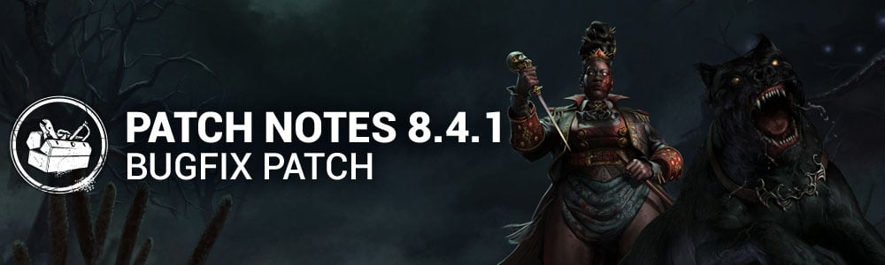

<!-- summary -->
## AI TL;DR

The Houndmaster’s Chase Command cooldown drops to 4 s, completed generators turn light orange, Houndsense only shows within 20 m, and aura outlines are dimmed; addons gain longer Training Bell reveals, extended Mangled/Haemorrhage, and lower Gunpowder Tin bonus. The Dark Lord’s Medusa’s Hair hinder penalty is cut to 8 % for 3 s, Demogorgon’s Upside-Down speed rises to 32 m/s, Good Guy’s Hidey-Ho cooldown becomes 14 s and Slice & Dice lasts 1.8 s at 8 m/s. Human Greed now reveals chests and survivor auras longer and adds a quick kick, while Weave Attunement drops depleted items with aura visibility and inflicts Oblivious on pickup. The patch also fixes audio glitches, character power bugs, map collisions, perk prompt and token errors, and UI inventory refresh issues.
<!-- /summary -->

<!-- nav -->
&larr; [8.4.0 | Doomed Course](482-8-4-0-doomed-course.md) · [Live](../../index.md#live) · [8.4.2 | Bugfix Patch](484-8-4-2-bugfix-patch.md) &rarr;
<!-- /nav -->

# 8.4.1 | Bugfix Patch

## Content

### Killer Updates

#### The Houndmaster - Basekit

- Chase Command cooldown reduced to 4 seconds *(was 5 seconds)*
- Completed Generators now appear light orange to The Houndmaster after charging Search Command (*previously Completed Generators were visible at all times)*
- Houndsense Radius only visible to a Survivor when the dog is within 20 meters of them *(previously was visible at any range)*
- Survivors afflicted with Houndsense appear with reduced color and opacity outline to The Houndmaster *(red tint used to blend too much with Killer Instinct feedback)*

#### The Houndmaster** - Addons

- **Training Bell:**
  - Increased the Survivor aura reveals to 8 seconds *(was 5 seconds)*
- **Spiked Collar:**
  - Increase the duration of the Mangled and Haemorrhage status effects to 60 seconds *(was 45 seconds)*
- **Gunpowder Tin:**
  - Reduced the action speed bonus to 30% *(was 40%)*
- **Marlinspike:**
  - Updated effect to exclude grabbed Survivor from receiving Houndsense *(was previously all Survivors within 20m of location of Dog Grab)*
  - Description updated to reflect change of effect

#### The Dark Lord - Addons

- **Medusa's Hair:**
  - Decreased the Hindered penalty to 8%. *(was 15%)*
  - Decreased the Hindered penalty duration to 3 seconds. *(was 5 seconds)*

#### The Demogorgon - Basekit

- Increase Upside Down suggested velocity to 32 m/s *(was 28 m/s)*

#### The Good Guy - Basekit

- Increased Hidey-Ho Mode's cooldown to 14 seconds *(was 12 sec)*
- Increased Slice & Dice duration to 1.8 sec. *(was 1.2 sec)*
- Decreased Slice & Dice movement speed to 8 m/s. *(was 10 m/s)*

#### The Shape - Basekit

- Increased the Evil Within gain multiplier when stalking from up close to 0.6 *(was 0.4)*

### Killer Perk Updates

- **Human Greed:**
  - You see Unopened Chests auras and Survivor auras are revealed for 3/4/5 seconds when they enter a 8/8/8-meter range. *(was 3/3/3 seconds)*
  - You also gain the ability to kick chests to close them. This ability has a 10/10/10-second cooldown. *(was 30/25/20 seconds)*
- **Weave Attunement:**
  - When any item becomes depleted for the first time each match, it is dropped. You see the auras of dropped items.
  - Survivors within 12 meters of dropped items have their auras revealed to you. *(was 8 meters)*
  - Affected Survivors see the item's aura.
  - When a Survivor picks up a Survivor item, they suffer the Oblivious status effect for 20/25/30 seconds.

## Bug Fixes

### Archives & Events

- Fixed an issue where the challenge "Means To An End" in Tome 6 - DIVERGENCE was not properly tracking progress from successful pallet stuns after a dropped pallet was reset.
- The Tome 6 challenge Means To An End can now be correctly completed.

### Audio

- Fixed an issue that caused Memory Shard idling sound to be audible after collecting it.
- Fixed an issue that caused the Demogorgon to be able to spam Grunts while interacting with a Glyph.
- Fixed an issue that caused The Skull Merchant's Radar to persist when inspecting the Radar multiple time.
- Fixed an issue that caused The Spirit and Yun-Jin Lee to play the wrong menu theme music for their 'Cozy Break' outfits.
- Fixed an issue that caused The Dark Lord Hellfire's sound to keep playing after getting Stunned during charging.

### Characters

- Fixed an issue that caused the Lute to not dissolve after selecting any item for Aestri Yazar or Baermar Uraz.
- Updated the animation for Female Survivors: it is now intentional for them to no longer grip the Huntress's axe during the Memento Mori.
- The Lich's Fly spell can now correctly fly through vaults when the Survivor is on another side.
- Survivors' M1 action to remove The Doctor's Madness no longer randomly fails.
- Getting downed by Deep Wound while in the Struggle phase with a Mimic no longer locks the animation.
- Fixed an issue that caused the Plague to no longer have a cooldown when cancelling Vile Purge.
- The Cenobite's chains correctly spawn faster while a Survivor blesses a totem while carrying the Lament Configuration.

### The Houndmaster

- Fixed an issue that caused the Dog to grab Survivors that are being killed by the Entity during the End Game Collapse.
- Fixed an issue that caused the Dog's Chase command to always vault if it is next to a vault location in Redirect mode.
- Fixed an issue that caused the trail boost to have no effect when starting a chase on the search path.
- Fixed an issue that caused the Dog to get stuck on walls and fail to dash when the Killer quickly sends the dash command on the other side of a wall.
- Fixed multiple path finding issues with the Dog in various maps.
- The Dog no longer teleports at the start of a dash.
- The Dog patrol path can appear above ground level when the patrol is sent to a different elevation.
- Fixed an issue that caused the Houndsense Killer Effect to be removed when an injured Survivor is grabbed.
- Fixed an issue that caused the Houndsense Killer Effect timer to reset if a Survivor was hit while having the Endurance effect.
- Fixed an issue that caused the power not to visually appear on cooldown when spectating.
- Fixed an issue that caused spectators not to see the reverse Red arrow marker when The Houndmaster points at objects with the patrol ability.
- The Nipping at Your Heels score event is no longer earned twice when the survivor escapes the trial with Houndsense.

### Environment/Maps

- Fixed issues of Camera Fade exclusion for the Mori Update feature.
- Fixed a placeholder textures in the main building tile on the Eyrie Of Crows map.
- Fixed issues related to the collisions around the Shuttle on the Nostromo Wreckage map.
- Fixed issue in the Raccoon Police Department where collisions were preventing The Nurse, The Houndmaster, and The Cenobite to use their powers properly in the front part of the building.

### Perks

- The Corrective Action perk no longer gains tokens on a successful "Snap Out of It" Skill Check from The Doctor.
- Fixed an issue that caused the Invocation perks to use the wrong input button prompts.
- Fixed an issue that caused Survivors auras to be missing around a newly created Scourge Hook when using Scourge Hook: Jagged Compass and Scourge Hook: Hangman's Trick while carrying a Survivor.
- Fixed an issue that caused the Clean Break prompt to be seen briefly after recovering from the Dying State with the Broken status effect.
- Fixed an issue that caused Unnerving Presence to only affect the first skill check when No Quarter is active.
- The White Aura of the Invocation Ring is no longer visible to all Survivors after an Invocation has been completed.
- The Dance With Me perk is no longer missing 3 seconds of cooldown.

### UI

- Fixed an issue with a superfluous Blood Mark displayed behind the Survivor's HUD portrait icon when a Survivor stuns the Houndmaster's Dog using a Pallet while being chased.
- Fixed an issue where the Perk Inventory was not instantly refreshed after purchasing a perk in the Shrine of Secrets.
- Fixed an issue with the Inventory Tooltip in the Tally Scoreboard that could be partially cut-off.

### Misc

- Fixed an issue where unowned perks show up as disabled in the loadout presets with "None Remaining" in tooltip description.

<!-- nav -->
&larr; [8.4.0 | Doomed Course](482-8-4-0-doomed-course.md) · [Live](../../index.md#live) · [8.4.2 | Bugfix Patch](484-8-4-2-bugfix-patch.md) &rarr;
<!-- /nav -->
