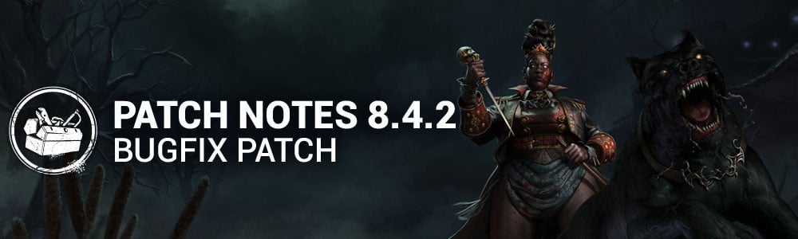

# 8.4.2 | Bugfix Patch

## Content

### Killer Updates

#### The Houndmaster - Basekit

- Chase Command cooldown reduced to 3 seconds *(was 4 seconds)*
- Increased the time it takes The Houndmaster to recover movement speed from cancelling Chase Command to 1 second *(was 0.85 seconds)*
- Reduced the movement speed penalty from cancelling Chase Command to 3.0 m/s *(was 2.0 m/s)*
- Increased the time it takes The Houndmaster to recover movement speed from cancelling Search Command to 1 second *(was 0.85 seconds)*
- Increased hitbox of Dog while performing Chase Command to 0.65 meters *(was 0.5 meters)*
- Increased Window and Pallet vault speed of Dog while performing Chase Command to 0.45 seconds *(was 0.9 seconds)*
- Reduced Chase Command camera transition time from The Houndmaster to Dog when activating Redirect to 0.15 seconds *(was 0.25 seconds)*
- Reduced Chase Command camera transition time from Dog to The Houndmaster after ending Redirect to 0.15 seconds *(was 0.25 seconds)*
- Updated Dog pathfinding during Grab to pull Survivors towards coordinates where the Grab was started *(was previously towards The Houndmaster's location at moment of Chase Command activation)*
- Increased the amount of Hindered status effect applied to Survivor caught in a Grab to 10% *(was 3%)*

#### The Houndmaster - Addons

- Knotted Rope: Basic attack cooldown against grabbed Survivors reduced to 2% *(was 10%)*

### Killer Perk Updates

- **Hex: Thrill of the Hunt:**
  - For each Dull and Hex Totem remaining on the map, gain a Token.
  - Survivors' Cleansing and Blessing speed is reduced by 8/10/12% for each Token. *(was 10/12/14%)*

### Archives & Events

- Chaos Shuffle returns January 16, 2025 at 11:00am Eastern.
  - This event includes an event tome featuring **Dungeons & Dragons** themed rewards.

## Bug Fixes

### Bots

- Trained survivor bot to use the perk Invocation: Treacherous Crows.

### Characters

- Fixed an issue that caused The Houndmaster to temporarily become stuck during the break generator animation when spectating.
- Fixed an issue that caused The Houndmaster's Dog's Search to have the wrong icon when charging the power.
- Fixed an issue that caused The Houndmaster's Swap Command icon to remain lit up when charging the power.
- Fixed an issue that caused The Houndmaster's Chase command not to injure vaulting Survivors.
- Fixed an issue that caused The Houndmaster's Dog to vault at the same vault location being used by a Survivor.
- Fixed an issue that caused The Houndmaster's Dog to bring the Survivor back to the location that the command was given when in a struggle.
- Fixed an issue that caused the Detected killer instinct to linger indefinitely on affected survivors if The Houndmaster's Dog remains next to them after the patrol detection radius is gone.
- Fixed an issue that caused The Houndmaster's Dog to vault over elevated vaults that players normally fall from.
- Fixed an issue that could cause a crash when The Houndmaster left a trial.
- Fixed an issue that caused The Demogorgon to be missing the Hold arrow icon for Traverse Upside Down action.
- Fixed an issue that caused The Nurse to be able to cancel her blink when releasing the input while looking down at an obstacle.

### Environment/Maps

- Fixed a window on Ormond Lake Mine map that caused a Killer projectile impact issue.
- Fixed various issues with fading on Mori animations.
- Fixed an issue that allowed the Dark Lord's pillars of Hellfire to go outside of the Exit Gates with the Add-on "Alucard's Shield".
- Fixed issues in The Nostromo Wreckage map that prevented the power of The Nurse and The Houndmaster from working properly.
- Fixed issues in The Underground Complex where The Nurse could use her power and get out of bounds on the map.
- Fixed multiples issues in all realms where the camera rotation at the beginning of a game would clip inside the head of The Houndmaster.
- Fixed issues in The Underground Complex where some of the ground did not appear.
- Fixed an issue Gideon Meat Plant where an invisible collision would prevent the players from navigating from the bottom floor to the second floor.
- Fixed an issue in Raccoon City Police Station where the players could stand on top on a couch.
- Fixed an issue in Suffocation Pit where a snowman would block the path of the players.
- Fixed an issue in Crotus Prenn where The Nurse would get stuck when blinking on wooden ramp on the second floor of the building.
- Fixed an issue in Haddonfield where The Nurse or The Cenobite could use their power outside of the limit of the map around the exit gates.

### Perks

- Fixed an issue that caused Save the Best for Last not to lose tokens when damaging a Survivor with The Houndmaster's Dog.
- Fixed an issue that caused Play With Your Food not to lose tokens when damaging a Survivor with The Houndmaster's Dog.
- Fixed an issue that caused THWACK! not to display Survivor auras when destroying a pallet or breakable wall.
- Fixed an issue that caused Survivors to still have grunts of pain when using Clean Break with other interaction.
- Fixed an issue that caused a missing audio cue when dropping a Flashbang.
