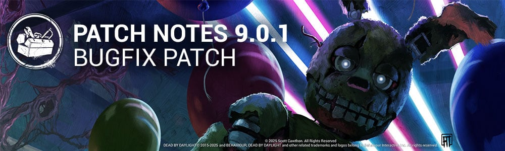

<!-- summary -->
## AI TL;DR

AFK Crows now grant points more slowly, with longer intervals (120-180 s), a 30-second grace period, and reduced accrual rates while moving or after Exit Gates power. The Animatronic receives visual aura tweaks, new Deviousness-based score events and added survivor score triggers for camera reveals, axe removal and door entry, while its axe and grab mechanics are fixed. The 9th Anniversary Twisted Masquerade event returns June 26. The patch also addresses a wide range of bugs: audio loops, missing SFX, invisible killers, map texture glitches, character animation stalls, platform crashes and UI warnings, plus numerous specific issues with The Animatronic, killers, survivors and maps.
<!-- /summary -->

<!-- nav -->
&larr; [9.0.0 | Five Nights at Freddy's](510-9-0-0-five-nights-at-freddys.md) · [Live](../../index.md#live) · [9.0.2 | Bugfix Patch](512-9-0-2-bugfix-patch.md) &rarr;
<!-- /nav -->

# 9.0.1 | Bugfix Patch

## Features

**AFK Crows**

- Increased the intervals at which AFK Crows are gained to 120/140/180 seconds *(was 60/75/90 seconds).*
- Increased the Grace Period before AFK points start accruing to 30 seconds *(was 10 seconds).*
- Decreased the rate at which AFK points accrue while moving to 25% *(was 50%).*
- Decreased the rate at which AFK points accrue after Exit Gates are powered to 25% *(NEW).*
- Reset AFK points upon completing interactions *(previously removed 60 AFK points).*

## Content

### The Animatronic

- Adjusted the color of your current door position when operating the Security Cameras as a Survivor to improve the aura color distinction.
- Adjusted the following score events for The Animatronic:
  - Got 'Em now awards Deviousness points *(was Brutality).*
  - When Got 'Em triggers, a regular Hit score event will also trigger that awards 300 Brutality points *(NEW).*
  - Yoink now awards Deviousness points *(was Brutality).*
  - When Yoink triggers, a regular Hit score event will also trigger that awards 300 Brutality points *(NEW).*
  - Another One! now awards Deviousness points *(was Hunter).*
  - Look at You now awards Deviousness points *(was Hunter).*
- Added score events for Survivors facing The Animatronic:
  - Say Cheese awards 700 Boldness points upon revealing the Killer through a Security Camera *(NEW)*.
  - Do It Yourself awards 350 Survival points upon self-removing an attached Fire Axe *(NEW)*.
  - Friend in Need awards 500 Altruism points upon participating in a co-op action to remove an attached Fire Axe from a fellow Survivor *(NEW)*.
  - Door to Door awards 100 Survival points upon entering a Security Door *(NEW)*.

### Events

- The 9th Anniversary "Twisted Masquerade" event returns Thursday, June 26th at 11:00 AM Eastern.

## Bug Fixes

### Archives

- Fixed an issue that caused "Invalid input: This item is not in the user's inventory database" to be incorrectly displayed to players.

### Audio

- Fixed an issue that caused Security Camera SFX to get stuck in a loop after Survivors moved the camera.
- Fixed an issue that caused the Hatch's SFX to be audible when traversing from one Security Door to another.
- Fixed an issue that caused the Killer's Terror Radius to be inaudible while a Survivor was inside a Security Door and both the Killer and Survivors are idle.
- Fixed an issue that caused Security Camera movement SFX to only be audible when looking at the camera of the Security Door being used by the Survivor.
- Fixed an issue that caused chase music to be missing for Survivors when chased by Victor.
- Fixed an issue that caused one of The Animatronic's voice lines to be silent when interacting with an occupied locker.
- Fixed an issue that caused the Animatronic's Axe SFX to still be audible when thrown outside of a map's boundaries.
- Fixed an issue that caused the French voiceover lines of The Good Guy to be missing.
- Fixed an issue that caused the SFX for The Artist's Leshen outfit to be louder than her other outfits.

### The Animatronic

- Fixed an issue that caused The Animatronic to be temporarily invisible when exiting a Security Door.
- Fixed an issue that caused Survivors to see a single frame of the map when transitioning through Security Cameras.
- Fixed an issue that caused an error when hit by The Animatronic's Axe while affected by Endurance.
- Fixed an issue that caused The Animatronic's Grab Axe action to be temporarily disabled if a Survivor triggers an emote.
- Fixed an issue that caused The Animatronic to be unable to grab Survivors during a co-op Axe removal.
- Fixed an issue that caused the Remove Axe prompt to have priority over the Travel Via Passage prompt for Survivors.
- Fixed an issue that caused The Animatronic's Got 'Em scoring event to trigger incorrectly on hooked Survivors.
- Fixed an issue that caused The Animatronic's Survivor carrying speed to be inconsistent.
- Fixed an issue that caused certain Security Doors to be usable from behind.
- Fixed an issue that caused The Animatronic's Security Room jumpscare to gave an abrupt fade in & out visual effect.
- Fixed an issue that caused The Animatronic's prompt to retrieve their Axe to display incorrectly when the Axe is thrown outside the map.
- Fixed an issue that caused co-op Axe removal actions to not cancel when attacked.
- Fixed an issue that caused the game to desynchronize if a Survivor entered a Security Door behind The Animatronic as he grabs another Survivor.
- Fixed an issue that caused The Animatronic's Axe to disappear when thrown into Security Doors.
- Fixed an issue that caused The Animatronic's Axe to disappear when thrown at the lower part of any interactive object (i.e. breakable door).
- Fixed an issue that caused The Animatronic's Yellow Rabbit face to become distorted when reclaiming the Axe.

### Characters

- Fixed an issue that caused certain Killers to be missing their weapons on the Main Menu.
- Fixed an issue that caused the camera to get stuck after the first camera pan when The Onryō triggers a Mori on a Survivor.
- Fixed an issue that caused Main Menu animations to be missing for Killers.
- Fixed an issue that caused The Plague to get stuck at 4.4 base speed after being pallet stunned while charging Vile Purge.
- Fixed an issue that caused The Plague's Corrupt Purge to change back to Vile Purge if the time runs out mid-action.
- Fixed an issue that caused rapid camera stutters for The Ghoul when grabbing Survivors with its power.
- Fixed an issue that caused The Ghoul's cooldown of Kagune Leap to not reset properly after destroying pallets.
- Fixed an issue that caused The Ghoul's Enraged mode bonus cooldown to not be correctly applied to actions.
- Fixed an issue that caused hooks to not turn into Scourged Hooks when controlling Victor with the 'Scourge Hook: Jagged Compass' perk.
- Fixed an issue that caused Survivors to not become Broken when missing a No Quarter skill check against The Houndmaster.
- Fixed an issue that caused The Houndmaster's dog to bypass its leap animation for pallet vaults when redirected.
- Fixed an issue that caused Dwight to be unable to self-unhook properly during the Survivor tutorial.

### Environment/Maps

- Fixed an issue that caused a stretched texture to be visible on the carpet in the main building of the Father Campbell's Chapel map.
- Fixed an issue that caused hooks in the Autohaven Wreckers realm to have placeholder textures.
- Fixed an issue that caused Survivors to be unable to access the basement on the Shelter Woods map.
- Fixed an issue that caused The Animatronic to be unable to interrupt a Survivor interacting with a Security Door across multiple maps.
- Fixed an issue that caused a placeholder tile to spawn in the Coldwind Farm realm.
- Fixed an issue that caused projectiles to get stuck on an invisible collision above a wooden table on the Freddy Fazbear's Pizza map.
- Fixed an issue that caused the camera to clip inside The Houndmaster during her spawn animation in the Withered Isle realm.
- Fixed an issue that caused projectiles to hit an invisible collision in the Gideon Meat Plant realm.
- Fixed an issue that caused Survivors and killers to be able to climb on top of objects on the Freddy Fazbear's Pizza map.

### Platforms

- Fixed an issue that caused a crash on Switch 2 when launching the application.
- Fixed an issue that caused directional Survivor SFX to not work properly after exiting Security Camera view.
  - *Note: A fix for this issue was previously deployed on Steam last week.*

### UI

- Fixed an issue that caused the "Cannot start with 2 Killer(s)" warning to disappear after transitioning from the Store to a Custom Game lobby.
- Fixed a potential crash issue when exiting a Trial immediately after making progress on a challenge.

### Miscellaneous

- Fixed an issue that caused the pick up interaction to have higher priority over Locker Search when a downed Survivor is next to a locker.

## Known Issues

- On Steam and Windows, a flashing light can sometimes be seen when the user hovers over the Friends menu and their online state refreshes after tabbing out of the title.

<!-- nav -->
&larr; [9.0.0 | Five Nights at Freddy's](510-9-0-0-five-nights-at-freddys.md) · [Live](../../index.md#live) · [9.0.2 | Bugfix Patch](512-9-0-2-bugfix-patch.md) &rarr;
<!-- /nav -->
