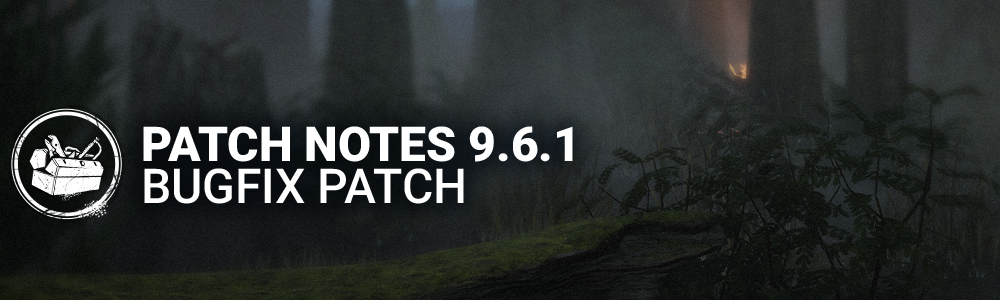

<!-- summary -->
## AI TL;DR

Doctor's Shock Therapy delay was shortened to 0.65 seconds and Ghost Face’s crouch speed raised to 4 m/s, while the new Discipline add-ons further cut the Doctor’s detonation delay. The update also refreshed the Diminishing Returns list in the manual, tweaked the progress-bar animation, and increased Mastermind’s Bound token timer for 2v8. The bulk of the patch comprises extensive bug fixes covering 2v8 map collisions, AI pathing, audio balance, character visual glitches, perk interactions, UI friend-list issues and server disconnects.
<!-- /summary -->

<!-- nav -->
&larr; [9.6.0 | Patch Notes](544-9-6-0-patch-notes.md) · [Live](../../index.md#live) · [9.6.2 | Bugfix Patch](546-9-6-2-bugfix-patch.md) &rarr;
<!-- /nav -->

# 9.6.1 | Bugfix Patch

## Features

### Diminishing Returns Update

- Diminishing Returns section in the Game Manual updated.
  - Now lists all Action Speeds and Modifiers affected by Diminishing Returns in a Trial.

### Progress Bar Update

- Adjusted the arrows animation on the progress bar to better reflect the speed of the bar filling.

## Content

### Killer Updates

**The Doctor**

- Decreased delay of Shock Therapy attack to **0.65 seconds**. *(was 0.75 seconds)*

**The Ghost Face**

- Increased default Crouch movement speed to **4.0 m/s**. *(was 3.8 m/s)*

### Killer Add-ons Updates

**The Doctor's add-ons**

- "Discipline" - Class II (Uncommon)
  - Decreases the detonation delay of Shock Therapy by **0.06 seconds**. *(was 0.1 seconds)*
- "Discipline" - Class III (Rare)
  - Decreases the detonation delay of Shock Therapy by **0.08 seconds**. *(was 0.15 seconds)*
- "Discipline" - Carter's Notes (Very Rare)
  - Decreases the detonation delay of Shock Therapy by **0.1 seconds**. *(was 0.2 seconds)*

### 2v8

The core changes to Mastermind are now applied in 2v8. The time it takes to gain a Bound token has been increased to maintain balancing (5s → 5.5s).

**The Mastermind Innate Skill**

- Increases time to gain a Bound token by 0.5 seconds.

## Bug Fixes

### 2v8

- Fixed an issue where The Dark Lord's castle was missing with 4 specific Killers.
- Fixed an issue where the Antidote item was held horizontally or clipped inside the Survivor's arm when facing The Mastermind and The Nemesis.
- Fixed an issue where the Scout was able to reveal the Killer's aura regardless of the distance to all Survivors within 64 meters of the Killer.
- Fixed an issue where the movement speed from Scout class stacked when applied to a crouching Survivor.
- Fixed an issue where the Torchbearer was unable to use its Team skill.
- Fixed an issue where the Escapist Team Skill ability was unable to give the Haste bonus after another Survivor was Sacrificed.
- Fixed an issue where Survivors were able to relocate infinitely during the End Game Collapse.
- Fixed an issue where the 2v8 Event Entry Overview popup Play buttons were placeholder in several languages.

### Audio

- Fixed an issue where The Trickster's laugh was not heard across the map when reaching S-Rank.
- Fixed an issue where subtitles for Stranger Things characters' French VO's were incorrect.
- Fixed an issue where The First's voice lines are missing when reaching the last quarter of the Doomclock while Grandfather Clocks are unused by all Survivors.
- Fixed an issue where Eleven couching grunts for French VO's were too loud.
- Fixed an issue where MiNA's lullaby can be heard during the Mori.
- Fixed an issue where Killers equipped with Blighted outfits were missing customization SFX.
- Fixed an issue where some specific sounds related to Killer Power were sometime louder than ordinary.
- Fixed an issue where Menu music was unbalanced between different menus and music cues.
- Fixed an issue where The Good Guy's attack swing audio could be heard twice when preparing a lunge attack.
- Fixed an issue where The Ghoul's SFX was too loud.
- Fixed an issue where certain Killer SFX and actions were too loud.

### Bot Improvements

- Fixed an issue with AI characters being unable to traverse the top of one of the stairs in Hawkins National Laboratory.

### Characters

- Fixed an issue where The Krasue's head detaches during the Hook animation in Head Form.
- Fixed an issue where The Animatronic's Axe Throw was unable to be tracked by the Chaser score event on damaging hits.
- Fixed an issue where The Animatronic's Grab Axe could cause a desync when performed on Survivors entering Lockers.
- Fixed an issue where The Animatronic's Grab Axe action did not appear if Survivors were too close to the Killer.
- Fixed an issue where the Survivors' cough was silent when hiding in a locker while infected by The Nemesis' T-Virus.
- Fixed an issue where The Dark Lord's Hellfire Spell VFX stayed in the Killer's hand after the Killer Power was cancelled by a Pallet Stun.
- Fixed an issue where The Knight was unable to see noise notifications for cleansed totems when in Guard Summon mode.
- Fixed an issue where the Survivors' footsteps VFX were missing when above a Xenomorph Tunnel, and where an Aura was missing between the Control Station and the Exit.
- Fixed an issue where The Executioner's 1st instance of Trail of Torment could spawn at another nearby location where Trail of Torment had been used earlier.
- Fixed an issue where an Item was unable to be in a Survivor's Back Pocket when Picking Up the Lich's Eye or Hand.
- Fixed an issue where, after Scampering, The Good Guy's camera could become corrupted and lock into place for the duration of the trial.
- Fixed an issue where Survivors slammed in a corner by The Mastermind were blocked by The Mastermind's collision.
- Fixed an issue where The Mastermind was able to cancel the special vault fatigue with a basic attack.
- Fixed an issue where The Mastermind had no remaining momentum when pressing a directional input while hitting a collision with Virulent Bound.
- Fixed an issue where The Mastermind was able to grab Survivors with Virulent Bound while they were dropping pallets. (tentative fix)
- Fixed an issue where The Trickster ''Frosty Eyes'' Head Outfit caused texture issues when swapping from another head outfit.

### Environment/Maps

- Fixed an issue in Dead Dawg Saloon where The Nightmare could not teleport properly to a generator on a balcony in the back of a structure.
- Fixed an issue in Trickster's Delusion where Killers would get stuck on a collision on a food cart.
- Fixed an issue where projectiles of Killers would be blocked by a collision above the fire barrels.
- Fixed an issue in Pale Rose where the navigation of players were hindered by the placement of a Xenomorph tunnel entry.
- Fixed an issue in Disturbed Ward where The Nurse could blink on top of the structure.
- Fixed an issue in Toba Landing where a Survivor clips through a locker when entering.
- Fixed an issue in Sanctum of Wrath where The Plague's projectile would be blocked by an invisible collision.
- Fixed an issue in Raccoon City Police Station - West Side where The Trapper's Trap would clip through the ground.
- Fixed an issue in the Toba Landing map by creating LODs for plants to avoid LOD popping throughout the map.
- Fixed an issue where the Exit Gates opening was slightly delayed after playing more then 1 match.

### Perks

- Fixed an issue where the Obsession changed to another Survivor when Dramaturgy gave a key with the Wedding Ring Key add-on to the Obsession.
- Fixed an issue where The Krasue's Regurgitate removed a token from the Perk Play with Your Food.
- Fixed an issue where the Perk Chemical Trap used the Marked Aura type.
- Fixed an issue where the Perk Wire Tap used the Marked Aura type.
- Fixed an issue where the Perk Bada Bada Boom used the Marked Aura type.
- Fixed an issue where the Perk Reassurance was unable to be reapplied to a Survivor that previously used the Anti-Camp Self unhook.
- Fixed an issue where the Perk Game Afoot incorrectly applied the Haste Status Effect on Wall Special Break.
- Fixed an issue where an Injured Survivor's aura was revealed inside a Locker with the Boon: Circle of Healing Perk.

### Misc

- Fixed an issue where players were randomly disconnected by server.
- Fixed an issue where certain assets and Killer Powers with a white default aura appeared in a purple aura.
- Fixed an issue where players were unable to complete the Achievement 'Collision Course'.

### UI

- Fixed an issue where players could have duplicate of the same friends in friends list.
- Fixed an issue where players could select two friends at the same time in the friends list.
- Fixed an issue where players could not add new friends on certain platforms.

<!-- nav -->
&larr; [9.6.0 | Patch Notes](544-9-6-0-patch-notes.md) · [Live](../../index.md#live) · [9.6.2 | Bugfix Patch](546-9-6-2-bugfix-patch.md) &rarr;
<!-- /nav -->
