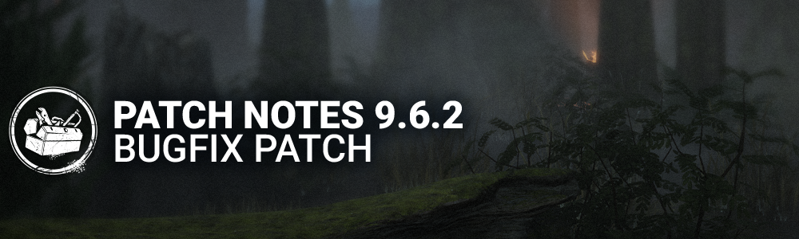

<!-- summary -->
## AI TL;DR

The Pig's Amanda’s Letter add-on has been re-enabled, restoring its effect on Rift Breaker Tokens. The patch also delivers a broad sweep of stability fixes: audio glitches for the Krasue, Nightmare, Dredge, Tomie and Demogorgon are resolved; visual and animation bugs for survivors and killers such as Feng Min, Xenomorph, Blight, Nurse and several add-ons are corrected; map collision and camera issues in Freddy Fazbear’s Pizza, Midwich Elementary and The Forgotten Ruins are fixed; perk misbehaviors like Phantom Fear, Nowhere to Hide, Leader and Hex: No One Escapes Death are addressed; and platform-specific problems on PC, Switch and Switch 2—including controller icons, resize crashes and stray logos—are patched. A tentative fix for flashing lights in trials is also included.
<!-- /summary -->

<!-- nav -->
&larr; [9.6.1 | Bugfix Patch](545-9-6-1-bugfix-patch.md) · [Live](../../index.md#live) · [10.0.0 | Jason Patch Notes](550-10-0-0-jason-patch-notes.md) &rarr;
<!-- /nav -->

# 9.6.2 | Bugfix Patch

## Important

- The Pig's Amanda's Letter add-on has been re-enabled.

## Bug Fixes

### 2v8

- Fixed an issue where the Play buttons were greyed out in the Overview tab after viewing the Quests.

### Audio

- Fixed an issue where The Krasue had missing SFX when Hooking Survivors in Body and Head Form.
- Fixed an issue where The Nightmare activates the Dream Snare attack and the SFX audio is distorted for the Survivor nearby.
- Fixed an issue where the Dredge's "Nightfall soon" SFX Volume is louder than usual inside a Locker.
- Fixed an issue where Tomie's audio persist in other trials against The Spirit.
- Fixed an issue where The Demogorgon's Red Moss add-on did not silence the gurgling SFX when exiting a portal.

### Characters

- Fixed an issue where some Feng Min outfits had clipping issues around the skirt during multiple animations.
- Fixed an issue where The Xenomorph had a small object sticking from its head during the lobby.
- Fixed an issue where the the Survivors' footsteps VFX are missing when above The Xenomorph Tunnel and also an Aura between the Control Station and Exit.
- Fixed an issue where The Pig's add-ons Amanda's Letter, Jigsaw's Sketch, and Jigsaw's Annotated Plan did not affect the number of RBTs available.
- Fixed an issue where The Executioner's Obsidian Goblet add-on prevented the perk Spirit Fury to work correctly when using ranged attacks.
- Fixed an issue where The Blight did not lose Tokens when breaking a pallet with 3 or less Tokens.
- Fixed an issue where The Nurse was missing her fatigue animation from Survivor POV.

### Environment/Maps

- Fixed an issue in Freddy Fazbear's Pizza where the camera clips inside assets.
- Fixed an issue in Midwich Elementary School where the hooks are not accessible.
- Fixed an issue with the large stack of cages in The Forgotten Ruins by replacing collision primitives to fix a gap between cages that was blocking projectiles from being thrown through.
- Fixed an issue in the astrology room in The Forgotten Ruins by fixing collisions and repairing a corrupted 3D file to fix a vault point that had extended collision, blocking projectiles from being thrown through at an angle.

### Perks

- Fixed an issue where Phantom Fear could trigger on a Survivor despite the Killer not being in view.
- Fixed an issue where Nowhere to Hide was unable to reveal Survivors in the dying state.
- Fixed an issue where Leader remained active after the Survivor is Sacrificed.
- Fixed an issue where the totem aura was missing from Survivor POV when Hex: No One Escapes Death was active.

### Platforms

- Fixed an issue on PC where DualSense PS controller would have incorrect icons.
- Fixed an issue on PC where resizing the game could cause a crash.
- Fixed an issue on Switch/Switch 2 where a Steam logo was visible in the Player Stats Access page.

### Misc

- Tentative fix to address flashing lights in a trial.

<!-- nav -->
&larr; [9.6.1 | Bugfix Patch](545-9-6-1-bugfix-patch.md) · [Live](../../index.md#live) · [10.0.0 | Jason Patch Notes](550-10-0-0-jason-patch-notes.md) &rarr;
<!-- /nav -->
