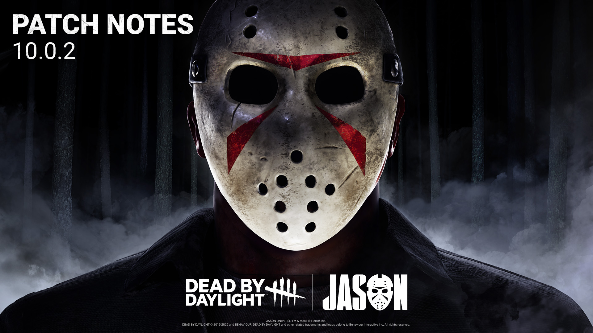

<!-- summary -->
## AI TL;DR

The Doctor returns to the 10th Anniversary Event queue, and the Slasher’s Deputy’s Badge add-on now triggers explosions at 2 m instead of 4 m and no longer reacts to regressing generators. The patch focuses on extensive bug fixes: event interactions (cake rarity, Snap Out Of It with Morsels, portal spawns, visual and audio glitches), audio language and timing issues, numerous character and animation bugs (item pickups, model clipping, power and shadow anomalies), map collisions and access problems across many maps, perk activation quirks, and a lingering Tome Challenge issue. No new content beyond these adjustments.
<!-- /summary -->

<!-- nav -->
&larr; [10.0.1 | Bugfix Patch ](551-10-0-1-bugfix-patch.md) · [Live](../../index.md#live) · [10.0.3 | Bugfix Patch](553-10-0-3-bugfix-patch.md) &rarr;
<!-- /nav -->

# 10.0.2 | Bugfix Patch

## Important

- The Doctor has been re-enabled in the 10th Anniversary Event queue.

## Content

### Killer Add-on Updates

**The Slasher's Add-ons**

- Deputy's Badge (Very Rare)
  - While in Omnipresent Evil, passing within 2m of a generator will cause it to explode. *(was 4m)*
  - No longer triggers on regressing Generators. *(Bug Fix)*

## Bug Fixes

### 10th Anniversary Event - Black Banquet

- Changed the rarity of the Toothy Torte Cake offering from Very Rare to Common.
- Fixed an issue where Survivors were unable to Snap Out Of It against The Doctor when holding a Morsel.
- Fixed an issue where Fully infected Survivors were able to infect event interactables when playing against The Plague.
- Fixed an issue where only 3 Portals spawned in The Game map making one unable to be interacted with.
- Fixed an issue where, rarely, it was impossible to interact with a Portal in the Family Residence map.
- Fixed an issue where the Poison VFX remained on assets during the 10th Anniversary event.
- Fixed an issue where The Legion's power did not go on cooldown when throwing Poison as it was ending.
- Fixed an issue where a blue stain would appear on the Survivor when consuming an Invisibility Morsel while being close to The Unknown.
- Fixed an issue where a placeholder interaction sphere appeared around The Houndmaster's dog Snug when catching a Survivor that consumed an Invisibility Morsel.
- Fixed an issue where the Poison Throw SFX would loop infinitely when the throw was canceled by the Dessert phase transition.

### Audio

- Fixed an issue where some Castlevania customizations were not playing the Collection music.
- Fixed an issue where the cooldown of an audio node could miss a timer assignment.
- Fixed a further unintended longer delay between healing end & saved voice overs.
- Fixed two issues causing Tomie's audio to persist in following trials against The Spirit.
- Fixed an incorrect voice line for The First when activating World Breaker mode.
- Fixed an issue causing Killer and Survivor voice lines to be played in English, regardless of the Voice Language selection setting.
- Fixed an issue where audio distortion could be heard when escaping through the Exit Gate while the End Game collapse timer was almost done.

### Characters

- Fixed an issue where some Survivors could pick up an item from outside The Lich's chest when positioned to the left, right, or backward.
- Fixed an issue where the bottom teeth of Nancy Wheeler or Alan Wake (Rose Marigold Outfit) would clip inside the top lip when the Survivor attempts to 'Escape' while on a Hook.
- Fixed an issue where The Skull Merchant was able to deploy a Drone under a hooked Survivor. Causing the Drone to instantly be refunded.
- Fixed an issue where The Wraith's Suppression of the Red Stain and Terror Radius after Uncloaking were missing with the "The Ghost" - Soot Add-On.
- Fixed an issue where Survivors could be misaligned when getting pinned by The Slasher.
- Fixed an issue where Survivors with high ping were pinned to walls backward when moving away from The Slasher.
- Fixed an issue where The Mastermind could rarely softlock when performing a quick double dash with high ping.
- Fixed an issue where Survivors' shadows remained visible while The Slasher was inside the Omnipresent Evil.
- Fixed an issue where The Demogorgon became invisible when Teleporting to a Portal with a Survivor on top when the player was lagging.
- Fixed an issue where the Survivor kept the Flame Turret when in Dying State against The Xenomorph.
- Fixed an issue where Survivors traveled a much shorter distance when hit by the Killer Power of The Mastermind or The Slasher when both were at high ping.
- Fixed an issue where The Nightmare's Black Box Add-On was unable to apply the Linger Effect.
- Fixed an issue where The Slasher's Dirty Money Add-On consumed 2 tokens on a Jump Scare vault.
- Fixed an issue where The Cenobite could teleport under the map or inside the ground when teleporting to a Survivor using the Lament Configuration
- Fixed an issue where The Deputy's Badge Add-On applied its regression effect on already regressing generators.
- Fixed an issue where The Deputy's Badge could activate during the Jump Scare teleport for The Slasher.

### Environment/Maps

- Fixed an issue where the closed guillotine doors in Grim Pantry had no collision.
- Fixed an issue in Badham Preschool where the Vile Purge is blocked by an invisible collision.
- Fixed an issue where the Killer can't interact with the hatch.
- Fixed an issue in the Thompson House where screen goes black when blinking in part of the map.
- Fixed an issue in Toba Landing where The Houndmaster's Dog can't vault over a window.
- Fixed an issue in Raccoon City Police Station where The Slasher can't reach and grab a survivor between two assets.
- Fixed an issue in Trickster's Delusion where players can climb on top of the environment.
- Fixed an issue in the Crotus Prenn Asylum where grass is floating on top of a hill.
- Fixed an issue in Badham Preschool where assets would too spawn close to each other and prevent players to navigate.
- Fixed an issue in Fractured Cowshed where there was an extra collision on the stairs.
- Fixed an issue in Ironworks of Misery where The Plague's Vile Purge would be blocked by an invisible collision.
- Fixed an issue in Trickster's Delusion where The Slasher could teleport into a blocker.
- Fixed an issue in Mount Ormond Resort where The Demogorgon portal would float above the ground placed on the second floor of the building.
- Fixed an issue in the Realm of Coldwind Farm where the trap of The Trapper appears to be floating.
- Fixed an issue in Trickster's Delusion where the introduction camera clips in The Houndmaster.
- Fixed an issue in Mount Ormond Resort where the base of a totem is clipping in the snow.

### Perks

- Fixed an issue where Cross-Examination, could be triggered by 16 ranged Killer powers.
- Fixed an issue where Object of Obsession was unable to be activated when getting unhooked with Shoulder The Burden.
- Fixed an issue where the "Lend A Hand" prompt was displayed on the same Survivor after the charges were used.
- Fixed an issue where Buckle Up activated with the perk Conviction, this was previously amended in error.

### Misc

- Fixed an issue where the Tome Challenge "Shared Task" was unable to be completed.

<!-- nav -->
&larr; [10.0.1 | Bugfix Patch ](551-10-0-1-bugfix-patch.md) · [Live](../../index.md#live) · [10.0.3 | Bugfix Patch](553-10-0-3-bugfix-patch.md) &rarr;
<!-- /nav -->
