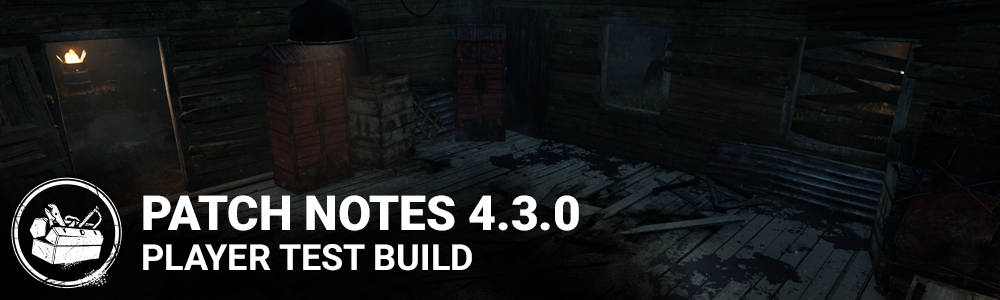

<!-- summary -->
## AI TL;DR

The Executioner receives a balance tweak: post-cancellation movement speed rises to 4.4 m/s for one second, attacks are delayed one second, and Punishment of the Damned cooldown drops to 2.25 s. The Trail of Torment’s Undetectable now lasts until a generator stops regressing, Forced Penance’s broken status lasts up to 80 s, Blood Pact’s haste scales to 7 % and ends when survivors separate, and many other perks gain Bloodpoint rewards, altered durations, ranges or effects. Generator terminology is clarified and related text updated. Visuals are refreshed across maps, lockers, VFX, UI icons and portraits, and all perks share a unified rarity tier system. The build also includes broad gameplay and system bug fixes and notes temporary map and collision issues.
<!-- /summary -->

<!-- nav -->
&larr; [4.2.0 | PTB](226-4-2-0-ptb.md) · [Player Test Build (PTB)](../../index.md#player-test-build-ptb) · [4.4.0 | PTB](269-4-4-0-ptb.md) &rarr;
<!-- /nav -->

# 4.3.0 | PTB

## Features & Content

### The Executioner Balance Update

**Power:**

- After cancelling Rites of Judgement:
- Movement speed is 4.4 m/s for 1 second
- Further attacks cannot be made for 1 second
- Cooldown before further attacks after Punishment of the Damned reduced from 2.75 seconds to 2.25 second

**Perks:**

- Trail of Torment: Undetectable now lasts until the affected Generator stops regressing or a Survivor is injured or put into the dying state by any means
- Forced Penance: Broken Status effect lasts 60/70/80 seconds
- Blood Pact: Haste bonus is now 5%/6%/7%, and lasts until the Survivors are no longer within 16 meters of each other

### Perk Updates

- Any Means Necessary now awards Bloodpoints when used, and its cooldown has been reduced to 100/80/60 seconds
- For the People now awards Bloodpoints when used
- Thanataphobia no longer affects healing speed, and its penalties have been increased to 4%/4.5%/5%
- Mindbreaker's effect now lasts 3/4/5 seconds
- Cruel Limits's range has been increased to 32 meters
- Slippery Meat no longer affects Bear Trap escapes, and now increases hook escape attempt probabilities by 2%/3%/4%
- These escape attempt percentages are additive, i.e. with this perk the chance of escaping the hook is now 6%/7%/8%
- Hex: Huntress Lullaby now only affects healing and repairing skill checks
- Technician now prevents all Generator explosions from missed skill checks
- The Generator loses and additional 5%/4%/3% progress for missed skill checks
- Pop Goes the Weasel now lasts 35/40/45 seconds
- We're Gonna Live Forever now increases healing speed by 100% when healing a Survivor in the dying state
- Players now gain a token when rescuing a Survivor by stunning the Killer with a pallet or blinding them with a flashlight

### Generator Terminology changes and clarifications

- A Generator losing progress over time is "regressing"
- Putting a Generator into the regressing state is "damaging the Generator"
- If a Generator loses some of its progress immediately, this is "losing progress"
- A blocked Generator cannot change its progress
- A blocked Generator retains its regression state, but no progress is lost until it is no longer blocked
- A regressing Generator can lose progress due to other effects
- e.g. a Generator affected by Ruin can still lose progress due to Surge
- Surge, Pop Goes the Weasel, and Overcharge have had their text updated to reflect these changes

### Visual Update

- Visual updates to maps in The MacMillan Estates Realm.
- Visual update to Lockers.
- Added Footstep VFX.
- Visual update to all Blood VFX. On Screen Blood, Blood squirt on hit, Blood pool decals.
- Updated VFX for Trapper, Wraith and Hillbilly.
- Updated dissolve VFX in-game and in-lobbies.
- 4K UI Icons
- Updated Character portraits and customization icons for better resolution at 4K. *This may result in your custom icons being replaced when you update.*

### Perk rarity

- All perks now have the same rarity:
- Tier 1: Uncommon
- Tier 2: Rare
- Tier 3: Very Rare

## Bug Fixes

**System:**

- Disabled daily rituals screen and claiming while in Custom Game

**Gameplay:**

- Fixed an issue that might cause a survivor to remain in the being carried position after being hooked
- Fixed an issue that might cause players to have less control on their character after being unhooked
- Fixed an issue that caused the Cursed effect to appear before any token is earned on the perk Hex: Huntress Lullaby
- Fixed an issue that might cause Hex totems to appear as dull totems for some players
- Fixed an issue that caused the Make Your Choice perk to override a survivor's Calm Spirit while unhooking
- Fixed an issue that caused failed skill check animations to continue after a player lets go of the interaction button
- Fixed an issue that caused the survivor to hold the Deathslinger's chain with one hand after holding and dropping an item

## Known Issues

- An invisible collision blocks the Coal Tower's basement.
- Due to gameplay issues, Autohaven Wreckers maps are disabled during the PTB.
- Cars in the MacMillan Estate currently have placeholder textures.
- The Entity does not appear on hooks or generators on Medium to Ultra graphics settings.

<!-- nav -->
&larr; [4.2.0 | PTB](226-4-2-0-ptb.md) · [Player Test Build (PTB)](../../index.md#player-test-build-ptb) · [4.4.0 | PTB](269-4-4-0-ptb.md) &rarr;
<!-- /nav -->
